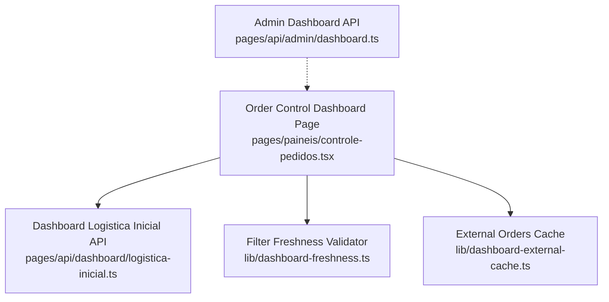
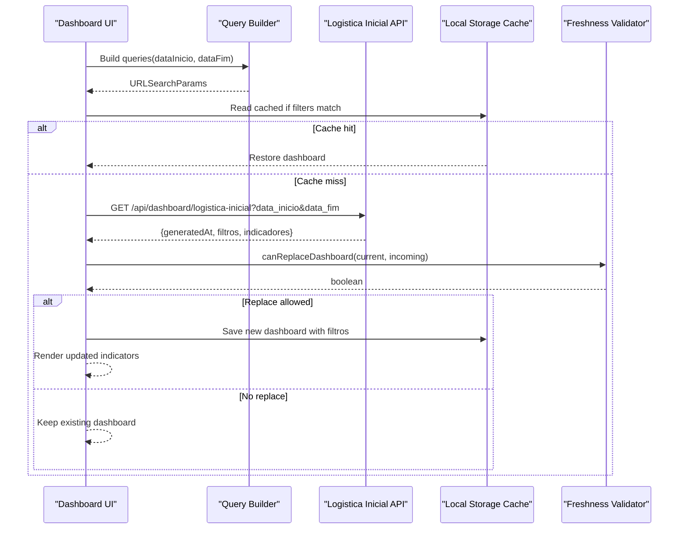
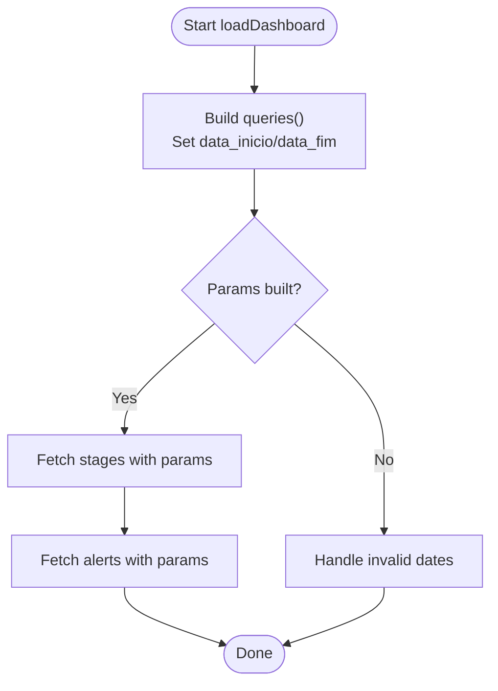
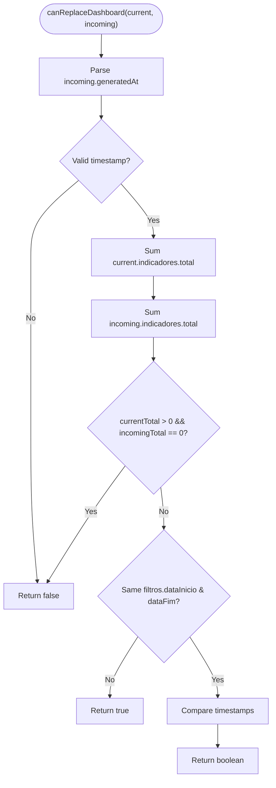
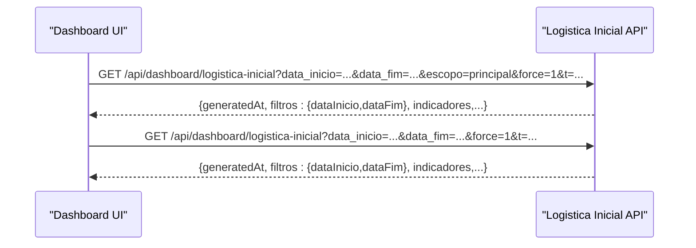
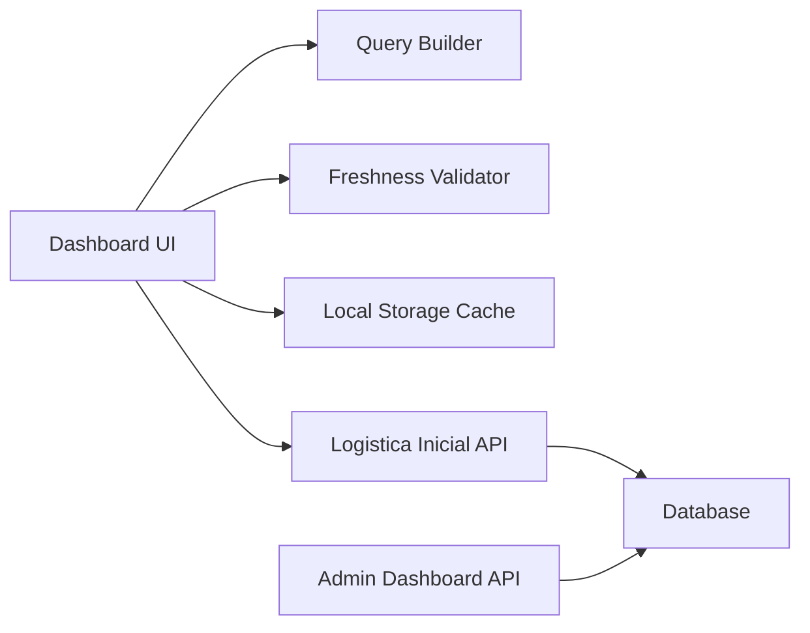

# Filtering System

<cite>
**Referenced Files in This Document**
- [controle-pedidos.tsx](file://pages/paineis/controle-pedidos.tsx)
- [dashboard-freshness.ts](file://lib/dashboard-freshness.ts)
- [dashboard-external-cache.ts](file://lib/dashboard-external-cache.ts)
- [dashboard.ts](file://pages/api/admin/dashboard.ts)
</cite>

## Table of Contents
1. Introduction
2. Project Structure
3. Core Components
4. Architecture Overview
5. Detailed Component Analysis
6. Dependency Analysis
7. Performance Considerations
8. Troubleshooting Guide
9. Conclusion

## Introduction
This document explains the dashboard filtering system with a focus on date range filtering using dataInicio and dataFim parameters, default period calculations, filter validation logic, API integration, query parameter building, and how filters affect dashboard data loading. It also covers filter state management (applied vs pending), clear/filter application workflow, programmatic filter changes, persistence, error handling for invalid date ranges, performance considerations when applying filters, and data refresh behavior.

## Project Structure
The filtering system spans UI components, hooks, and server APIs:
- The order control dashboard page builds and applies date filters to API calls.
- A freshness utility validates whether incoming filtered responses can replace current state based on generated timestamps and applied filters.
- An external cache layer supports fetching orders with optional date filters and short-lived caching.
- Admin dashboard endpoints provide baseline metrics without date filters.

**Diagram sources**
- [controle-pedidos.tsx:81-98](file://pages/paineis/controle-pedidos.tsx#L81-L98)
- [dashboard-freshness.ts:1-24](file://lib/dashboard-freshness.ts#L1-L24)
- [dashboard-external-cache.ts:15-90](file://lib/dashboard-external-cache.ts#L15-L90)
- [dashboard.ts:1-46](file://pages/api/admin/dashboard.ts#L1-L46)

**Section sources**
- [controle-pedidos.tsx:81-98](file://pages/paineis/controle-pedidos.tsx#L81-L98)
- [dashboard-freshness.ts:1-24](file://lib/dashboard-freshness.ts#L1-L24)
- [dashboard-external-cache.ts:15-90](file://lib/dashboard-external-cache.ts#L15-L90)
- [dashboard.ts:1-46](file://pages/api/admin/dashboard.ts#L1-L46)

## Core Components
- Date range builder: constructs default periods for “today” and “alerts last 29 days,” then serializes them into URLSearchParams for API calls.
- Filter-aware state replacement: ensures that only newer or different-period responses replace current dashboard state.
- External cache: fetches orders with optional date filters and caches results with TTLs; key includes data_inicio, data_fim, and tipo_data.
- Admin dashboard endpoint: returns aggregate counts without date filters (baseline).

Key responsibilities:
- Build query parameters from date inputs.
- Validate and apply filters before making requests.
- Persist and restore cached dashboards keyed by applied filters.
- Prevent stale or empty responses from overwriting valid data.

**Section sources**
- [controle-pedidos.tsx:65-98](file://pages/paineis/controle-pedidos.tsx#L65-L98)
- [dashboard-freshness.ts:1-24](file://lib/dashboard-freshness.ts#L1-L24)
- [dashboard-external-cache.ts:15-90](file://lib/dashboard-external-cache.ts#L15-L90)
- [dashboard.ts:1-46](file://pages/api/admin/dashboard.ts#L1-L46)

## Architecture Overview
The dashboard loads two datasets:
- Main stages: filtered by today’s date range.
- Alerts: filtered by a rolling 29-day window ending today.

Both use the same logistica-inicial endpoint but with different query parameters. The UI uses a hook to manage current dashboard state and local storage caching keyed by applied filters. Incoming responses are validated via a freshness function that compares generatedAt timestamps and filter scopes.

**Diagram sources**
- [controle-pedidos.tsx:120-188](file://pages/paineis/controle-pedidos.tsx#L120-L188)
- [dashboard-freshness.ts:6-23](file://lib/dashboard-freshness.ts#L6-L23)

## Detailed Component Analysis

### Date Range Filtering and Default Periods
- Default periods:
  - Stages: data_inicio and data_fim set to today.
  - Alerts: data_inicio set to 29 days ago; data_fim set to today.
- Query serialization:
  - Uses URLSearchParams with keys data_inicio and data_fim.
  - Adds force and t parameters to bypass caches and ensure fresh data.
- Effect on data loading:
  - Each dataset is fetched with its own date range, enabling separate views for main stages and alerts.

**Diagram sources**
- [controle-pedidos.tsx:81-98](file://pages/paineis/controle-pedidos.tsx#L81-L98)
- [controle-pedidos.tsx:120-163](file://pages/paineis/controle-pedidos.tsx#L120-L163)

**Section sources**
- [controle-pedidos.tsx:65-98](file://pages/paineis/controle-pedidos.tsx#L65-L98)
- [controle-pedidos.tsx:120-163](file://pages/paineis/controle-pedidos.tsx#L120-L163)

### Filter Validation Logic
- Freshness check:
  - Compares generatedAt timestamps.
  - Treats empty incoming responses as non-replaceable when current has data.
  - Allows replacement if filter scope (dataInicio/dataFim) differs.
- Purpose:
  - Ensures that outdated or mismatched filter responses do not overwrite valid dashboard state.

**Diagram sources**
- [dashboard-freshness.ts:6-23](file://lib/dashboard-freshness.ts#L6-L23)

**Section sources**
- [dashboard-freshness.ts:1-24](file://lib/dashboard-freshness.ts#L1-L24)

### API Integration and Query Parameter Building
- Endpoints:
  - Main stages and alerts both call /api/dashboard/logistica-inicial with different date ranges.
- Parameters:
  - data_inicio, data_fim define the filter window.
  - escopo controls scope for stages.
  - force and t disable caching and enforce freshness.
- Response shape:
  - Includes generatedAt and filtros with dataInicio/dataFim for downstream validation.

**Diagram sources**
- [controle-pedidos.tsx:120-163](file://pages/paineis/controle-pedidos.tsx#L120-L163)

**Section sources**
- [controle-pedidos.tsx:120-163](file://pages/paineis/controle-pedidos.tsx#L120-L163)

### Filter State Management: Applied vs Pending
- Applied filters:
  - Derived from current query parameters used to build requests.
  - Stored in local storage under a cache key alongside the dashboard payload.
- Pending filters:
  - Not explicitly implemented in this codebase; however, the pattern to support pending filters would be:
    - Maintain a separate state for draft filters.
    - Only commit to applied filters upon explicit confirmation.
    - Use the same query builder to preview effects without triggering network calls.
- Clearing filters:
  - Resetting to defaults (e.g., today) effectively clears custom ranges.
  - Local storage entries are refreshed when new queries run and match default filters.

Note: The current implementation primarily manages applied filters through query building and cache keys. To introduce pending filters, add a draft state and a confirm action that updates applied filters and triggers reload.

**Section sources**
- [controle-pedidos.tsx:165-188](file://pages/paineis/controle-pedidos.tsx#L165-L188)

### Programmatic Filter Changes
- To change filters programmatically:
  - Update the variables controlling dataInicio and dataFim.
  - Rebuild queries and trigger loadDashboard to fetch new data.
  - Ensure local storage cache keys align with new filters so cached data is correctly matched.

Example steps:
- Set new start/end dates.
- Call getDashboardQueries() to serialize parameters.
- Invoke loadDashboard() to fetch and validate new data.

**Section sources**
- [controle-pedidos.tsx:81-98](file://pages/paineis/controle-pedidos.tsx#L81-L98)
- [controle-pedidos.tsx:120-163](file://pages/paineis/controle-pedidos.tsx#L120-L163)

### Filter Persistence
- Local storage:
  - Stores dashboard payloads keyed by a constant cache key.
  - On load, checks if cached data matches current filters (dataInicio/dataFim) before restoring.
- Freshness:
  - Even if cache exists, incoming responses are validated against current state using generatedAt and filter scope.

**Section sources**
- [controle-pedidos.tsx:165-188](file://pages/paineis/controle-pedidos.tsx#L165-L188)
- [dashboard-freshness.ts:6-23](file://lib/dashboard-freshness.ts#L6-L23)

### Error Handling for Invalid Date Ranges
- Current behavior:
  - If API response is not ok, an error message is set and loading states are updated.
  - Empty fallback responses are treated as warnings and may prevent replacing valid data.
- Recommendations:
  - Validate date ranges client-side before building queries (e.g., ensure start <= end).
  - Provide user feedback for invalid ranges and prevent network calls until corrected.

**Section sources**
- [controle-pedidos.tsx:120-163](file://pages/paineis/controle-pedidos.tsx#L120-L163)
- [dashboard-freshness.ts:6-23](file://lib/dashboard-freshness.ts#L6-L23)

### External Orders Cache with Filters
- Key composition:
  - Includes username, limit, data_inicio, data_fim, and tipo_data to differentiate cached results per filter scope.
- TTL strategy:
  - Short TTL for fresh data and longer stale TTL to serve older data when no new data is available.
- Retry logic:
  - Retries failed offsets to improve reliability during large fetches.

**Section sources**
- [dashboard-external-cache.ts:15-90](file://lib/dashboard-external-cache.ts#L15-L90)

## Dependency Analysis
- UI depends on:
  - Query builder for constructing date-filtered requests.
  - Freshness validator to decide state replacement.
  - Local storage for cache persistence keyed by filters.
- API endpoints:
  - Logistica inicial serves filtered data based on provided date ranges.
  - Admin dashboard provides unfiltered aggregates.

**Diagram sources**
- [controle-pedidos.tsx:81-98](file://pages/paineis/controle-pedidos.tsx#L81-L98)
- [dashboard-freshness.ts:6-23](file://lib/dashboard-freshness.ts#L6-L23)
- [dashboard.ts:1-46](file://pages/api/admin/dashboard.ts#L1-L46)

**Section sources**
- [controle-pedidos.tsx:81-98](file://pages/paineis/controle-pedidos.tsx#L81-L98)
- [dashboard-freshness.ts:6-23](file://lib/dashboard-freshness.ts#L6-L23)
- [dashboard.ts:1-46](file://pages/api/admin/dashboard.ts#L1-L46)

## Performance Considerations
- Avoid unnecessary re-fetches:
  - Use force and t parameters only when needed; otherwise rely on cache.
- Cache strategies:
  - Leverage local storage keyed by filters to avoid redundant network calls.
  - Use external cache TTLs for order lists to reduce backend load.
- Batch and parallelize:
  - Fetch stages and alerts concurrently to minimize total load time.
- Data size:
  - Limit result sets where possible; paginate if necessary.
- Refresh interval:
  - Auto-refresh interval balances freshness with resource usage; tune based on operational needs.

[No sources needed since this section provides general guidance]

## Troubleshooting Guide
Common issues and resolutions:
- Stale or missing data after changing filters:
  - Verify that local storage cache keys include the new filters.
  - Ensure canReplaceDashboard allows replacement when filters differ.
- Network errors:
  - Check API response status and handle errors gracefully.
  - Inspect query parameters for correctness (date formats, ranges).
- Empty responses replacing valid data:
  - Freshness logic prevents empty responses from overwriting valid data; verify indicator totals and generatedAt values.

**Section sources**
- [controle-pedidos.tsx:120-163](file://pages/paineis/controle-pedidos.tsx#L120-L163)
- [dashboard-freshness.ts:6-23](file://lib/dashboard-freshness.ts#L6-L23)

## Conclusion
The dashboard filtering system centers on robust date range handling, careful state replacement via freshness checks, and efficient caching. By building precise query parameters, validating incoming responses, and persisting filter-scoped caches, the system delivers accurate and performant dashboard views. Extending to pending filters and enhanced client-side validation can further improve user experience and reliability.