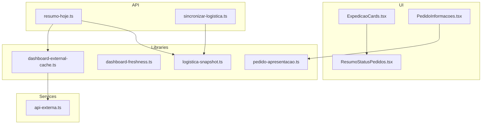
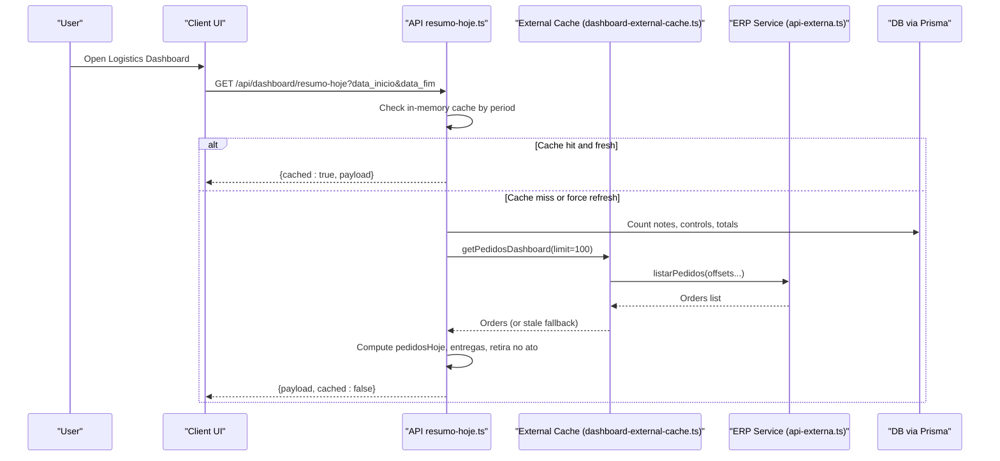
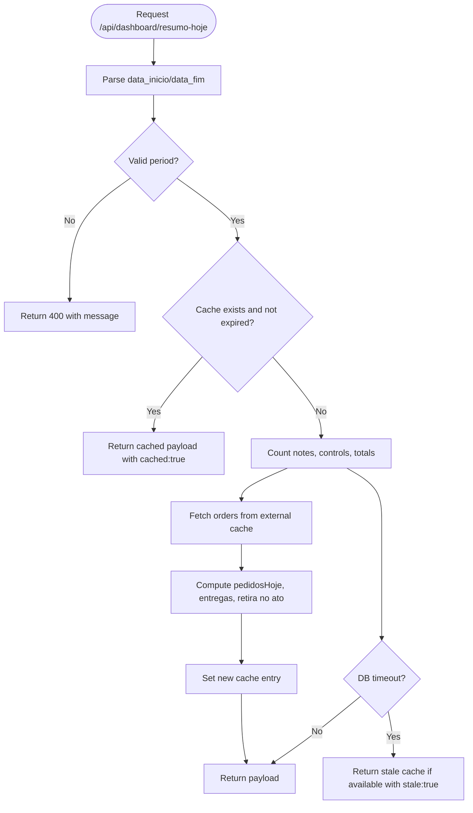
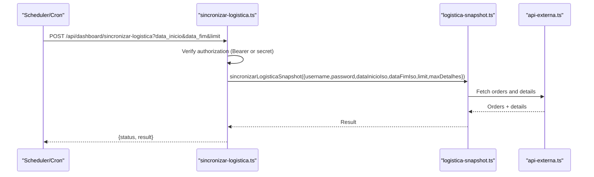
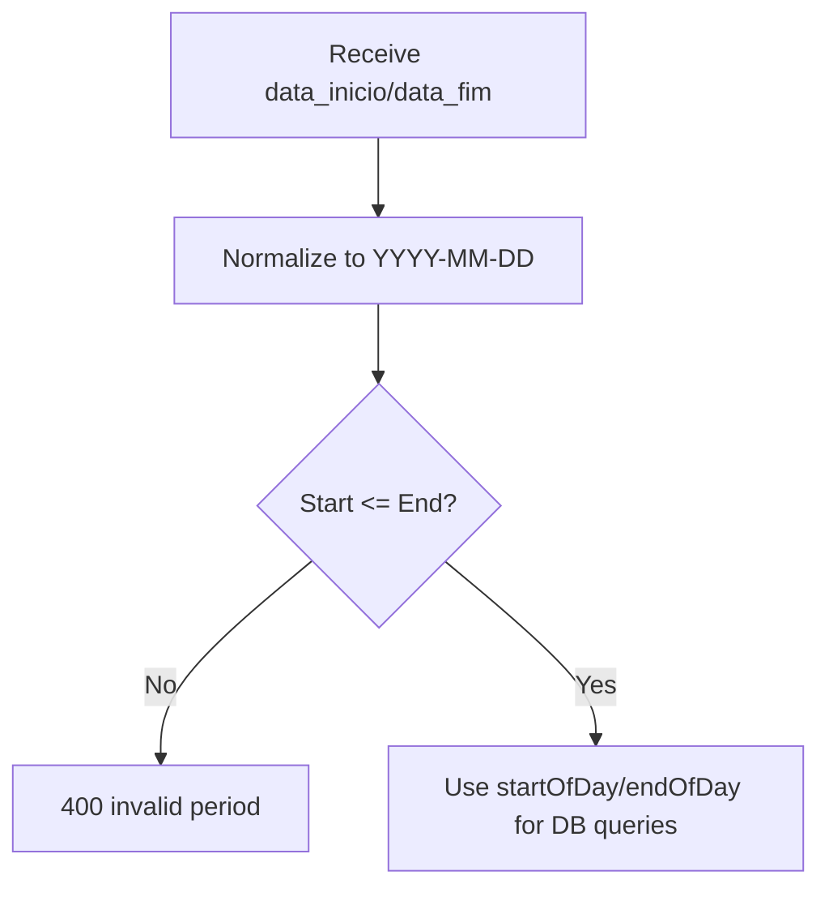
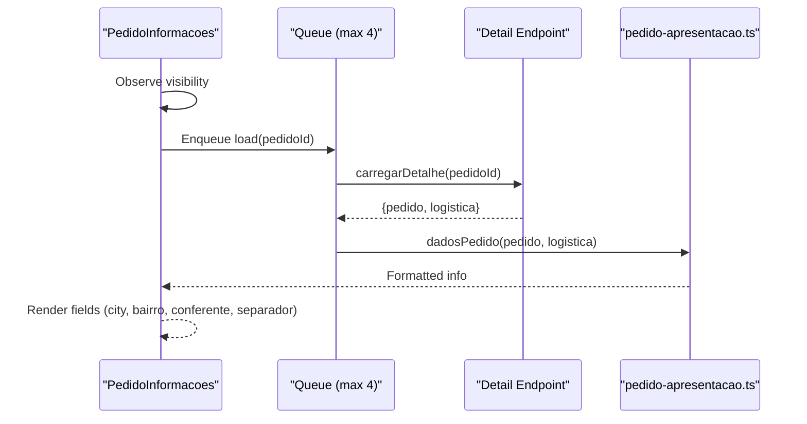
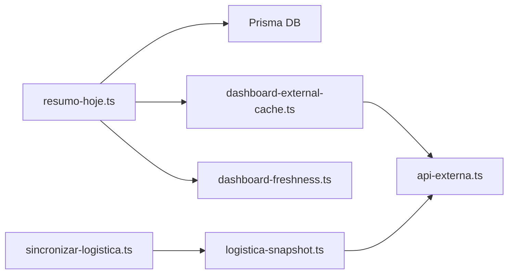

# Logistics Dashboard

<cite>
**Referenced Files in This Document**
- [ExpedicaoCards.tsx](file://components/dashboard/ExpedicaoCards.tsx)
- [PedidoInformacoes.tsx](file://components/dashboard/PedidoInformacoes.tsx)
- [ResumoStatusPedidos.tsx](file://components/dashboard/ResumoStatusPedidos.tsx)
- [dashboard-external-cache.ts](file://lib/dashboard-external-cache.ts)
- [dashboard-freshness.ts](file://lib/dashboard-freshness.ts)
- [resumo-hoje.ts](file://pages/api/dashboard/resumo-hoje.ts)
- [sincronizar-logistica.ts](file://pages/api/dashboard/sincronizar-logistica.ts)
- [logistica-snapshot.ts](file://lib/logistica-snapshot.ts)
- [pedido-apresentacao.ts](file://lib/pedido-apresentacao.ts)
- [api-externa.ts](file://services/api-externa.ts)
</cite>

## Table of Contents
1. Introduction
2. Project Structure
3. Core Components
4. Architecture Overview
5. Detailed Component Analysis
6. Dependency Analysis
7. Performance Considerations
8. Troubleshooting Guide
9. Conclusion

## Introduction
This document explains the Logistics Dashboard feature that provides real-time order monitoring, dashboard data synchronization, auto-refresh mechanisms, and status categorization. It covers the dashboard architecture including state management, caching strategies, and performance optimizations. It also documents order statuses such as PEDIDO_NOVO, PEDIDO_EM_SEPARACAO, PEDIDO_SEPARADO, and their visual representations and user interactions. Examples include filtering by date ranges, viewing order details, and managing alerts. Error handling, loading states, and offline capabilities with local storage caching are addressed.

## Project Structure
The Logistics Dashboard is composed of:
- UI components for stage cards, alerts, pending items, and order information summaries
- API endpoints to fetch today’s summary and synchronize logistics snapshots
- Libraries for external cache, freshness control, and presentation helpers
- Services to communicate with an external ERP system



**Diagram sources**
- [ExpedicaoCards.tsx:1-278](file://components/dashboard/ExpedicaoCards.tsx#L1-L278)
- [PedidoInformacoes.tsx:1-80](file://components/dashboard/PedidoInformacoes.tsx#L1-L80)
- [ResumoStatusPedidos.tsx:1-18](file://components/dashboard/ResumoStatusPedidos.tsx#L1-L18)
- [resumo-hoje.ts:1-293](file://pages/api/dashboard/resumo-hoje.ts#L1-L293)
- [sincronizar-logistica.ts:1-76](file://pages/api/dashboard/sincronizar-logistica.ts#L1-L76)
- [dashboard-external-cache.ts:1-92](file://lib/dashboard-external-cache.ts#L1-L92)
- [dashboard-freshness.ts:1-24](file://lib/dashboard-freshness.ts#L1-L24)
- [pedido-apresentacao.ts:1-200](file://lib/pedido-apresentacao.ts)
- [logistica-snapshot.ts:1-200](file://lib/logistica-snapshot.ts)
- [api-externa.ts:1-200](file://services/api-externa.ts)

**Section sources**
- [ExpedicaoCards.tsx:1-278](file://components/dashboard/ExpedicaoCards.tsx#L1-L278)
- [PedidoInformacoes.tsx:1-80](file://components/dashboard/PedidoInformacoes.tsx#L1-L80)
- [ResumoStatusPedidos.tsx:1-18](file://components/dashboard/ResumoStatusPedidos.tsx#L1-L18)
- [resumo-hoje.ts:1-293](file://pages/api/dashboard/resumo-hoje.ts#L1-L293)
- [sincronizar-logistica.ts:1-76](file://pages/api/dashboard/sincronizar-logistica.ts#L1-L76)
- [dashboard-external-cache.ts:1-92](file://lib/dashboard-external-cache.ts#L1-L92)
- [dashboard-freshness.ts:1-24](file://lib/dashboard-freshness.ts#L1-L24)

## Core Components
- Stage Cards and Alerts: Visualize counts per logistics stage and highlight delayed or problematic orders.
- Order Information: Lazy-loads detailed order info when visible and shows key fields like city, neighborhood, checker, and separator.
- Status Summary: Displays aggregated counts per order status, hiding empty or non-relevant categories.

Key responsibilities:
- ExpedicaoCards renders stage cards and alert panels with animated indicators and click handlers to navigate to filtered views.
- PedidoInformacoes uses IntersectionObserver and a concurrency-limited queue to avoid overloading the backend while fetching order details.
- ResumoStatusPedidos filters out zero-count or non-relevant status entries and presents them in a compact grid.

**Section sources**
- [ExpedicaoCards.tsx:1-278](file://components/dashboard/ExpedicaoCards.tsx#L1-L278)
- [PedidoInformacoes.tsx:1-80](file://components/dashboard/PedidoInformacoes.tsx#L1-L80)
- [ResumoStatusPedidos.tsx:1-18](file://components/dashboard/ResumoStatusPedidos.tsx#L1-L18)

## Architecture Overview
The dashboard follows a layered architecture:
- UI layer: React components render stage cards, alerts, and order details.
- API layer: Endpoints provide cached summaries and trigger logistics synchronization.
- Data layer: In-memory caches reduce load on external APIs; freshness logic prevents stale updates from wiping valid data.
- External integration: An ERP service supplies order lists used to compute today’s metrics and alerts.



**Diagram sources**
- [resumo-hoje.ts:1-293](file://pages/api/dashboard/resumo-hoje.ts#L1-L293)
- [dashboard-external-cache.ts:1-92](file://lib/dashboard-external-cache.ts#L1-L92)
- [api-externa.ts:1-200](file://services/api-externa.ts)

## Detailed Component Analysis

### Real-Time Order Monitoring and Auto-Refresh
- The dashboard requests today’s summary with optional date range filters. Responses are cached in-memory with TTL and staleness windows to minimize network calls.
- When the database is slow, the endpoint returns stale cached data with a warning flag instead of failing completely.
- The client can force refresh by appending a query parameter to bypass cache.



**Diagram sources**
- [resumo-hoje.ts:1-293](file://pages/api/dashboard/resumo-hoje.ts#L1-L293)

**Section sources**
- [resumo-hoje.ts:1-293](file://pages/api/dashboard/resumo-hoje.ts#L1-L293)

### Dashboard Data Synchronization
- A dedicated endpoint synchronizes logistics snapshots from the external ERP into the internal system. It supports authorization via token or secret and configurable limits to prevent long-running jobs.
- The synchronization function aggregates recent orders within a default 30-day window unless explicit dates are provided.



**Diagram sources**
- [sincronizar-logistica.ts:1-76](file://pages/api/dashboard/sincronizar-logistica.ts#L1-L76)
- [logistica-snapshot.ts:1-200](file://lib/logistica-snapshot.ts)
- [api-externa.ts:1-200](file://services/api-externa.ts)

**Section sources**
- [sincronizar-logistica.ts:1-76](file://pages/api/dashboard/sincronizar-logistica.ts#L1-L76)

### Status Categorization and Visual Representations
- Order statuses include PEDIDO_NOVO, PEDIDO_EM_SEPARACAO, PEDIDO_SEPARADO, and others. The UI groups orders by operational stage and highlights delays or missing products.
- PedidoInformacoes checks for PEDIDO_EM_SEPARACAO to adjust displayed fields (e.g., hide separator during active picking).
- ResumoStatusPedidos displays only statuses with non-zero totals or relevant alerts.

```mermaid
classDiagram
class PedidoInformacoes {
+pedido : object
+carregarDetalhe(id) : Promise
-situacao : "carregando|pronto|erro"
}
class ResumoStatusPedidos {
+itens : Array<{codigo,titulo,total}>
}
class ExpedicaoCards {
+stageCards : Array
+alertas : object
+pendencias : object
}
PedidoInformacoes --> "uses" pedido-apresentacao.ts : "format display"
ExpedicaoCards --> "renders" ResumoStatusPedidos : "aggregated view"
```

**Diagram sources**
- [PedidoInformacoes.tsx:1-80](file://components/dashboard/PedidoInformacoes.tsx#L1-L80)
- [ResumoStatusPedidos.tsx:1-18](file://components/dashboard/ResumoStatusPedidos.tsx#L1-L18)
- [ExpedicaoCards.tsx:1-278](file://components/dashboard/ExpedicaoCards.tsx#L1-L278)

**Section sources**
- [PedidoInformacoes.tsx:1-80](file://components/dashboard/PedidoInformacoes.tsx#L1-L80)
- [ResumoStatusPedidos.tsx:1-18](file://components/dashboard/ResumoStatusPedidos.tsx#L1-L18)
- [ExpedicaoCards.tsx:1-278](file://components/dashboard/ExpedicaoCards.tsx#L1-L278)

### Filtering by Date Ranges
- The summary endpoint accepts data_inicio and data_fim parameters. Invalid periods return a 400 error with a clear message.
- Filters are normalized to date-only values and used to compute counts within the specified window.



**Diagram sources**
- [resumo-hoje.ts:1-293](file://pages/api/dashboard/resumo-hoje.ts#L1-L293)

**Section sources**
- [resumo-hoje.ts:1-293](file://pages/api/dashboard/resumo-hoje.ts#L1-L293)

### Order Detail Views
- PedidoInformacoes lazily loads order details using IntersectionObserver and a concurrency-limited queue to cap concurrent requests.
- It formats display data via pedido-apresentacao and falls back to minimal fields when unavailable.



**Diagram sources**
- [PedidoInformacoes.tsx:1-80](file://components/dashboard/PedidoInformacoes.tsx#L1-L80)
- [pedido-apresentacao.ts:1-200](file://lib/pedido-apresentacao.ts)

**Section sources**
- [PedidoInformacoes.tsx:1-80](file://components/dashboard/PedidoInformacoes.tsx#L1-L80)

### Alert Management
- ExpedicaoCards includes alert panels for delayed orders and missing products, with animated indicators when issues exist.
- Clicking these panels navigates users to filtered views where they can investigate and act on problematic orders.

**Section sources**
- [ExpedicaoCards.tsx:1-278](file://components/dashboard/ExpedicaoCards.tsx#L1-L278)

## Dependency Analysis
- The summary endpoint depends on Prisma for counts and on the external cache for order retrieval.
- The external cache coordinates pagination and retries for the ERP service and maintains in-memory TTL-based caching.
- Freshness logic ensures that empty responses do not overwrite valid previous frames when updating dashboards.



**Diagram sources**
- [resumo-hoje.ts:1-293](file://pages/api/dashboard/resumo-hoje.ts#L1-L293)
- [dashboard-external-cache.ts:1-92](file://lib/dashboard-external-cache.ts#L1-L92)
- [dashboard-freshness.ts:1-24](file://lib/dashboard-freshness.ts#L1-L24)
- [sincronizar-logistica.ts:1-76](file://pages/api/dashboard/sincronizar-logistica.ts#L1-L76)
- [logistica-snapshot.ts:1-200](file://lib/logistica-snapshot.ts)
- [api-externa.ts:1-200](file://services/api-externa.ts)

**Section sources**
- [resumo-hoje.ts:1-293](file://pages/api/dashboard/resumo-hoje.ts#L1-L293)
- [dashboard-external-cache.ts:1-92](file://lib/dashboard-external-cache.ts#L1-L92)
- [dashboard-freshness.ts:1-24](file://lib/dashboard-freshness.ts#L1-L24)
- [sincronizar-logistica.ts:1-76](file://pages/api/dashboard/sincronizar-logistica.ts#L1-L76)

## Performance Considerations
- In-memory caching:
  - Summary endpoint caches results per period with short TTL and staleness window to reduce DB pressure.
  - External order cache batches paginated requests and deduplicates in-flight calls per key.
- Timeouts:
  - Database queries and external API calls use timeouts to prevent hanging requests.
- Concurrency control:
  - Order detail loading caps concurrent requests to avoid overwhelming the backend.
- Stale-while-revalidate:
  - Client headers allow serving cached content while background revalidation occurs.

[No sources needed since this section provides general guidance]

## Troubleshooting Guide
Common issues and resolutions:
- Invalid date range:
  - Symptom: 400 response with message about invalid period.
  - Cause: data_inicio greater than data_fim or malformed dates.
  - Resolution: Ensure start date is before end date and format is YYYY-MM-DD.
- Database slowness:
  - Symptom: Response includes stale:true and a warning message.
  - Cause: DB query exceeded timeout threshold.
  - Resolution: Retry after a moment or force refresh; monitor DB performance.
- External ERP unavailability:
  - Symptom: Synchronization endpoint returns 503 with error indicating external API down.
  - Cause: Missing credentials or ERP service downtime.
  - Resolution: Configure credentials and verify ERP availability.
- Empty dashboard update:
  - Symptom: New response has zero totals but previous data remains.
  - Cause: Freshness logic prevents replacing valid data with empty updates.
  - Resolution: Wait for next successful update or force refresh.

**Section sources**
- [resumo-hoje.ts:1-293](file://pages/api/dashboard/resumo-hoje.ts#L1-L293)
- [sincronizar-logistica.ts:1-76](file://pages/api/dashboard/sincronizar-logistica.ts#L1-L76)
- [dashboard-freshness.ts:1-24](file://lib/dashboard-freshness.ts#L1-L24)

## Conclusion
The Logistics Dashboard combines efficient caching, robust error handling, and responsive UI components to deliver real-time order monitoring. It supports date-range filtering, lazy loading of order details, and alert management for delayed or problematic orders. The architecture balances performance and reliability through in-memory caches, timeouts, concurrency limits, and freshness controls. For offline resilience, consider adding local storage caching at the client layer to persist last-known dashboard state and serve it until connectivity is restored.