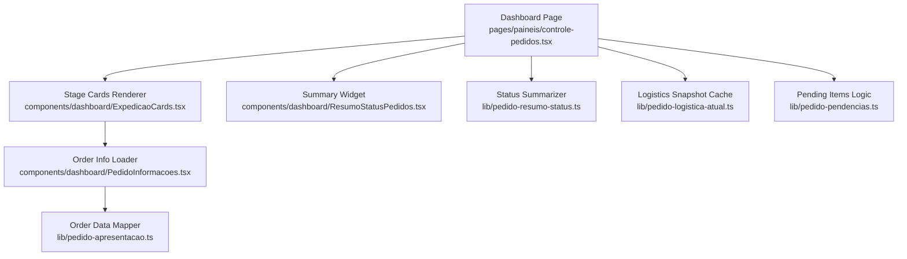
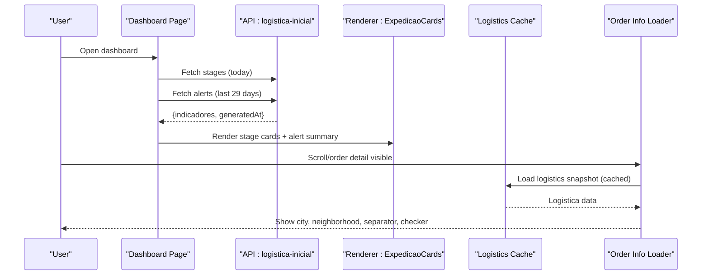
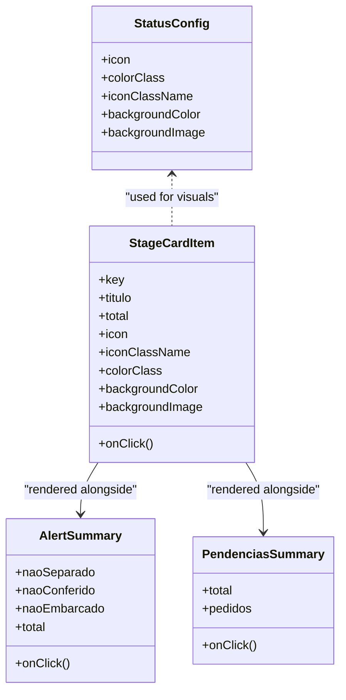
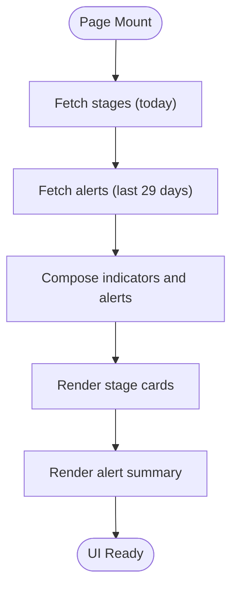
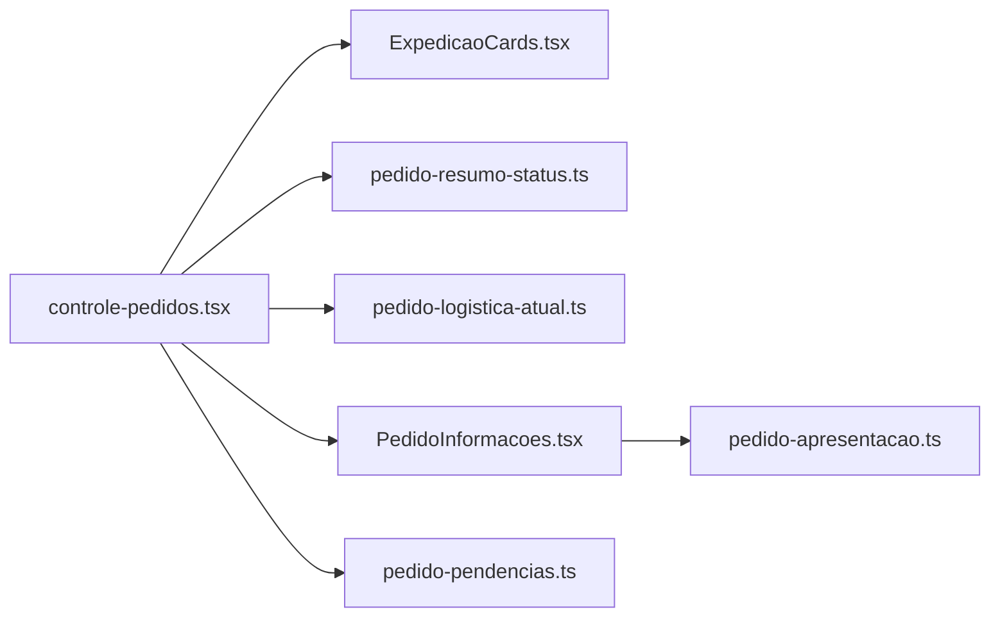

# Order Status Workflows

<cite>
**Referenced Files in This Document**
- [controle-pedidos.tsx](file://pages/paineis/controle-pedidos.tsx)
- [ExpedicaoCards.tsx](file://components/dashboard/ExpedicaoCards.tsx)
- [ResumoStatusPedidos.tsx](file://components/dashboard/ResumoStatusPedidos.tsx)
- [pedido-resumo-status.ts](file://lib/pedido-resumo-status.ts)
- [pedido-apresentacao.ts](file://lib/pedido-apresentacao.ts)
- [PedidoInformacoes.tsx](file://components/dashboard/PedidoInformacoes.tsx)
- [pedido-logistica-atual.ts](file://lib/pedido-logistica-atual.ts)
- [pedido-pendencias.ts](file://lib/pedido-pendencias.ts)
</cite>

## Table of Contents
1. Introduction
2. Project Structure
3. Core Components
4. Architecture Overview
5. Detailed Component Analysis
6. Dependency Analysis
7. Performance Considerations
8. Troubleshooting Guide
9. Conclusion

## Introduction
This document explains the order status workflows in the logistics dashboard, covering the complete lifecycle from PEDIDO_NOVO through PEDIDO_EMBARCADO and alert statuses ALERTAS_NAO_SEPARADOS, ALERTAS_NAO_CONFERIDOS, and ALERTAS_NAO_EMBARCADOS. It details how orders are categorized, visualized with colors and icons, filtered, and interacted with by users across the dashboard.

## Project Structure
The order status workflow spans a few key areas:
- Dashboard page that loads stage counts and alerts, maps statuses to visuals, and composes cards for each stage and alert category.
- Shared components that render stage cards, alert summaries, and per-order information.
- Libraries that summarize orders by status, present order data, fetch logistics snapshots, and compute pending items.

**Diagram sources**
- [controle-pedidos.tsx:48-58](file://pages/paineis/controle-pedidos.tsx#L48-L58)
- [ExpedicaoCards.tsx:59-116](file://components/dashboard/ExpedicaoCards.tsx#L59-L116)
- [ResumoStatusPedidos.tsx:1-18](file://components/dashboard/ResumoStatusPedidos.tsx#L1-L18)
- [pedido-resumo-status.ts:1-31](file://lib/pedido-resumo-status.ts#L1-L31)
- [pedido-logistica-atual.ts:1-22](file://lib/pedido-logistica-atual.ts#L1-L22)
- [PedidoInformacoes.tsx:1-80](file://components/dashboard/PedidoInformacoes.tsx#L1-L80)
- [pedido-apresentacao.ts:1-26](file://lib/pedido-apresentacao.ts#L1-L26)
- [pedido-pendencias.ts:37-129](file://lib/pedido-pendencias.ts#L37-L129)

**Section sources**
- [controle-pedidos.tsx:1-266](file://pages/paineis/controle-pedidos.tsx#L1-L266)
- [ExpedicaoCards.tsx:1-278](file://components/dashboard/ExpedicaoCards.tsx#L1-L278)
- [ResumoStatusPedidos.tsx:1-18](file://components/dashboard/ResumoStatusPedidos.tsx#L1-L18)
- [pedido-resumo-status.ts:1-31](file://lib/pedido-resumo-status.ts#L1-L31)
- [pedido-logistica-atual.ts:1-22](file://lib/pedido-logistica-atual.ts#L1-L22)
- [PedidoInformacoes.tsx:1-80](file://components/dashboard/PedidoInformacoes.tsx#L1-L80)
- [pedido-apresentacao.ts:1-26](file://lib/pedido-apresentacao.ts#L1-L26)
- [pedido-pendencias.ts:1-129](file://lib/pedido-pendencias.ts#L1-L129)

## Core Components
- Dashboard controller (page): Loads stage indicators and alerts, defines status-to-visual mapping, and passes data to card components.
- Stage cards renderer: Renders gradient cards with icons and totals; renders alert summary and pending products list.
- Status summarizer: Groups orders by operational or alert status and computes titles and totals.
- Order info loader: Lazily loads per-order details using an intersection observer and a concurrency-limited queue.
- Logistics snapshot cache: Caches external logistics queries with TTL and deduplication.
- Pending items logic: Determines whether orders belong in pending lists based on ERP delivery state and returns.

Key responsibilities:
- Visual mapping: Each status has an icon, color class, background color, and optional gradient image.
- Filtering: Alerts are loaded with a different date range and aggregated separately from main stages.
- Presentation: Titles and grouping respect alert prefixes and operational codes when available.

**Section sources**
- [controle-pedidos.tsx:48-58](file://pages/paineis/controle-pedidos.tsx#L48-L58)
- [pedido-resumo-status.ts:1-31](file://lib/pedido-resumo-status.ts#L1-L31)
- [ExpedicaoCards.tsx:118-278](file://components/dashboard/ExpedicaoCards.tsx#L118-L278)
- [PedidoInformacoes.tsx:14-64](file://components/dashboard/PedidoInformacoes.tsx#L14-L64)
- [pedido-logistica-atual.ts:1-22](file://lib/pedido-logistica-atual.ts#L1-L22)
- [pedido-pendencias.ts:37-129](file://lib/pedido-pendencias.ts#L37-L129)

## Architecture Overview
The dashboard composes two primary datasets:
- Main stages: Today’s orders grouped into standard workflow stages.
- Alerts: Orders flagged as not separated, not checked, or not shipped within a longer lookback window.

**Diagram sources**
- [controle-pedidos.tsx:120-188](file://pages/paineis/controle-pedidos.tsx#L120-L188)
- [ExpedicaoCards.tsx:118-278](file://components/dashboard/ExpedicaoCards.tsx#L118-L278)
- [pedido-logistica-atual.ts:1-22](file://lib/pedido-logistica-atual.ts#L1-L22)
- [PedidoInformacoes.tsx:28-64](file://components/dashboard/PedidoInformacoes.tsx#L28-L64)

## Detailed Component Analysis

### Status Lifecycle and Categories
- Standard lifecycle stages:
  - PEDIDO_NOVO: New orders awaiting picking.
  - PEDIDO_EM_SEPARACAO: Orders currently being picked.
  - PEDIDO_SEPARADO: Picked but not yet checked.
  - PEDIDO_EMBARCADO: Checked but not yet shipped.
  - PEDIDOS_EMBARCADOS: Shipped orders.
- Alert categories:
  - ALERTAS_NAO_SEPARADOS: Orders not picked beyond expected time.
  - ALERTAS_NAO_CONFERIDOS: Orders picked but not checked beyond expected time.
  - ALERTAS_NAO_EMBARCADOS: Orders checked but not shipped beyond expected time.
  - PENDENCIAS: Orders with missing/unfound products.

Grouping rules:
- When summarizing, if a status code starts with ALERTAS_, it is used directly; otherwise, the operational code takes precedence if present.
- Titles are mapped via a lookup table for human-readable labels.

Visual mapping:
- Each status has a defined icon, color class, background color, and optional gradient image.
- Alert cards use red-themed gradients and pulsing icons to draw attention.

Transition rules:
- The dashboard displays current counts per stage and alert category; transitions are driven by upstream ERP/logistics updates reflected in the API responses.
- Alerts are computed over a broader date range than daily stages to highlight overdue work.

Examples of filtering and rendering:
- Stage cards are rendered for the five core stages with their configured visuals.
- Alert summary aggregates three alert types and shows a total count of unique affected orders.
- Pendências panel lists orders with missing items and product-level details when available.

**Section sources**
- [controle-pedidos.tsx:13-22](file://pages/paineis/controle-pedidos.tsx#L13-L22)
- [controle-pedidos.tsx:48-58](file://pages/paineis/controle-pedidos.tsx#L48-L58)
- [controle-pedidos.tsx:81-98](file://pages/paineis/controle-pedidos.tsx#L81-L98)
- [controle-pedidos.tsx:190-207](file://pages/paineis/controle-pedidos.tsx#L190-L207)
- [pedido-resumo-status.ts:1-31](file://lib/pedido-resumo-status.ts#L1-L31)
- [ExpedicaoCards.tsx:140-273](file://components/dashboard/ExpedicaoCards.tsx#L140-L273)

#### Class Diagram: Status Configuration and Rendering

**Diagram sources**
- [controle-pedidos.tsx:48-58](file://pages/paineis/controle-pedidos.tsx#L48-L58)
- [ExpedicaoCards.tsx:5-47](file://components/dashboard/ExpedicaoCards.tsx#L5-L47)

### Status Visualization and Color Coding
- Icons:
  - Package for new orders.
  - ClipboardList for picking.
  - PackageCheck for picked/shipped states.
  - UserCheck for checked state.
  - AlertCircle for alert categories.
- Colors:
  - Blue gradient for new orders.
  - Yellow/amber gradients for picking and checked-but-not-shipped.
  - Green gradient for shipped.
  - Red gradients for alerts and pendências.
- Backgrounds:
  - Gradient backgrounds applied via inline styles and Tailwind classes.
  - Pulsing animation on alert and pendências headers when counts are non-zero.

**Section sources**
- [controle-pedidos.tsx:48-58](file://pages/paineis/controle-pedidos.tsx#L48-L58)
- [ExpedicaoCards.tsx:59-116](file://components/dashboard/ExpedicaoCards.tsx#L59-L116)
- [ExpedicaoCards.tsx:140-273](file://components/dashboard/ExpedicaoCards.tsx#L140-L273)

### Business Logic for Status Categorization
- Grouping by status:
  - Uses either the operational code or the base status code depending on prefix.
  - Aggregates unique orders per group to avoid double-counting.
- Titles:
  - Human-friendly labels mapped per status code.
- Alerts vs. stages:
  - Alerts are fetched with a wider date range and displayed separately.
  - Pendências are derived from logistics data indicating missing items or deliveries.

**Section sources**
- [pedido-resumo-status.ts:13-31](file://lib/pedido-resumo-status.ts#L13-L31)
- [controle-pedidos.tsx:81-98](file://pages/paineis/controle-pedidos.tsx#L81-L98)
- [pedido-pendencias.ts:37-129](file://lib/pedido-pendencias.ts#L37-L129)

### Data Flow: From API to UI

**Diagram sources**
- [controle-pedidos.tsx:120-188](file://pages/paineis/controle-pedidos.tsx#L120-L188)
- [ExpedicaoCards.tsx:118-278](file://components/dashboard/ExpedicaoCards.tsx#L118-L278)

### Per-Order Information and Lazy Loading
- IntersectionObserver triggers loading only when the element enters the viewport.
- Concurrency limit ensures at most four simultaneous requests.
- Fallback values display “Carregando...”, “Indisponível”, or “Não informado” while loading or on error.
- Separation of concerns:
  - PedidoInformacoes orchestrates loading and state.
  - dadosPedido normalizes fields from multiple sources.

**Section sources**
- [PedidoInformacoes.tsx:14-64](file://components/dashboard/PedidoInformacoes.tsx#L14-L64)
- [PedidoInformacoes.tsx:66-79](file://components/dashboard/PedidoInformacoes.tsx#L66-L79)
- [pedido-apresentacao.ts:1-26](file://lib/pedido-apresentacao.ts#L1-L26)

### Logistics Snapshot Caching
- Keyed by username and order ID.
- Deduplicates in-flight requests via a promise map.
- TTL-based cache eviction with size cap.

**Section sources**
- [pedido-logistica-atual.ts:1-22](file://lib/pedido-logistica-atual.ts#L1-L22)

### Pendências Logic
- Excludes orders fully returned.
- Computes pending balances considering returns and issued quantities.
- Merges delivery and comparison lists to produce accurate pending item views.

**Section sources**
- [pedido-pendencias.ts:37-129](file://lib/pedido-pendencias.ts#L37-L129)

## Dependency Analysis
- controle-pedidos.tsx depends on:
  - ExpedicaoCards for rendering.
  - pedido-resumo-status for grouping logic (indirectly via API responses).
  - pedido-logistica-atual for per-order logistics snapshots.
  - PedidoInformacoes for per-order details.
- ExpedicaoCards depends on:
  - Lucide icons and framer-motion for visuals.
  - cn utility for class composition.
- pedido-resumo-status is a pure function module used to aggregate status groups.
- pedido-pendencias provides business rules for pendências visibility.

**Diagram sources**
- [controle-pedidos.tsx:1-266](file://pages/paineis/controle-pedidos.tsx#L1-L266)
- [ExpedicaoCards.tsx:1-278](file://components/dashboard/ExpedicaoCards.tsx#L1-L278)
- [pedido-resumo-status.ts:1-31](file://lib/pedido-resumo-status.ts#L1-L31)
- [pedido-logistica-atual.ts:1-22](file://lib/pedido-logistica-atual.ts#L1-L22)
- [PedidoInformacoes.tsx:1-80](file://components/dashboard/PedidoInformacoes.tsx#L1-L80)
- [pedido-apresentacao.ts:1-26](file://lib/pedido-apresentacao.ts#L1-L26)
- [pedido-pendencias.ts:1-129](file://lib/pedido-pendencias.ts#L1-L129)

**Section sources**
- [controle-pedidos.tsx:1-266](file://pages/paineis/controle-pedidos.tsx#L1-L266)
- [ExpedicaoCards.tsx:1-278](file://components/dashboard/ExpedicaoCards.tsx#L1-L278)
- [pedido-resumo-status.ts:1-31](file://lib/pedido-resumo-status.ts#L1-L31)
- [pedido-logistica-atual.ts:1-22](file://lib/pedido-logistica-atual.ts#L1-L22)
- [PedidoInformacoes.tsx:1-80](file://components/dashboard/PedidoInformacoes.tsx#L1-L80)
- [pedido-apresentacao.ts:1-26](file://lib/pedido-apresentacao.ts#L1-L26)
- [pedido-pendencias.ts:1-129](file://lib/pedido-pendencias.ts#L1-L129)

## Performance Considerations
- Staged fetching:
  - Main stages and alerts are fetched in parallel with distinct date ranges to reduce perceived latency.
- Local caching:
  - Dashboard data cached in localStorage keyed by filters; stale caches ignored if filters change.
- Request coalescing:
  - Logistics snapshot cache deduplicates concurrent requests and applies TTL to minimize backend load.
- Lazy loading:
  - Per-order details load only when visible, reducing initial payload and network usage.
- Concurrency control:
  - Limits active requests to prevent overwhelming the server during large lists.

[No sources needed since this section provides general guidance]

## Troubleshooting Guide
- Empty dashboard fallback:
  - If the response contains a warning and zero totals, the page treats it as empty and surfaces the warning message.
- Network errors:
  - Non-OK responses set an error state and stop secondary loading.
- Stale or corrupted cache:
  - Invalid JSON in local storage is caught and ignored; fresh data is fetched on next mount.
- Missing per-order details:
  - While loading, placeholders indicate “Carregando...” or “Indisponível”; errors transition to “erro”.

**Section sources**
- [controle-pedidos.tsx:105-108](file://pages/paineis/controle-pedidos.tsx#L105-L108)
- [controle-pedidos.tsx:120-163](file://pages/paineis/controle-pedidos.tsx#L120-L163)
- [PedidoInformacoes.tsx:33-64](file://components/dashboard/PedidoInformacoes.tsx#L33-L64)

## Conclusion
The logistics dashboard implements a clear, visual workflow for order statuses from creation to shipment, complemented by alert categories that highlight overdue or incomplete steps. Status-to-visual mappings provide immediate context through icons and colors, while robust caching and lazy loading ensure responsive performance. Business logic for categorization and pendências ensures accurate representation of real-world operations, enabling operators to quickly identify and act on bottlenecks.