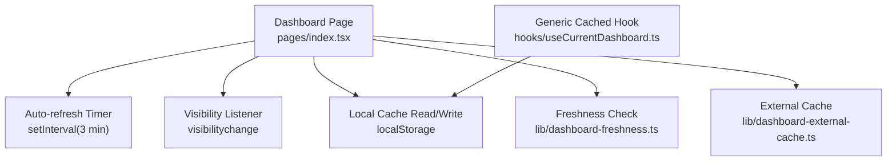
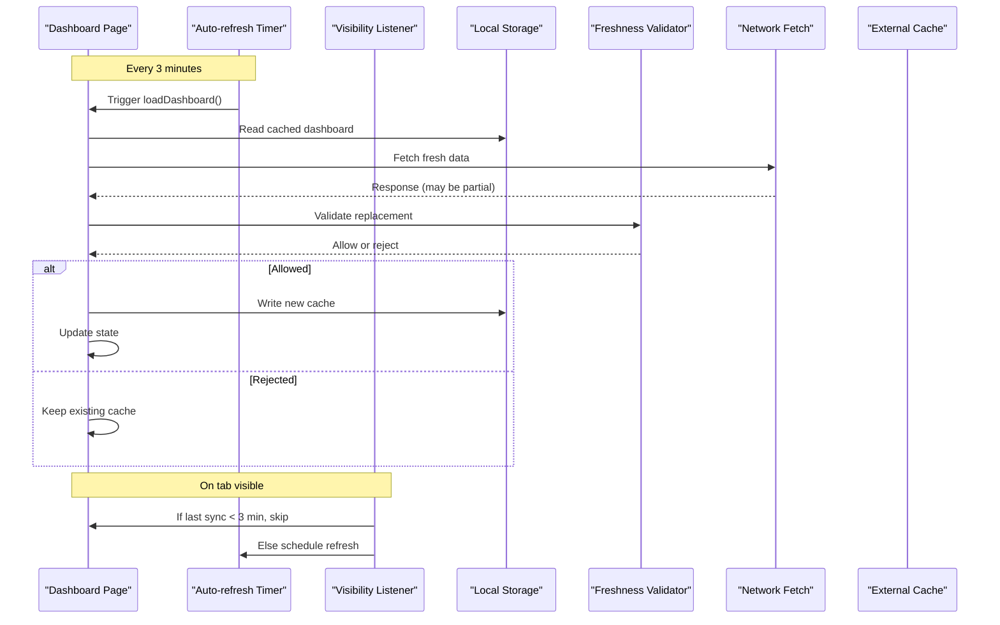
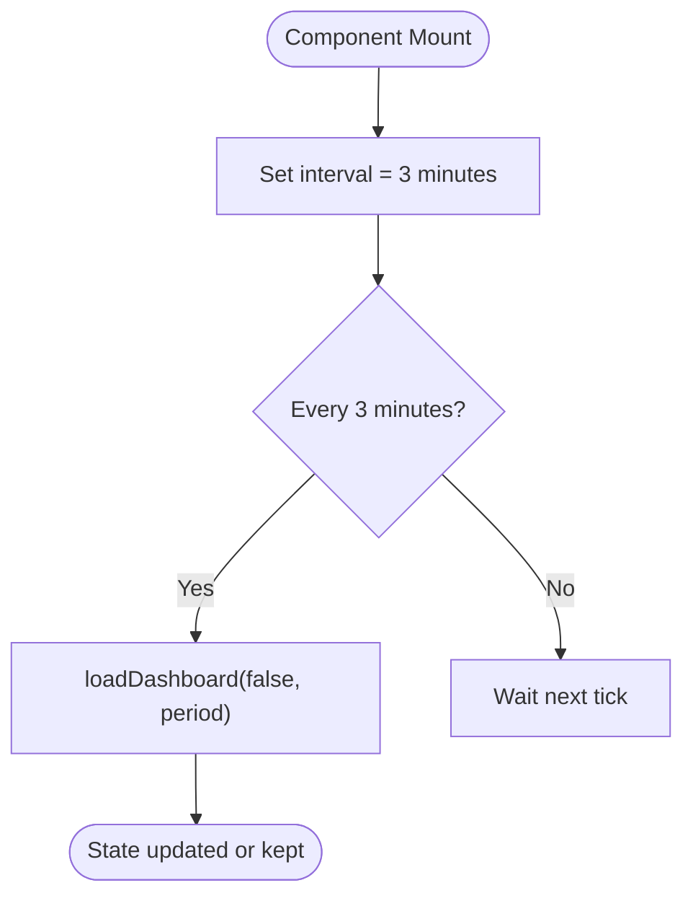
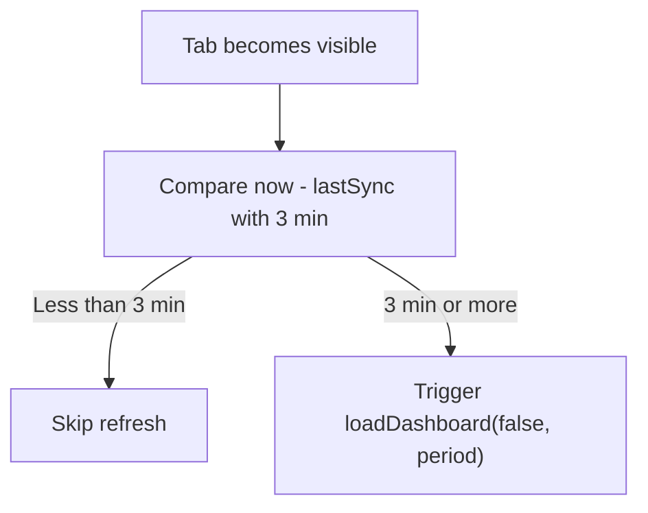
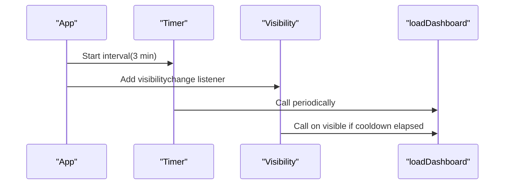
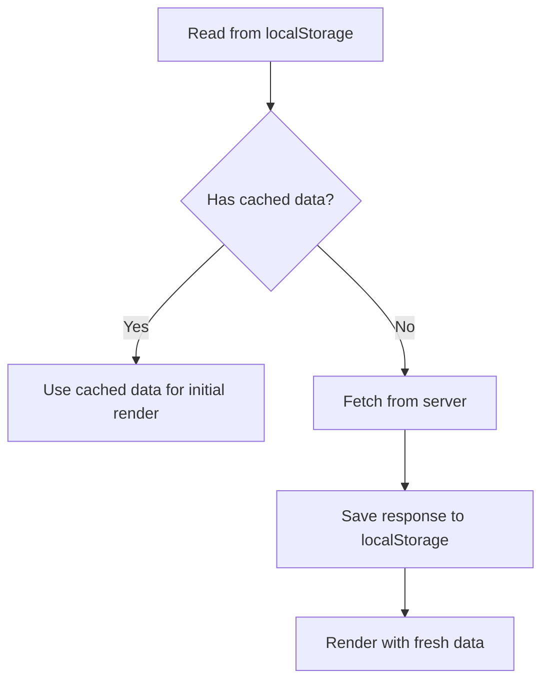
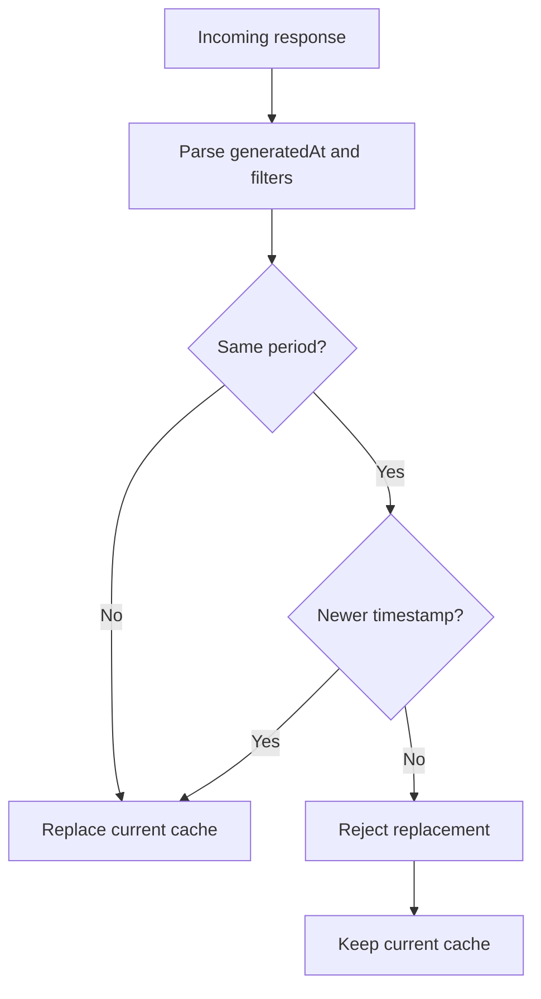
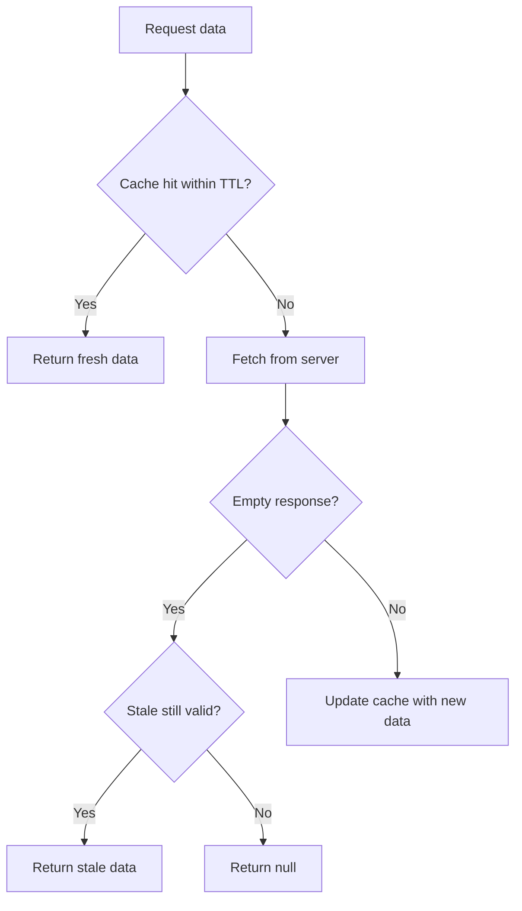
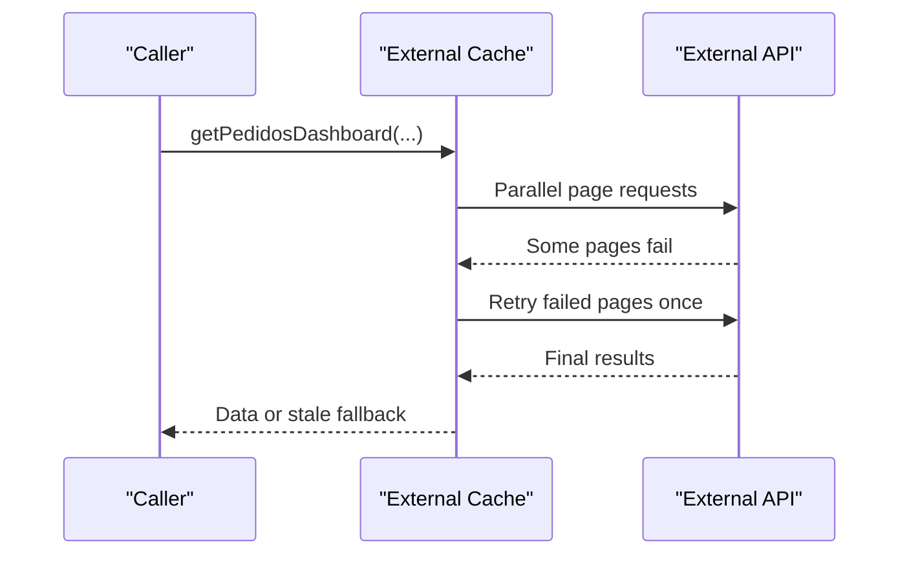
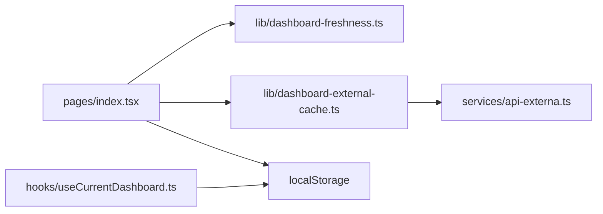

# Real-time Updates & Caching

<cite>
**Referenced Files in This Document**
- [index.tsx](file://pages/index.tsx)
- [acompanhamento-pedidos.tsx](file://pages/acompanhamento-pedidos.tsx)
- [dashboard-freshness.ts](file://lib/dashboard-freshness.ts)
- [dashboard-external-cache.ts](file://lib/dashboard-external-cache.ts)
- [useCurrentDashboard.ts](file://hooks/useCurrentDashboard.ts)
</cite>

## Table of Contents
1. [Introduction](#introduction)
2. [Project Structure](#project-structure)
3. [Core Components](#core-components)
4. [Architecture Overview](#architecture-overview)
5. [Detailed Component Analysis](#detailed-component-analysis)
6. [Dependency Analysis](#dependency-analysis)
7. [Performance Considerations](#performance-considerations)
8. [Troubleshooting Guide](#troubleshooting-guide)
9. [Conclusion](#conclusion)

## Introduction
This document explains the real-time update system and caching mechanisms used by the dashboard pages. It covers:
- Auto-refresh interval configuration (3 minutes)
- Visibility change detection to avoid unnecessary refreshes
- Background synchronization strategies
- Local storage caching with versioned keys, validation, and fallbacks
- Dashboard freshness checking and stale data handling
- Conflict resolution between cached and fresh data
- Manual refresh triggers, automatic scheduling, and cache invalidation
- Network error handling, retry logic, and offline data presentation

## Project Structure
The real-time behavior is implemented primarily in the dashboard pages and shared libraries:
- Pages orchestrate auto-refresh, visibility-based refresh, and local cache usage
- Libraries provide freshness checks and external cache for background requests
- A hook provides a generic pattern for reading/writing versioned local storage

**Diagram sources**
- [index.tsx:268-606](file://pages/index.tsx#L268-L606)
- [dashboard-freshness.ts:1-24](file://lib/dashboard-freshness.ts#L1-L24)
- [dashboard-external-cache.ts:1-92](file://lib/dashboard-external-cache.ts#L1-L92)
- [useCurrentDashboard.ts:1-30](file://hooks/useCurrentDashboard.ts#L1-L30)

**Section sources**
- [index.tsx:268-606](file://pages/index.tsx#L268-L606)
- [dashboard-freshness.ts:1-24](file://lib/dashboard-freshness.ts#L1-L24)
- [dashboard-external-cache.ts:1-92](file://lib/dashboard-external-cache.ts#L1-L92)
- [useCurrentDashboard.ts:1-30](file://hooks/useCurrentDashboard.ts#L1-L30)

## Core Components
- Auto-refresh scheduler: Runs every 3 minutes to fetch fresh dashboard data when authenticated.
- Visibility-aware refresh: On tab focus, only refresh if the last sync was older than the configured interval.
- Freshness validator: Prevents replacing valid current data with empty or older responses.
- External cache: Short-lived in-memory cache with staleness window and retry on partial failures.
- Local storage cache: Versioned keys per dashboard context; reads first, writes after successful fetch.

**Section sources**
- [index.tsx:268-606](file://pages/index.tsx#L268-L606)
- [dashboard-freshness.ts:1-24](file://lib/dashboard-freshness.ts#L1-L24)
- [dashboard-external-cache.ts:1-92](file://lib/dashboard-external-cache.ts#L1-L92)
- [useCurrentDashboard.ts:1-30](file://hooks/useCurrentDashboard.ts#L1-L30)

## Architecture Overview
The dashboard uses a layered approach:
- UI layer triggers periodic and visibility-driven updates
- Data layer applies freshness rules before updating state
- Cache layer serves recent data immediately and falls back to stale data when needed
- Network layer includes retries for partial page loads

**Diagram sources**
- [index.tsx:268-606](file://pages/index.tsx#L268-L606)
- [dashboard-freshness.ts:1-24](file://lib/dashboard-freshness.ts#L1-L24)
- [dashboard-external-cache.ts:1-92](file://lib/dashboard-external-cache.ts#L1-L92)

## Detailed Component Analysis

### Auto-refresh Interval Configuration (3 minutes)
- The dashboard sets a constant for a 3-minute interval and uses setInterval to call the background refresh function.
- The same interval is enforced in visibility change handlers to prevent rapid re-fetching.

**Diagram sources**
- [index.tsx:268-606](file://pages/index.tsx#L268-L606)
- [acompanhamento-pedidos.tsx:268-599](file://pages/acompanhamento-pedidos.tsx#L268-L599)

**Section sources**
- [index.tsx:268-606](file://pages/index.tsx#L268-L606)
- [acompanhamento-pedidos.tsx:268-599](file://pages/acompanhamento-pedidos.tsx#L268-L599)

### Visibility Change Detection
- When the tab becomes visible, the code checks whether enough time has passed since the last sync. If not, it skips the refresh to reduce network load.
- Listeners are attached and cleaned up on mount/unmount.

**Diagram sources**
- [index.tsx:590-606](file://pages/index.tsx#L590-L606)
- [acompanhamento-pedidos.tsx:586-599](file://pages/acompanhamento-pedidos.tsx#L586-L599)

**Section sources**
- [index.tsx:590-606](file://pages/index.tsx#L590-L606)
- [acompanhamento-pedidos.tsx:586-599](file://pages/acompanhamento-pedidos.tsx#L586-L599)

### Background Synchronization Strategies
- Periodic background refresh runs regardless of user interaction.
- Visibility-based refresh complements the timer to ensure data is fresh when the user returns to the app.
- Both strategies use the same interval guard to avoid excessive calls.

**Diagram sources**
- [index.tsx:590-606](file://pages/index.tsx#L590-L606)
- [acompanhamento-pedidos.tsx:586-599](file://pages/acompanhamento-pedidos.tsx#L586-L599)

**Section sources**
- [index.tsx:590-606](file://pages/index.tsx#L590-L606)
- [acompanhamento-pedidos.tsx:586-599](file://pages/acompanhamento-pedidos.tsx#L586-L599)

### Local Storage Caching System
- Each dashboard page reads from localStorage using a dedicated key for the main dashboard and another for alerts.
- After a successful fetch, the new data is written back to localStorage.
- A reusable hook demonstrates the pattern of reading and writing JSON to localStorage with try/catch to tolerate storage errors.

**Diagram sources**
- [index.tsx:562-574](file://pages/index.tsx#L562-L574)
- [useCurrentDashboard.ts:15-28](file://hooks/useCurrentDashboard.ts#L15-L28)

**Section sources**
- [index.tsx:562-574](file://pages/index.tsx#L562-L574)
- [useCurrentDashboard.ts:15-28](file://hooks/useCurrentDashboard.ts#L15-L28)

### Versioned Cache Keys and Validation
- The external cache composes a key from username, limit, and filters to isolate datasets.
- Freshness validation ensures that:
  - Empty responses do not overwrite a previously valid dashboard
  - Responses with different filter periods can replace the current one
  - Newer timestamps replace older ones within the same period

**Diagram sources**
- [dashboard-freshness.ts:1-24](file://lib/dashboard-freshness.ts#L1-L24)

**Section sources**
- [dashboard-freshness.ts:1-24](file://lib/dashboard-freshness.ts#L1-L24)

### Stale Data Handling and Offline Presentation
- The external cache defines a short TTL for immediate hits and a longer stale window to serve older data when fresh data is unavailable or empty.
- If a fresh fetch returns no data but stale data exists within its window, the stale data is returned to keep the UI functional.

**Diagram sources**
- [dashboard-external-cache.ts:1-92](file://lib/dashboard-external-cache.ts#L1-L92)

**Section sources**
- [dashboard-external-cache.ts:1-92](file://lib/dashboard-external-cache.ts#L1-L92)

### Conflict Resolution Between Cached and Fresh Data
- Freshness rules prevent accidental loss of valid data when receiving empty or outdated responses.
- Within the same period, only newer timestamps replace older ones.
- Different periods allow replacement to reflect the user’s selected filters.

**Section sources**
- [dashboard-freshness.ts:1-24](file://lib/dashboard-freshness.ts#L1-L24)

### Manual Refresh Triggers
- While the primary mechanism is automatic, the same load function is invoked when users apply or clear date filters, enabling manual refresh semantics tied to context changes.

**Section sources**
- [index.tsx:639-676](file://pages/index.tsx#L639-L676)

### Automatic Refresh Scheduling
- A 3-minute interval drives background refreshes.
- Visibility events trigger an additional check to refresh only after the cooldown period.

**Section sources**
- [index.tsx:268-606](file://pages/index.tsx#L268-L606)
- [acompanhamento-pedidos.tsx:268-599](file://pages/acompanhamento-pedidos.tsx#L268-L599)

### Cache Invalidation Strategies
- External cache uses TTL and stale windows to expire entries automatically.
- Freshness validation acts as logical invalidation by rejecting incompatible or older responses.
- Local storage is overwritten on successful fetches, effectively invalidating previous values.

**Section sources**
- [dashboard-external-cache.ts:1-92](file://lib/dashboard-external-cache.ts#L1-L92)
- [dashboard-freshness.ts:1-24](file://lib/dashboard-freshness.ts#L1-L24)
- [index.tsx:562-574](file://pages/index.tsx#L562-L574)

### Network Error Handling and Retry Logic
- For external order lists, the system batches paginated requests and retries failed offsets once, improving resilience under transient errors.
- Dashboard detail requests handle non-OK responses by throwing descriptive errors, which are caught and surfaced to the UI.

**Diagram sources**
- [dashboard-external-cache.ts:32-86](file://lib/dashboard-external-cache.ts#L32-L86)

**Section sources**
- [dashboard-external-cache.ts:32-86](file://lib/dashboard-external-cache.ts#L32-L86)
- [index.tsx:700-725](file://pages/index.tsx#L700-L725)

### Offline Data Presentation
- When fresh data is empty but stale data is available within its window, the system returns stale data to keep the dashboard usable.
- Local storage provides a secondary fallback so the UI can render even if network requests fail entirely.

**Section sources**
- [dashboard-external-cache.ts:73-83](file://lib/dashboard-external-cache.ts#L73-L83)
- [index.tsx:562-574](file://pages/index.tsx#L562-L574)

## Dependency Analysis
- Pages depend on:
  - Local storage for immediate availability
  - Freshness validator to decide replacements
  - External cache for resilient background fetching
- The external cache depends on the external API service and implements its own retry strategy.
- The generic hook demonstrates a reusable pattern for versioned local storage access.

**Diagram sources**
- [index.tsx:562-606](file://pages/index.tsx#L562-L606)
- [dashboard-freshness.ts:1-24](file://lib/dashboard-freshness.ts#L1-L24)
- [dashboard-external-cache.ts:1-92](file://lib/dashboard-external-cache.ts#L1-L92)
- [useCurrentDashboard.ts:1-30](file://hooks/useCurrentDashboard.ts#L1-L30)

**Section sources**
- [index.tsx:562-606](file://pages/index.tsx#L562-L606)
- [dashboard-freshness.ts:1-24](file://lib/dashboard-freshness.ts#L1-L24)
- [dashboard-external-cache.ts:1-92](file://lib/dashboard-external-cache.ts#L1-L92)
- [useCurrentDashboard.ts:1-30](file://hooks/useCurrentDashboard.ts#L1-L30)

## Performance Considerations
- 3-minute intervals balance freshness with network efficiency.
- Visibility-based throttling avoids redundant refreshes when tabs are hidden.
- External cache reduces repeated network calls and mitigates partial failures via retries.
- Freshness validation prevents unnecessary state churn and protects against empty responses.

[No sources needed since this section provides general guidance]

## Troubleshooting Guide
- Dashboard not refreshing:
  - Verify the interval is running and visibility listener is attached.
  - Ensure the last sync timestamp is being updated on each successful fetch.
- Stale data persists:
  - Confirm freshness rules allow replacement for the current filters and timestamp.
  - Check that the external cache TTL/stale window is not too long.
- Frequent network errors:
  - Inspect retry behavior for external list requests.
  - Handle non-OK responses gracefully and surface errors to the UI.

**Section sources**
- [index.tsx:590-606](file://pages/index.tsx#L590-L606)
- [dashboard-freshness.ts:1-24](file://lib/dashboard-freshness.ts#L1-L24)
- [dashboard-external-cache.ts:32-86](file://lib/dashboard-external-cache.ts#L32-L86)

## Conclusion
The dashboard employs a robust real-time update system combining scheduled background refreshes, visibility-aware throttling, strict freshness validation, and multi-layer caching. This design ensures responsive, accurate, and resilient data presentation even under intermittent connectivity or slow networks.

[No sources needed since this section summarizes without analyzing specific files]