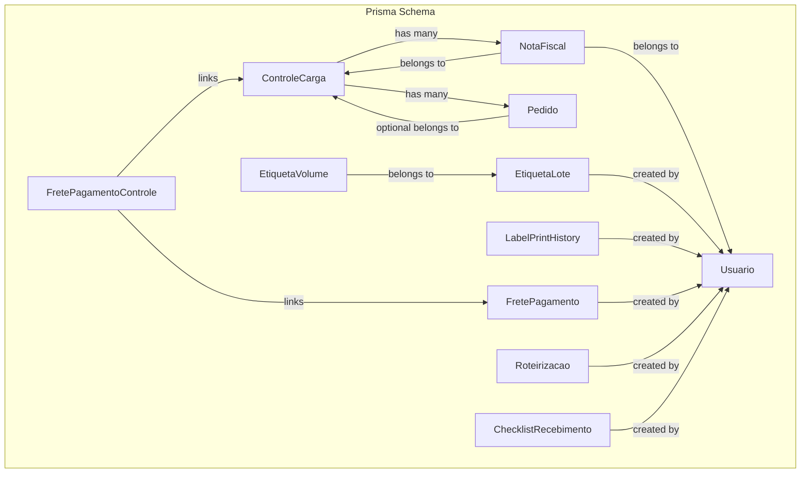
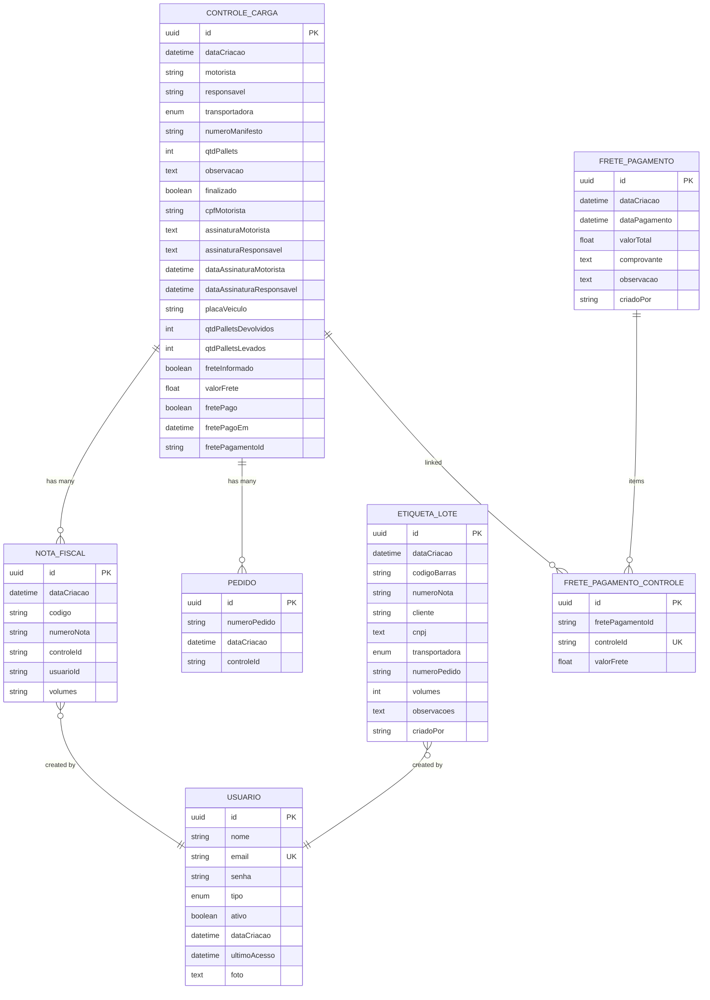
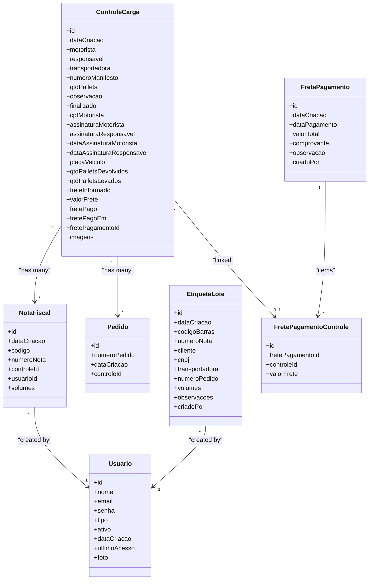
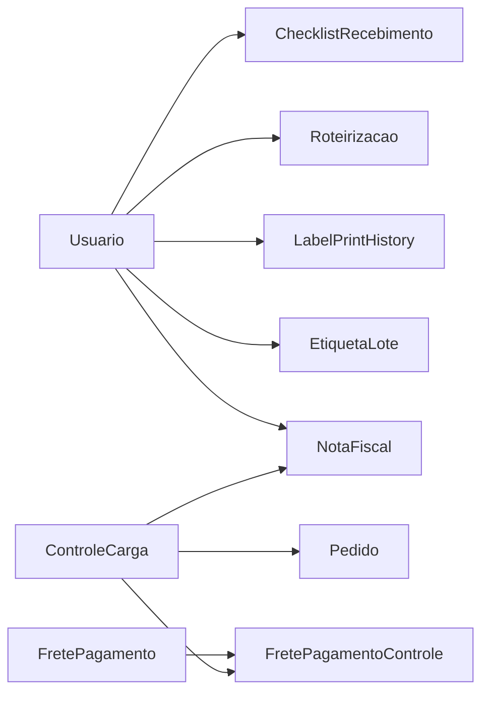

# Database Schema

<cite>
**Referenced Files in This Document**
- [schema.prisma](file://prisma/schema.prisma)
- [seed.ts](file://prisma/seed.ts)
- [migration.sql (add cnpj to EtiquetaLote)](file://prisma/migrations/20260807150000_add_cnpj_etiqueta_lote/migration.sql)
- [sync-production-database.sql](file://scripts/sql/sync-production-database.sql)
</cite>

## Table of Contents
1. Introduction
2. Project Structure
3. Core Components
4. Architecture Overview
5. Detailed Component Analysis
6. Dependency Analysis
7. Performance Considerations
8. Troubleshooting Guide
9. Conclusion
10. Appendices

## Introduction
This document provides comprehensive data model documentation for the Control Carga database schema, focusing on the core entities ControleCarga, Pedido, NotaFiscal, Usuario, and EtiquetaLote. It details field definitions, data types, primary and foreign keys, indexes, constraints, entity relationships, validation rules, business logic constraints, migration strategy, data seeding procedures, performance optimization through indexing, data lifecycle considerations, backup strategies, and maintenance procedures for production environments.

## Project Structure
The database schema is defined using Prisma with a PostgreSQL provider. The central schema file defines all models, enums, relations, and indexes. Seed scripts provide initial user data for development and testing. Migration files capture incremental changes to the schema over time.

**Diagram sources**
- [schema.prisma:11-42](file://prisma/schema.prisma#L11-L42)
- [schema.prisma:44-67](file://prisma/schema.prisma#L44-L67)
- [schema.prisma:69-96](file://prisma/schema.prisma#L69-L96)
- [schema.prisma:414-448](file://prisma/schema.prisma#L414-L448)
- [schema.prisma:263-290](file://prisma/schema.prisma#L263-L290)
- [schema.prisma:450-470](file://prisma/schema.prisma#L450-L470)
- [schema.prisma:538-552](file://prisma/schema.prisma#L538-L552)
- [schema.prisma:479-536](file://prisma/schema.prisma#L479-L536)

**Section sources**
- [schema.prisma:1-9](file://prisma/schema.prisma#L1-L9)

## Core Components
This section documents the core entities requested: ControleCarga, Pedido, NotaFiscal, Usuario, and EtiquetaLote. For each entity, we describe fields, types, keys, indexes, constraints, and relationships.

- ControleCarga
  - Purpose: Represents a shipment control record capturing driver, transport carrier, pallet counts, signatures, freight payment linkage, images, and associations to notes and orders.
  - Primary Key: id (UUID, auto-generated)
  - Notable Fields:
    - Timestamps: dataCriacao (default now())
    - Operational: motorista, responsavel, transportadora (enum default ACCERT), numeroManifesto, qtdPallets, observacao, finalizado
    - Driver info: cpfMotorista (default PENDENTE), placaVeiculo
    - Signatures: assinaturaMotorista, assinaturaResponsavel, dataAssinaturaMotorista, dataAssinaturaResponsavel
    - Freight linkage: freteInformado, valorFrete, fretePago, fretePagoEm, fretePagamentoId (FK to FretePagamento), fretePagamentoItens (relation to FretePagamentoControle)
    - Images: imagens (string array)
  - Relationships:
    - One-to-many NotaFiscal via controleId
    - One-to-many Pedido via controleId
    - One-to-one optional FretePagamentoControle via fretePagamentoId
  - Indexes: dataCriacao, finalizado
  - Constraints:
    - transportadora defaults to ACCERT
    - cpfMotorista defaults to PENDENTE
    - onDelete SetNull for fretePagamento relation

- Pedido
  - Purpose: Represents an order linked to a shipment control.
  - Primary Key: id (UUID, auto-generated)
  - Notable Fields:
    - numeroPedido (string)
    - dataCriacao (default now())
    - controleId (optional FK to ControleCarga)
  - Relationships:
    - Optional belongs-to ControleCarga via controleId
  - Indexes: dataCriacao

- NotaFiscal
  - Purpose: Represents a fiscal note associated with a shipment control and optionally created by a user.
  - Primary Key: id (UUID, auto-generated)
  - Notable Fields:
    - dataCriacao (default now())
    - codigo, numeroNota (strings)
    - controleId (optional FK to ControleCarga)
    - usuarioId (optional FK to Usuario)
    - volumes (string, default "1")
  - Relationships:
    - Optional belongs-to ControleCarga via controleId
    - Optional belongs-to Usuario via usuarioId
  - Indexes: dataCriacao

- Usuario
  - Purpose: User account and identity used across the system for creation and audit trails.
  - Primary Key: id (UUID, auto-generated)
  - Notable Fields:
    - nome, email (unique), senha, tipo (enum default USUARIO), ativo (boolean default true)
    - dataCriacao (default now()), ultimoAcesso, foto (nullable)
  - Relationships:
    - Many NotaFiscal via usuarioId
    - Many EtiquetaLote via criadoPor
    - Many LabelPrintHistory via usuarioId
    - Many Roteirizacao via criadoPor
    - Many ChecklistRecebimento via criadoPor
    - Many FretePagamento via criadoPor
    - Various audit and scoring relations
  - Constraints:
    - email unique

- EtiquetaLote
  - Purpose: Batch of transport labels generated from scanned barcode or invoice data, including customer and carrier information.
  - Primary Key: id (UUID, auto-generated)
  - Notable Fields:
    - dataCriacao (default now())
    - codigoBarras, numeroNota, cliente, cnpj (nullable), transportadora (enum), numeroPedido, volumes, observacoes
    - criadoPor (FK to Usuario)
  - Relationships:
    - One-to-many EtiquetaVolume via loteId
  - Indexes: dataCriacao, codigoBarras, numeroNota, numeroPedido, criadoPor
  - Notes:
    - cnpj added via migration to support label display

**Section sources**
- [schema.prisma:11-42](file://prisma/schema.prisma#L11-L42)
- [schema.prisma:44-67](file://prisma/schema.prisma#L44-L67)
- [schema.prisma:69-96](file://prisma/schema.prisma#L69-L96)
- [schema.prisma:414-448](file://prisma/schema.prisma#L414-L448)

## Architecture Overview
The database architecture centers around shipment controls (ControleCarga) that aggregate orders (Pedido) and fiscal notes (NotaFiscal). Users (Usuario) create and own records such as label batches (EtiquetaLote), print history (LabelPrintHistory), routing plans (Roteirizacao), checklists (ChecklistRecebimento), and freight payments (FretePagamento). Freight payments are linked to shipment controls via a join table (FretePagamentoControle).

**Diagram sources**
- [schema.prisma:11-42](file://prisma/schema.prisma#L11-L42)
- [schema.prisma:44-67](file://prisma/schema.prisma#L44-L67)
- [schema.prisma:69-96](file://prisma/schema.prisma#L69-L96)
- [schema.prisma:414-448](file://prisma/schema.prisma#L414-L448)
- [schema.prisma:263-290](file://prisma/schema.prisma#L263-L290)

## Detailed Component Analysis

### Entity Relationship Diagram
The following diagram maps the core entities and their relationships as defined in the Prisma schema.

**Diagram sources**
- [schema.prisma:11-42](file://prisma/schema.prisma#L11-L42)
- [schema.prisma:44-67](file://prisma/schema.prisma#L44-L67)
- [schema.prisma:69-96](file://prisma/schema.prisma#L69-L96)
- [schema.prisma:414-448](file://prisma/schema.prisma#L414-L448)
- [schema.prisma:263-290](file://prisma/schema.prisma#L263-L290)

### Data Validation Rules and Business Logic Constraints
- Transportadora enum values define allowed carriers; default is ACCERT for new ControleCarga records.
- Email uniqueness constraint on Usuario ensures single account per email.
- Default values:
  - dataCriacao timestamps default to current time
  - finalizado defaults to false
  - cpfMotorista defaults to PENDENTE
  - volumes defaults to "1" for NotaFiscal
- Relations:
  - NotaFiscal can be linked to a ControleCarga and optionally to a Usuario
  - Pedido can be linked to a ControleCarga
  - FretePagamentoControle links FretePagamento to ControleCarga with cascade delete on payment side and restrict delete on control side
- Migration-driven updates:
  - cnpj column added to EtiquetaLote to support label printing with customer CNPJ

**Section sources**
- [schema.prisma:11-42](file://prisma/schema.prisma#L11-L42)
- [schema.prisma:44-67](file://prisma/schema.prisma#L44-L67)
- [schema.prisma:69-96](file://prisma/schema.prisma#L69-L96)
- [schema.prisma:263-290](file://prisma/schema.prisma#L263-L290)
- [schema.prisma:414-448](file://prisma/schema.prisma#L414-L448)
- [migration.sql (add cnpj to EtiquetaLote):1-5](file://prisma/migrations/20260807150000_add_cnpj_etiqueta_lote/migration.sql#L1-L5)

### Migration Strategy
- Use Prisma migrations to evolve the schema incrementally. Each migration captures DDL changes applied to PostgreSQL.
- Example migration adds cnpj to EtiquetaLote to support label printing requirements.
- Production synchronization script includes safe checks and updates:
  - Adds missing columns if not present
  - Updates legacy enum values (e.g., ACERT to ACCERT)
  - Sets default types for existing records where necessary
  - Logs summary of changes for verification

**Section sources**
- [migration.sql (add cnpj to EtiquetaLote):1-5](file://prisma/migrations/20260807150000_add_cnpj_etiqueta_lote/migration.sql#L1-L5)
- [sync-production-database.sql:1-53](file://scripts/sql/sync-production-database.sql#L1-L53)

### Data Seeding Procedures
- Seed script creates initial users for development and testing:
  - Admin user with hashed password and ADMIN role
  - Funcionario (employee) user with FUNCIONARIO role
  - Cliente (client) user with CLIENTE role
- Procedure:
  - Deletes any existing users with the same emails to ensure clean state
  - Hashes passwords before storing
  - Creates users with required roles and active status
  - Disconnects Prisma client after completion

**Section sources**
- [seed.ts:1-92](file://prisma/seed.ts#L1-L92)

### Performance Optimization Through Indexing
- Indexes defined in schema improve query performance:
  - ControleCarga: dataCriacao, finalizado
  - NotaFiscal: dataCriacao
  - Pedido: dataCriacao
  - EtiquetaLote: dataCriacao, codigoBarras, numeroNota, numeroPedido, criadoPor
  - Additional indexes exist for related tables (e.g., audit logs, logistics snapshots)
- Recommendations:
  - Ensure queries filter on indexed columns frequently
  - Avoid unnecessary joins when possible
  - Monitor slow queries and add composite indexes if needed

**Section sources**
- [schema.prisma:11-42](file://prisma/schema.prisma#L11-L42)
- [schema.prisma:44-67](file://prisma/schema.prisma#L44-L67)
- [schema.prisma:414-448](file://prisma/schema.prisma#L414-L448)

### Data Lifecycle
- Creation:
  - Users create shipment controls, orders, and fiscal notes
  - Label batches are created from scanned barcodes or invoice data
  - Freight payments are recorded and linked to controls
- Updates:
  - Controls may be finalized; signatures captured with timestamps
  - Volumes and quantities updated as goods move through logistics
- Archival:
  - Audit logs and historical snapshots retain context for reporting and compliance
- Deletion:
  - Cascading deletes apply in specific relations (e.g., FretePagamento items)
  - Restrict deletes protect referential integrity for critical entities

[No sources needed since this section summarizes lifecycle concepts without analyzing specific files]

### Backup Strategies
- Regular backups of PostgreSQL database recommended:
  - Full logical backups (e.g., pg_dump) scheduled nightly
  - Incremental backups during peak hours if supported by hosting
- Verify backup integrity periodically
- Store backups offsite or in secure cloud storage
- Test restore procedures regularly

[No sources needed since this section provides general guidance]

### Maintenance Procedures
- Apply Prisma migrations in production safely:
  - Run migrations during low-traffic windows
  - Validate schema drift with checks
  - Rollback plan in case of failures
- Synchronize production data with schema fixes:
  - Use provided scripts to update legacy values and set defaults
  - Log changes and verify counts post-execution
- Monitor indexes and query performance:
  - Analyze slow queries and adjust indexes
  - Rebuild indexes if fragmentation occurs

**Section sources**
- [sync-production-database.sql:1-53](file://scripts/sql/sync-production-database.sql#L1-L53)

## Dependency Analysis
Core dependencies between entities:
- NotaFiscal depends on ControleCarga and Usuario
- Pedido depends on ControleCarga
- EtiquetaLote depends on Usuario
- FretePagamentoControle depends on both FretePagamento and ControleCarga
- LabelPrintHistory depends on Usuario
- Roteirizacao and ChecklistRecebimento depend on Usuario

**Diagram sources**
- [schema.prisma:11-42](file://prisma/schema.prisma#L11-L42)
- [schema.prisma:44-67](file://prisma/schema.prisma#L44-L67)
- [schema.prisma:69-96](file://prisma/schema.prisma#L69-L96)
- [schema.prisma:263-290](file://prisma/schema.prisma#L263-L290)
- [schema.prisma:414-448](file://prisma/schema.prisma#L414-L448)
- [schema.prisma:450-470](file://prisma/schema.prisma#L450-L470)
- [schema.prisma:538-552](file://prisma/schema.prisma#L538-L552)
- [schema.prisma:479-536](file://prisma/schema.prisma#L479-L536)

**Section sources**
- [schema.prisma:11-42](file://prisma/schema.prisma#L11-L42)
- [schema.prisma:44-67](file://prisma/schema.prisma#L44-L67)
- [schema.prisma:69-96](file://prisma/schema.prisma#L69-L96)
- [schema.prisma:263-290](file://prisma/schema.prisma#L263-L290)
- [schema.prisma:414-448](file://prisma/schema.prisma#L414-L448)
- [schema.prisma:450-470](file://prisma/schema.prisma#L450-L470)
- [schema.prisma:538-552](file://prisma/schema.prisma#L538-L552)
- [schema.prisma:479-536](file://prisma/schema.prisma#L479-L536)

## Performance Considerations
- Leverage existing indexes on frequently filtered columns (e.g., dataCriacao, finalizado, codigoBarras)
- Avoid selecting large arrays (e.g., imagens) unless necessary
- Use pagination for list queries involving NotaFiscal, Pedido, and EtiquetaLote
- Monitor query plans for complex joins between ControleCarga, NotaFiscal, and Pedidos
- Consider materialized views for heavy reporting queries if needed

[No sources needed since this section provides general guidance]

## Troubleshooting Guide
Common issues and resolutions:
- Enum mismatches (e.g., legacy ACERT vs ACCERT):
  - Use synchronization script to update legacy values to ACCERT
  - Verify counts and logs after execution
- Missing columns (e.g., cnpj on EtiquetaLote):
  - Apply migration to add missing columns
  - Confirm presence via schema checks
- Seed conflicts:
  - Seed script deletes existing users with same emails before creating new ones
  - Ensure environment variables are configured correctly for database access

**Section sources**
- [sync-production-database.sql:1-53](file://scripts/sql/sync-production-database.sql#L1-L53)
- [migration.sql (add cnpj to EtiquetaLote):1-5](file://prisma/migrations/20260807150000_add_cnpj_etiqueta_lote/migration.sql#L1-L5)
- [seed.ts:1-92](file://prisma/seed.ts#L1-L92)

## Conclusion
The Control Carga database schema is structured around shipment controls, orders, fiscal notes, users, and label batches, with robust relationships and indexes to support operational workflows. Migrations and synchronization scripts ensure schema evolution and data consistency. Seeding provides a reliable starting point for development. Following the outlined performance, backup, and maintenance practices will help keep the system stable and efficient in production.

[No sources needed since this section summarizes without analyzing specific files]

## Appendices

### Field Definitions Summary
- ControleCarga: id, dataCriacao, motorista, responsavel, transportadora, numeroManifesto, qtdPallets, observacao, finalizado, cpfMotorista, assinaturaMotorista, assinaturaResponsavel, dataAssinaturaMotorista, dataAssinaturaResponsavel, placaVeiculo, qtdPalletsDevolvidos, qtdPalletsLevados, freteInformado, valorFrete, fretePago, fretePagoEm, fretePagamentoId, imagens
- Pedido: id, numeroPedido, dataCriacao, controleId
- NotaFiscal: id, dataCriacao, codigo, numeroNota, controleId, usuarioId, volumes
- Usuario: id, nome, email, senha, tipo, ativo, dataCriacao, ultimoAcesso, foto
- EtiquetaLote: id, dataCriacao, codigoBarras, numeroNota, cliente, cnpj, transportadora, numeroPedido, volumes, observacoes, criadoPor

**Section sources**
- [schema.prisma:11-42](file://prisma/schema.prisma#L11-L42)
- [schema.prisma:44-67](file://prisma/schema.prisma#L44-L67)
- [schema.prisma:69-96](file://prisma/schema.prisma#L69-L96)
- [schema.prisma:414-448](file://prisma/schema.prisma#L414-L448)