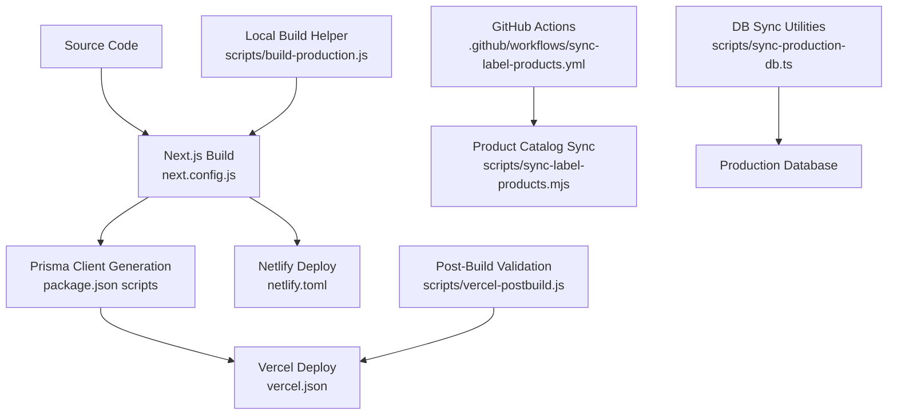
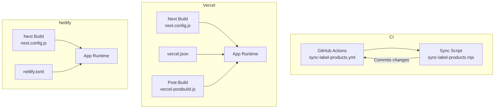
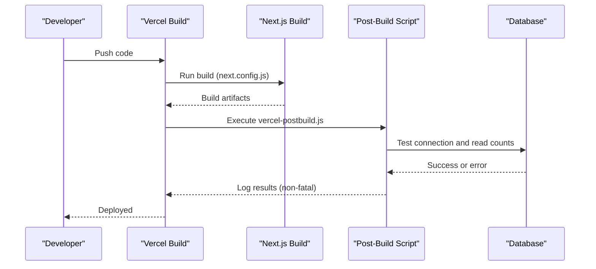
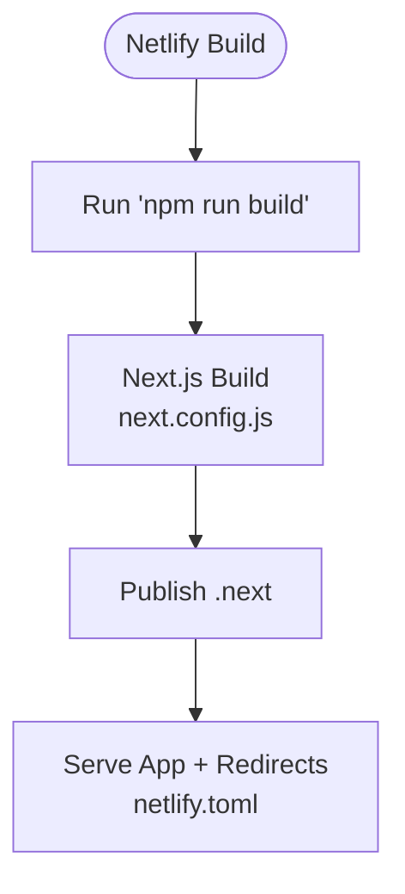
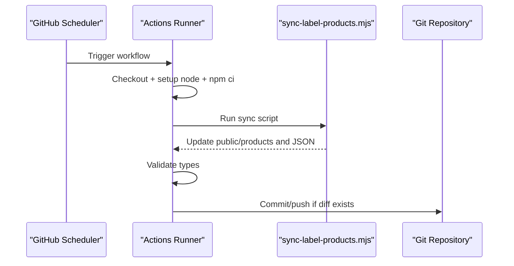
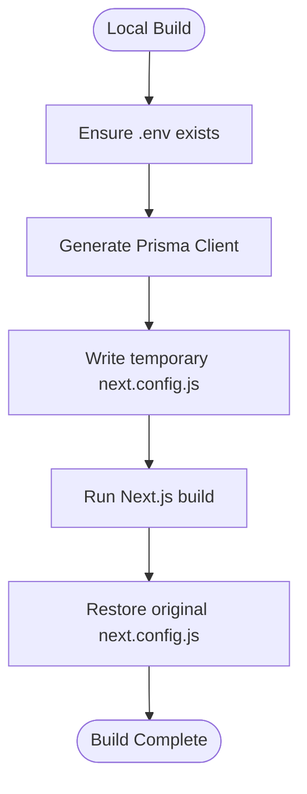
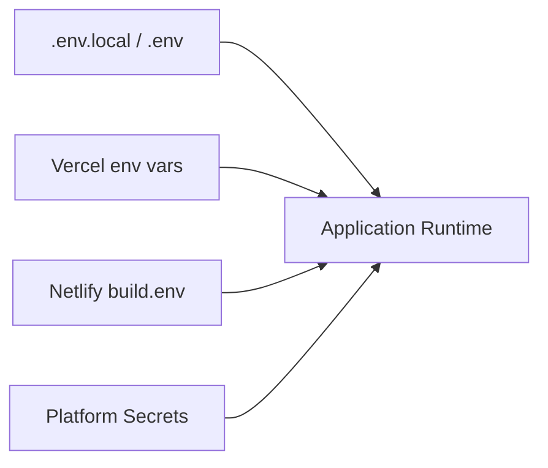
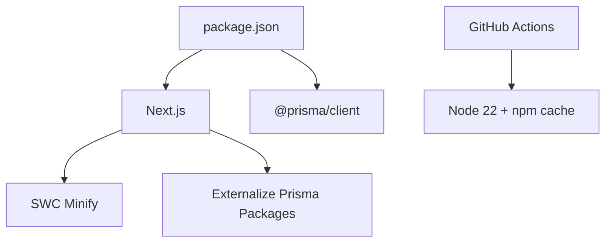

# Deployment & DevOps

<cite>
**Referenced Files in This Document**
- [vercel.json](file://vercel.json)
- [netlify.toml](file://netlify.toml)
- [.github/workflows/sync-label-products.yml](file://.github/workflows/sync-label-products.yml)
- [next.config.js](file://next.config.js)
- [package.json](file://package.json)
- [env.example.txt](file://env.example.txt)
- [scripts/build-production.js](file://scripts/build-production.js)
- [scripts/vercel-postbuild.js](file://scripts/vercel-postbuild.js)
- [scripts/sync-label-products.mjs](file://scripts/sync-label-products.mjs)
- [scripts/sync-production-db.ts](file://scripts/sync-production-db.ts)
</cite>

## Table of Contents
1. Introduction
2. Project Structure
3. Core Components
4. Architecture Overview
5. Detailed Component Analysis
6. Dependency Analysis
7. Performance Considerations
8. Troubleshooting Guide
9. Conclusion
10. Appendices

## Introduction
This document provides comprehensive deployment and DevOps guidance for the project, covering build processes, environment configuration, CI/CD pipelines, and production deployment strategies across Vercel and Netlify. It also documents automated product synchronization via GitHub Actions, environment variable management, build optimizations, caching strategies, monitoring hooks, rollback procedures, backup strategies, and disaster recovery plans.

## Project Structure
The repository is a Next.js application with Prisma-based data access and several operational scripts. Key deployment-related assets include:
- Platform configurations: Vercel (vercel.json), Netlify (netlify.toml)
- Build and runtime configuration: next.config.js, package.json scripts
- CI/CD automation: GitHub Actions workflow for label product synchronization
- Operational scripts: local build helper, post-build validation, database sync utilities, and catalog synchronization tooling

**Diagram sources**
- [next.config.js:1-29](file://next.config.js#L1-L29)
- [package.json:5-19](file://package.json#L5-L19)
- [vercel.json:1-13](file://vercel.json#L1-L13)
- [netlify.toml:1-10](file://netlify.toml#L1-L10)
- [.github/workflows/sync-label-products.yml:1-63](file://.github/workflows/sync-label-products.yml#L1-L63)
- [scripts/sync-label-products.mjs:1-800](file://scripts/sync-label-products.mjs#L1-L800)
- [scripts/build-production.js:1-101](file://scripts/build-production.js#L1-L101)
- [scripts/vercel-postbuild.js:1-61](file://scripts/vercel-postbuild.js#L1-L61)
- [scripts/sync-production-db.ts:1-106](file://scripts/sync-production-db.ts#L1-L106)

**Section sources**
- [next.config.js:1-29](file://next.config.js#L1-L29)
- [package.json:5-19](file://package.json#L5-L19)
- [vercel.json:1-13](file://vercel.json#L1-L13)
- [netlify.toml:1-10](file://netlify.toml#L1-L10)
- [.github/workflows/sync-label-products.yml:1-63](file://.github/workflows/sync-label-products.yml#L1-L63)
- [scripts/sync-label-products.mjs:1-800](file://scripts/sync-label-products.mjs#L1-L800)
- [scripts/build-production.js:1-101](file://scripts/build-production.js#L1-L101)
- [scripts/vercel-postbuild.js:1-61](file://scripts/vercel-postbuild.js#L1-L61)
- [scripts/sync-production-db.ts:1-106](file://scripts/sync-production-db.ts#L1-L106)

## Core Components
- Build pipeline:
  - Local and CI builds use Prisma client generation followed by Next.js build.
  - The local build helper ensures a minimal .env exists and temporarily configures Next to ignore type/lint errors during build.
- Runtime configuration:
  - Vercel sets function duration limits and disables Prisma migrations at deploy time.
  - Netlify defines build command, publish directory, environment variables, and API proxy redirect.
- CI/CD:
  - Scheduled GitHub Actions job synchronizes label products from an ERP endpoint, validates TypeScript, and commits changes when differences are detected.
- Post-deploy validation:
  - Vercel post-build script checks DB connectivity and logs counts; it does not run migrations automatically due to permissions.
- Data operations:
  - Scripts exist to synchronize production database values and validate structure.

**Section sources**
- [package.json:5-19](file://package.json#L5-L19)
- [scripts/build-production.js:1-101](file://scripts/build-production.js#L1-L101)
- [vercel.json:1-13](file://vercel.json#L1-L13)
- [netlify.toml:1-10](file://netlify.toml#L1-L10)
- [.github/workflows/sync-label-products.yml:1-63](file://.github/workflows/sync-label-products.yml#L1-L63)
- [scripts/vercel-postbuild.js:1-61](file://scripts/vercel-postbuild.js#L1-L61)
- [scripts/sync-production-db.ts:1-106](file://scripts/sync-production-db.ts#L1-L106)

## Architecture Overview
The deployment architecture spans two hosting platforms and a CI pipeline that updates static product assets used by the app.

**Diagram sources**
- [.github/workflows/sync-label-products.yml:1-63](file://.github/workflows/sync-label-products.yml#L1-L63)
- [scripts/sync-label-products.mjs:1-800](file://scripts/sync-label-products.mjs#L1-L800)
- [next.config.js:1-29](file://next.config.js#L1-L29)
- [vercel.json:1-13](file://vercel.json#L1-L13)
- [netlify.toml:1-10](file://netlify.toml#L1-L10)
- [scripts/vercel-postbuild.js:1-61](file://scripts/vercel-postbuild.js#L1-L61)

## Detailed Component Analysis

### Vercel Deployment Configuration
- Function duration: API functions under pages/api are limited to 60 seconds.
- Environment overrides: Disables Prisma data proxy generation and skips migrations during deploy.
- Integration points:
  - Next.js build uses SWC minification and ignores TS/ESLint errors during build.
  - Post-build script performs DB connectivity checks without running migrations.

**Diagram sources**
- [vercel.json:1-13](file://vercel.json#L1-L13)
- [next.config.js:1-29](file://next.config.js#L1-L29)
- [scripts/vercel-postbuild.js:1-61](file://scripts/vercel-postbuild.js#L1-L61)

**Section sources**
- [vercel.json:1-13](file://vercel.json#L1-L13)
- [next.config.js:1-29](file://next.config.js#L1-L29)
- [scripts/vercel-postbuild.js:1-61](file://scripts/vercel-postbuild.js#L1-L61)

### Netlify Deployment Options
- Build command: npm run build
- Publish directory: .next
- Environment variables: Sets NEXT_PUBLIC_API_URL for the frontend
- Redirects: Proxies /api/* requests to the same origin (useful for serverless or edge routing scenarios)

**Diagram sources**
- [netlify.toml:1-10](file://netlify.toml#L1-L10)
- [next.config.js:1-29](file://next.config.js#L1-L29)

**Section sources**
- [netlify.toml:1-10](file://netlify.toml#L1-L10)

### GitHub Actions Workflow: Product Synchronization
- Trigger: Scheduled daily at a fixed time and manual dispatch.
- Concurrency: Grouped to prevent overlapping runs.
- Steps:
  - Checkout repository
  - Setup Node.js with npm cache
  - Install dependencies
  - Run product sync script
  - Validate TypeScript for labels
  - Commit and push if changes detected

**Diagram sources**
- [.github/workflows/sync-label-products.yml:1-63](file://.github/workflows/sync-label-products.yml#L1-L63)
- [scripts/sync-label-products.mjs:1-800](file://scripts/sync-label-products.mjs#L1-L800)

**Section sources**
- [.github/workflows/sync-label-products.yml:1-63](file://.github/workflows/sync-label-products.yml#L1-L63)
- [scripts/sync-label-products.mjs:1-800](file://scripts/sync-label-products.mjs#L1-L800)

### Build Process and Optimizations
- Prisma client generation is part of the build lifecycle.
- Next.js build enables SWC minification and transpiles specific packages.
- Local build helper:
  - Ensures a minimal .env exists
  - Temporarily writes a permissive next.config.js to allow builds to complete even with type/lint issues
  - Runs Next.js build in production mode
  - Restores original next.config.js afterward

**Diagram sources**
- [scripts/build-production.js:1-101](file://scripts/build-production.js#L1-L101)
- [next.config.js:1-29](file://next.config.js#L1-L29)
- [package.json:5-19](file://package.json#L5-L19)

**Section sources**
- [scripts/build-production.js:1-101](file://scripts/build-production.js#L1-L101)
- [next.config.js:1-29](file://next.config.js#L1-L29)
- [package.json:5-19](file://package.json#L5-L19)

### Environment Variable Management
- Example environment file lists required keys for local development and production, including:
  - Application URLs
  - Authentication secrets
  - Database URL
  - CORS settings
  - Cookie and session configuration
  - CSRF and rate limiting parameters
- Platform-specific injection:
  - Vercel: env block in vercel.json sets Prisma-related flags
  - Netlify: build.environment sets NEXT_PUBLIC_API_URL

**Diagram sources**
- [env.example.txt:1-38](file://env.example.txt#L1-L38)
- [vercel.json:1-13](file://vercel.json#L1-L13)
- [netlify.toml:1-10](file://netlify.toml#L1-L10)

**Section sources**
- [env.example.txt:1-38](file://env.example.txt#L1-L38)
- [vercel.json:1-13](file://vercel.json#L1-L13)
- [netlify.toml:1-10](file://netlify.toml#L1-L10)

### Production Deployment Strategies
- Vercel:
  - Use default framework detection; ensure environment variables are set in the dashboard.
  - Keep PRISMA_SKIP_MIGRATIONS true; perform migrations manually or via secure admin tools.
  - Leverage post-build script for health checks only.
- Netlify:
  - Configure build command and publish directory as defined.
  - Set NEXT_PUBLIC_API_URL in site environment settings.
  - Use redirects for API proxying if needed.

[No sources needed since this section summarizes platform strategies based on existing configs]

### Monitoring Setup
- Post-build verification:
  - Connects to the database and logs counts for key tables to confirm connectivity and basic data presence.
- Observability recommendations:
  - Add health endpoints to expose readiness/liveness.
  - Integrate error tracking and performance monitoring at the application layer.

**Section sources**
- [scripts/vercel-postbuild.js:1-61](file://scripts/vercel-postbuild.js#L1-L61)

### Rollback Procedures
- Vercel:
  - Use the platform’s rollbacks to revert to a previous deployment version.
  - Ensure environment variables remain consistent across versions.
- Netlify:
  - Revert to a prior deploy using the Netlify UI or CLI.
  - Verify redirects and environment variables after rollback.

[No sources needed since this section provides general guidance]

### Backup Strategies
- Database backups:
  - Schedule regular snapshots of the production database.
  - Store backups securely with retention policies.
- Static assets:
  - Version control includes product images and catalogs; rely on Git history for asset rollback.

[No sources needed since this section provides general guidance]

### Disaster Recovery Plan
- RTO/RPO targets:
  - Define acceptable recovery time and point objectives for critical services.
- Recovery steps:
  - Restore database from latest verified backup.
  - Redeploy application from known-good commit/tag.
  - Validate integrations and re-run essential post-deploy checks.

[No sources needed since this section provides general guidance]

## Dependency Analysis
Key runtime and build-time dependencies relevant to deployment:
- Next.js application with SWC minification and selective externalization of Prisma packages.
- Prisma client generated during build/postinstall.
- Node.js engine pinned to a specific major version.
- CI runner uses Node 22 with npm caching enabled.

**Diagram sources**
- [package.json:20-22](file://package.json#L20-L22)
- [package.json:23-94](file://package.json#L23-L94)
- [next.config.js:1-29](file://next.config.js#L1-L29)
- [.github/workflows/sync-label-products.yml:34-41](file://.github/workflows/sync-label-products.yml#L34-L41)

**Section sources**
- [package.json:20-22](file://package.json#L20-L22)
- [package.json:23-94](file://package.json#L23-L94)
- [next.config.js:1-29](file://next.config.js#L1-L29)
- [.github/workflows/sync-label-products.yml:34-41](file://.github/workflows/sync-label-products.yml#L34-L41)

## Performance Considerations
- Build optimizations:
  - SWC minification enabled.
  - Transpile heavy packages explicitly to reduce bundle size.
  - Ignore TS/ESLint errors during build to avoid blocking deployments (use cautiously).
- Runtime considerations:
  - API function duration capped at 60 seconds on Vercel; optimize long-running tasks or offload to background jobs.
  - Avoid heavy synchronous operations in request handlers.
- Caching strategies:
  - Use CDN caching for static assets (images, catalogs).
  - Implement application-level caching for expensive queries where appropriate.

[No sources needed since this section provides general guidance]

## Troubleshooting Guide
Common issues and resolutions:
- Build failures due to type/lint errors:
  - The local build helper temporarily bypasses checks; fix underlying issues before relying on this workaround.
- Prisma client generation errors:
  - Ensure DATABASE_URL and other required env vars are present.
  - Regenerate client using the provided scripts.
- API timeouts on Vercel:
  - Review function duration limits and refactor slow endpoints.
- Post-build DB validation failures:
  - Confirm migrations have been applied and credentials are correct.

**Section sources**
- [scripts/build-production.js:1-101](file://scripts/build-production.js#L1-L101)
- [scripts/vercel-postbuild.js:1-61](file://scripts/vercel-postbuild.js#L1-L61)

## Conclusion
The project supports robust deployment workflows across Vercel and Netlify, with CI-driven product synchronization and clear separation between build-time and runtime concerns. By following the outlined environment configuration, leveraging build optimizations, and implementing monitoring and rollback strategies, teams can maintain reliable production releases and rapid recovery capabilities.

[No sources needed since this section summarizes without analyzing specific files]

## Appendices

### Environment Variables Reference
- Application URLs: NEXT_PUBLIC_APP_URL, NEXT_PUBLIC_API_URL
- Security: NEXTAUTH_SECRET, NEXTAUTH_URL, JWT_SECRET
- Database: DATABASE_URL
- CORS: CORS_ORIGIN, CORS_METHODS, CORS_ALLOWED_HEADERS
- Cookies: NODE_ENV, COOKIE_DOMAIN, SECURE_COOKIE
- Session: SESSION_SECRET, SESSION_MAX_AGE
- CSRF: CSRF_SECRET
- Rate Limiting: RATE_LIMIT_WINDOW_MS, RATE_LIMIT_MAX_REQUESTS

**Section sources**
- [env.example.txt:1-38](file://env.example.txt#L1-L38)

### Database Synchronization Utility
- Purpose: Apply targeted updates to production data (e.g., transportadora renaming) and verify schema fields.
- Usage: Execute via ts-node; handles updates and reports missing columns requiring manual SQL fixes.

**Section sources**
- [scripts/sync-production-db.ts:1-106](file://scripts/sync-production-db.ts#L1-L106)