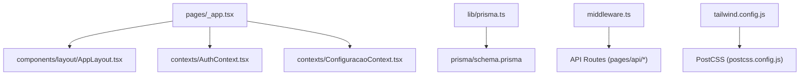
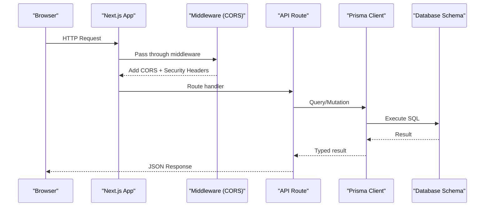
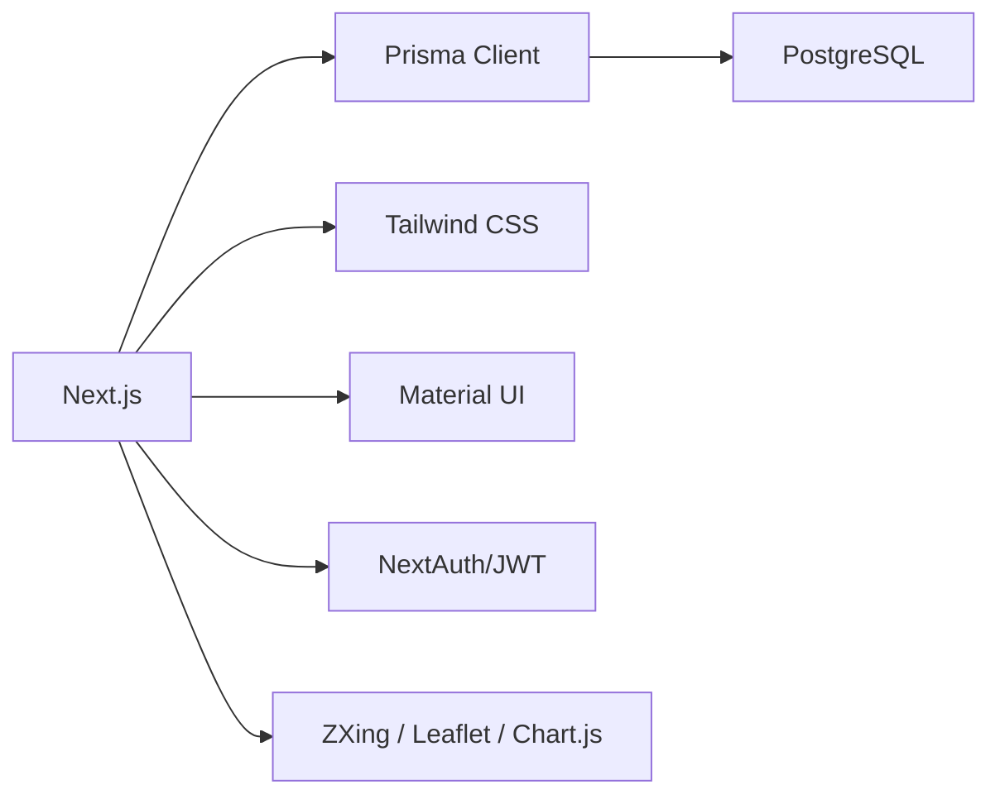

# Development Guide

<cite>
**Referenced Files in This Document**
- [package.json](file://package.json)
- [tsconfig.json](file://tsconfig.json)
- [.eslintrc.json](file://.eslintrc.json)
- [postcss.config.js](file://postcss.config.js)
- [tailwind.config.js](file://tailwind.config.js)
- [next.config.js](file://next.config.js)
- [middleware.ts](file://middleware.ts)
- [prisma/schema.prisma](file://prisma/schema.prisma)
- [lib/prisma.ts](file://lib/prisma.ts)
- [pages/_app.tsx](file://pages/_app.tsx)
- [README.md](file://README.md)
- [env.example.txt](file://env.example.txt)
- [tests/pedido-cards.test.ts](file://tests/pedido-cards.test.ts)
- [tests/pedido-pendencias.test.ts](file://tests/pedido-pendencias.test.ts)
</cite>

## Table of Contents
1. [Introduction](#introduction)
2. [Project Structure](#project-structure)
3. [Core Components](#core-components)
4. [Architecture Overview](#architecture-overview)
5. [Detailed Component Analysis](#detailed-component-analysis)
6. [Dependency Analysis](#dependency-analysis)
7. [Performance Considerations](#performance-considerations)
8. [Troubleshooting Guide](#troubleshooting-guide)
9. [Conclusion](#conclusion)
10. [Appendices](#appendices)

## Introduction
This guide explains how to contribute effectively to the Control Carga project. It covers coding standards, TypeScript configuration, ESLint rules, PostCSS and Tailwind setup, development workflow, code organization, naming conventions, component structure guidelines, adding features, creating database migrations, writing tests, Git practices, development tools, debugging techniques, performance optimization strategies, and contribution guidelines for team collaboration and code reviews.

## Project Structure
Control Carga is a Next.js application with:
- Pages and API routes under pages/
- Shared UI components under components/
- Business logic and utilities under lib/ and services/
- Database schema and migrations under prisma/
- Global styles and theming under styles/ and tailwind.config.js
- Environment variables via .env.local (see env.example.txt)
- Tests under tests/

**Diagram sources**
- [pages/_app.tsx:1-206](file://pages/_app.tsx#L1-L206)
- [lib/prisma.ts:1-19](file://lib/prisma.ts#L1-L19)
- [prisma/schema.prisma:1-559](file://prisma/schema.prisma#L1-L559)
- [middleware.ts:1-251](file://middleware.ts#L1-L251)
- [postcss.config.js:1-7](file://postcss.config.js#L1-L7)
- [tailwind.config.js:1-38](file://tailwind.config.js#L1-L38)

**Section sources**
- [README.md:1-84](file://README.md#L1-L84)
- [package.json:1-112](file://package.json#L1-L112)

## Core Components
- Application shell and providers are initialized in pages/_app.tsx, including theme, authentication context, configuration context, and protected routing.
- Prisma client is configured in lib/prisma.ts with logging enabled in non-production environments.
- The middleware enforces CORS, security headers, and cookie handling for API routes.

Key responsibilities:
- pages/_app.tsx: global layout, auth/config contexts, snackbar provider, protected route wrapper
- lib/prisma.ts: singleton Prisma client instance with query/error/warn logs
- middleware.ts: per-request CORS policy, security headers, cookie processing for cross-origin requests

**Section sources**
- [pages/_app.tsx:1-206](file://pages/_app.tsx#L1-L206)
- [lib/prisma.ts:1-19](file://lib/prisma.ts#L1-L19)
- [middleware.ts:1-251](file://middleware.ts#L1-L251)

## Architecture Overview
The app follows a Next.js file-based routing model with server-side API routes and a shared data layer via Prisma. Authentication and configuration are provided through React contexts. Styles are built with Tailwind CSS processed by PostCSS.

**Diagram sources**
- [middleware.ts:163-239](file://middleware.ts#L163-L239)
- [lib/prisma.ts:1-19](file://lib/prisma.ts#L1-L19)
- [prisma/schema.prisma:1-559](file://prisma/schema.prisma#L1-L559)

## Detailed Component Analysis

### TypeScript Configuration
- Strict mode enabled for type safety.
- Path aliases configured for cleaner imports across contexts, services, types, components, and lib.
- JSX preserved for Next.js integration; incremental builds enabled.
- Node types included; scripts excluded from compilation.

Recommendations:
- Use path aliases consistently to avoid deep relative imports.
- Keep strict mode on to catch issues early.

**Section sources**
- [tsconfig.json:1-68](file://tsconfig.json#L1-L68)

### ESLint Rules
- Extends Next.js recommended configs for web vitals and TypeScript.
- Warns on explicit any, unused vars, missing hook dependencies, anonymous default exports, and var usage.

Guidelines:
- Prefer typed interfaces over any.
- Ensure all hooks have correct dependency arrays.
- Avoid anonymous default exports; prefer named exports.

**Section sources**
- [.eslintrc.json:1-14](file://.eslintrc.json#L1-L14)

### PostCSS and Tailwind Setup
- PostCSS uses @tailwindcss/postcss and autoprefixer.
- Tailwind content scans pages and components directories.
- Custom color palette and design tokens defined in theme extension.

Usage tips:
- Place new UI components under components/ so Tailwind can purge unused styles.
- Extend theme colors or spacing in tailwind.config.js when needed.

**Section sources**
- [postcss.config.js:1-7](file://postcss.config.js#L1-L7)
- [tailwind.config.js:1-38](file://tailwind.config.js#L1-L38)

### Next.js Configuration
- SWC minification enabled.
- TypeScript and ESLint checks ignored during build to keep CI fast while relying on local checks.
- Externalize Prisma packages in server components for better performance.
- Webpack fallback disables Node-only modules in the browser bundle.

Best practices:
- Keep experimental flags minimal and justified.
- Use transpilePackages only for necessary libraries.

**Section sources**
- [next.config.js:1-29](file://next.config.js#L1-L29)

### Middleware (CORS and Security)
- Enforces allowed origins based on environment.
- Adds security headers (X-Content-Type-Options, X-Frame-Options, etc.).
- Processes Set-Cookie headers to ensure correct SameSite and Secure attributes.
- Applies to all API routes via matcher.

Operational notes:
- In production, cookies include Secure and SameSite=None where appropriate.
- Preflight OPTIONS requests return immediately with proper CORS headers.

**Section sources**
- [middleware.ts:1-251](file://middleware.ts#L1-L251)

### Database Schema and Migrations
- Single PostgreSQL datasource using DATABASE_URL.
- Models cover core domains: load control, invoices, users, logistics snapshots, freight payments, materials, transport labels, checklists, and routing.
- Enums define constrained values for transporters, statuses, and movement types.

Migration workflow:
- Create a migration with Prisma CLI.
- Review generated SQL before applying.
- Apply to dev, test, then prod environments.

Data access:
- Use lib/prisma.ts to obtain the Prisma client instance.
- Leverage generated types for safe queries.

**Section sources**
- [prisma/schema.prisma:1-559](file://prisma/schema.prisma#L1-L559)
- [lib/prisma.ts:1-19](file://lib/prisma.ts#L1-L19)

### Application Shell and Routing
- pages/_app.tsx sets up Material UI theme, global styles, snackbar provider, and contexts for auth and configuration.
- ProtectedRoute wraps authenticated pages; public routes bypass protection.
- Layout selection supports both standard and app-wide layouts.

Contribution tips:
- Add new top-level pages under pages/.
- Wrap sensitive pages with ProtectedRoute if not already handled by layout logic.

**Section sources**
- [pages/_app.tsx:1-206](file://pages/_app.tsx#L1-L206)

### Environment Variables
- See env.example.txt for required keys such as NEXTAUTH_SECRET, JWT_SECRET, DATABASE_URL, and CORS settings.
- Copy to .env.local for local development.

Security note:
- Never commit secrets; use environment-specific files and platform secret managers.

**Section sources**
- [env.example.txt:1-38](file://env.example.txt#L1-L38)

### Testing
- Tests use Node’s assert module to validate business logic functions.
- Example tests verify order summary grouping and pending balance calculations.

How to run:
- Use ts-node with tsconfig-paths registration as shown in package scripts.

Adding tests:
- Place tests under tests/ mirroring the feature/module being tested.
- Keep assertions focused and deterministic.

**Section sources**
- [tests/pedido-cards.test.ts:1-24](file://tests/pedido-cards.test.ts#L1-L24)
- [tests/pedido-pendencias.test.ts:1-36](file://tests/pedido-pendencias.test.ts#L1-L36)
- [package.json:5-18](file://package.json#L5-L18)

## Dependency Analysis
High-level dependencies and their roles:
- Next.js: framework for pages, API routes, and build pipeline
- Prisma: ORM and migrations for PostgreSQL
- Tailwind + PostCSS: styling pipeline
- Material UI: UI components and theming
- Auth: NextAuth and JWT for session management
- Utilities: ZXing for barcode scanning, Leaflet for maps, Chart.js for charts

**Diagram sources**
- [package.json:23-94](file://package.json#L23-L94)
- [next.config.js:1-29](file://next.config.js#L1-L29)
- [postcss.config.js:1-7](file://postcss.config.js#L1-L7)
- [tailwind.config.js:1-38](file://tailwind.config.js#L1-L38)

**Section sources**
- [package.json:1-112](file://package.json#L1-L112)

## Performance Considerations
- Enable SWC minification and keep experimental flags minimal.
- Externalize heavy server packages (e.g., Prisma) in server components.
- Use Tailwind’s content paths to limit CSS size.
- Avoid unnecessary re-renders in components; memoize expensive computations.
- Log queries selectively in development; disable verbose logging in production.

[No sources needed since this section provides general guidance]

## Troubleshooting Guide
Common issues and resolutions:
- CORS errors: Verify allowed origins and credentials in middleware; ensure preflight responses are correct.
- Cookie issues: Confirm SameSite and Secure attributes set by middleware; check domain matching.
- Build failures due to TypeScript/ESLint: Run local lint/type checks before committing; ignore flags are set for builds but local checks remain strict.
- Database connectivity: Validate DATABASE_URL and apply migrations before starting the app.

Debugging tips:
- Use Prisma logs in development to inspect queries.
- Inspect network tab for CORS and cookie headers.
- Check console for middleware logs related to DELETE or POST methods.

**Section sources**
- [middleware.ts:163-239](file://middleware.ts#L163-L239)
- [lib/prisma.ts:1-19](file://lib/prisma.ts#L1-L19)
- [next.config.js:1-29](file://next.config.js#L1-L29)

## Conclusion
This guide outlines the development workflow, coding standards, and tooling for contributing to Control Carga. Follow the established patterns for components, API routes, database changes, and tests to maintain consistency and reliability. Use the provided configurations and scripts to streamline development and ensure quality through linting, type checking, and testing.

[No sources needed since this section summarizes without analyzing specific files]

## Appendices

### Coding Standards and Naming Conventions
- Use TypeScript strictly; prefer interfaces and enums over loose types.
- Name files and folders in kebab-case; components in PascalCase.
- Export named functions/components; avoid anonymous defaults.
- Organize code by feature: pages, components, lib, services, types.

[No sources needed since this section provides general guidance]

### Adding New Features
- Create page(s) under pages/ and corresponding components under components/.
- If backend logic is needed, add an API route under pages/api/ and implement handlers.
- For data changes, create a Prisma migration and update schema accordingly.
- Write tests under tests/ for critical logic.

[No sources needed since this section provides general guidance]

### Creating Database Migrations
- Modify prisma/schema.prisma to reflect desired changes.
- Generate migration with Prisma CLI.
- Review and apply migration to dev/test/prod environments.
- Update seed or scripts if initial data is affected.

**Section sources**
- [prisma/schema.prisma:1-559](file://prisma/schema.prisma#L1-L559)

### Writing Tests
- Use Node’s assert for unit tests.
- Mirror the structure of the code under tests/.
- Run tests via npm scripts that leverage ts-node and path resolution.

**Section sources**
- [tests/pedido-cards.test.ts:1-24](file://tests/pedido-cards.test.ts#L1-L24)
- [tests/pedido-pendencias.test.ts:1-36](file://tests/pedido-pendencias.test.ts#L1-L36)
- [package.json:5-18](file://package.json#L5-L18)

### Git Workflow Practices
- Create feature branches from main for each change.
- Commit small, logical units with clear messages.
- Open pull requests with descriptions linking to issues or tasks.
- Require code review before merging; ensure tests pass locally.

[No sources needed since this section provides general guidance]

### Development Tools and Scripts
- Development server: npm run dev
- Build: npm run build (includes Prisma generate)
- Lint: npm run lint
- Type check: npm run type-check
- Test label products sync: npm run sync:label-products

**Section sources**
- [package.json:5-18](file://package.json#L5-L18)

### Contribution Guidelines and Code Review
- Follow ESLint and TypeScript rules; fix warnings before review.
- Ensure middleware and API routes handle CORS and security correctly.
- Include tests for new functionality where applicable.
- Document changes in PR description; link to relevant issues.

[No sources needed since this section provides general guidance]