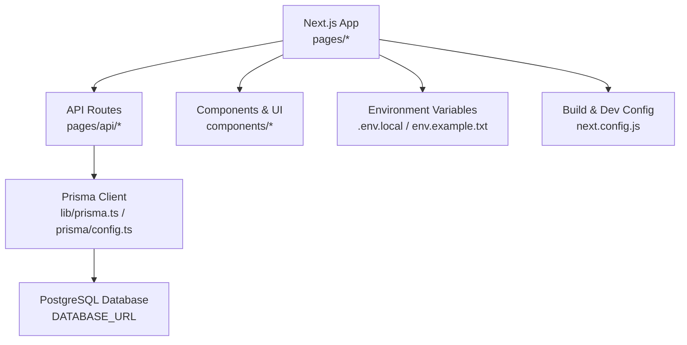
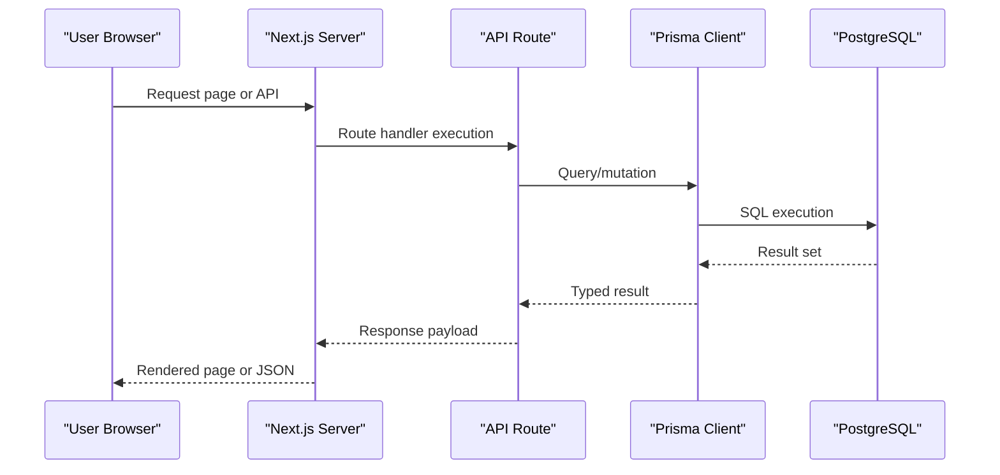
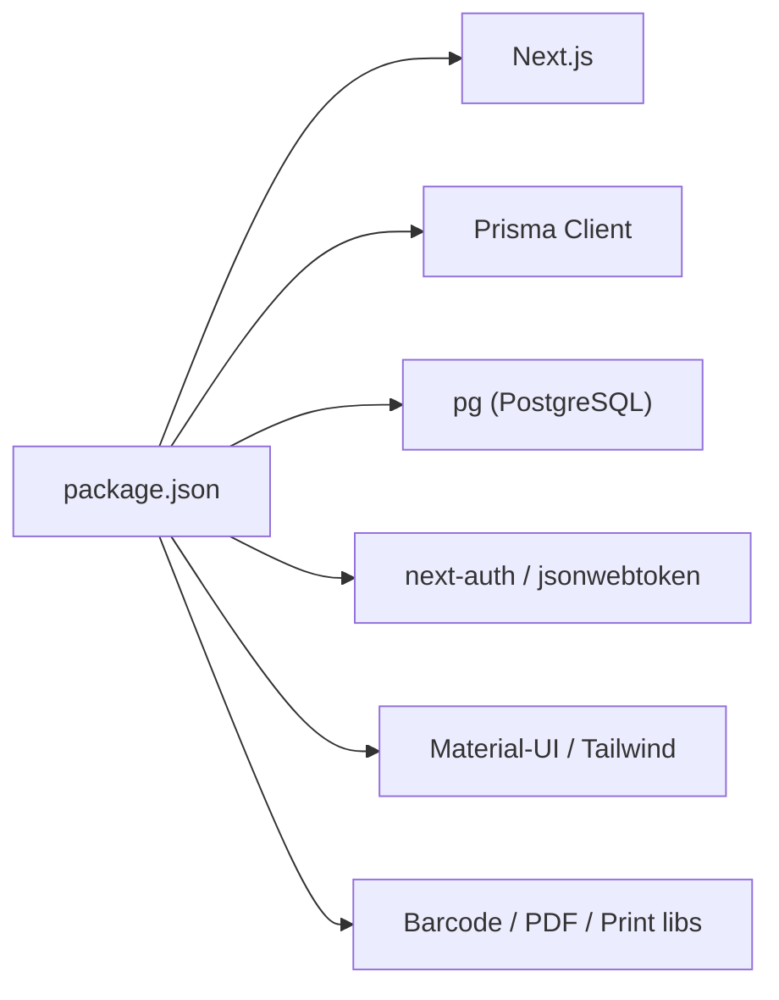

# Getting Started

<cite>
**Referenced Files in This Document**
- [README.md](file://README.md)
- [package.json](file://package.json)
- [next.config.js](file://next.config.js)
- [env.example.txt](file://env.example.txt)
- [prisma/schema.prisma](file://prisma/schema.prisma)
- [prisma/config.ts](file://prisma/config.ts)
- [vercel.json](file://vercel.json)
- [INSTRUCOES_BANCO.md](file://INSTRUCOES_BANCO.md)
</cite>

## Table of Contents
1. Introduction
2. Project Structure
3. Core Components
4. Architecture Overview
5. Detailed Component Analysis
6. Dependency Analysis
7. Performance Considerations
8. Troubleshooting Guide
9. Conclusion

## Introduction
This guide walks you through setting up the Control Carga system from scratch, including prerequisites, installation steps, database configuration, environment variables, migrations, and starting the development server. It also covers initial configuration guidance, first-time deployment to Vercel, troubleshooting tips, and verification steps to ensure a successful setup.

## Project Structure
Control Carga is a Next.js application with TypeScript, Prisma for data modeling, and PostgreSQL as the database. The project includes API routes under pages/api, shared libraries under lib, UI components under components, and Prisma schema and migrations under prisma. Environment variables are managed via .env.local (or .env), with an example provided.

**Diagram sources**
- [next.config.js:1-29](file://next.config.js#L1-L29)
- [env.example.txt:1-38](file://env.example.txt#L1-L38)
- [prisma/schema.prisma:1-10](file://prisma/schema.prisma#L1-L10)
- [prisma/config.ts:1-12](file://prisma/config.ts#L1-L12)

**Section sources**
- [README.md:15-39](file://README.md#L15-L39)
- [package.json:1-22](file://package.json#L1-L22)
- [next.config.js:1-29](file://next.config.js#L1-L29)

## Core Components
- Runtime and tooling: Node.js engine specified in package.json; scripts for dev, build, start, and postinstall generation of Prisma client.
- Database layer: Prisma client configured to read DATABASE_URL from environment and connect to PostgreSQL.
- Configuration: next.config.js sets build behavior and externalizes Prisma packages for server-side usage.
- Environment: Example environment variables include app URLs, secrets, database URL, CORS, cookies, session, CSRF, and rate limiting settings.

Key responsibilities:
- package.json defines commands and dependencies, including Next.js, Prisma, and PostgreSQL driver.
- prisma/schema.prisma declares the data model and datasource provider (PostgreSQL).
- prisma/config.ts exports a singleton PrismaClient instance used across the app.
- next.config.js configures Next.js build and server component handling for Prisma.
- env.example.txt provides a template for required environment variables.

**Section sources**
- [package.json:1-22](file://package.json#L1-L22)
- [prisma/schema.prisma:1-10](file://prisma/schema.prisma#L1-L10)
- [prisma/config.ts:1-12](file://prisma/config.ts#L1-L12)
- [next.config.js:1-29](file://next.config.js#L1-L29)
- [env.example.txt:1-38](file://env.example.txt#L1-L38)

## Architecture Overview
The application follows a standard Next.js architecture:
- Frontend pages and components render the UI.
- API routes handle business logic and data operations.
- Prisma Client connects to PostgreSQL using DATABASE_URL.
- Environment variables control runtime behavior and security.

**Diagram sources**
- [prisma/config.ts:1-12](file://prisma/config.ts#L1-L12)
- [prisma/schema.prisma:1-10](file://prisma/schema.prisma#L1-L10)

## Detailed Component Analysis

### Installation and Setup
Follow these steps to get Control Carga running locally:

1. Install prerequisites
   - Node.js 18+ (project specifies engines.node 22.x in package.json; use a compatible version)
   - PostgreSQL server accessible from your machine
   - npm or yarn

2. Clone the repository
   - Use the repository URL provided by your hosting service.

3. Install dependencies
   - Run npm install to install all dependencies and generate Prisma client via postinstall.

4. Configure the database
   - Create a PostgreSQL database for the application.
   - Ensure your database user has permissions to create tables and enums if needed. If not, follow the manual SQL instructions in the project’s database documentation.

5. Set environment variables
   - Copy env.example.txt to .env.local and fill in values:
     - NEXT_PUBLIC_APP_URL and NEXT_PUBLIC_API_URL
     - NEXTAUTH_SECRET and NEXTAUTH_URL
     - JWT_SECRET
     - DATABASE_URL pointing to your PostgreSQL instance
     - Optional: CORS, cookies, session, CSRF, and rate limiting variables

6. Run Prisma migrations
   - Execute npx prisma migrate dev to apply schema changes to your database.

7. Start the development server
   - Run npm run dev to launch the app on localhost:3000.

Verification steps:
- Open http://localhost:3000 in your browser and confirm the app loads without errors.
- Test a simple API endpoint if available (e.g., health or dashboard summary) to verify database connectivity.
- Confirm that Prisma client can query the database by checking logs for any connection errors.

Common pitfalls:
- Missing or incorrect DATABASE_URL will cause Prisma to fail connecting.
- Incorrect NEXTAUTH_URL or NEXTAUTH_SECRET may break authentication flows.
- Insufficient database permissions can prevent migration creation or table/enums creation.

**Section sources**
- [README.md:35-67](file://README.md#L35-L67)
- [package.json:1-22](file://package.json#L1-L22)
- [env.example.txt:1-38](file://env.example.txt#L1-L38)
- [INSTRUCOES_BANCO.md:1-66](file://INSTRUCOES_BANCO.md#L1-L66)

### Initial Configuration
- Environment variables:
  - NEXT_PUBLIC_APP_URL and NEXT_PUBLIC_API_URL define frontend-facing URLs.
  - NEXTAUTH_SECRET and NEXTAUTH_URL secure sessions and redirects.
  - JWT_SECRET signs tokens used by the application.
  - DATABASE_URL must point to a valid PostgreSQL instance.
  - Optional CORS, cookies, session, CSRF, and rate limiting variables can be tuned per environment.

- Build configuration:
  - next.config.js disables strict mode for React, enables SWC minification, ignores TypeScript and ESLint errors during builds, transpiles specific packages, and marks Prisma packages as external for server components.

- Prisma client:
  - prisma/config.ts creates a singleton PrismaClient instance and logs errors/warnings. In non-production environments, it attaches the client to globalThis to avoid multiple connections.

**Section sources**
- [env.example.txt:1-38](file://env.example.txt#L1-L38)
- [next.config.js:1-29](file://next.config.js#L1-L29)
- [prisma/config.ts:1-12](file://prisma/config.ts#L1-L12)

### Database Connection Setup
- Data source:
  - prisma/schema.prisma defines the datasource provider as PostgreSQL and reads DATABASE_URL from environment.

- Permissions:
  - If migrations fail due to insufficient privileges, follow the manual SQL approach documented in the project to create necessary tables or request DDL permissions from your database administrator.

- Verification:
  - After setting DATABASE_URL and running migrations, confirm connectivity by accessing the app and observing no database-related errors in logs.

**Section sources**
- [prisma/schema.prisma:1-10](file://prisma/schema.prisma#L1-L10)
- [INSTRUCOES_BANCO.md:1-66](file://INSTRUCOES_BANCO.md#L1-L66)

### First-Time Deployment to Vercel
- Prepare environment variables:
  - Add all required variables (NEXT_PUBLIC_APP_URL, NEXT_PUBLIC_API_URL, NEXTAUTH_SECRET, NEXTAUTH_URL, JWT_SECRET, DATABASE_URL, etc.) in Vercel project settings.

- Build and runtime:
  - vercel.json sets PRISMA_GENERATE_DATAPROXY to false and PRISMA_SKIP_MIGRATIONS to true. This means migrations should be applied outside of Vercel functions (e.g., via CI/CD or local dev workflow).

- Deploy:
  - Connect your repository to Vercel and deploy. The platform will use Next.js build and start commands defined in package.json.

- Post-deploy checks:
  - Verify the app loads at your Vercel domain.
  - Confirm API endpoints respond correctly and database queries succeed.
  - Ensure authentication flows work with configured NEXTAUTH_URL and secrets.

**Section sources**
- [vercel.json:1-13](file://vercel.json#L1-L13)
- [package.json:1-22](file://package.json#L1-L22)
- [README.md:69-77](file://README.md#L69-L77)

## Dependency Analysis
Core runtime and build dependencies:
- Next.js framework and related tooling
- Prisma client and Prisma CLI for data modeling and migrations
- PostgreSQL driver (pg) for database connectivity
- Authentication and token utilities (next-auth, jsonwebtoken)
- UI libraries (Material-UI, Tailwind CSS)
- Utilities for barcode scanning, PDF generation, and printing

**Diagram sources**
- [package.json:23-94](file://package.json#L23-L94)

**Section sources**
- [package.json:23-94](file://package.json#L23-L94)

## Performance Considerations
- Build optimizations:
  - next.config.js enables SWC minification and externalizes Prisma packages for server components to improve build times and runtime performance.

- Database access:
  - Use Prisma efficiently by selecting only needed fields and leveraging indexes defined in the schema.

- Environment tuning:
  - Adjust CORS, rate limiting, and cookie settings based on deployment environment needs.

[No sources needed since this section provides general guidance]

## Troubleshooting Guide
Common issues and resolutions:

- Database connection failures:
  - Verify DATABASE_URL format and credentials.
  - Ensure PostgreSQL is running and reachable.
  - Check network/firewall rules if using remote databases.

- Migration permission errors:
  - If the database user lacks DDL permissions, execute the recommended SQL manually or request elevated privileges from your database administrator.

- Authentication problems:
  - Confirm NEXTAUTH_URL matches your deployed domain and NEXTAUTH_SECRET is set.
  - Ensure JWT_SECRET is configured consistently across environments.

- Build errors:
  - Review next.config.js settings; ignore flags may hide issues during builds but not in development.
  - Ensure all required environment variables are present when building for production.

- Vercel-specific issues:
  - Migrations are skipped in Vercel functions per vercel.json; apply migrations via CI/CD or local workflow before deploying.

Verification checklist:
- App loads at localhost:3000 or your Vercel domain.
- API endpoints return expected responses.
- Database queries succeed without permission or connection errors.
- Authentication flow completes successfully.

**Section sources**
- [INSTRUCOES_BANCO.md:1-66](file://INSTRUCOES_BANCO.md#L1-L66)
- [vercel.json:1-13](file://vercel.json#L1-L13)
- [next.config.js:1-29](file://next.config.js#L1-L29)

## Conclusion
You now have the essential steps to install, configure, and run Control Carga locally, as well as deploy it to Vercel. Ensure your environment variables are correct, database permissions are sufficient, and migrations are applied before deployment. Use the troubleshooting guide to resolve common setup issues and verify your installation by testing core features like login and data queries.