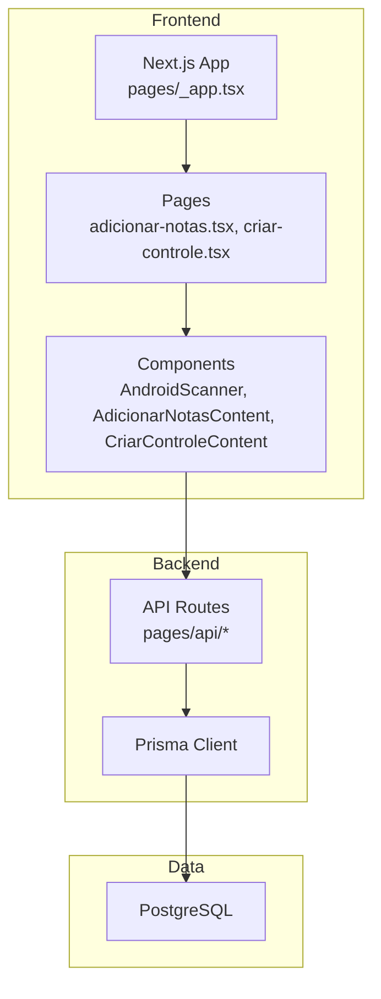
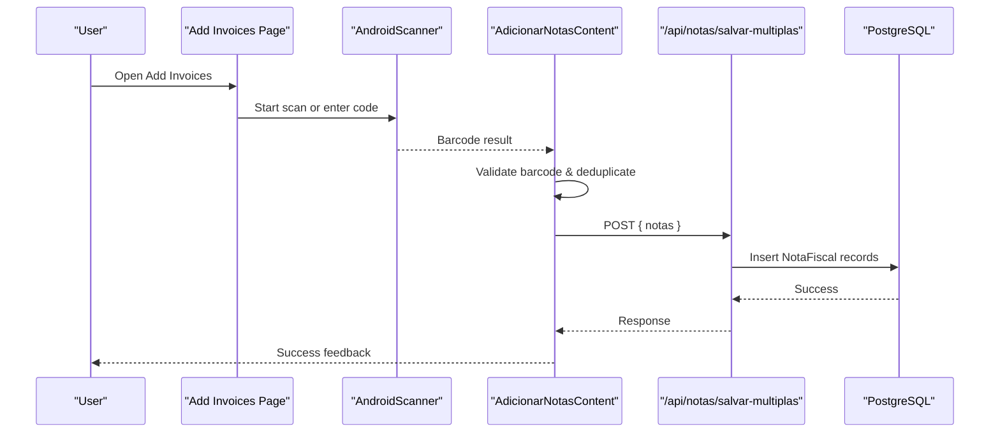
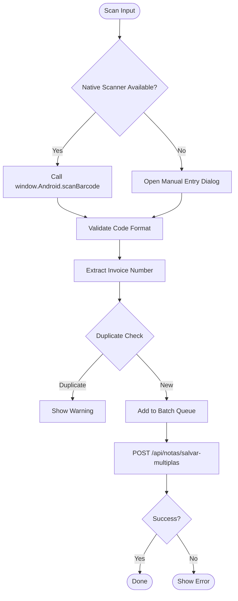
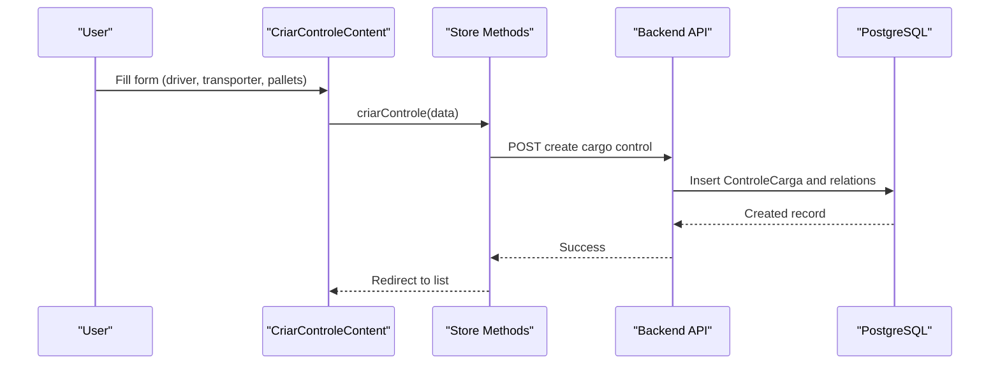
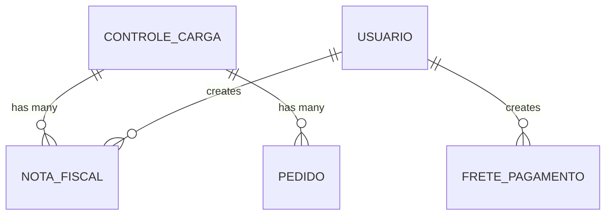
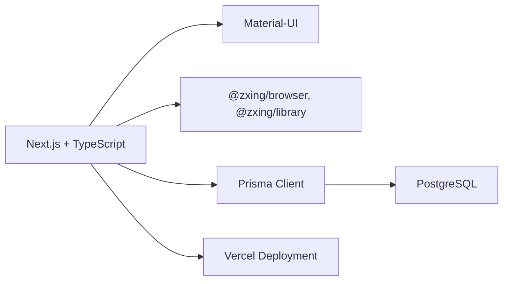

# Project Overview

<cite>
**Referenced Files in This Document**
- [README.md](file://README.md)
- [package.json](file://package.json)
- [next.config.js](file://next.config.js)
- [pages/_app.tsx](file://pages/_app.tsx)
- [prisma/schema.prisma](file://prisma/schema.prisma)
- [components/AndroidScanner.tsx](file://components/AndroidScanner.tsx)
- [pages/adicionar-notas.tsx](file://pages/adicionar-notas.tsx)
- [components/AdicionarNotasContent.tsx](file://components/AdicionarNotasContent.tsx)
- [pages/criar-controle.tsx](file://pages/criar-controle.tsx)
- [components/CriarControleContent.tsx](file://components/CriarControleContent.tsx)
- [lib/barcode-validation.ts](file://lib/barcode-validation.ts)
</cite>

## Table of Contents
1. Introduction
2. Project Structure
3. Core Components
4. Architecture Overview
5. Detailed Component Analysis
6. Dependency Analysis
7. Performance Considerations
8. Troubleshooting Guide
9. Conclusion

## Introduction
Control Carga is a web-based cargo control and invoice management system designed to streamline warehouse operations and logistics workflows. It enables fast barcode scanning for invoices, multi-invoice cargo control creation, PDF manifest generation, and a responsive modern interface optimized for desktop and mobile devices. The system integrates with PostgreSQL via Prisma and runs on Next.js with TypeScript and Material-UI. It supports deployment on Vercel and requires Node.js 18+ and a PostgreSQL database.

Key benefits:
- Barcode-driven invoice capture reduces manual entry errors and speeds up receiving processes.
- Multi-invoice cargo control simplifies grouping multiple fiscal notes into a single shipment record.
- PDF manifests support documentation and compliance needs.
- A responsive UI improves usability across devices used in warehouse environments.

**Section sources**
- [README.md:15-39](file://README.md#L15-L39)

## Project Structure
The application follows a Next.js pages-based routing structure with feature-oriented directories:
- pages: Application routes and API endpoints (e.g., adicionar-notas, criar-controle, api/*).
- components: Reusable UI and domain-specific components (e.g., AndroidScanner, AdicionarNotasContent, CriarControleContent).
- lib: Shared utilities (barcode validation, label generation, storage helpers).
- prisma: Data models and migrations defining the PostgreSQL schema.
- styles and contexts: Theming and global state providers (authentication, configuration).

**Diagram sources**
- [pages/_app.tsx:118-197](file://pages/_app.tsx#L118-L197)
- [pages/adicionar-notas.tsx:10-41](file://pages/adicionar-notas.tsx#L10-L41)
- [pages/criar-controle.tsx:9-55](file://pages/criar-controle.tsx#L9-L55)
- [prisma/schema.prisma:6-9](file://prisma/schema.prisma#L6-L9)

**Section sources**
- [next.config.js:1-29](file://next.config.js#L1-L29)
- [pages/_app.tsx:118-197](file://pages/_app.tsx#L118-L197)

## Core Components
- Barcode Scanner Integration: AndroidScanner component provides native scanner access on Android or falls back to manual code entry when unavailable.
- Invoice Capture: AdicionarNotasContent orchestrates barcode input, validation, duplicate detection, and batch saving of multiple invoices.
- Cargo Control Creation: CriarControleContent manages form data for creating a cargo control, linking selected invoices, transporters, pallets, and optional freight details.
- Data Model: Prisma schema defines entities such as ControleCarga, NotaFiscal, Pedido, Usuario, and related relationships.

Key capabilities:
- Barcode reading via ZXing libraries and native Android bridge.
- EAN-8/EAN-13 validation and format detection utilities.
- Batch save of invoices through API endpoint /api/notas/salvar-multiplas.
- Cargo control creation with transporter selection, driver info, pallet counts, and optional freight value.

**Section sources**
- [components/AndroidScanner.tsx:46-74](file://components/AndroidScanner.tsx#L46-L74)
- [components/AdicionarNotasContent.tsx:176-285](file://components/AdicionarNotasContent.tsx#L176-L285)
- [components/CriarControleContent.tsx:286-412](file://components/CriarControleContent.tsx#L286-L412)
- [prisma/schema.prisma:11-67](file://prisma/schema.prisma#L11-L67)

## Architecture Overview
The system uses a client-server architecture built on Next.js:
- Client-side: React components handle user interactions, barcode scanning, and form management.
- Server-side: API routes process requests, validate inputs, interact with the database via Prisma, and return results.
- Database: PostgreSQL stores core entities like cargo controls, invoices, users, and logistics snapshots.

**Diagram sources**
- [components/AndroidScanner.tsx:46-74](file://components/AndroidScanner.tsx#L46-L74)
- [components/AdicionarNotasContent.tsx:176-285](file://components/AdicionarNotasContent.tsx#L176-L285)
- [components/AdicionarNotasContent.tsx:415-467](file://components/AdicionarNotasContent.tsx#L415-L467)
- [prisma/schema.prisma:55-67](file://prisma/schema.prisma#L55-L67)

## Detailed Component Analysis

### Barcode Scanning and Validation
- AndroidScanner attempts to use a native Android scanner interface; if unavailable, it opens a dialog for manual code entry.
- AdicionarNotasContent validates scanned codes, extracts invoice numbers from DANFE formats, prevents duplicates, and prepares data for batch saving.
- lib/barcode-validation.ts provides EAN-8/EAN-13 checksum validation and barcode type detection.

**Diagram sources**
- [components/AndroidScanner.tsx:46-74](file://components/AndroidScanner.tsx#L46-L74)
- [components/AdicionarNotasContent.tsx:176-285](file://components/AdicionarNotasContent.tsx#L176-L285)
- [components/AdicionarNotasContent.tsx:415-467](file://components/AdicionarNotasContent.tsx#L415-L467)
- [lib/barcode-validation.ts:25-40](file://lib/barcode-validation.ts#L25-L40)

**Section sources**
- [components/AndroidScanner.tsx:46-74](file://components/AndroidScanner.tsx#L46-L74)
- [components/AdicionarNotasContent.tsx:176-285](file://components/AdicionarNotasContent.tsx#L176-L285)
- [lib/barcode-validation.ts:25-40](file://lib/barcode-validation.ts#L25-L40)

### Multi-Invoice Cargo Control Creation
- CriarControleContent collects driver, transporter, vehicle, and pallet information, optionally capturing freight details for third-party transporters.
- It links previously saved invoices to the new cargo control and persists the record via store methods that call backend APIs.

**Diagram sources**
- [components/CriarControleContent.tsx:286-412](file://components/CriarControleContent.tsx#L286-L412)
- [prisma/schema.prisma:11-42](file://prisma/schema.prisma#L11-L42)

**Section sources**
- [components/CriarControleContent.tsx:286-412](file://components/CriarControleContent.tsx#L286-L412)

### Data Models and Relationships
Core entities include:
- ControleCarga: Represents a cargo control with driver, transporter, pallet counts, signatures, images, and linked invoices/orders.
- NotaFiscal: Represents an invoice linked to a cargo control and a user.
- Pedido: Represents an order linked to a cargo control.
- Usuario: Represents users with roles and relationships to various modules.

**Diagram sources**
- [prisma/schema.prisma:11-96](file://prisma/schema.prisma#L11-L96)

**Section sources**
- [prisma/schema.prisma:11-96](file://prisma/schema.prisma#L11-L96)

## Dependency Analysis
Technology stack and runtime:
- Framework: Next.js with TypeScript and Material-UI.
- Database: PostgreSQL via Prisma ORM.
- Barcode Libraries: ZXing-js for browser-based scanning.
- Deployment: Configured for Vercel.

**Diagram sources**
- [package.json:23-94](file://package.json#L23-L94)
- [next.config.js:1-29](file://next.config.js#L1-L29)
- [prisma/schema.prisma:6-9](file://prisma/schema.prisma#L6-L9)

**Section sources**
- [package.json:23-94](file://package.json#L23-L94)
- [next.config.js:1-29](file://next.config.js#L1-L29)

## Performance Considerations
- Build optimizations: SWC minification enabled; TypeScript and ESLint checks can be ignored during builds to speed up CI/CD.
- External packages: Transpile specific packages (react-leaflet, leaflet-routing-machine) to ensure compatibility.
- Client fallbacks: Disable Node-only modules (fs, net, tls) in the browser bundle to reduce size and avoid runtime errors.
- Barcode processing: Local validation and deduplication minimize unnecessary server calls.

[No sources needed since this section provides general guidance]

## Troubleshooting Guide
Common issues and resolutions:
- Barcode not recognized: Ensure the scanner returns ASCII-printable values; verify EAN-8/EAN-13 checksums using provided utilities.
- Duplicate invoice: The system detects and warns about previously scanned invoices; remove duplicates before saving.
- Native scanner unavailable: Fallback to manual entry is available; confirm permissions and device capabilities.
- Save failures: Check network connectivity and API responses; inspect error messages returned by /api/notas/salvar-multiplas.

**Section sources**
- [lib/barcode-validation.ts:42-88](file://lib/barcode-validation.ts#L42-L88)
- [components/AdicionarNotasContent.tsx:176-285](file://components/AdicionarNotasContent.tsx#L176-L285)

## Conclusion
Control Carga delivers a robust, modern platform for warehouse and logistics management. Its barcode-first approach accelerates invoice capture, while multi-invoice cargo control creation streamlines shipment documentation. Built on Next.js, TypeScript, Material-UI, Prisma, and PostgreSQL, it offers a scalable architecture suitable for deployment on Vercel. With responsive design and comprehensive validation, it enhances operational efficiency and accuracy in real-world logistics environments.

[No sources needed since this section summarizes without analyzing specific files]