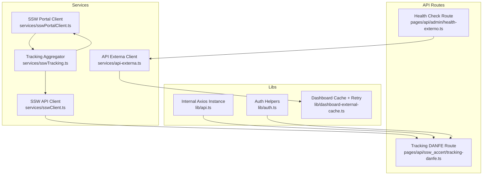
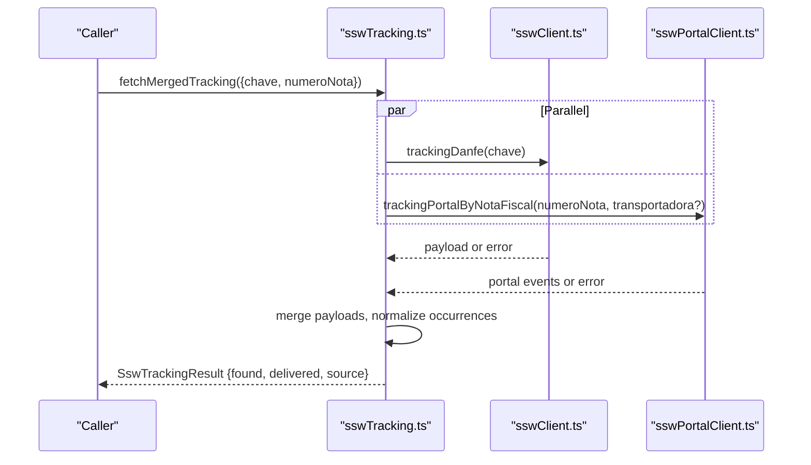
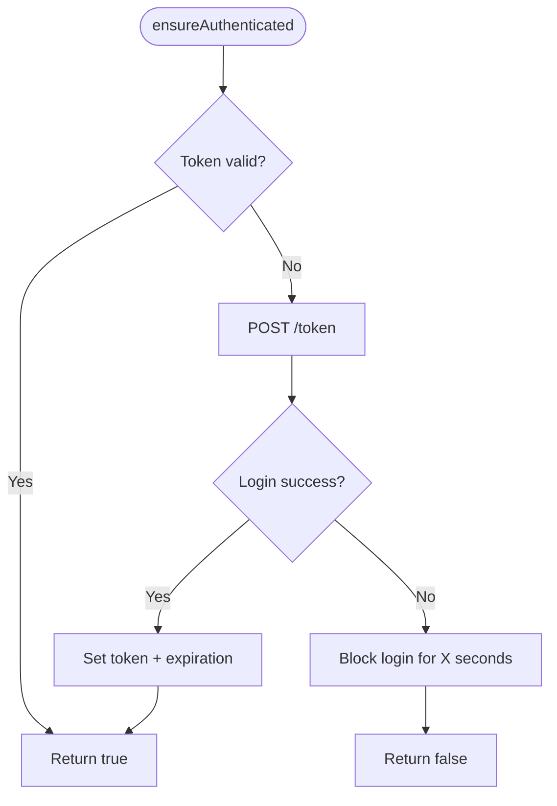
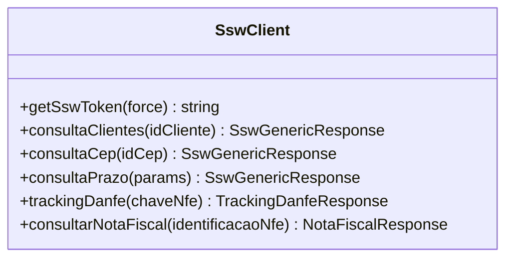
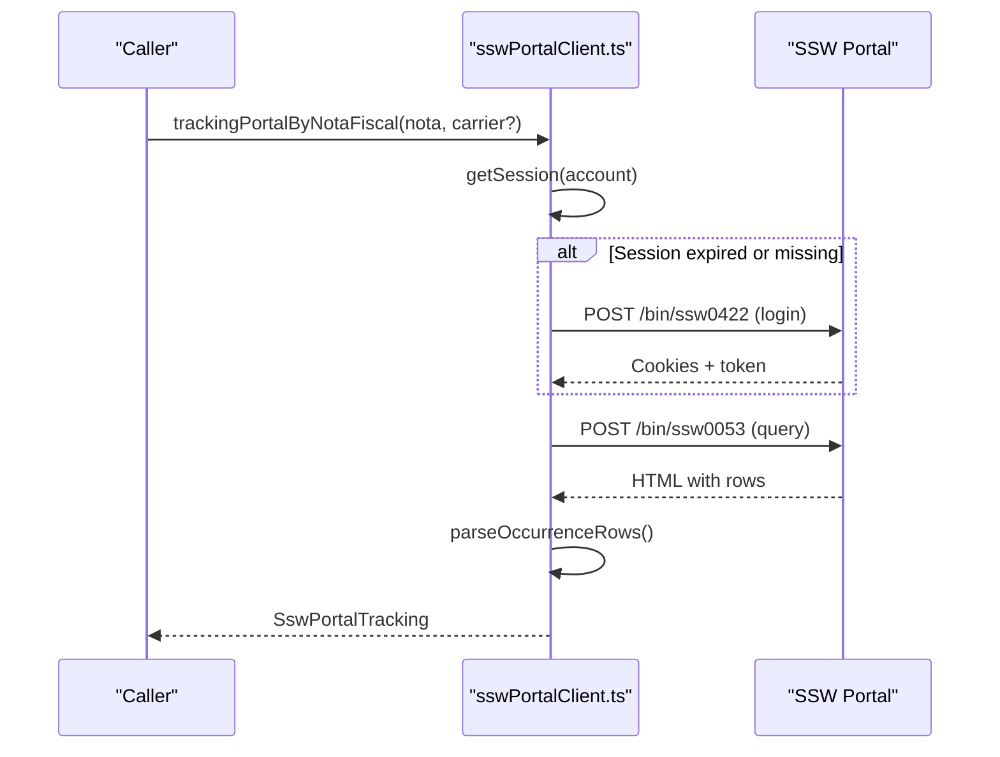
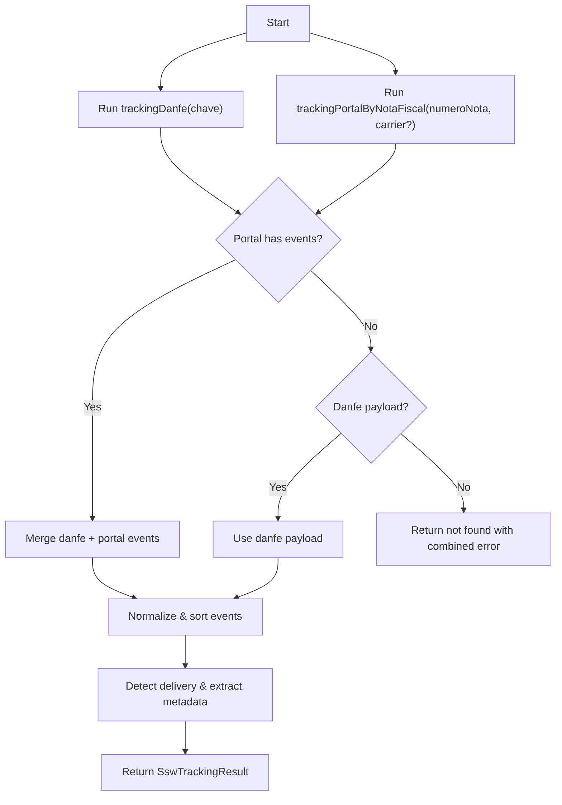
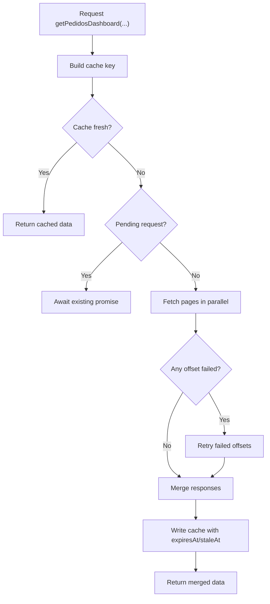
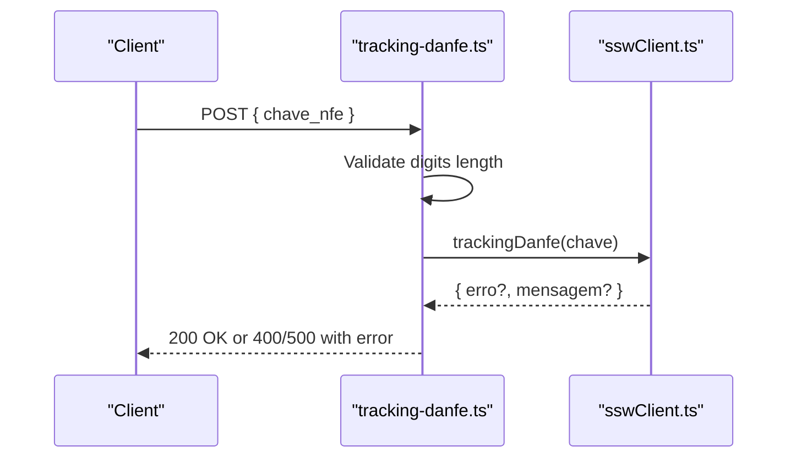
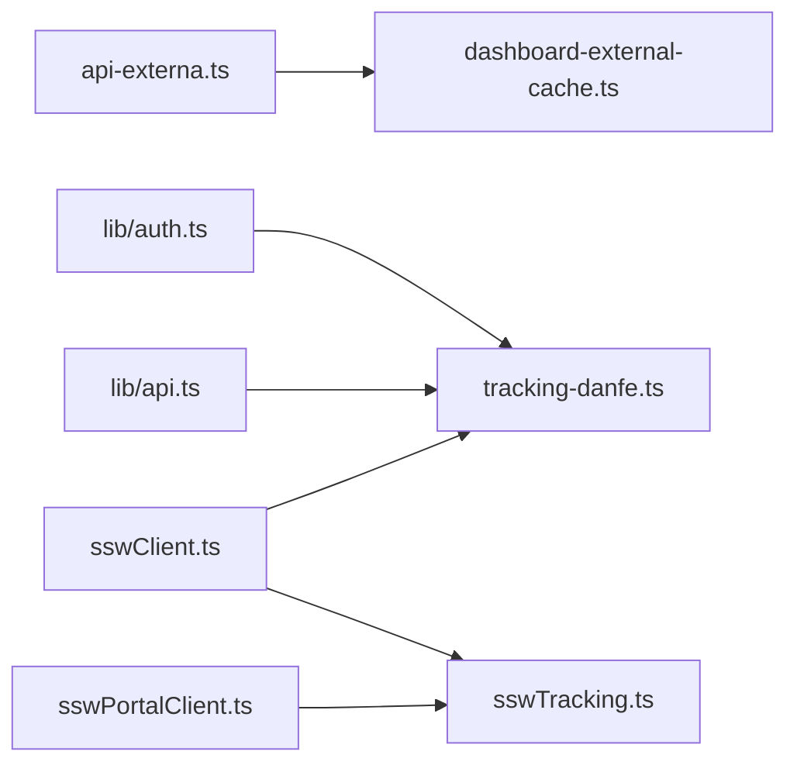

# External API Clients

<cite>
**Referenced Files in This Document**
- [api-externa.ts](file://services/api-externa.ts)
- [sswClient.ts](file://services/sswClient.ts)
- [sswPortalClient.ts](file://services/sswPortalClient.ts)
- [sswTracking.ts](file://services/sswTracking.ts)
- [api.ts](file://lib/api.ts)
- [auth.ts](file://lib/auth.ts)
- [dashboard-external-cache.ts](file://lib/dashboard-external-cache.ts)
- [tracking-danfe.ts](file://pages/api/ssw_accert/tracking-danfe.ts)
- [health-externo.ts](file://pages/api/admin/health-externo.ts)
</cite>

## Table of Contents
1. Introduction
2. Project Structure
3. Core Components
4. Architecture Overview
5. Detailed Component Analysis
6. Dependency Analysis
7. Performance Considerations
8. Troubleshooting Guide
9. Conclusion
10. Appendices

## Introduction
This document explains how external API clients are implemented and used across the application. It covers REST client configuration, authentication handling, request/response transformation, error management, caching, retry strategies, and graceful degradation when external services fail. It also includes guidance for creating new clients, handling API versioning, logging and monitoring integration points, testing strategies for external dependencies, and optimizing network requests.

## Project Structure
External integrations are organized into focused service modules:
- A generic external API client with token-based auth and fallback endpoints
- SSW-specific clients for API tokens, portal session handling, and tracking
- A unified tracking aggregator that merges results from multiple sources
- Internal helpers for dashboard caching and timeouts
- Next.js API routes exposing safe wrappers around external calls

**Diagram sources**
- [api-externa.ts:117-158](file://services/api-externa.ts#L117-L158)
- [sswClient.ts:50-153](file://services/sswClient.ts#L50-L153)
- [sswPortalClient.ts:176-222](file://services/sswPortalClient.ts#L176-L222)
- [sswTracking.ts:393-479](file://services/sswTracking.ts#L393-L479)
- [api.ts:1-12](file://lib/api.ts#L1-L12)
- [auth.ts:10-66](file://lib/auth.ts#L10-L66)
- [dashboard-external-cache.ts:15-92](file://lib/dashboard-external-cache.ts#L15-L92)
- [tracking-danfe.ts:8-31](file://pages/api/ssw_accert/tracking-danfe.ts#L8-L31)
- [health-externo.ts:4-41](file://pages/api/admin/health-externo.ts#L4-L41)

**Section sources**
- [api-externa.ts:117-158](file://services/api-externa.ts#L117-L158)
- [sswClient.ts:50-153](file://services/sswClient.ts#L50-L153)
- [sswPortalClient.ts:176-222](file://services/sswPortalClient.ts#L176-L222)
- [sswTracking.ts:393-479](file://services/sswTracking.ts#L393-L479)
- [api.ts:1-12](file://lib/api.ts#L1-L12)
- [auth.ts:10-66](file://lib/auth.ts#L10-L66)
- [dashboard-external-cache.ts:15-92](file://lib/dashboard-external-cache.ts#L15-L92)
- [tracking-danfe.ts:8-31](file://pages/api/ssw_accert/tracking-danfe.ts#L8-L31)
- [health-externo.ts:4-41](file://pages/api/admin/health-externo.ts#L4-L41)

## Core Components
- API Externa Client: Centralized HTTP client with base URL, timeout, request/response interceptors, token lifecycle, and robust fallback flows for invoice and order lookups.
- SSW API Client: Token generation and caching, typed GET/POST helpers, and a dedicated NFe lookup wrapper.
- SSW Portal Client: Sessionful portal automation with login, cookie persistence, per-account routing, and image retrieval with retries.
- Tracking Aggregator: Merges results from SSW API and Portal to produce a normalized tracking result with occurrence lists and delivery signals.
- Dashboard Cache: In-memory cache with TTL/stale window, concurrent deduplication, and retry on partial failures.
- Auth Helpers: Cookie parsing and JWT verification utilities for server-side route protection.

Key responsibilities:
- Authentication: OAuth/password grant or bearer tokens; portal sessions via cookies.
- Resilience: Timeouts, short-circuit on auth block, retry on failed offsets, portal session refresh.
- Data mapping: Normalize heterogeneous responses into consistent internal shapes.
- Observability: Structured console logs at critical points (login, errors, token expiry).

**Section sources**
- [api-externa.ts:117-248](file://services/api-externa.ts#L117-L248)
- [sswClient.ts:50-153](file://services/sswClient.ts#L50-L153)
- [sswPortalClient.ts:176-222](file://services/sswPortalClient.ts#L176-L222)
- [sswTracking.ts:220-384](file://services/sswTracking.ts#L220-L384)
- [dashboard-external-cache.ts:15-92](file://lib/dashboard-external-cache.ts#L15-L92)
- [auth.ts:10-66](file://lib/auth.ts#L10-L66)

## Architecture Overview
The system composes multiple external providers behind stable internal interfaces. The tracking flow demonstrates multi-source aggregation with normalization and graceful degradation.

**Diagram sources**
- [sswTracking.ts:393-479](file://services/sswTracking.ts#L393-L479)
- [sswClient.ts:183-222](file://services/sswClient.ts#L183-L222)
- [sswPortalClient.ts:534-577](file://services/sswPortalClient.ts#L534-L577)

## Detailed Component Analysis

### API Externa Client
- Configuration: Base URL from environment or default; global timeout; content-type header.
- Interceptors: Attach Authorization header for non-token endpoints; handle 401 by clearing state.
- Authentication: Password grant to /token with shorter timeout; token expiration tracking; temporary login block after failures to avoid thundering herd.
- Data access: Multiple endpoints for invoices and orders with fallback chains (e.g., try identifier-first, then key-based or list scan).
- Error handling: Consistent catch blocks returning null or empty arrays; structured logs with status and messages.

**Diagram sources**
- [api-externa.ts:167-248](file://services/api-externa.ts#L167-L248)

**Section sources**
- [api-externa.ts:117-248](file://services/api-externa.ts#L117-L248)
- [api-externa.ts:250-749](file://services/api-externa.ts#L250-L749)

### SSW API Client
- Token lifecycle: Generate token via POST /generateToken; parse validity string to milliseconds; cache token with early expiry buffer.
- Request helpers: Typed GET/POST wrappers that attach Authorization header and validate JSON responses.
- NFe lookup: Dedicated function to query notes by identification number with strict validation.

**Diagram sources**
- [sswClient.ts:50-153](file://services/sswClient.ts#L50-L153)
- [sswClient.ts:183-305](file://services/sswClient.ts#L183-L305)

**Section sources**
- [sswClient.ts:50-153](file://services/sswClient.ts#L50-L153)
- [sswClient.ts:183-305](file://services/sswClient.ts#L183-L305)

### SSW Portal Client
- Multi-account support: Configurable accounts keyed by transportadora; preferred account selection based on normalized carrier name.
- Session management: Login flow to collect cookies; session reuse with expiration; automatic re-login on failure.
- Image retrieval: Validates signed photo links; retries against multiple endpoints; handles HTML redirects and embedded images.
- Tracking queries: Parses portal HTML tables into structured events; extracts proof-of-delivery images.

**Diagram sources**
- [sswPortalClient.ts:176-222](file://services/sswPortalClient.ts#L176-L222)
- [sswPortalClient.ts:485-532](file://services/sswPortalClient.ts#L485-L532)
- [sswPortalClient.ts:534-577](file://services/sswPortalClient.ts#L534-L577)

**Section sources**
- [sswPortalClient.ts:15-108](file://services/sswPortalClient.ts#L15-L108)
- [sswPortalClient.ts:176-222](file://services/sswPortalClient.ts#L176-L222)
- [sswPortalClient.ts:380-483](file://services/sswPortalClient.ts#L380-L483)
- [sswPortalClient.ts:485-577](file://services/sswPortalClient.ts#L485-L577)

### Tracking Aggregator
- Strategy: Run both SSW API and Portal in parallel; prefer portal events if present; otherwise fall back to API payload.
- Normalization: Extracts dates, statuses, photos, receiver names, and occurrence lists; sorts chronologically; detects delivery keywords.
- Result shape: Unified SswTrackingResult with fields like found, delivered, status, message, deliveredAt, receiverName, photoUrl, occurrences, source.

**Diagram sources**
- [sswTracking.ts:393-479](file://services/sswTracking.ts#L393-L479)
- [sswTracking.ts:220-384](file://services/sswTracking.ts#L220-L384)

**Section sources**
- [sswTracking.ts:220-384](file://services/sswTracking.ts#L220-L384)
- [sswTracking.ts:393-479](file://services/sswTracking.ts#L393-L479)

### Dashboard Cache and Retries
- Purpose: Reduce load on external APIs and improve responsiveness for dashboards.
- Behavior: Short TTL for freshness; longer stale window to serve cached data; concurrent request deduplication; retry only failed page offsets.

**Diagram sources**
- [dashboard-external-cache.ts:15-92](file://lib/dashboard-external-cache.ts#L15-L92)

**Section sources**
- [dashboard-external-cache.ts:15-92](file://lib/dashboard-external-cache.ts#L15-L92)

### API Routes and Health Checks
- Tracking DANFE route: Validates input, delegates to SSW client, returns standardized JSON or error.
- Health check route: Probes external API health endpoint and reports connectivity and database status.

**Diagram sources**
- [tracking-danfe.ts:8-31](file://pages/api/ssw_accert/tracking-danfe.ts#L8-L31)
- [sswClient.ts:183-222](file://services/sswClient.ts#L183-L222)

**Section sources**
- [tracking-danfe.ts:8-31](file://pages/api/ssw_accert/tracking-danfe.ts#L8-L31)
- [health-externo.ts:4-41](file://pages/api/admin/health-externo.ts#L4-L41)

## Dependency Analysis
- api-externa.ts depends on axios and environment variables for base URL and timeouts; it is consumed by dashboard cache and other features.
- sswClient.ts provides token and tracking functions used by routes and aggregator.
- sswPortalClient.ts encapsulates portal session logic and is used by the aggregator for richer tracking data.
- sswTracking.ts orchestrates both providers and normalizes outputs.
- lib/api.ts is a shared axios instance for internal routes.
- lib/auth.ts supports server-side token extraction and verification.

**Diagram sources**
- [api-externa.ts:117-158](file://services/api-externa.ts#L117-L158)
- [dashboard-external-cache.ts:15-92](file://lib/dashboard-external-cache.ts#L15-L92)
- [sswClient.ts:50-153](file://services/sswClient.ts#L50-L153)
- [sswPortalClient.ts:534-577](file://services/sswPortalClient.ts#L534-L577)
- [sswTracking.ts:393-479](file://services/sswTracking.ts#L393-L479)
- [api.ts:1-12](file://lib/api.ts#L1-L12)
- [auth.ts:10-66](file://lib/auth.ts#L10-L66)
- [tracking-danfe.ts:8-31](file://pages/api/ssw_accert/tracking-danfe.ts#L8-L31)

**Section sources**
- [api-externa.ts:117-158](file://services/api-externa.ts#L117-L158)
- [dashboard-external-cache.ts:15-92](file://lib/dashboard-external-cache.ts#L15-L92)
- [sswClient.ts:50-153](file://services/sswClient.ts#L50-L153)
- [sswPortalClient.ts:534-577](file://services/sswPortalClient.ts#L534-L577)
- [sswTracking.ts:393-479](file://services/sswTracking.ts#L393-L479)
- [api.ts:1-12](file://lib/api.ts#L1-L12)
- [auth.ts:10-66](file://lib/auth.ts#L10-L66)
- [tracking-danfe.ts:8-31](file://pages/api/ssw_accert/tracking-danfe.ts#L8-L31)

## Performance Considerations
- Timeouts: Global and per-call timeouts prevent long hangs; login uses a shorter timeout to fail fast.
- Caching: Token caches reduce auth overhead; dashboard cache reduces repeated external calls with TTL and stale windows.
- Concurrency: Parallel fetching of page offsets and parallel provider calls (DANFE + Portal) improve throughput.
- Retries: Targeted retries on failed offsets minimize wasted work while improving reliability.
- Rate limiting: Not explicitly implemented; consider adding per-provider rate limiters or token throttling if external limits are enforced.
- Circuit breaker: No circuit breaker pattern is currently implemented; consider wrapping critical calls with a simple breaker to short-circuit during outages.

[No sources needed since this section provides general guidance]

## Troubleshooting Guide
Common issues and where to inspect:
- Authentication failures:
  - Check token generation and expiration logic in the SSW client and API externa client.
  - Inspect console logs for blocked login periods and last auth error messages.
- Network errors:
  - Verify base URLs and timeouts; use health check route to confirm external API reachability.
  - For portal issues, ensure cookies are persisted and session refreshed on failure.
- Data mismatches:
  - Use the tracking aggregator’s normalization to understand which fields were mapped and why certain outcomes (e.g., delivered) were inferred.
- Route-level errors:
  - Validate inputs (e.g., NFe key length) before calling downstream services.

Actionable checks:
- Confirm environment variables for credentials and domains are set.
- Review interceptor behavior for 401 handling and token invalidation.
- Use the health endpoint to detect upstream downtime quickly.

**Section sources**
- [api-externa.ts:167-248](file://services/api-externa.ts#L167-L248)
- [sswClient.ts:50-153](file://services/sswClient.ts#L50-L153)
- [sswPortalClient.ts:176-222](file://services/sswPortalClient.ts#L176-L222)
- [tracking-danfe.ts:8-31](file://pages/api/ssw_accert/tracking-danfe.ts#L8-L31)
- [health-externo.ts:4-41](file://pages/api/admin/health-externo.ts#L4-L41)

## Conclusion
The external API layer combines resilient HTTP clients, robust authentication, and multi-source aggregation to deliver reliable tracking and data retrieval. Caching and targeted retries improve performance and resilience. To further harden the system, consider adding explicit rate limiting and circuit breakers, centralizing logging and metrics, and standardizing error codes across routes.

[No sources needed since this section summarizes without analyzing specific files]

## Appendices

### Creating a New API Client
Steps:
- Define configuration constants (base URL, timeouts) and required environment variables.
- Implement token/session management with caching and expiration handling.
- Provide typed request helpers (GET/POST) with response validation.
- Add fallback strategies and clear error paths.
- Wrap in a module and expose domain-specific methods.
- Add an API route if you need to proxy or sanitize inputs.

Example references:
- Token caching and validation: [sswClient.ts:50-153](file://services/sswClient.ts#L50-L153)
- Sessionful portal login and reuse: [sswPortalClient.ts:176-222](file://services/sswPortalClient.ts#L176-L222)
- Input validation and error shaping in routes: [tracking-danfe.ts:8-31](file://pages/api/ssw_accert/tracking-danfe.ts#L8-L31)

**Section sources**
- [sswClient.ts:50-153](file://services/sswClient.ts#L50-L153)
- [sswPortalClient.ts:176-222](file://services/sswPortalClient.ts#L176-L222)
- [tracking-danfe.ts:8-31](file://pages/api/ssw_accert/tracking-danfe.ts#L8-L31)

### Handling API Versioning
- Prefer path-based versioning (e.g., /api/v1/...) as seen in the external client.
- Maintain backward compatibility by supporting multiple endpoints when necessary (fallback chains).
- Document breaking changes and deprecation timelines.

**Section sources**
- [api-externa.ts:250-749](file://services/api-externa.ts#L250-L749)

### Graceful Degradation Strategies
- Fallback endpoints: Try alternative endpoints or identifiers when primary fails.
- Partial results: Aggregate best-effort data from multiple sources (as done in tracking aggregator).
- Stale data: Serve recent cached data when upstream is down or slow.

**Section sources**
- [api-externa.ts:250-347](file://services/api-externa.ts#L250-L347)
- [sswTracking.ts:393-479](file://services/sswTracking.ts#L393-L479)
- [dashboard-external-cache.ts:15-92](file://lib/dashboard-external-cache.ts#L15-L92)

### Optimizing Network Requests
- Use timeouts appropriate to the operation (shorter for login, longer for large queries).
- Batch or paginate requests and process in parallel where safe.
- Cache tokens and frequently accessed data with TTL and stale windows.
- Avoid redundant calls by deduplicating pending requests.

**Section sources**
- [api-externa.ts:125-158](file://services/api-externa.ts#L125-L158)
- [dashboard-external-cache.ts:15-92](file://lib/dashboard-external-cache.ts#L15-L92)

### Logging and Monitoring Integration Points
- Console logs are used extensively for login attempts, token expiry, errors, and successful operations.
- Consider integrating structured logging (e.g., JSON logs) and metrics (latency, error rates) around:
  - Token acquisition
  - External API calls
  - Cache hits/misses
  - Route handlers

**Section sources**
- [api-externa.ts:167-248](file://services/api-externa.ts#L167-L248)
- [sswClient.ts:50-153](file://services/sswClient.ts#L50-L153)
- [sswPortalClient.ts:534-577](file://services/sswPortalClient.ts#L534-L577)

### Testing Strategies for External Dependencies
- Mock external services using local stubs or test doubles for:
  - Token endpoints
  - Invoice/order endpoints
  - Portal responses (HTML snippets)
- Validate input sanitization and error paths in API routes.
- Simulate failures (timeouts, 4xx/5xx) to verify fallbacks and retries.
- Use feature flags to toggle between real and mocked providers in tests.

[No sources needed since this section provides general guidance]