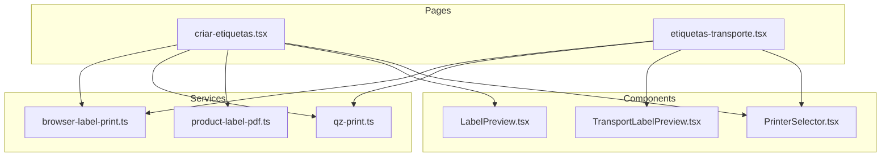
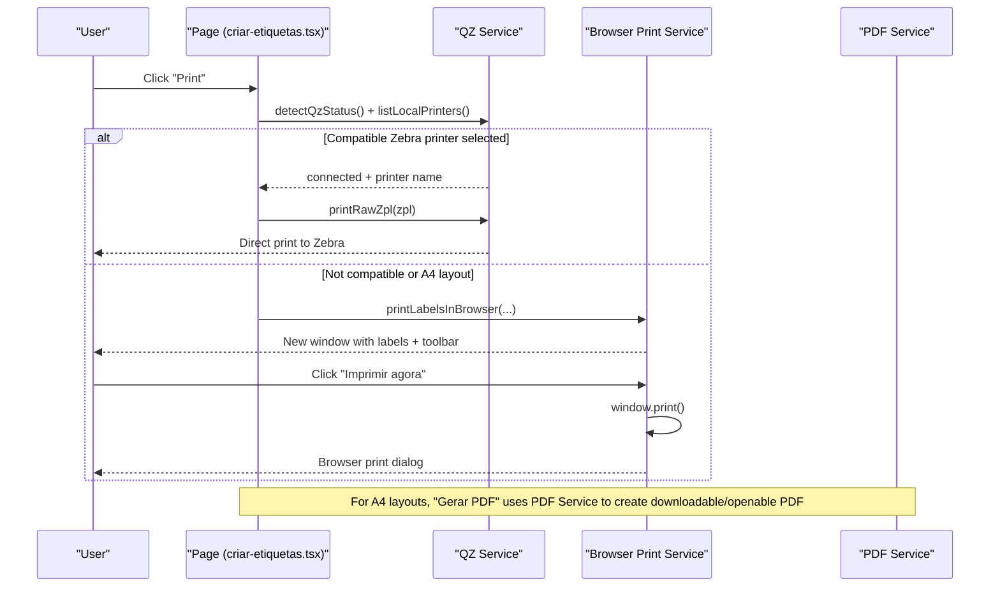
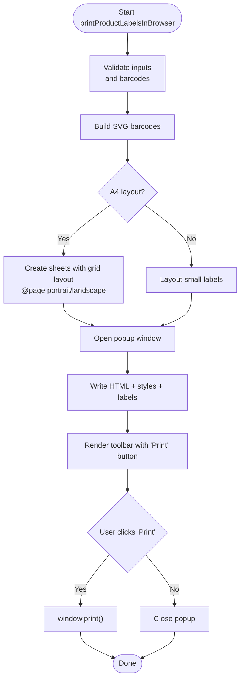
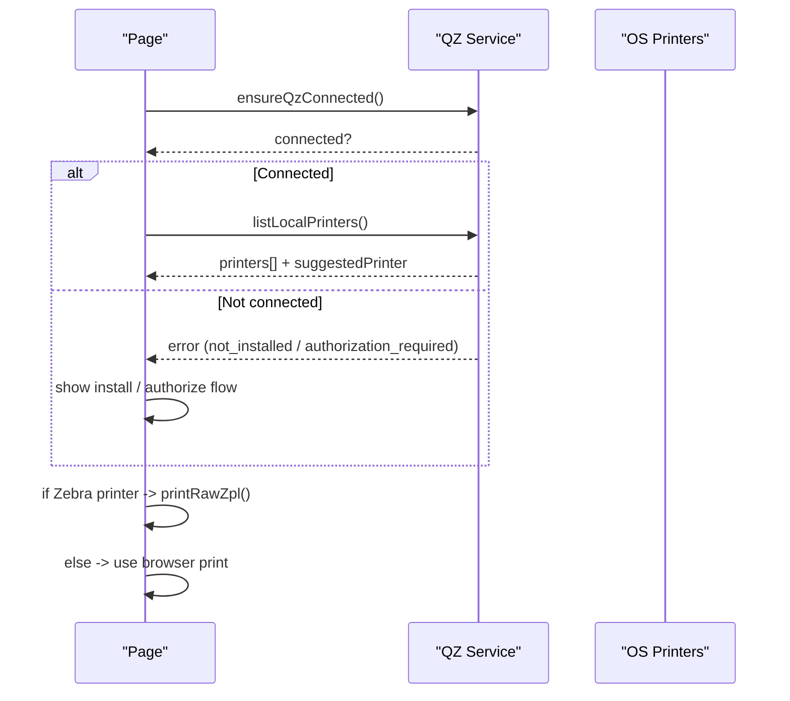
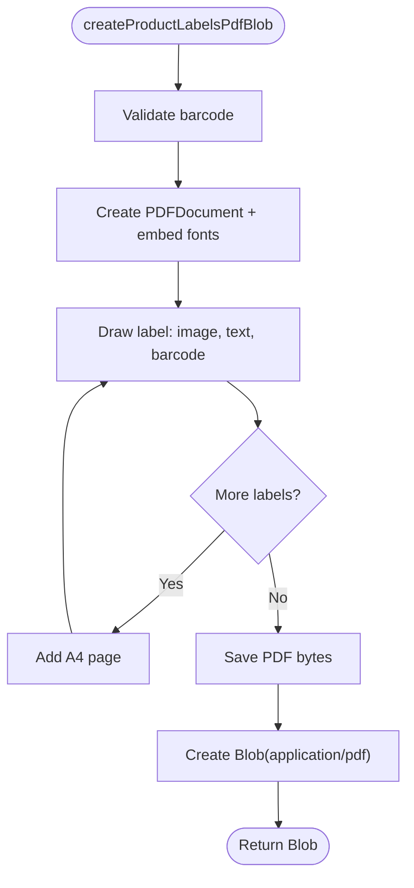
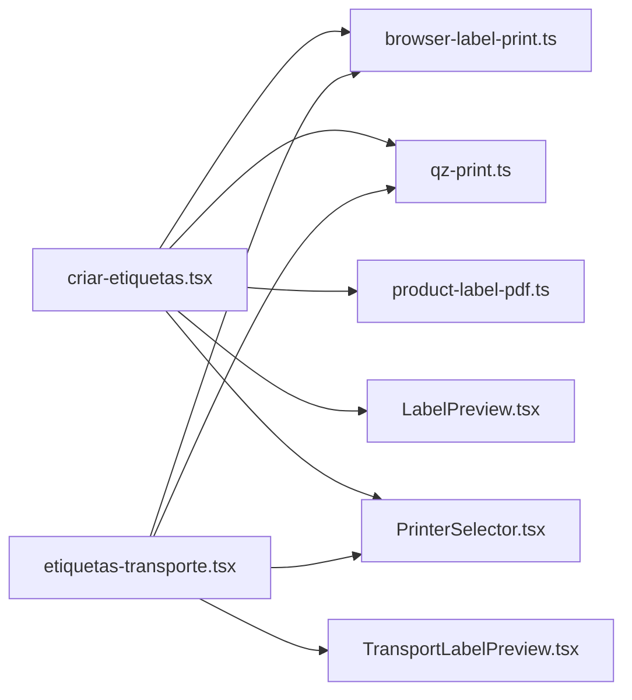

# Browser-Based Label Printing

<cite>
**Referenced Files in This Document**
- [browser-label-print.ts](file://services/browser-label-print.ts)
- [qz-print.ts](file://services/qz-print.ts)
- [product-label-pdf.ts](file://services/product-label-pdf.ts)
- [LabelPreview.tsx](file://components/labels/LabelPreview.tsx)
- [TransportLabelPreview.tsx](file://components/labels/TransportLabelPreview.tsx)
- [PrinterSelector.tsx](file://components/labels/PrinterSelector.tsx)
- [criar-etiquetas.tsx](file://pages/criar-etiquetas.tsx)
- [etiquetas-transporte.tsx](file://pages/etiquetas-transporte.tsx)
</cite>

## Table of Contents
1. [Introduction](#introduction)
2. [Project Structure](#project-structure)
3. [Core Components](#core-components)
4. [Architecture Overview](#architecture-overview)
5. [Detailed Component Analysis](#detailed-component-analysis)
6. [Dependency Analysis](#dependency-analysis)
7. [Performance Considerations](#performance-considerations)
8. [Troubleshooting Guide](#troubleshooting-guide)
9. [Conclusion](#conclusion)
10. [Appendices](#appendices)

## Introduction
This document explains the browser-based label printing approach implemented in the application as an alternative to native printer integration via QZ Tray. It covers how HTML5 print is used, how CSS media queries and page sizing are applied for labels, how PDF generation is supported, and how the system falls back gracefully when QZ Tray is unavailable or unsuitable. It also provides guidance on creating printable templates, handling different paper sizes and orientations, managing print dialogs, and implementing robust fallback strategies.

## Project Structure
The browser-based printing capability spans services, UI components, and pages:
- Services implement label rendering, barcode generation, and print/PDF flows.
- UI components provide previews and printer selection UX.
- Pages orchestrate user actions and choose between QZ Tray direct printing and browser-based printing.

**Diagram sources**
- [criar-etiquetas.tsx:235-276](file://pages/criar-etiquetas.tsx#L235-L276)
- [etiquetas-transporte.tsx:313-351](file://pages/etiquetas-transporte.tsx#L313-L351)
- [browser-label-print.ts:109-684](file://services/browser-label-print.ts#L109-L684)
- [qz-print.ts:18-157](file://services/qz-print.ts#L18-L157)
- [product-label-pdf.ts:101-402](file://services/product-label-pdf.ts#L101-L402)
- [LabelPreview.tsx:117-298](file://components/labels/LabelPreview.tsx#L117-L298)
- [TransportLabelPreview.tsx:164-186](file://components/labels/TransportLabelPreview.tsx#L164-L186)
- [PrinterSelector.tsx:16-96](file://components/labels/PrinterSelector.tsx#L16-L96)

**Section sources**
- [criar-etiquetas.tsx:235-276](file://pages/criar-etiquetas.tsx#L235-L276)
- [etiquetas-transporte.tsx:313-351](file://pages/etiquetas-transporte.tsx#L313-L351)
- [browser-label-print.ts:109-684](file://services/browser-label-print.ts#L109-L684)
- [qz-print.ts:18-157](file://services/qz-print.ts#L18-L157)
- [product-label-pdf.ts:101-402](file://services/product-label-pdf.ts#L101-L402)
- [LabelPreview.tsx:117-298](file://components/labels/LabelPreview.tsx#L117-L298)
- [TransportLabelPreview.tsx:164-186](file://components/labels/TransportLabelPreview.tsx#L164-L186)
- [PrinterSelector.tsx:16-96](file://components/labels/PrinterSelector.tsx#L16-L96)

## Core Components
- Browser label service: builds printable HTML with embedded SVG barcodes, applies @page sizing and margins, and opens a dedicated print window with a toolbar that triggers window.print().
- QZ Tray service: detects connection status, lists local printers, and sends raw ZPL to compatible printers; includes fallbacks when QZ is not available.
- PDF service: generates A4 product labels as PDF using pdf-lib, supports download and opening in a new tab for print-to-PDF workflows.
- Preview components: render visual approximations of labels for both product and transport labels.
- Printer selector: guides users through QZ installation/connection and shows recommended printers.

**Section sources**
- [browser-label-print.ts:109-684](file://services/browser-label-print.ts#L109-L684)
- [qz-print.ts:18-157](file://services/qz-print.ts#L18-L157)
- [product-label-pdf.ts:101-402](file://services/product-label-pdf.ts#L101-L402)
- [LabelPreview.tsx:117-298](file://components/labels/LabelPreview.tsx#L117-L298)
- [TransportLabelPreview.tsx:164-186](file://components/labels/TransportLabelPreview.tsx#L164-L186)
- [PrinterSelector.tsx:16-96](file://components/labels/PrinterSelector.tsx#L16-L96)

## Architecture Overview
The application chooses between two primary flows based on printer compatibility and label type:
- Direct ZPL via QZ Tray: For Zebra/ZDesigner printers, send raw ZPL commands directly.
- Browser-based printing: Open a new window with styled labels and trigger the browser’s print dialog (or generate PDF).

**Diagram sources**
- [criar-etiquetas.tsx:235-276](file://pages/criar-etiquetas.tsx#L235-L276)
- [qz-print.ts:18-157](file://services/qz-print.ts#L18-L157)
- [browser-label-print.ts:109-684](file://services/browser-label-print.ts#L109-L684)
- [product-label-pdf.ts:352-402](file://services/product-label-pdf.ts#L352-L402)

## Detailed Component Analysis

### Browser Label Printing Service
- Generates HTML with embedded SVG barcodes using JsBarcode.
- Supports multiple label variants: small, closed box, A4 horizontal, A4 vertical, and A4 vertical double.
- Uses @page to set size and orientation per variant and controls margins for print fidelity.
- Opens a popup window with a toolbar containing “Print now” and “Close”, then calls window.print().
- Validates barcodes before rendering and throws descriptive errors for invalid codes.

**Diagram sources**
- [browser-label-print.ts:109-684](file://services/browser-label-print.ts#L109-L684)

**Section sources**
- [browser-label-print.ts:109-684](file://services/browser-label-print.ts#L109-L684)

### QZ Tray Integration and Fallbacks
- Detects QZ Tray connection and lists local printers with suggested auto-match for Zebra/ZDesigner.
- Provides fallbacks: reconnecting websocket, enumerating details/default printer, and fetching Windows printers via API if needed.
- Sends raw ZPL to compatible printers; otherwise, routes to browser-based printing.

**Diagram sources**
- [qz-print.ts:18-157](file://services/qz-print.ts#L18-L157)
- [criar-etiquetas.tsx:235-276](file://pages/criar-etiquetas.tsx#L235-L276)

**Section sources**
- [qz-print.ts:18-157](file://services/qz-print.ts#L18-L157)
- [criar-etiquetas.tsx:235-276](file://pages/criar-etiquetas.tsx#L235-L276)

### PDF Generation for Product Labels
- Builds A4 pages with two 18x11 cm labels per page using pdf-lib.
- Embeds fonts, draws borders, text, images, and barcodes; wraps long descriptions.
- Exposes functions to download PDF or open it in a new tab for print-to-PDF.

**Diagram sources**
- [product-label-pdf.ts:101-225](file://services/product-label-pdf.ts#L101-L225)

**Section sources**
- [product-label-pdf.ts:101-402](file://services/product-label-pdf.ts#L101-L402)

### UI Previews and Printer Selection
- LabelPreview renders approximate on-screen representations of labels for product types, including A4 variants and closed-box labels.
- TransportLabelPreview renders transport labels with CODE128 barcodes and batch info.
- PrinterSelector guides users to install/connect QZ Tray and select printers, indicating ZPL-compatible devices.

**Section sources**
- [LabelPreview.tsx:117-298](file://components/labels/LabelPreview.tsx#L117-L298)
- [TransportLabelPreview.tsx:164-186](file://components/labels/TransportLabelPreview.tsx#L164-L186)
- [PrinterSelector.tsx:16-96](file://components/labels/PrinterSelector.tsx#L16-L96)

### Page Orchestration
- Product labels page: searches product by code, shows preview, selects label type, and chooses between QZ direct print or browser print/PDF.
- Transport labels page: creates batches, previews labels, and prints via QZ or browser depending on printer compatibility.

**Section sources**
- [criar-etiquetas.tsx:235-276](file://pages/criar-etiquetas.tsx#L235-L276)
- [etiquetas-transporte.tsx:313-351](file://pages/etiquetas-transporte.tsx#L313-L351)

## Dependency Analysis
Key dependencies and relationships:
- Pages depend on services for printing logic and on components for UI.
- Browser label service depends on JsBarcode for SVG generation and on validation utilities for barcode checks.
- PDF service depends on pdf-lib for programmatic PDF creation.
- QZ service depends on qz-tray library and environment configuration for security and connectivity.

**Diagram sources**
- [criar-etiquetas.tsx:235-276](file://pages/criar-etiquetas.tsx#L235-L276)
- [etiquetas-transporte.tsx:313-351](file://pages/etiquetas-transporte.tsx#L313-L351)
- [browser-label-print.ts:109-684](file://services/browser-label-print.ts#L109-L684)
- [qz-print.ts:18-157](file://services/qz-print.ts#L18-L157)
- [product-label-pdf.ts:101-402](file://services/product-label-pdf.ts#L101-L402)
- [LabelPreview.tsx:117-298](file://components/labels/LabelPreview.tsx#L117-L298)
- [TransportLabelPreview.tsx:164-186](file://components/labels/TransportLabelPreview.tsx#L164-L186)
- [PrinterSelector.tsx:16-96](file://components/labels/PrinterSelector.tsx#L16-L96)

**Section sources**
- [criar-etiquetas.tsx:235-276](file://pages/criar-etiquetas.tsx#L235-L276)
- [etiquetas-transporte.tsx:313-351](file://pages/etiquetas-transporte.tsx#L313-L351)
- [browser-label-print.ts:109-684](file://services/browser-label-print.ts#L109-L684)
- [qz-print.ts:18-157](file://services/qz-print.ts#L18-L157)
- [product-label-pdf.ts:101-402](file://services/product-label-pdf.ts#L101-L402)
- [LabelPreview.tsx:117-298](file://components/labels/LabelPreview.tsx#L117-L298)
- [TransportLabelPreview.tsx:164-186](file://components/labels/TransportLabelPreview.tsx#L164-L186)
- [PrinterSelector.tsx:16-96](file://components/labels/PrinterSelector.tsx#L16-L96)

## Performance Considerations
- Barcode generation: SVG barcodes are created in-memory; large batches may increase memory usage. Consider limiting batch sizes or paginating output.
- PDF generation: pdf-lib operations run in the browser; generating many pages can be CPU-intensive. Use minimal images and avoid excessive formatting.
- Popup windows: Opening popups and writing large HTML strings can cause delays; keep content concise and defer heavy work until necessary.
- Print dialog: Users must confirm scaling and margins; instruct them to use 100% scale for accurate output.

[No sources needed since this section provides general guidance]

## Troubleshooting Guide
Common issues and resolutions:
- Invalid barcode: The service validates barcodes and throws errors; ensure valid EAN13/EAN8/CODE128 values.
- Popup blocked: If the browser blocks popups, allow popups for the site or trigger from a user gesture.
- QZ Tray not installed or unauthorized: Follow the guided flow to install QZ Tray and authorize the site; use the “Test connection” action to retry.
- No printers found: Use the fallback mechanism to enumerate default or Windows printers; verify OS printer setup.
- Incorrect print scaling: Instruct users to select “Actual size” or “Scale 100%” in the print dialog to preserve label dimensions.

**Section sources**
- [qz-print.ts:159-205](file://services/qz-print.ts#L159-L205)
- [browser-label-print.ts:187-190](file://services/browser-label-print.ts#L187-L190)
- [criar-etiquetas.tsx:442-452](file://pages/criar-etiquetas.tsx#L442-L452)

## Conclusion
The application implements a robust browser-based label printing strategy that works independently of QZ Tray while still leveraging it when available. It supports multiple label formats, precise A4 layouts, and PDF generation. When QZ Tray is unavailable, the system gracefully falls back to browser printing with clear user guidance, ensuring consistent label output across environments.

[No sources needed since this section summarizes without analyzing specific files]

## Appendices

### Creating Printable Label Templates
- Use the provided label variants: small, closed box, A4 horizontal, A4 vertical, and A4 vertical double.
- For A4 layouts, rely on @page settings and grid layouts to position labels precisely.
- Keep images optimized and avoid heavy styling to improve print performance.

**Section sources**
- [browser-label-print.ts:109-684](file://services/browser-label-print.ts#L109-L684)
- [LabelPreview.tsx:117-298](file://components/labels/LabelPreview.tsx#L117-L298)

### Handling Different Paper Sizes and Orientations
- A4 portrait for single vertical labels; A4 landscape for triple vertical labels; A4 portrait for two horizontal labels.
- Margins are minimized for A4 labels to maximize usable area.

**Section sources**
- [browser-label-print.ts:109-684](file://services/browser-label-print.ts#L109-L684)

### Managing Print Dialogs
- The service opens a dedicated popup with a toolbar that triggers window.print().
- Users should select the correct printer and ensure 100% scale for accurate output.

**Section sources**
- [browser-label-print.ts:187-190](file://services/browser-label-print.ts#L187-L190)
- [criar-etiquetas.tsx:442-452](file://pages/criar-etiquetas.tsx#L442-L452)

### Implementing Fallback Strategies
- Prefer QZ Tray for Zebra/ZDesigner printers; otherwise, use browser-based printing.
- Provide user-friendly messages and actions to install or authorize QZ Tray when needed.

**Section sources**
- [qz-print.ts:18-157](file://services/qz-print.ts#L18-L157)
- [criar-etiquetas.tsx:235-276](file://pages/criar-etiquetas.tsx#L235-L276)

### Advantages and Disadvantages vs QZ Tray
- Advantages:
  - No dependency on external software; works out-of-the-box in modern browsers.
  - Flexible layouts and easy PDF export for archival or sharing.
- Disadvantages:
  - Requires user interaction to confirm print settings and scaling.
  - Less control over exact printer behavior compared to raw ZPL.

[No sources needed since this section provides general guidance]