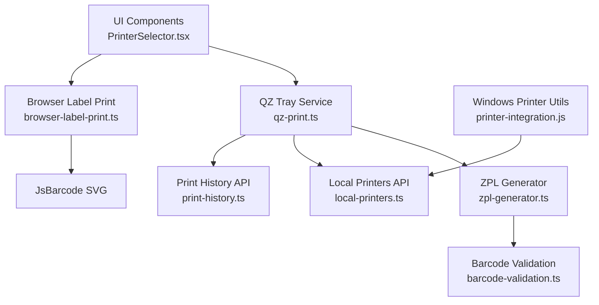
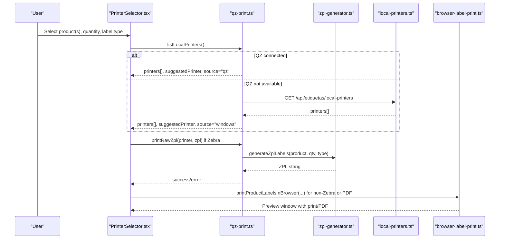
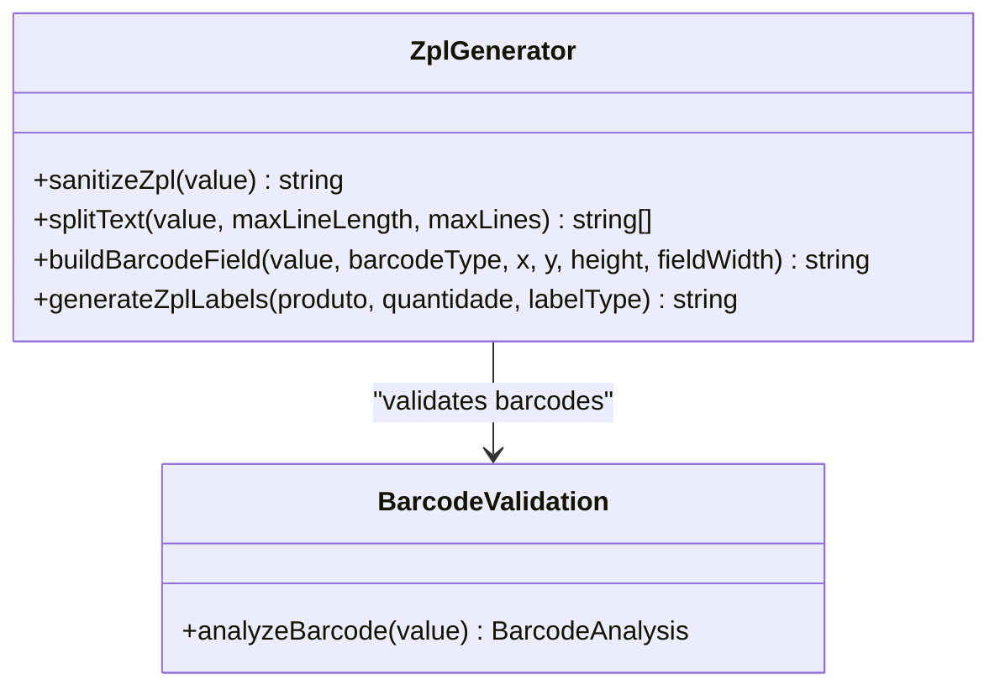
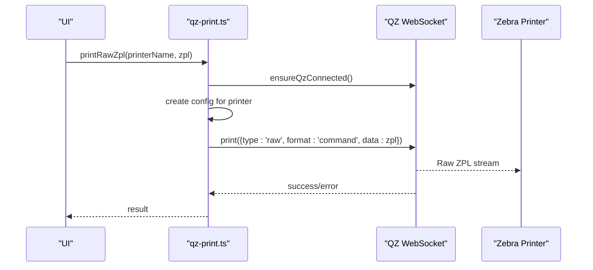
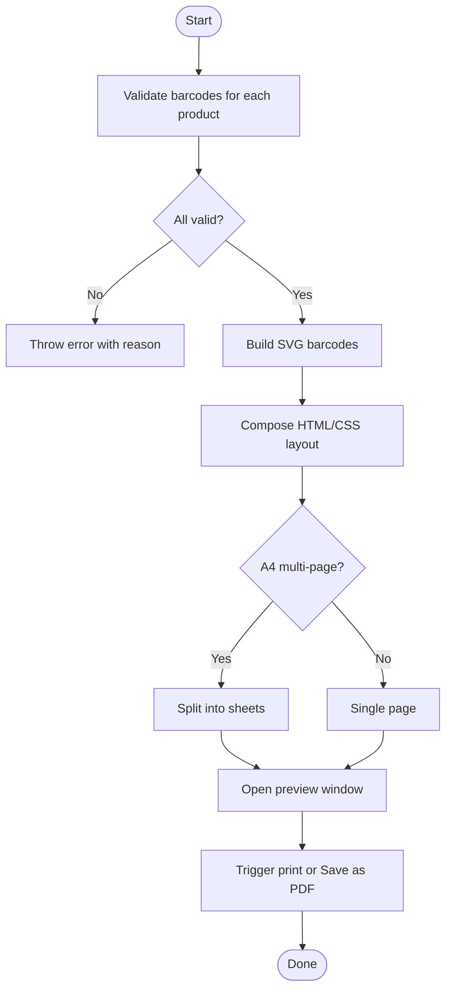
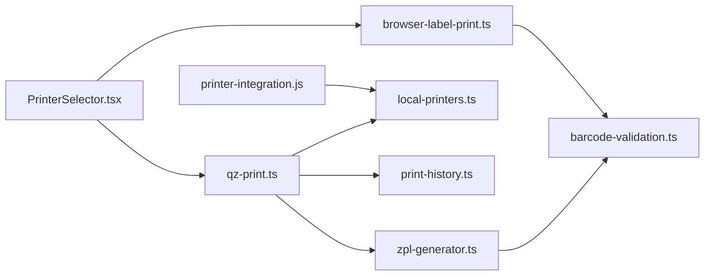

# Printer Integrations

<cite>
**Referenced Files in This Document**
- [zpl-generator.ts](file://lib/zpl-generator.ts)
- [qz-print.ts](file://services/qz-print.ts)
- [browser-label-print.ts](file://services/browser-label-print.ts)
- [printer-integration.js](file://utils/printer-integration.js)
- [local-printers.ts](file://pages/api/etiquetas/local-printers.ts)
- [print-history.ts](file://pages/api/etiquetas/print-history.ts)
- [PrinterSelector.tsx](file://components/labels/PrinterSelector.tsx)
- [barcode-validation.ts](file://lib/barcode-validation.ts)
- [labels.ts](file://types/labels.ts)
</cite>

## Table of Contents
1. Introduction
2. Project Structure
3. Core Components
4. Architecture Overview
5. Detailed Component Analysis
6. Dependency Analysis
7. Performance Considerations
8. Troubleshooting Guide
9. Conclusion

## Introduction
This document explains the printer integration system for Zebra printers and browser-based label printing. It covers:
- ZPL (Zebra Programming Language) generation for unit and closed-box labels
- Printer discovery, selection, and fallback strategies
- Print job management via QZ Tray and browser print APIs
- Error handling for hardware failures and connection issues
- Configuration for different printer types and label templates
- Batch printing operations and retry logic patterns

The system supports two primary flows:
- Direct ZPL to Zebra printers through QZ Tray
- Browser-based HTML/CSS labels with SVG barcodes for general printers or PDF output

## Project Structure
The printing subsystem spans client-side components, services, utilities, API endpoints, and type definitions.

**Diagram sources**
- [qz-print.ts:1-205](file://services/qz-print.ts#L1-L205)
- [browser-label-print.ts:1-800](file://services/browser-label-print.ts#L1-L800)
- [zpl-generator.ts:1-171](file://lib/zpl-generator.ts#L1-L171)
- [local-printers.ts:1-50](file://pages/api/etiquetas/local-printers.ts#L1-L50)
- [print-history.ts:1-48](file://pages/api/etiquetas/print-history.ts#L1-L48)
- [barcode-validation.ts:1-89](file://lib/barcode-validation.ts#L1-L89)
- [printer-integration.js:1-168](file://utils/printer-integration.js#L1-L168)

**Section sources**
- [qz-print.ts:1-205](file://services/qz-print.ts#L1-L205)
- [browser-label-print.ts:1-800](file://services/browser-label-print.ts#L1-L800)
- [zpl-generator.ts:1-171](file://lib/zpl-generator.ts#L1-L171)
- [local-printers.ts:1-50](file://pages/api/etiquetas/local-printers.ts#L1-L50)
- [print-history.ts:1-48](file://pages/api/etiquetas/print-history.ts#L1-L48)
- [barcode-validation.ts:1-89](file://lib/barcode-validation.ts#L1-L89)
- [printer-integration.js:1-168](file://utils/printer-integration.js#L1-L168)

## Core Components
- ZPL generator: Builds Zebra command sequences for unit and closed-box labels, validates barcodes, and formats text fields.
- QZ Tray service: Manages WebSocket connection, lists local printers, selects a preferred Zebra printer, sends raw ZPL, and detects status/errors.
- Browser label printer: Generates HTML/CSS pages with SVG barcodes for A4 or small labels, opens a preview window, and triggers native print/PDF workflows.
- Windows printer utilities: Detects installed printers on Windows and can send ZPL via PowerShell/COPY as a fallback path.
- Local printers API: Securely enumerates Windows printers via PowerShell for fallback when QZ is unavailable.
- Print history API: Persists successful/failed print attempts for auditability.
- Barcode validation: Validates EAN-13/EAN-8 checksums and classifies supported formats.

**Section sources**
- [zpl-generator.ts:1-171](file://lib/zpl-generator.ts#L1-L171)
- [qz-print.ts:1-205](file://services/qz-print.ts#L1-L205)
- [browser-label-print.ts:1-800](file://services/browser-label-print.ts#L1-L800)
- [printer-integration.js:1-168](file://utils/printer-integration.js#L1-L168)
- [local-printers.ts:1-50](file://pages/api/etiquetas/local-printers.ts#L1-L50)
- [print-history.ts:1-48](file://pages/api/etiquetas/print-history.ts#L1-L48)
- [barcode-validation.ts:1-89](file://lib/barcode-validation.ts#L1-L89)

## Architecture Overview
The system chooses between direct ZPL printing and browser-based printing based on printer capability and environment.

**Diagram sources**
- [qz-print.ts:85-157](file://services/qz-print.ts#L85-L157)
- [zpl-generator.ts:149-170](file://lib/zpl-generator.ts#L149-L170)
- [local-printers.ts:16-49](file://pages/api/etiquetas/local-printers.ts#L16-L49)
- [browser-label-print.ts:109-684](file://services/browser-label-print.ts#L109-L684)

## Detailed Component Analysis

### ZPL Generation
Responsibilities:
- Validate barcode input and normalize values
- Build unit labels (multiple per page) and closed-box labels
- Sanitize text and compute layout positions
- Assemble complete ZPL command blocks

Key behaviors:
- Text splitting with truncation to fit label width
- Centered barcode placement and configurable module widths
- Page setup with darkness, dimensions, and label count
- Error throwing for invalid or missing barcodes

Complexity notes:
- Linear in number of labels and lines per label
- Efficient reuse of helper functions for repeated elements

Error handling:
- Throws descriptive errors for invalid quantities or unsupported barcodes

**Section sources**
- [zpl-generator.ts:11-42](file://lib/zpl-generator.ts#L11-L42)
- [zpl-generator.ts:48-97](file://lib/zpl-generator.ts#L48-L97)
- [zpl-generator.ts:99-147](file://lib/zpl-generator.ts#L99-L147)
- [zpl-generator.ts:149-170](file://lib/zpl-generator.ts#L149-L170)

#### Class-like structure overview

**Diagram sources**
- [zpl-generator.ts:11-170](file://lib/zpl-generator.ts#L11-L170)
- [barcode-validation.ts:42-88](file://lib/barcode-validation.ts#L42-L88)

### QZ Tray Integration
Responsibilities:
- Configure security (certificate and signature)
- Ensure WebSocket connection and reconnect on port mismatch
- Enumerate local printers with multiple fallbacks (QZ find/details/default, then Windows API)
- Send raw ZPL to selected printer
- Detect and classify QZ status (connected, not installed, authorization required, error)

Retry and fallback strategy:
- Reconnect on specific ports before listing printers
- Fall back to Windows printer enumeration via server endpoint
- Persist preferred printer locally for next session

Error classification:
- Normalizes messages to identify installation, certificate, or connectivity issues

**Section sources**
- [qz-print.ts:32-56](file://services/qz-print.ts#L32-L56)
- [qz-print.ts:58-83](file://services/qz-print.ts#L58-L83)
- [qz-print.ts:85-146](file://services/qz-print.ts#L85-L146)
- [qz-print.ts:148-157](file://services/qz-print.ts#L148-L157)
- [qz-print.ts:159-205](file://services/qz-print.ts#L159-L205)

#### Sequence: Print raw ZPL

**Diagram sources**
- [qz-print.ts:52-56](file://services/qz-print.ts#L52-L56)
- [qz-print.ts:148-157](file://services/qz-print.ts#L148-L157)

### Browser-Based Label Printing
Responsibilities:
- Generate SVG barcodes using JsBarcode
- Compose HTML/CSS layouts for A4 horizontal/vertical/double and small labels
- Open a preview window with toolbar and print/PDF actions
- Support copies per product and multiple products in one batch

Features:
- Escapes user content to prevent injection
- Configurable page size and margins for print media
- Dynamic grid layout for multiple labels per sheet

Error handling:
- Validates barcodes before rendering
- Throws if popup cannot be opened or no volumes provided

**Section sources**
- [browser-label-print.ts:16-41](file://services/browser-label-print.ts#L16-L41)
- [browser-label-print.ts:43-107](file://services/browser-label-print.ts#L43-L107)
- [browser-label-print.ts:109-185](file://services/browser-label-print.ts#L109-L185)
- [browser-label-print.ts:675-684](file://services/browser-label-print.ts#L675-L684)
- [browser-label-print.ts:686-745](file://services/browser-label-print.ts#L686-L745)

#### Flowchart: Product label generation

**Diagram sources**
- [browser-label-print.ts:109-185](file://services/browser-label-print.ts#L109-L185)
- [browser-label-print.ts:187-673](file://services/browser-label-print.ts#L187-L673)

### Windows Printer Utilities
Responsibilities:
- Detect installed printers via WMIC on Windows
- Parse WMIC CSV output into structured objects
- Send ZPL to printer using PowerShell Out-Printer, with COPY fallback
- Provide mock printers on non-Windows platforms

Notes:
- Uses temporary files for ZPL payloads
- Cleans up temp files after sending
- Logs detailed diagnostics for troubleshooting

**Section sources**
- [printer-integration.js:14-45](file://utils/printer-integration.js#L14-L45)
- [printer-integration.js:47-74](file://utils/printer-integration.js#L47-L74)
- [printer-integration.js:76-130](file://utils/printer-integration.js#L76-L130)
- [printer-integration.js:132-164](file://utils/printer-integration.js#L132-L164)

### Local Printers API
Responsibilities:
- Authenticate and authorize users
- Execute PowerShell to enumerate Windows printers
- Return deduplicated printer names

Security:
- Requires authenticated active user with allowed roles
- Returns 401/403 for unauthorized access

**Section sources**
- [local-printers.ts:16-49](file://pages/api/etiquetas/local-printers.ts#L16-L49)

### Print History API
Responsibilities:
- Record print attempts with product details, printer, and outcome
- Enforce role-based access

Usage:
- Call after successful or failed print to persist audit trail

**Section sources**
- [print-history.ts:8-47](file://pages/api/etiquetas/print-history.ts#L8-L47)

### UI: Printer Selector
Responsibilities:
- Display current QZ status and guidance
- Offer install/retry actions
- List available printers and mark recommended Zebra printers
- Persist user choice

Integration:
- Uses QZ status and printer list from qz-print.ts
- Provides callbacks for install and retry flows

**Section sources**
- [PrinterSelector.tsx:1-96](file://components/labels/PrinterSelector.tsx#L1-L96)

## Dependency Analysis

**Diagram sources**
- [zpl-generator.ts:1-171](file://lib/zpl-generator.ts#L1-L171)
- [qz-print.ts:1-205](file://services/qz-print.ts#L1-L205)
- [browser-label-print.ts:1-800](file://services/browser-label-print.ts#L1-L800)
- [local-printers.ts:1-50](file://pages/api/etiquetas/local-printers.ts#L1-L50)
- [print-history.ts:1-48](file://pages/api/etiquetas/print-history.ts#L1-L48)
- [printer-integration.js:1-168](file://utils/printer-integration.js#L1-L168)
- [PrinterSelector.tsx:1-96](file://components/labels/PrinterSelector.tsx#L1-L96)
- [barcode-validation.ts:1-89](file://lib/barcode-validation.ts#L1-L89)

**Section sources**
- [qz-print.ts:1-205](file://services/qz-print.ts#L1-L205)
- [zpl-generator.ts:1-171](file://lib/zpl-generator.ts#L1-L171)
- [browser-label-print.ts:1-800](file://services/browser-label-print.ts#L1-L800)
- [local-printers.ts:1-50](file://pages/api/etiquetas/local-printers.ts#L1-L50)
- [print-history.ts:1-48](file://pages/api/etiquetas/print-history.ts#L1-L48)
- [printer-integration.js:1-168](file://utils/printer-integration.js#L1-L168)
- [PrinterSelector.tsx:1-96](file://components/labels/PrinterSelector.tsx#L1-L96)
- [barcode-validation.ts:1-89](file://lib/barcode-validation.ts#L1-L89)

## Performance Considerations
- ZPL generation batches multiple unit labels per page to reduce printer overhead; choose appropriate label dimensions and darkness settings.
- Barcode validation runs once per product; avoid redundant validations in loops.
- QZ Tray reconnection uses minimal retries and short delays; prefer stable connections and avoid frequent connect/disconnect cycles.
- Browser label printing builds DOM strings; for large batches, consider pagination or chunking to keep memory usage low.
- Windows printer detection via PowerShell has timeouts; handle slow responses gracefully.

[No sources needed since this section provides general guidance]

## Troubleshooting Guide
Common issues and resolutions:
- QZ Tray not installed or not running:
  - Status indicates not installed; prompt to download and open the application.
  - Ensure the app remains open during use.
- Authorization/certificate blocked:
  - Status indicates authorization required; configure certificate and sign requests as configured.
- No printers found:
  - Fallback to Windows printer enumeration via API; verify permissions and PowerShell execution policy.
- Connection refused or websocket closed:
  - Reconnect automatically; check firewall and port configuration.
- Invalid barcode:
  - Validation rejects unsupported or malformed codes; correct the barcode value before printing.
- Print history not saved:
  - Verify authentication and role permissions; check API response for errors.

Operational tips:
- Use the PrinterSelector component to test connectivity and update printer choices.
- Prefer Zebra printers for direct ZPL; otherwise use browser-based printing or PDF export.
- Log and record outcomes using the print history API for auditing.

**Section sources**
- [qz-print.ts:159-205](file://services/qz-print.ts#L159-L205)
- [local-printers.ts:16-49](file://pages/api/etiquetas/local-printers.ts#L16-L49)
- [barcode-validation.ts:42-88](file://lib/barcode-validation.ts#L42-L88)
- [print-history.ts:8-47](file://pages/api/etiquetas/print-history.ts#L8-L47)
- [PrinterSelector.tsx:39-70](file://components/labels/PrinterSelector.tsx#L39-L70)

## Conclusion
The system provides robust printer integration for Zebra devices via QZ Tray and flexible browser-based printing for general printers. It includes reliable printer discovery, clear fallback strategies, comprehensive error classification, and audit logging. By combining efficient ZPL generation with resilient connection handling and user-friendly UI feedback, it supports both high-throughput warehouse operations and ad-hoc label printing scenarios.

[No sources needed since this section summarizes without analyzing specific files]