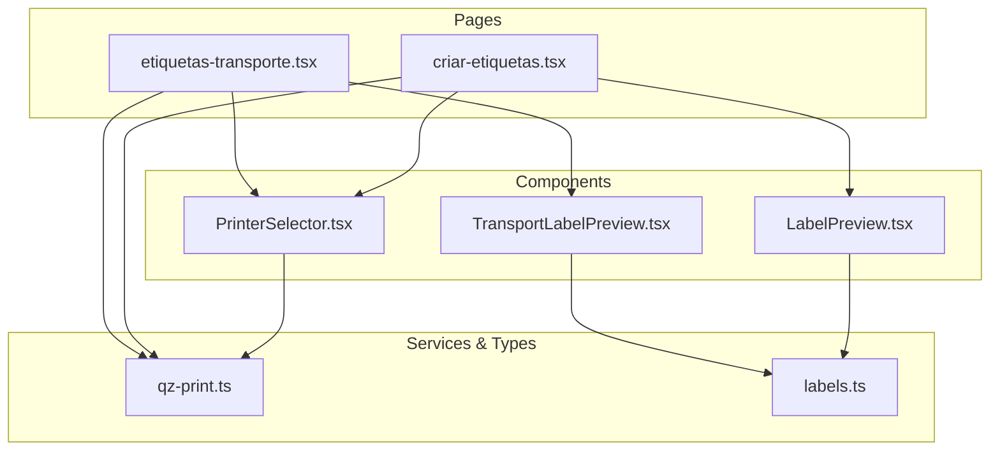
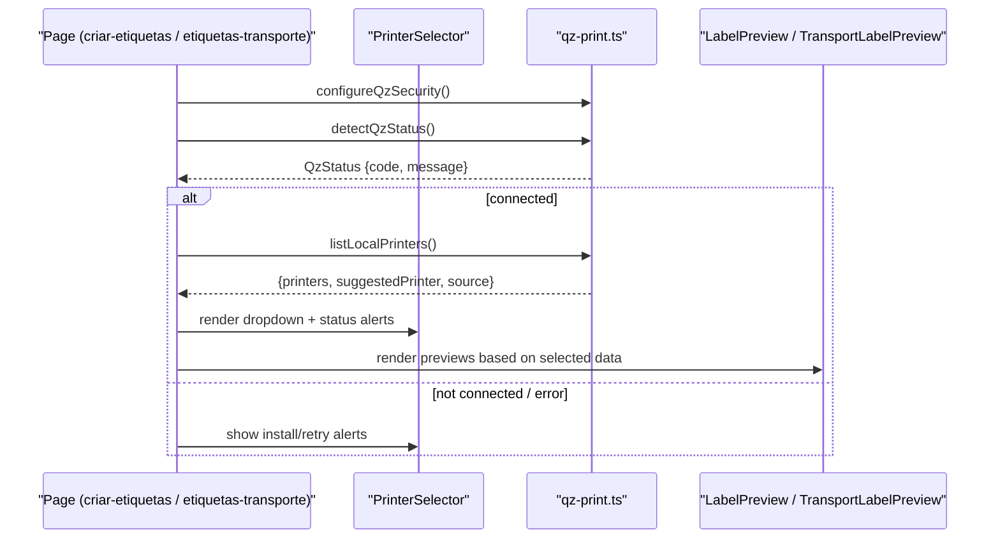
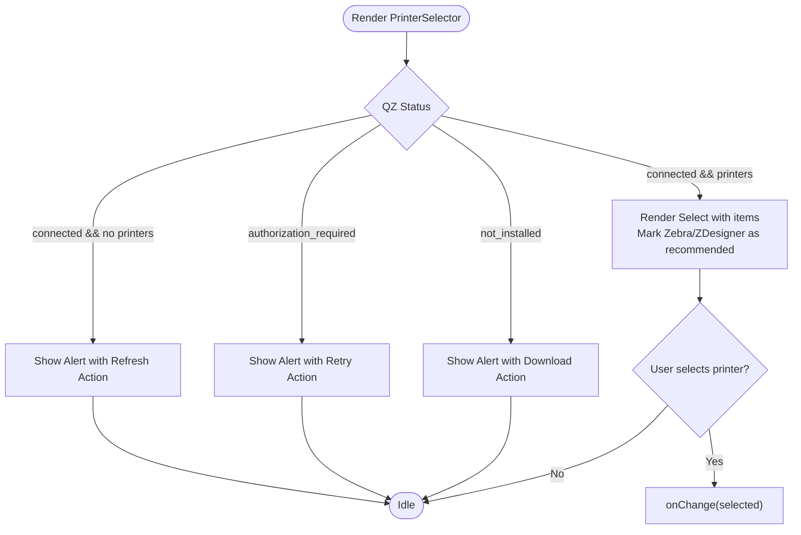
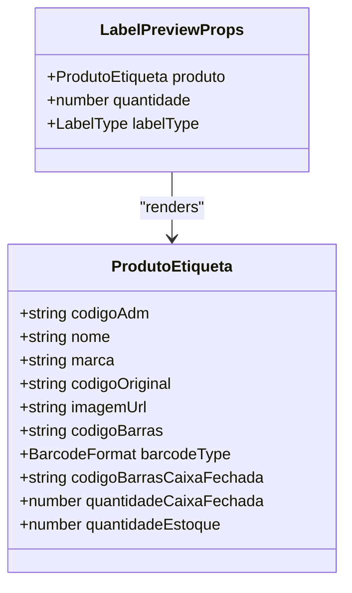
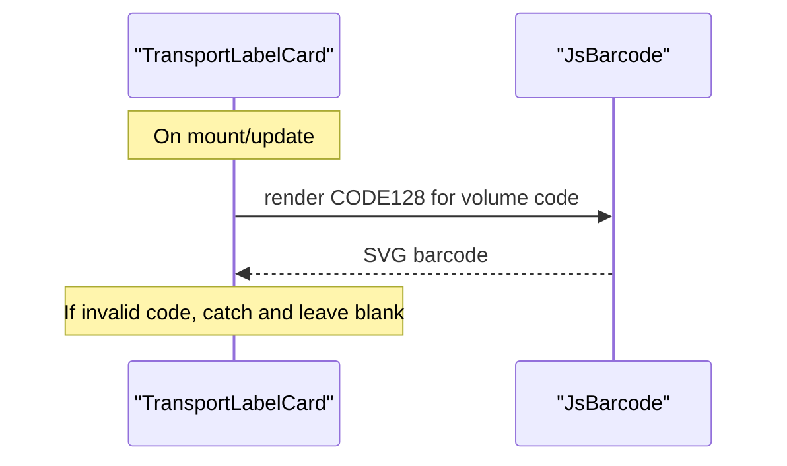
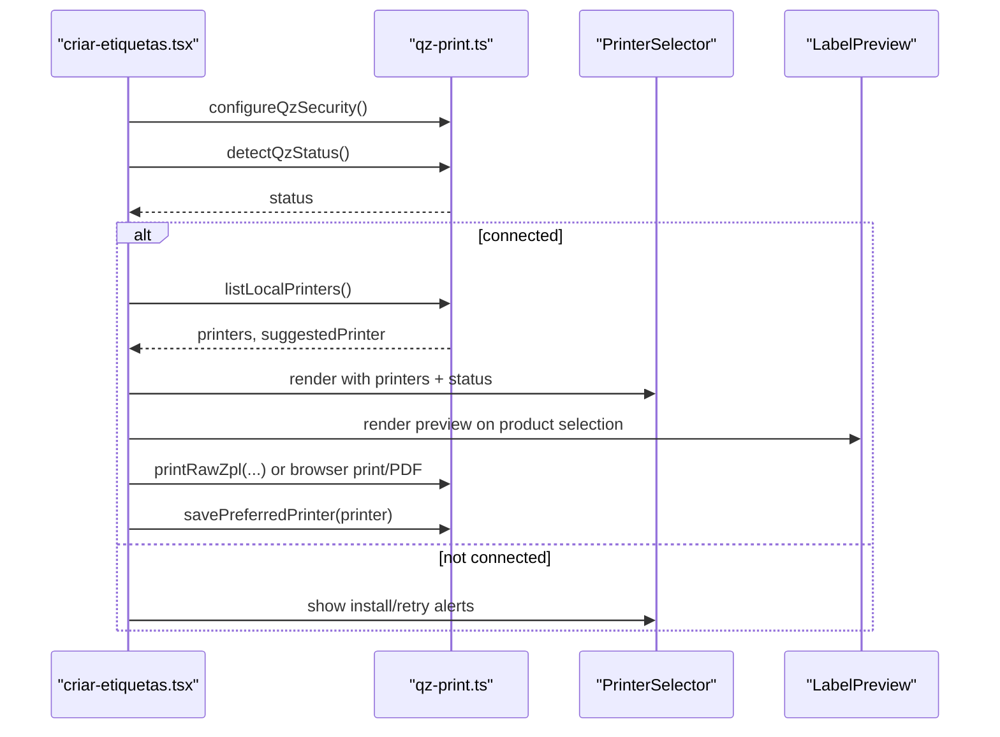
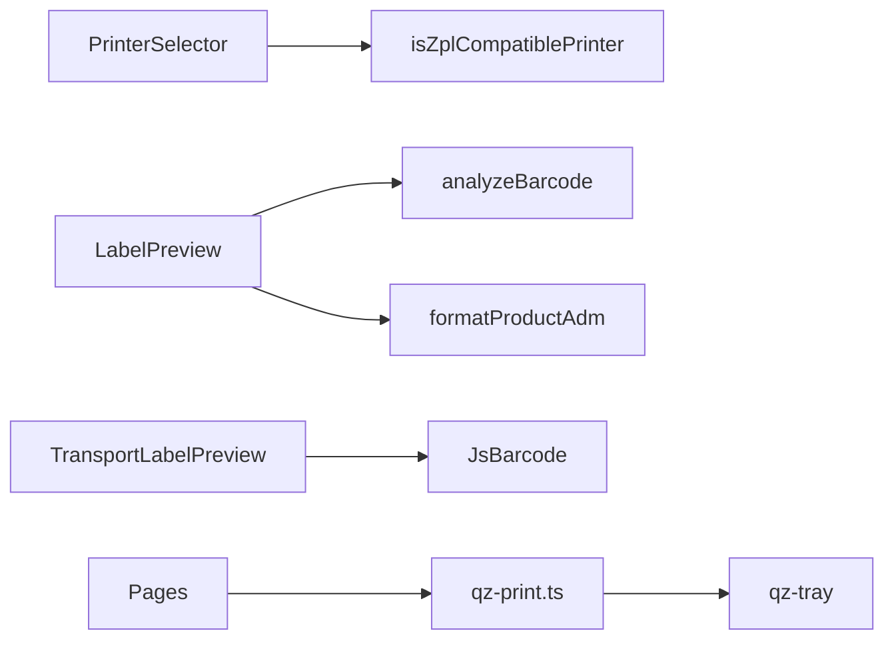

# Printer Selection Interface

<cite>
**Referenced Files in This Document**
- [PrinterSelector.tsx](file://components/labels/PrinterSelector.tsx)
- [LabelPreview.tsx](file://components/labels/LabelPreview.tsx)
- [TransportLabelPreview.tsx](file://components/labels/TransportLabelPreview.tsx)
- [qz-print.ts](file://services/qz-print.ts)
- [labels.ts](file://types/labels.ts)
- [criar-etiquetas.tsx](file://pages/criar-etiquetas.tsx)
- [etiquetas-transporte.tsx](file://pages/etiquetas-transporte.tsx)
</cite>

## Table of Contents
1. [Introduction](#introduction)
2. [Project Structure](#project-structure)
3. [Core Components](#core-components)
4. [Architecture Overview](#architecture-overview)
5. [Detailed Component Analysis](#detailed-component-analysis)
6. [Dependency Analysis](#dependency-analysis)
7. [Performance Considerations](#performance-considerations)
8. [Troubleshooting Guide](#troubleshooting-guide)
9. [Conclusion](#conclusion)

## Introduction
This document explains the user interface components that enable printer selection and label preview for product and transport labels. It focuses on:
- PrinterSelector: a dropdown-based UI to choose from available printers, with auto-detection of compatible printers and saved preferences.
- LabelPreview: visual previews of product labels before printing, supporting multiple format views and real-time updates as data changes.
- TransportLabelPreview: visual previews for transport labels with per-volume barcodes.

It also covers integration patterns into workflows, handling printer availability changes, implementing real-time preview updates, providing user feedback for print operations, accessibility considerations, responsive design, and error state presentation.

## Project Structure
The printer and label preview functionality is implemented across reusable components and pages:
- Reusable components:
  - PrinterSelector (dropdown + status alerts)
  - LabelPreview (product label previews)
  - TransportLabelPreview (transport label previews)
- Services and types:
  - qz-print (QZ Tray connection, printer discovery, raw ZPL printing, status detection)
  - labels (shared types for labels, statuses, and data models)
- Pages that integrate these components:
  - criar-etiquetas.tsx (product label creation workflow)
  - etiquetas-transporte.tsx (transport label generation workflow)

**Diagram sources**
- [criar-etiquetas.tsx:1-120](file://pages/criar-etiquetas.tsx#L1-L120)
- [etiquetas-transporte.tsx:1-120](file://pages/etiquetas-transporte.tsx#L1-L120)
- [PrinterSelector.tsx:1-96](file://components/labels/PrinterSelector.tsx#L1-L96)
- [LabelPreview.tsx:1-120](file://components/labels/LabelPreview.tsx#L1-L120)
- [TransportLabelPreview.tsx:1-60](file://components/labels/TransportLabelPreview.tsx#L1-L60)
- [qz-print.ts:1-60](file://services/qz-print.ts#L1-L60)
- [labels.ts:1-40](file://types/labels.ts#L1-L40)

**Section sources**
- [criar-etiquetas.tsx:1-120](file://pages/criar-etiquetas.tsx#L1-L120)
- [etiquetas-transporte.tsx:1-120](file://pages/etiquetas-transporte.tsx#L1-L120)
- [PrinterSelector.tsx:1-96](file://components/labels/PrinterSelector.tsx#L1-L96)
- [LabelPreview.tsx:1-120](file://components/labels/LabelPreview.tsx#L1-L120)
- [TransportLabelPreview.tsx:1-60](file://components/labels/TransportLabelPreview.tsx#L1-L60)
- [qz-print.ts:1-60](file://services/qz-print.ts#L1-L60)
- [labels.ts:1-40](file://types/labels.ts#L1-L40)

## Core Components
- PrinterSelector
  - Renders a select dropdown listing local printers discovered via QZ Tray or Windows fallback.
  - Displays contextual alerts based on QZ Tray status (not installed, authorization required, connected but no printers).
  - Marks Zebra/ZDesigner printers as recommended using compatibility checks.
  - Provides actions to install QZ Tray or retry connection.
- LabelPreview
  - Renders approximate visual previews of product labels in multiple formats:
    - Unitary label
    - Closed box label
    - A4 product (horizontal), vertical, and double-vertical layouts
  - Shows barcode type and quantity context; adapts layout responsively.
- TransportLabelPreview
  - Renders per-volume transport labels with CODE128 barcodes rendered via a client library.
  - Displays order, volume index, carrier info, and invoice number when present.

**Section sources**
- [PrinterSelector.tsx:1-96](file://components/labels/PrinterSelector.tsx#L1-L96)
- [LabelPreview.tsx:117-298](file://components/labels/LabelPreview.tsx#L117-L298)
- [TransportLabelPreview.tsx:1-186](file://components/labels/TransportLabelPreview.tsx#L1-L186)
- [qz-print.ts:18-30](file://services/qz-print.ts#L18-L30)
- [labels.ts:1-21](file://types/labels.ts#L1-L21)

## Architecture Overview
The system integrates UI components with a service layer that manages QZ Tray connectivity and printer discovery. Pages orchestrate the flow: detect status, list printers, render previews, and trigger printing.

**Diagram sources**
- [criar-etiquetas.tsx:102-171](file://pages/criar-etiquetas.tsx#L102-L171)
- [etiquetas-transporte.tsx:114-180](file://pages/etiquetas-transporte.tsx#L114-L180)
- [qz-print.ts:32-56](file://services/qz-print.ts#L32-L56)
- [qz-print.ts:85-146](file://services/qz-print.ts#L85-L146)
- [PrinterSelector.tsx:39-70](file://components/labels/PrinterSelector.tsx#L39-L70)
- [LabelPreview.tsx:117-150](file://components/labels/LabelPreview.tsx#L117-L150)
- [TransportLabelPreview.tsx:164-186](file://components/labels/TransportLabelPreview.tsx#L164-L186)

## Detailed Component Analysis

### PrinterSelector
- Purpose: Provide an accessible, informative printer selection control with status-aware guidance.
- Key behaviors:
  - Dropdown lists printers; marks Zebra/ZDesigner printers as recommended.
  - Alerts adapt to QZ Tray status:
    - Not installed: offer download link.
    - Authorization required: instruct to authorize site in QZ Tray.
    - Connected but no printers: offer refresh action.
  - Footer note guides users through assisted flow (install QZ Tray, keep Zebra as default).
- Integration:
  - Consumed by both product and transport label pages.
  - Receives printers array, current selection, change handler, and status object.

**Diagram sources**
- [PrinterSelector.tsx:39-92](file://components/labels/PrinterSelector.tsx#L39-L92)
- [qz-print.ts:18-30](file://services/qz-print.ts#L18-L30)

**Section sources**
- [PrinterSelector.tsx:1-96](file://components/labels/PrinterSelector.tsx#L1-L96)
- [qz-print.ts:18-30](file://services/qz-print.ts#L18-L30)

### LabelPreview
- Purpose: Render accurate visual previews of product labels prior to printing.
- Supported formats:
  - UNITARIA: compact unit label with image, product details, and barcode area.
  - CAIXA_FECHADA: closed-box label variant with specific aspect ratio and fields.
  - A4_PRODUTO: horizontal A4 layout (two labels per sheet).
  - A4_PRODUTO_VERTICAL: vertical A4 layout (one label per sheet).
  - A4_PRODUTO_VERTICAL_DUPLA: double vertical A4 layout (three labels per sheet).
- Features:
  - Uses barcode analysis to indicate type and validity.
  - Responsive grid adapts columns based on screen size.
  - Aspect ratios simulate physical label sizes for realistic preview.
- Real-time updates:
  - Preview re-renders automatically when product data, quantity, or label type changes.

**Diagram sources**
- [LabelPreview.tsx:6-10](file://components/labels/LabelPreview.tsx#L6-L10)
- [labels.ts:9-21](file://types/labels.ts#L9-L21)

**Section sources**
- [LabelPreview.tsx:117-298](file://components/labels/LabelPreview.tsx#L117-L298)
- [labels.ts:1-21](file://types/labels.ts#L1-L21)

### TransportLabelPreview
- Purpose: Render per-volume transport labels with CODE128 barcodes.
- Behavior:
  - Generates SVG barcodes per volume using a client-side library.
  - Displays order number, carrier name, invoice number, and volume indices.
  - Adapts layout for different screen sizes.
- Real-time updates:
  - Barcode renders whenever volume code changes; invalid codes are gracefully ignored.

**Diagram sources**
- [TransportLabelPreview.tsx:25-42](file://components/labels/TransportLabelPreview.tsx#L25-L42)

**Section sources**
- [TransportLabelPreview.tsx:1-186](file://components/labels/TransportLabelPreview.tsx#L1-L186)

### Integration Patterns and Workflows

#### Product Labels Workflow (criar-etiquetas.tsx)
- Initializes QZ security and attempts to connect and list printers on load.
- Detects QZ Tray status and shows appropriate alerts.
- Lists local printers and suggests a preferred one (saved or auto-detected).
- Allows users to search for a product by ADM code, then view and print labels.
- Prints directly to Zebra via raw ZPL when compatible; otherwise opens browser print preview or PDF generation for A4 layouts.
- Saves preferred printer after successful print.

**Diagram sources**
- [criar-etiquetas.tsx:102-171](file://pages/criar-etiquetas.tsx#L102-L171)
- [criar-etiquetas.tsx:235-262](file://pages/criar-etiquetas.tsx#L235-L262)
- [qz-print.ts:148-157](file://services/qz-print.ts#L148-L157)
- [qz-print.ts:22-30](file://services/qz-print.ts#L22-L30)

**Section sources**
- [criar-etiquetas.tsx:102-171](file://pages/criar-etiquetas.tsx#L102-L171)
- [criar-etiquetas.tsx:235-262](file://pages/criar-etiquetas.tsx#L235-L262)
- [qz-print.ts:148-157](file://services/qz-print.ts#L148-L157)
- [qz-print.ts:22-30](file://services/qz-print.ts#L22-L30)

#### Transport Labels Workflow (etiquetas-transporte.tsx)
- Similar initialization and printer discovery flow.
- Generates transport label batches and previews per volume.
- Prints via raw ZPL if compatible; otherwise uses browser print preview.
- Persists preferred printer and updates printed timestamps per volume.

**Section sources**
- [etiquetas-transporte.tsx:114-180](file://pages/etiquetas-transporte.tsx#L114-L180)
- [etiquetas-transporte.tsx:313-351](file://pages/etiquetas-transporte.tsx#L313-L351)

## Dependency Analysis
- PrinterSelector depends on:
  - MUI components for UI controls and alerts.
  - qz-print.isZplCompatiblePrinter to mark recommended printers.
- LabelPreview depends on:
  - MUI components and theme utilities.
  - Barcode validation and product formatting utilities.
  - Shared label types for structure.
- TransportLabelPreview depends on:
  - JsBarcode for rendering CODE128 barcodes.
  - Shared label types for transport data.
- Pages depend on:
  - qz-print for connection, status detection, printer listing, and printing.
  - Local APIs for fetching product and transport data.

**Diagram sources**
- [PrinterSelector.tsx:1-4](file://components/labels/PrinterSelector.tsx#L1-L4)
- [LabelPreview.tsx:1-5](file://components/labels/LabelPreview.tsx#L1-L5)
- [TransportLabelPreview.tsx:1-6](file://components/labels/TransportLabelPreview.tsx#L1-L6)
- [qz-print.ts:1-6](file://services/qz-print.ts#L1-L6)

**Section sources**
- [PrinterSelector.tsx:1-4](file://components/labels/PrinterSelector.tsx#L1-L4)
- [LabelPreview.tsx:1-5](file://components/labels/LabelPreview.tsx#L1-L5)
- [TransportLabelPreview.tsx:1-6](file://components/labels/TransportLabelPreview.tsx#L1-L6)
- [qz-print.ts:1-6](file://services/qz-print.ts#L1-L6)

## Performance Considerations
- Avoid unnecessary re-renders:
  - Memoize derived values like barcode analysis and printer compatibility where possible.
- Efficient printer listing:
  - Cache results briefly and debounce refresh actions to reduce frequent QZ calls.
- Barcode rendering:
  - For TransportLabelPreview, ensure barcode regeneration only when relevant data changes.
- Print paths:
  - Prefer direct ZPL printing for compatible printers to avoid browser print overhead.
  - Use browser print/PDF only for A4 layouts where necessary.

[No sources needed since this section provides general guidance]

## Troubleshooting Guide
Common issues and how the system surfaces them:
- QZ Tray not installed:
  - Alert offers download link; page can open official download URL.
- Authorization required:
  - Alert instructs to authorize the site in QZ Tray; retry button reconnects.
- No printers found:
  - Alert indicates connection success but no local printers; offers refresh.
- Connection errors:
  - Error alert with descriptive message; retry option to reconnect.

Integration tips:
- Always call status detection before listing printers.
- Persist preferred printer and restore it on subsequent sessions.
- Provide clear user feedback via snackbar notifications for success and failure states.

**Section sources**
- [qz-print.ts:159-205](file://services/qz-print.ts#L159-L205)
- [criar-etiquetas.tsx:527-550](file://pages/criar-etiquetas.tsx#L527-L550)
- [etiquetas-transporte.tsx:166-180](file://pages/etiquetas-transporte.tsx#L166-L180)

## Conclusion
The PrinterSelector and LabelPreview components provide a robust, user-friendly foundation for selecting printers and verifying label content before printing. They integrate seamlessly with QZ Tray for direct ZPL printing and fall back to browser-based printing for A4 layouts. The system handles printer availability changes, supports real-time previews, and delivers clear user feedback and error states. Accessibility and responsive design are considered through semantic controls, descriptive labels, and adaptive layouts.

[No sources needed since this section summarizes without analyzing specific files]