# QZ Tray Integration

<cite>
**Referenced Files in This Document**
- [services/qz-print.ts](file://services/qz-print.ts)
- [types/qz-tray.d.ts](file://types/qz-tray.d.ts)
- [types/labels.ts](file://types/labels.ts)
- [pages/api/etiquetas/local-printers.ts](file://pages/api/etiquetas/local-printers.ts)
- [utils/printer-integration.js](file://utils/printer-integration.js)
- [utils/printer.js](file://utils/printer.js)
- [QZ_TRAY_ETIQUETAS.md](file://QZ_TRAY_ETIQUETAS.md)
</cite>

## Table of Contents
1. [Introduction](#introduction)
2. [Project Structure](#project-structure)
3. [Core Components](#core-components)
4. [Architecture Overview](#architecture-overview)
5. [Detailed Component Analysis](#detailed-component-analysis)
6. [Dependency Analysis](#dependency-analysis)
7. [Performance Considerations](#performance-considerations)
8. [Troubleshooting Guide](#troubleshooting-guide)
9. [Conclusion](#conclusion)
10. [Appendices](#appendices)

## Introduction
This document explains the QZ Tray integration used to communicate directly with Zebra printers from the browser via the QZ Tray desktop application. It covers WebSocket connection management, printer discovery and selection, security configuration (certificate handling and signature validation), error handling strategies, automatic printer detection logic, fallback mechanisms when QZ Tray is unavailable, and how to configure different printer types (ZD220, Zebra, ZDesigner). It also includes examples for connecting to QZ Tray, listing available printers, printing raw ZPL commands, and handling error states such as not_installed, authorization_required, and general error conditions. Connection options, retry logic, and port configuration for secure and insecure connections are documented.

## Project Structure
The integration spans client-side services, type definitions, API endpoints for fallback printer discovery, and utility modules for Windows-specific operations.

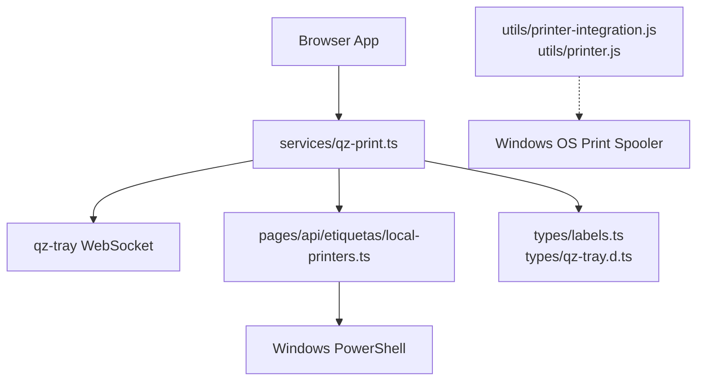

**Diagram sources**
- [services/qz-print.ts:1-205](file://services/qz-print.ts#L1-L205)
- [types/qz-tray.d.ts:1-44](file://types/qz-tray.d.ts#L1-L44)
- [types/labels.ts:67-78](file://types/labels.ts#L67-L78)
- [pages/api/etiquetas/local-printers.ts:1-50](file://pages/api/etiquetas/local-printers.ts#L1-L50)
- [utils/printer-integration.js:1-168](file://utils/printer-integration.js#L1-L168)
- [utils/printer.js:1-194](file://utils/printer.js#L1-L194)

**Section sources**
- [services/qz-print.ts:1-205](file://services/qz-print.ts#L1-L205)
- [types/qz-tray.d.ts:1-44](file://types/qz-tray.d.ts#L1-L44)
- [types/labels.ts:67-78](file://types/labels.ts#L67-L78)
- [pages/api/etiquetas/local-printers.ts:1-50](file://pages/api/etiquetas/local-printers.ts#L1-L50)
- [utils/printer-integration.js:1-168](file://utils/printer-integration.js#L1-L168)
- [utils/printer.js:1-194](file://utils/printer.js#L1-L194)

## Core Components
- QZ Tray service: manages WebSocket lifecycle, printer discovery, raw ZPL printing, and status detection.
- Type definitions: define QZ Tray module interface and status codes used across the app.
- Fallback printer discovery: Next.js API endpoint that enumerates Windows printers via PowerShell.
- Utilities: Windows-only helpers for direct printer access and PDF generation/printing.

Key responsibilities:
- Ensure a stable WebSocket connection to QZ Tray with configured hosts and ports.
- Discover printers through QZ Tray, then fall back to system APIs if needed.
- Enforce security via certificate and signature endpoints.
- Normalize errors into user-friendly statuses.

**Section sources**
- [services/qz-print.ts:7-16](file://services/qz-print.ts#L7-L16)
- [services/qz-print.ts:32-50](file://services/qz-print.ts#L32-L50)
- [services/qz-print.ts:52-63](file://services/qz-print.ts#L52-L63)
- [services/qz-print.ts:85-146](file://services/qz-print.ts#L85-L146)
- [services/qz-print.ts:148-157](file://services/qz-print.ts#L148-L157)
- [services/qz-print.ts:159-204](file://services/qz-print.ts#L159-L204)
- [types/qz-tray.d.ts:1-44](file://types/qz-tray.d.ts#L1-L44)
- [types/labels.ts:67-78](file://types/labels.ts#L67-L78)
- [pages/api/etiquetas/local-printers.ts:16-49](file://pages/api/etiquetas/local-printers.ts#L16-L49)

## Architecture Overview
The system connects the browser to QZ Tray over WebSocket, discovers printers, and prints raw ZPL. If QZ Tray is unavailable or returns no printers, it falls back to server-side Windows enumeration.

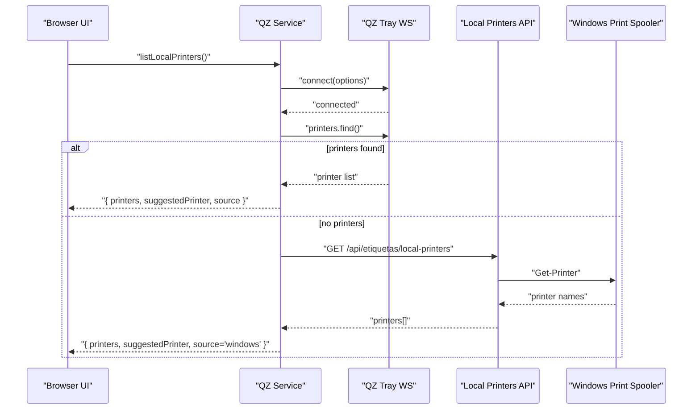

**Diagram sources**
- [services/qz-print.ts:52-63](file://services/qz-print.ts#L52-L63)
- [services/qz-print.ts:85-146](file://services/qz-print.ts#L85-L146)
- [pages/api/etiquetas/local-printers.ts:31-44](file://pages/api/etiquetas/local-printers.ts#L31-L44)

## Detailed Component Analysis

### QZ Tray Service (Client)
- Connection management: ensures an active WebSocket using configured hosts and multiple secure/insecure ports; reconnects on specific port conditions.
- Printer discovery: attempts QZ Tray’s find/details/default methods; falls back to server-side Windows enumeration if empty.
- Security: sets certificate promise and signature algorithm; posts signatures to a backend endpoint when configured.
- Printing: creates a config for a selected printer and sends raw ZPL command data.
- Status detection: attempts connection and normalizes errors into standardized statuses.

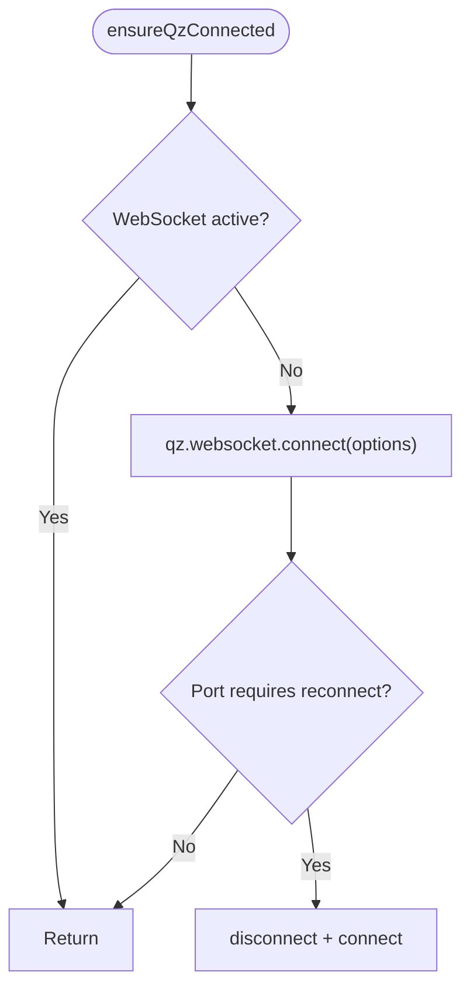

**Diagram sources**
- [services/qz-print.ts:52-63](file://services/qz-print.ts#L52-L63)

**Section sources**
- [services/qz-print.ts:7-16](file://services/qz-print.ts#L7-L16)
- [services/qz-print.ts:32-50](file://services/qz-print.ts#L32-L50)
- [services/qz-print.ts:52-63](file://services/qz-print.ts#L52-L63)
- [services/qz-print.ts:85-146](file://services/qz-print.ts#L85-L146)
- [services/qz-print.ts:148-157](file://services/qz-print.ts#L148-L157)
- [services/qz-print.ts:159-204](file://services/qz-print.ts#L159-L204)

### Printer Discovery and Selection
- Primary path: QZ Tray’s find/details/default to enumerate printers.
- Secondary path: server-side Windows enumeration via PowerShell when QZ Tray returns none.
- Auto-selection: prefers a previously saved printer or one matching ZD220/Zebra/ZDesigner patterns.

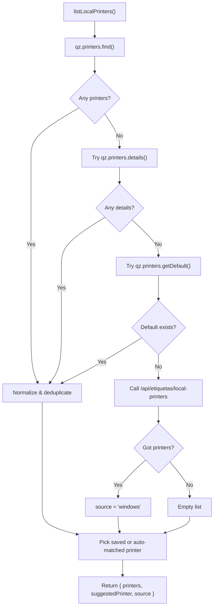

**Diagram sources**
- [services/qz-print.ts:85-146](file://services/qz-print.ts#L85-L146)
- [pages/api/etiquetas/local-printers.ts:31-44](file://pages/api/etiquetas/local-printers.ts#L31-L44)

**Section sources**
- [services/qz-print.ts:18-20](file://services/qz-print.ts#L18-L20)
- [services/qz-print.ts:85-146](file://services/qz-print.ts#L85-L146)
- [pages/api/etiquetas/local-printers.ts:16-49](file://pages/api/etiquetas/local-printers.ts#L16-L49)

### Security Configuration
- Certificate: set via a promise returning a base64-encoded certificate string from environment variables.
- Signature algorithm: configured to SHA512.
- Signature endpoint: posts a payload to a backend endpoint; expects a JSON response containing a signature field.

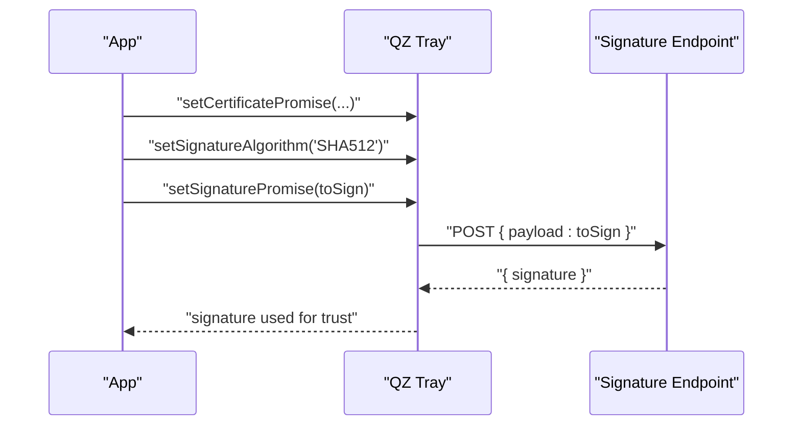

**Diagram sources**
- [services/qz-print.ts:32-50](file://services/qz-print.ts#L32-L50)

**Section sources**
- [services/qz-print.ts:32-50](file://services/qz-print.ts#L32-L50)
- [QZ_TRAY_ETIQUETAS.md:21-28](file://QZ_TRAY_ETIQUETAS.md#L21-L28)

### Error Handling Strategy
Errors are normalized into a consistent status object with code and message:
- not_installed: connection refused, fetch failures, websocket closed, unable to establish, cannot connect.
- authorization_required: certificate/signature issues, blocked/unauthorized responses.
- error: any other failure.

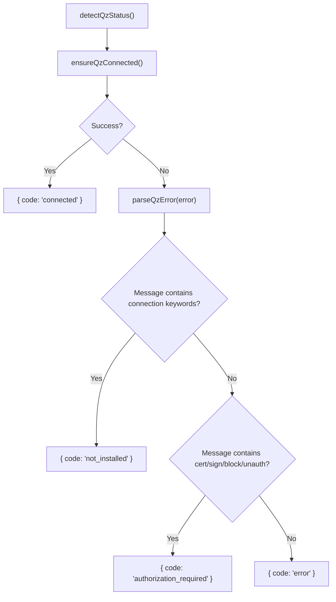

**Diagram sources**
- [services/qz-print.ts:159-204](file://services/qz-print.ts#L159-L204)

**Section sources**
- [services/qz-print.ts:159-204](file://services/qz-print.ts#L159-L204)
- [types/labels.ts:67-78](file://types/labels.ts#L67-L78)

### Printing Raw ZPL Commands
- Create a printer config for the target printer.
- Send raw ZPL data with format command and plain flavor.

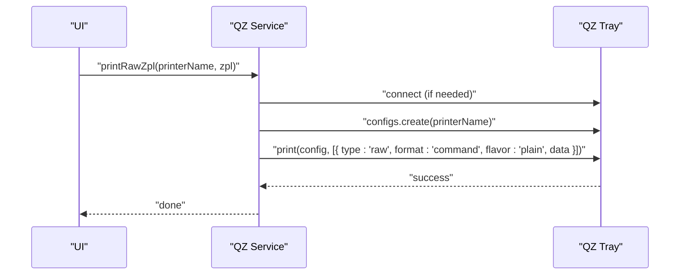

**Diagram sources**
- [services/qz-print.ts:148-157](file://services/qz-print.ts#L148-L157)

**Section sources**
- [services/qz-print.ts:148-157](file://services/qz-print.ts#L148-L157)

### Fallback Mechanisms When QZ Tray Is Unavailable
- If QZ Tray returns no printers, the service calls a server endpoint that uses PowerShell to list Windows printers.
- The endpoint enforces authentication and role-based access control before enumerating printers.

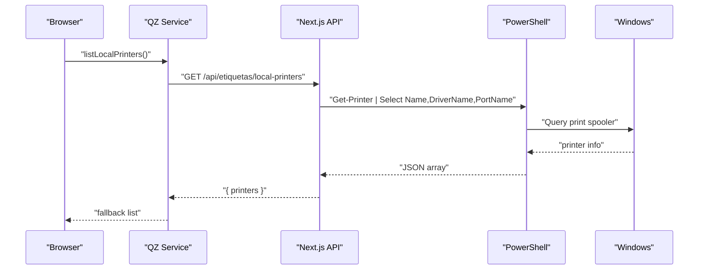

**Diagram sources**
- [services/qz-print.ts:65-83](file://services/qz-print.ts#L65-L83)
- [pages/api/etiquetas/local-printers.ts:16-49](file://pages/api/etiquetas/local-printers.ts#L16-L49)

**Section sources**
- [services/qz-print.ts:65-83](file://services/qz-print.ts#L65-L83)
- [pages/api/etiquetas/local-printers.ts:16-49](file://pages/api/etiquetas/local-printers.ts#L16-L49)

### Automatic Printer Detection Logic
- Matches printer names containing zd220, zebra, or zdesigner (case-insensitive).
- Prefers a previously saved printer; otherwise selects the first auto-matched printer.

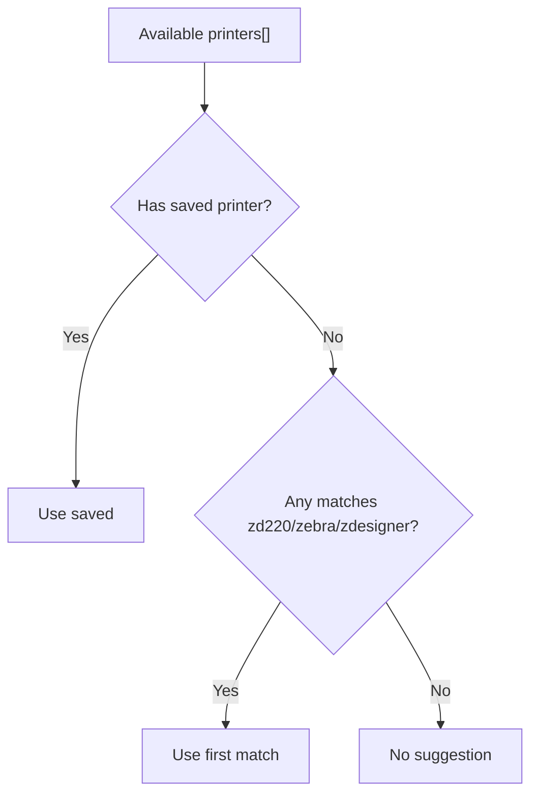

**Diagram sources**
- [services/qz-print.ts:18-20](file://services/qz-print.ts#L18-L20)
- [services/qz-print.ts:138-144](file://services/qz-print.ts#L138-L144)

**Section sources**
- [services/qz-print.ts:18-20](file://services/qz-print.ts#L18-L20)
- [services/qz-print.ts:138-144](file://services/qz-print.ts#L138-L144)

### Connection Options, Retry Logic, and Ports
- Hosts: localhost and localhost.qz.io.
- Secure ports: 8282, 8181, 8383, 8484.
- Insecure ports: 8283, 8182, 8384, 8485.
- KeepAlive: 30 seconds.
- Retries: 1.
- Delay: 0.2 seconds.
- Reconnection logic triggers when connected on certain ports or when connection info is undefined.

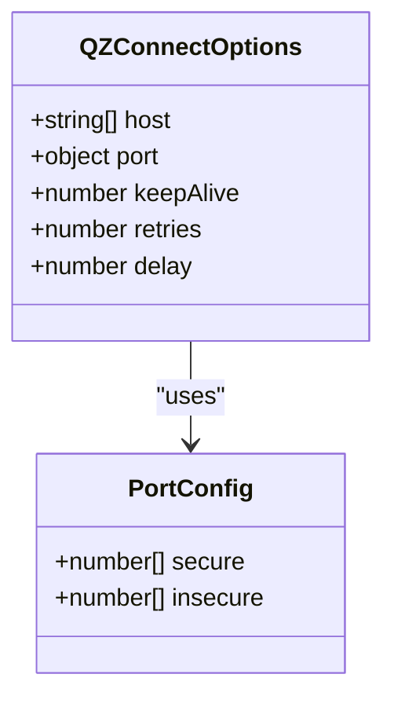

**Diagram sources**
- [services/qz-print.ts:7-16](file://services/qz-print.ts#L7-L16)
- [types/qz-tray.d.ts:12-22](file://types/qz-tray.d.ts#L12-L22)

**Section sources**
- [services/qz-print.ts:7-16](file://services/qz-print.ts#L7-L16)
- [services/qz-print.ts:97-109](file://services/qz-print.ts#L97-L109)
- [types/qz-tray.d.ts:12-22](file://types/qz-tray.d.ts#L12-L22)

### Utility Modules (Windows-Only)
- Direct printer enumeration and ZPL sending via PowerShell/COPY commands.
- PDF generation and printing utilities for non-ZPL workflows.

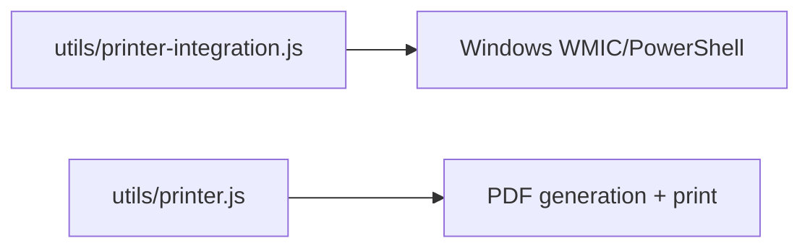

**Diagram sources**
- [utils/printer-integration.js:14-45](file://utils/printer-integration.js#L14-L45)
- [utils/printer-integration.js:77-130](file://utils/printer-integration.js#L77-L130)
- [utils/printer.js:20-72](file://utils/printer.js#L20-L72)
- [utils/printer.js:87-121](file://utils/printer.js#L87-L121)

**Section sources**
- [utils/printer-integration.js:1-168](file://utils/printer-integration.js#L1-L168)
- [utils/printer.js:1-194](file://utils/printer.js#L1-L194)

## Dependency Analysis
- Client service depends on qz-tray module and local types.
- Fallback relies on a Next.js API that executes PowerShell on Windows.
- Utilities depend on Node.js filesystem and child process APIs.

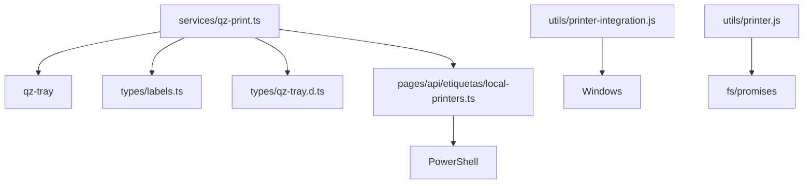

**Diagram sources**
- [services/qz-print.ts:1-205](file://services/qz-print.ts#L1-L205)
- [types/labels.ts:67-78](file://types/labels.ts#L67-L78)
- [types/qz-tray.d.ts:1-44](file://types/qz-tray.d.ts#L1-L44)
- [pages/api/etiquetas/local-printers.ts:1-50](file://pages/api/etiquetas/local-printers.ts#L1-L50)
- [utils/printer-integration.js:1-168](file://utils/printer-integration.js#L1-L168)
- [utils/printer.js:1-194](file://utils/printer.js#L1-L194)

**Section sources**
- [services/qz-print.ts:1-205](file://services/qz-print.ts#L1-L205)
- [pages/api/etiquetas/local-printers.ts:1-50](file://pages/api/etiquetas/local-printers.ts#L1-L50)
- [utils/printer-integration.js:1-168](file://utils/printer-integration.js#L1-L168)
- [utils/printer.js:1-194](file://utils/printer.js#L1-L194)

## Performance Considerations
- Use keepAlive to maintain WebSocket stability.
- Limit retries to avoid excessive reconnection loops.
- Prefer QZ Tray discovery first; fallback to server-side enumeration only when necessary to reduce network overhead.
- Avoid repeated full scans by caching suggested printer locally.

[No sources needed since this section provides general guidance]

## Troubleshooting Guide
Common scenarios and resolutions:
- not_installed: Indicates QZ Tray is not running or reachable. Ensure the application is installed, open, and firewall allows communication on configured ports.
- authorization_required: Indicates certificate or signature issues. Configure certificate and signature endpoint correctly; ensure the site is trusted in QZ Tray.
- error: General failure. Inspect logs and verify environment variables and network connectivity.

Operational checks:
- Verify WebSocket connection state and current port.
- Confirm printer names include expected substrings for auto-detection.
- Validate server-side printer enumeration works independently.

**Section sources**
- [services/qz-print.ts:159-204](file://services/qz-print.ts#L159-L204)
- [QZ_TRAY_ETIQUETAS.md:37-42](file://QZ_TRAY_ETIQUETAS.md#L37-L42)

## Conclusion
The integration provides robust communication with Zebra printers via QZ Tray, with resilient discovery and fallback mechanisms, strong security controls, and clear error normalization. By configuring hosts, ports, certificates, and signature endpoints appropriately, teams can reliably print raw ZPL labels in both development and production environments.

[No sources needed since this section summarizes without analyzing specific files]

## Appendices

### Examples

- Connect to QZ Tray
  - Call ensureQzConnected() to establish or reuse a WebSocket connection using configured hosts and ports.
  - Reference: [services/qz-print.ts:52-63](file://services/qz-print.ts#L52-L63)

- List Available Printers
  - Call listLocalPrinters() to retrieve printers from QZ Tray or Windows fallback.
  - Returns printers, suggestedPrinter, and source.
  - Reference: [services/qz-print.ts:85-146](file://services/qz-print.ts#L85-L146)

- Print Raw ZPL Commands
  - Call printRawZpl(printerName, zpl) to send ZPL to the selected printer.
  - Reference: [services/qz-print.ts:148-157](file://services/qz-print.ts#L148-L157)

- Handle Error States
  - Use detectQzStatus() to obtain a normalized status object.
  - Codes: checking, connected, not_installed, authorization_required, no_printers, error.
  - Reference: [services/qz-print.ts:194-204](file://services/qz-print.ts#L194-L204), [types/labels.ts:67-78](file://types/labels.ts#L67-L78)

- Configure Printer Types
  - Auto-detection matches printer names containing zd220, zebra, or zdesigner.
  - Reference: [services/qz-print.ts:18-20](file://services/qz-print.ts#L18-L20)

- Connection Options and Ports
  - Hosts: localhost, localhost.qz.io
  - Secure ports: 8282, 8181, 8383, 8484
  - Insecure ports: 8283, 8182, 8384, 8485
  - KeepAlive: 30, Retries: 1, Delay: 0.2
  - Reference: [services/qz-print.ts:7-16](file://services/qz-print.ts#L7-L16)

- Security Configuration
  - Set certificate promise and signature algorithm; post signatures to a backend endpoint.
  - Reference: [services/qz-print.ts:32-50](file://services/qz-print.ts#L32-L50), [QZ_TRAY_ETIQUETAS.md:21-28](file://QZ_TRAY_ETIQUETAS.md#L21-L28)

- Fallback Printer Discovery
  - Server endpoint enumerates Windows printers via PowerShell when QZ Tray returns none.
  - Reference: [pages/api/etiquetas/local-printers.ts:31-44](file://pages/api/etiquetas/local-printers.ts#L31-L44)