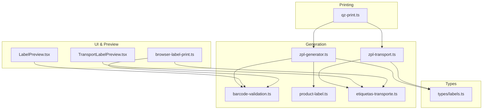
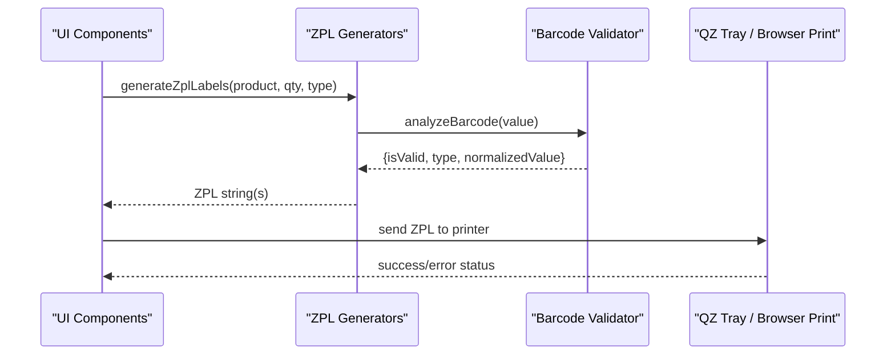
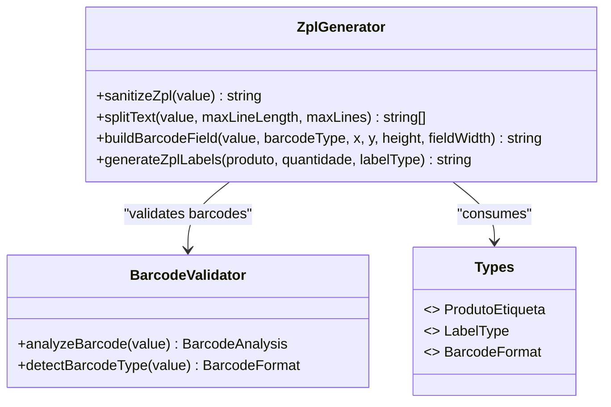
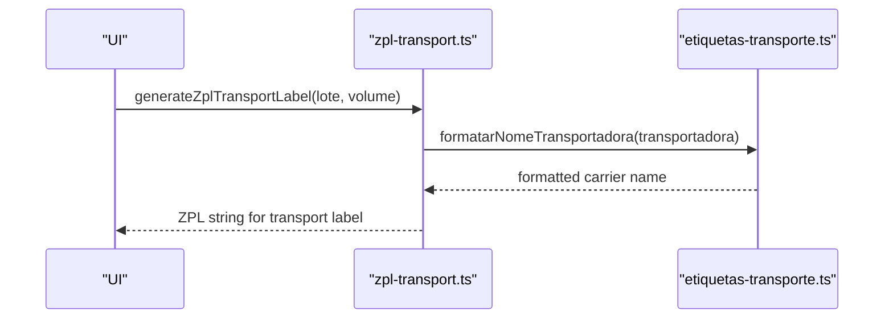
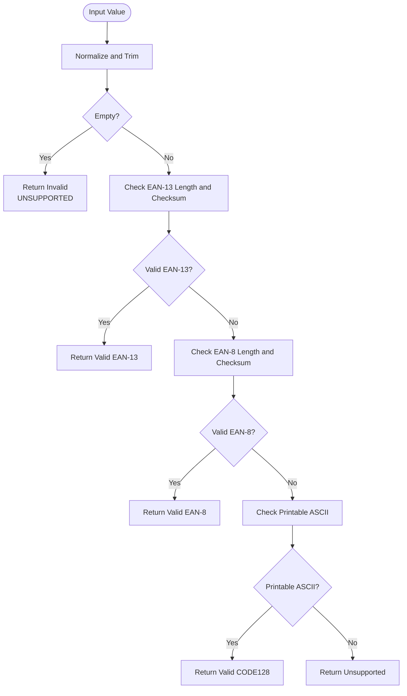
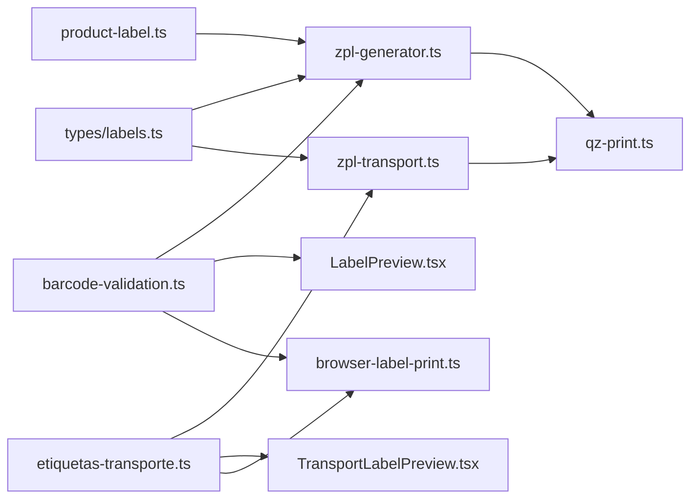

# ZPL Command Generation

<cite>
**Referenced Files in This Document**
- [zpl-generator.ts](file://lib/zpl-generator.ts)
- [zpl-transport.ts](file://lib/zpl-transport.ts)
- [barcode-validation.ts](file://lib/barcode-validation.ts)
- [labels.ts](file://types/labels.ts)
- [product-label.ts](file://lib/product-label.ts)
- [LabelPreview.tsx](file://components/labels/LabelPreview.tsx)
- [TransportLabelPreview.tsx](file://components/labels/TransportLabelPreview.tsx)
- [browser-label-print.ts](file://services/browser-label-print.ts)
- [qz-print.ts](file://services/qz-print.ts)
- [etiquetas-transporte.ts](file://lib/etiquetas-transporte.ts)
</cite>

## Table of Contents
1. Introduction
2. Project Structure
3. Core Components
4. Architecture Overview
5. Detailed Component Analysis
6. Dependency Analysis
7. Performance Considerations
8. Troubleshooting Guide
9. Conclusion

## Introduction
This document explains the Zebra Programming Language (ZPL) command generation system used to create optimized print commands for Zebra printers. It covers the template engine, dynamic content insertion, barcode generation, text formatting, image embedding considerations, and transport label generation. It also provides guidance on constructing complex label layouts, handling different data types, implementing conditional formatting, optimizing command size, and debugging print output issues.

## Project Structure
The ZPL generation system is implemented across several modules:
- Product label ZPL generation and layout logic
- Transport label ZPL generation
- Barcode validation and normalization
- Browser-based preview and printing utilities
- QZ Tray integration for sending raw ZPL to local printers
- Shared types and helpers

**Diagram sources**
- [zpl-generator.ts:1-171](file://lib/zpl-generator.ts#L1-L171)
- [zpl-transport.ts:1-71](file://lib/zpl-transport.ts#L1-L71)
- [barcode-validation.ts:1-89](file://lib/barcode-validation.ts#L1-L89)
- [product-label.ts:1-7](file://lib/product-label.ts#L1-L7)
- [etiquetas-transporte.ts:1-350](file://lib/etiquetas-transporte.ts#L1-L350)
- [labels.ts:1-121](file://types/labels.ts#L1-L121)
- [LabelPreview.tsx:1-298](file://components/labels/LabelPreview.tsx#L1-L298)
- [TransportLabelPreview.tsx:1-186](file://components/labels/TransportLabelPreview.tsx#L1-L186)
- [browser-label-print.ts:1-800](file://services/browser-label-print.ts#L1-L800)
- [qz-print.ts:1-205](file://services/qz-print.ts#L1-L205)

**Section sources**
- [zpl-generator.ts:1-171](file://lib/zpl-generator.ts#L1-L171)
- [zpl-transport.ts:1-71](file://lib/zpl-transport.ts#L1-L71)
- [barcode-validation.ts:1-89](file://lib/barcode-validation.ts#L1-L89)
- [labels.ts:1-121](file://types/labels.ts#L1-L121)
- [product-label.ts:1-7](file://lib/product-label.ts#L1-L7)
- [LabelPreview.tsx:1-298](file://components/labels/LabelPreview.tsx#L1-L298)
- [TransportLabelPreview.tsx:1-186](file://components/labels/TransportLabelPreview.tsx#L1-L186)
- [browser-label-print.ts:1-800](file://services/browser-label-print.ts#L1-L800)
- [qz-print.ts:1-205](file://services/qz-print.ts#L1-L205)
- [etiquetas-transporte.ts:1-350](file://lib/etiquetas-transporte.ts#L1-L350)

## Core Components
- ZPL product label generator: builds unit labels and closed-box labels with validated barcodes, sanitized text, and precise positioning.
- ZPL transport label generator: creates shipping labels with order info, carrier name, volume codes, and QR code for quick scanning.
- Barcode validator: detects and validates EAN-13, EAN-8, and CODE128 formats; returns normalized values and error reasons.
- Browser preview/printing: renders HTML previews and supports direct browser printing or PDF export.
- QZ Tray integration: connects to local printers and sends raw ZPL commands.

Key capabilities:
- Dynamic content insertion via sanitization and text splitting functions.
- Conditional formatting based on label type and available fields.
- Optimized command construction to minimize payload size while preserving readability.
- Robust error handling for invalid barcodes and missing data.

**Section sources**
- [zpl-generator.ts:11-171](file://lib/zpl-generator.ts#L11-L171)
- [zpl-transport.ts:9-71](file://lib/zpl-transport.ts#L9-L71)
- [barcode-validation.ts:25-89](file://lib/barcode-validation.ts#L25-L89)
- [browser-label-print.ts:109-684](file://services/browser-label-print.ts#L109-L684)
- [qz-print.ts:148-157](file://services/qz-print.ts#L148-L157)

## Architecture Overview
The system follows a layered approach:
- Data layer: shared types define structures for products, volumes, and label metadata.
- Validation layer: barcode analysis ensures only supported and valid codes are used.
- Generation layer: constructs ZPL command strings for product and transport labels.
- Presentation layer: previews render approximate visual layouts using HTML/CSS/SVG.
- Printing layer: QZ Tray sends raw ZPL to local Zebra printers; browser printing offers an alternative path.

**Diagram sources**
- [zpl-generator.ts:149-171](file://lib/zpl-generator.ts#L149-L171)
- [barcode-validation.ts:42-89](file://lib/barcode-validation.ts#L42-L89)
- [qz-print.ts:148-157](file://services/qz-print.ts#L148-L157)
- [browser-label-print.ts:109-684](file://services/browser-label-print.ts#L109-L684)

## Detailed Component Analysis

### ZPL Product Label Generator
Responsibilities:
- Sanitize input to remove ZPL control characters and normalize whitespace.
- Split long text into lines within constraints to fit label width.
- Build barcode fields with correct orientation and module widths.
- Compose pages containing multiple unit labels per page or single closed-box labels.

Key behaviors:
- Uses constants for label dimensions and darkness settings to ensure consistent output.
- Centers elements horizontally using calculated offsets.
- Validates barcodes before inclusion; throws descriptive errors for unsupported or invalid codes.
- Generates multiple pages when quantity exceeds labels per page.

Optimization notes:
- Reuses common header/footer sequences per page to reduce duplication.
- Chooses narrower module widths for smaller labels to keep commands compact.

Error handling:
- Throws errors for invalid quantities and missing barcodes.
- Provides clear messages for unsupported or invalid barcode formats.

**Section sources**
- [zpl-generator.ts:11-46](file://lib/zpl-generator.ts#L11-L46)
- [zpl-generator.ts:48-97](file://lib/zpl-generator.ts#L48-L97)
- [zpl-generator.ts:99-121](file://lib/zpl-generator.ts#L99-L121)
- [zpl-generator.ts:123-171](file://lib/zpl-generator.ts#L123-L171)

#### Class Diagram (Code-Level Relationships)

**Diagram sources**
- [zpl-generator.ts:11-171](file://lib/zpl-generator.ts#L11-L171)
- [barcode-validation.ts:35-89](file://lib/barcode-validation.ts#L35-L89)
- [labels.ts:1-21](file://types/labels.ts#L1-L21)

### ZPL Transport Label Generator
Responsibilities:
- Generate shipping labels with order number, client, CNPJ, carrier name, and volume information.
- Include a QR code encoding the order number for quick reference.
- Format carrier names consistently and handle special cases like “RETIRA CLIENTE”.

Key behaviors:
- Uses a larger page size suitable for shipping labels.
- Splits long carrier names into multiple lines to fit layout.
- Conditionally includes optional fields such as invoice number and CNPJ.

Error handling:
- Ensures at least one volume exists before generating labels.

**Section sources**
- [zpl-transport.ts:9-59](file://lib/zpl-transport.ts#L9-L59)
- [zpl-transport.ts:61-71](file://lib/zpl-transport.ts#L61-L71)
- [etiquetas-transporte.ts:32-48](file://lib/etiquetas-transporte.ts#L32-L48)

#### Sequence Diagram (Transport Label Flow)

**Diagram sources**
- [zpl-transport.ts:13-59](file://lib/zpl-transport.ts#L13-L59)
- [etiquetas-transporte.ts:32-48](file://lib/etiquetas-transporte.ts#L32-L48)

### Barcode Validation
Responsibilities:
- Detect barcode format: EAN-13, EAN-8, CODE128, or unsupported.
- Validate checksums for EAN-13 and EAN-8.
- Normalize values and provide human-readable reasons for failures.

Complexity:
- Linear scans over digit arrays for checksum calculation; O(n).
- Regex checks for format detection; constant-time overhead relative to input length.

Error handling:
- Returns structured results indicating validity, detected type, normalized value, and reason for failure.

**Section sources**
- [barcode-validation.ts:7-23](file://lib/barcode-validation.ts#L7-L23)
- [barcode-validation.ts:25-40](file://lib/barcode-validation.ts#L25-L40)
- [barcode-validation.ts:42-89](file://lib/barcode-validation.ts#L42-L89)

#### Flowchart (Barcode Analysis)

**Diagram sources**
- [barcode-validation.ts:42-89](file://lib/barcode-validation.ts#L42-L89)

### Browser Preview and Printing
Responsibilities:
- Render approximate label layouts in the browser using HTML/CSS/SVG.
- Generate SVG barcodes for preview consistency.
- Support A4 layouts with multiple labels per sheet and landscape/portrait modes.
- Provide a toolbar to print directly or save as PDF.

Key behaviors:
- Escapes user-provided content to prevent injection.
- Builds label markup variants based on label type and orientation.
- Opens a new window with styled sheets and triggers browser print dialog.

Error handling:
- Throws errors if no products are selected or if popup windows are blocked.

**Section sources**
- [browser-label-print.ts:7-41](file://services/browser-label-print.ts#L7-L41)
- [browser-label-print.ts:43-107](file://services/browser-label-print.ts#L43-L107)
- [browser-label-print.ts:109-184](file://services/browser-label-print.ts#L109-L184)
- [browser-label-print.ts:187-673](file://services/browser-label-print.ts#L187-L673)

### QZ Tray Integration
Responsibilities:
- Connect to QZ Tray service and list local printers.
- Send raw ZPL commands to Zebra-compatible printers.
- Detect and report connection and authorization issues.

Key behaviors:
- Auto-detects Zebra printers by name patterns.
- Persists preferred printer selection locally.
- Configures security certificates and signature endpoints.

Error handling:
- Normalizes errors into status codes for UI feedback (not installed, authorization required, general error).

**Section sources**
- [qz-print.ts:18-20](file://services/qz-print.ts#L18-L20)
- [qz-print.ts:22-30](file://services/qz-print.ts#L22-L30)
- [qz-print.ts:32-50](file://services/qz-print.ts#L32-L50)
- [qz-print.ts:52-63](file://services/qz-print.ts#L52-L63)
- [qz-print.ts:65-146](file://services/qz-print.ts#L65-L146)
- [qz-print.ts:148-157](file://services/qz-print.ts#L148-L157)
- [qz-print.ts:159-205](file://services/qz-print.ts#L159-L205)

## Dependency Analysis
- zpl-generator.ts depends on barcode-validation.ts for barcode analysis and types/labels.ts for data models.
- zpl-transport.ts depends on etiquetas-transporte.ts for carrier name formatting and types/labels.ts for data models.
- Browser components depend on barcode-validation.ts and product-label.ts for consistent display and formatting.
- qz-print.ts orchestrates printer discovery and raw ZPL transmission.

**Diagram sources**
- [zpl-generator.ts:1-171](file://lib/zpl-generator.ts#L1-L171)
- [zpl-transport.ts:1-71](file://lib/zpl-transport.ts#L1-L71)
- [barcode-validation.ts:1-89](file://lib/barcode-validation.ts#L1-L89)
- [etiquetas-transporte.ts:1-350](file://lib/etiquetas-transporte.ts#L1-L350)
- [labels.ts:1-121](file://types/labels.ts#L1-L121)
- [product-label.ts:1-7](file://lib/product-label.ts#L1-L7)
- [LabelPreview.tsx:1-298](file://components/labels/LabelPreview.tsx#L1-L298)
- [TransportLabelPreview.tsx:1-186](file://components/labels/TransportLabelPreview.tsx#L1-L186)
- [browser-label-print.ts:1-800](file://services/browser-label-print.ts#L1-L800)
- [qz-print.ts:1-205](file://services/qz-print.ts#L1-L205)

**Section sources**
- [zpl-generator.ts:1-171](file://lib/zpl-generator.ts#L1-L171)
- [zpl-transport.ts:1-71](file://lib/zpl-transport.ts#L1-L71)
- [barcode-validation.ts:1-89](file://lib/barcode-validation.ts#L1-L89)
- [etiquetas-transporte.ts:1-350](file://lib/etiquetas-transporte.ts#L1-L350)
- [labels.ts:1-121](file://types/labels.ts#L1-L121)
- [product-label.ts:1-7](file://lib/product-label.ts#L1-L7)
- [LabelPreview.tsx:1-298](file://components/labels/LabelPreview.tsx#L1-L298)
- [TransportLabelPreview.tsx:1-186](file://components/labels/TransportLabelPreview.tsx#L1-L186)
- [browser-label-print.ts:1-800](file://services/browser-label-print.ts#L1-L800)
- [qz-print.ts:1-205](file://services/qz-print.ts#L1-L205)

## Performance Considerations
- Minimize ZPL payload by reusing page headers and avoiding redundant commands.
- Use appropriate module widths and label sizes to balance readability and command length.
- Prefer CODE128 for flexible alphanumeric data; use EAN-13/EAN-8 only when standardized formats apply.
- Batch multiple labels per page to reduce printer communication overhead.
- Avoid excessive text wrapping; split intelligently to maintain legibility without bloating commands.
- Pre-validate barcodes to fail fast and avoid generating large invalid payloads.

[No sources needed since this section provides general guidance]

## Troubleshooting Guide
Common issues and resolutions:
- Invalid or unsupported barcode: check validation results and ensure data matches expected format; update source data if necessary.
- Missing barcode for label type: verify that the product has the required barcode field populated for the selected label type.
- QZ Tray not found or unauthorized: install QZ Tray, grant site permissions, and configure certificate/signature endpoint if required.
- Printer not detected: list local printers via QZ Tray or fallback mechanisms; confirm driver installation and connectivity.
- Text overflow or misalignment: adjust line lengths and font sizes; use sanitization and splitting utilities to fit content.

Debugging techniques:
- Inspect generated ZPL strings to validate command structure and coordinates.
- Use browser preview to approximate layout before sending to printer.
- Log validation errors and reasons to identify problematic inputs early.
- Test with small batches to isolate issues before full print runs.

**Section sources**
- [barcode-validation.ts:42-89](file://lib/barcode-validation.ts#L42-L89)
- [zpl-generator.ts:149-171](file://lib/zpl-generator.ts#L149-L171)
- [qz-print.ts:159-205](file://services/qz-print.ts#L159-L205)
- [browser-label-print.ts:109-184](file://services/browser-label-print.ts#L109-L184)

## Conclusion
The ZPL command generation system provides robust, validated, and optimized label outputs for both product and transport scenarios. By combining strict barcode validation, careful text handling, and efficient command construction, it delivers reliable prints across various label formats. The integrated preview and QZ Tray support streamline testing and deployment, while comprehensive error handling ensures a smooth user experience. Following the best practices outlined here will help maintain high-quality label outputs and simplify future enhancements.

[No sources needed since this section summarizes without analyzing specific files]