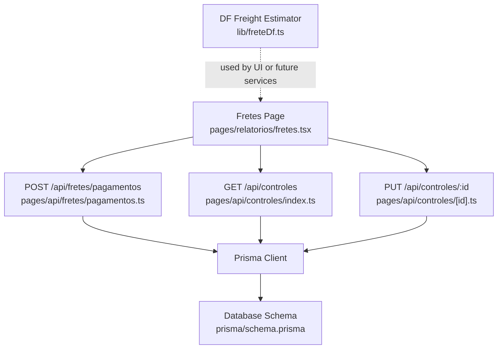
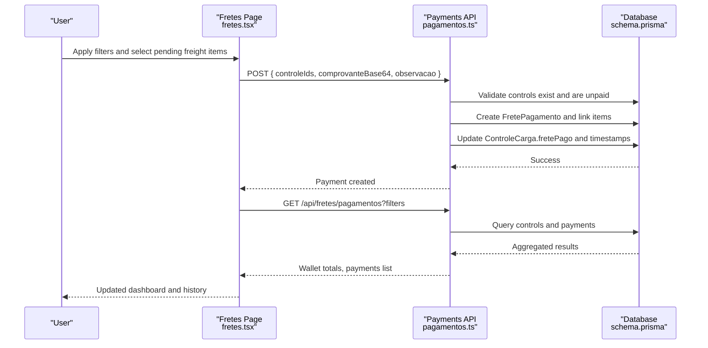
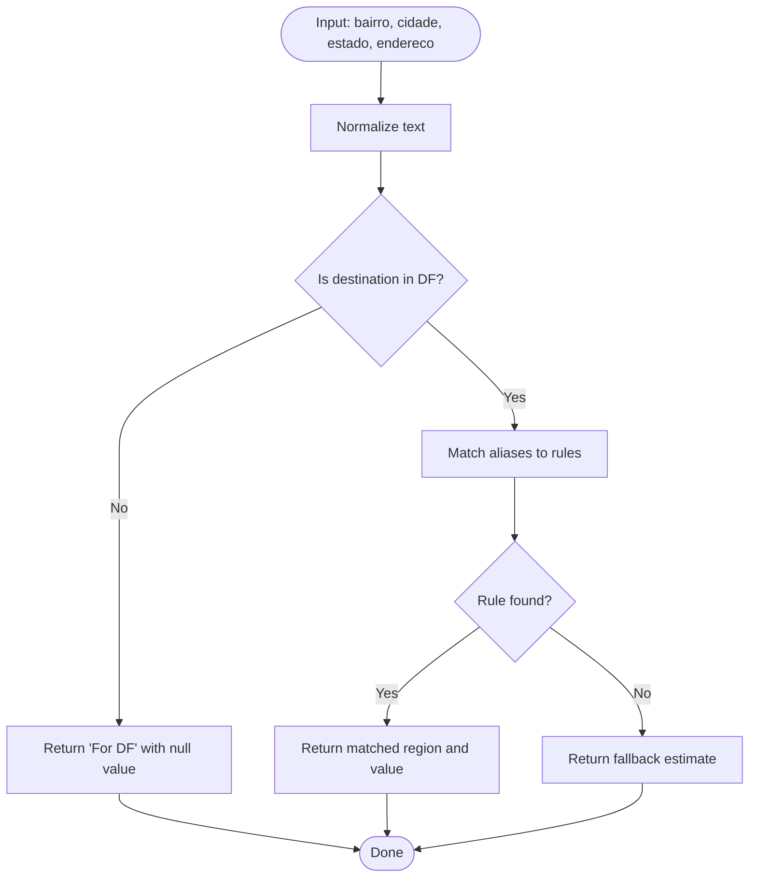
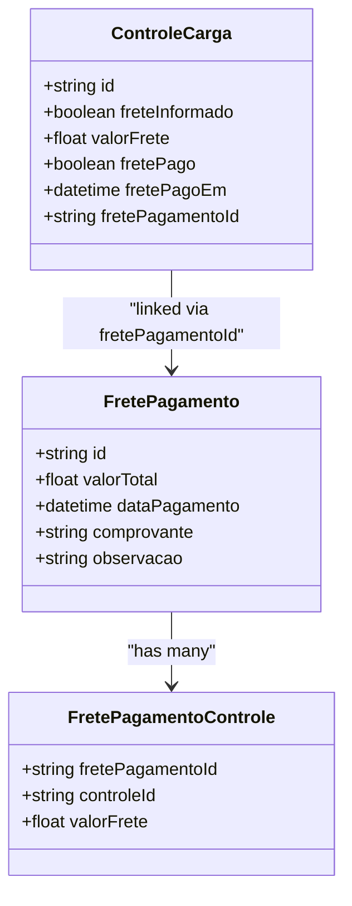
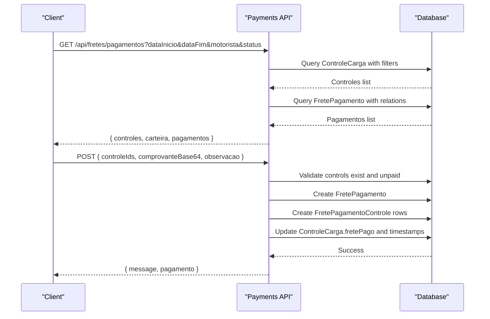
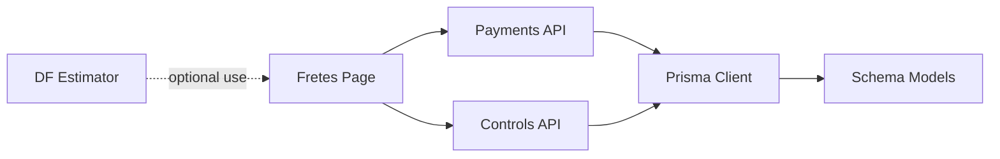

# Freight Calculation System

<cite>
**Referenced Files in This Document**
- [freteDf.ts](file://lib/freteDf.ts)
- [pagamentos.ts](file://pages/api/fretes/pagamentos.ts)
- [fretes.tsx](file://pages/relatorios/fretes.tsx)
- [index.ts (controles)](file://pages/api/controles/index.ts)
- [id.ts (controles)](file://pages/api/controles/[id].ts)
- [schema.prisma](file://prisma/schema.prisma)
</cite>

## Table of Contents
1. Introduction
2. Project Structure
3. Core Components
4. Architecture Overview
5. Detailed Component Analysis
6. Dependency Analysis
7. Performance Considerations
8. Troubleshooting Guide
9. Conclusion

## Introduction
This document explains the freight calculation and payment system implemented in the repository. It covers:
- How freight values are stored and managed per shipment control
- The regional freight estimation logic for Distrito Federal (DF)
- How freight payments are recorded, grouped, and reported
- Where configuration lives for carriers and freight fields
- How to extend the system for distance-based pricing, fuel surcharges, discounts, and external rate integrations

The current implementation focuses on:
- Storing freight information per control record
- Estimating a reference freight value by region (DF zones)
- Recording and reporting freight payments with supporting documents
- Filtering and aggregating freight data for dashboards and reports

## Project Structure
Freight-related functionality spans utilities, API endpoints, UI pages, and database schema:
- Utility for DF regional freight estimation
- API endpoints to create/update controls with freight info and to record freight payments
- Report page to view freight wallet, pending items, and payment history
- Prisma schema defining freight fields and payment models

**Diagram sources**
- [fretes.tsx:147-188](file://pages/relatorios/fretes.tsx#L147-L188)
- [pagamentos.ts:26-135](file://pages/api/fretes/pagamentos.ts#L26-L135)
- [index.ts (controles):5-59](file://pages/api/controles/index.ts#L5-L59)
- [id.ts (controles):28-77](file://pages/api/controles/[id].ts#L28-L77)
- [schema.prisma:11-42](file://prisma/schema.prisma#L11-L42)
- [schema.prisma:263-290](file://prisma/schema.prisma#L263-L290)

**Section sources**
- [freteDf.ts:1-197](file://lib/freteDf.ts#L1-L197)
- [pagamentos.ts:1-228](file://pages/api/fretes/pagamentos.ts#L1-L228)
- [fretes.tsx:109-188](file://pages/relatorios/fretes.tsx#L109-L188)
- [index.ts (controles):1-121](file://pages/api/controles/index.ts#L1-L121)
- [id.ts (controles):1-93](file://pages/api/controles/[id].ts#L1-L93)
- [schema.prisma:11-42](file://prisma/schema.prisma#L11-L42)
- [schema.prisma:263-290](file://prisma/schema.prisma#L263-L290)

## Core Components
- DF Regional Freight Estimator: Computes a reference freight value based on normalized address text and predefined DF zone rules.
- Controls CRUD: Create/update control records including freight flags and values.
- Freight Payments API: Query freight controls and payments; group multiple controls into a single payment batch; update control payment status.
- Fretes Report UI: Filters, selects pending freight items, uploads proof of payment, and displays totals and history.

Key responsibilities:
- Data modeling: freight fields on ControleCarga and dedicated FretePagamento/FretePagamentoControle tables
- Business rules: validation that only unpaid, freight-informed controls can be included in a payment
- Reporting: aggregated totals for planned, paid, and pending freight amounts

**Section sources**
- [freteDf.ts:140-190](file://lib/freteDf.ts#L140-L190)
- [index.ts (controles):64-112](file://pages/api/controles/index.ts#L64-L112)
- [id.ts (controles):28-77](file://pages/api/controles/[id].ts#L28-L77)
- [pagamentos.ts:26-135](file://pages/api/fretes/pagamentos.ts#L26-L135)
- [pagamentos.ts:137-222](file://pages/api/fretes/pagamentos.ts#L137-L222)
- [schema.prisma:11-42](file://prisma/schema.prisma#L11-L42)
- [schema.prisma:263-290](file://prisma/schema.prisma#L263-L290)

## Architecture Overview
The system follows a layered approach:
- UI layer (Report page) collects filters and user actions
- API layer validates inputs, queries/updates database via Prisma
- Data layer stores freight metadata and payment records
- Optional estimator utility provides reference freight values by region

**Diagram sources**
- [fretes.tsx:224-260](file://pages/relatorios/fretes.tsx#L224-L260)
- [pagamentos.ts:137-222](file://pages/api/fretes/pagamentos.ts#L137-L222)
- [pagamentos.ts:26-135](file://pages/api/fretes/pagamentos.ts#L26-L135)
- [schema.prisma:263-290](file://prisma/schema.prisma#L263-L290)

## Detailed Component Analysis

### DF Regional Freight Estimator
Purpose:
- Normalize address components and match them against predefined DF zone aliases
- Return a reference freight value and descriptive metadata for DF regions
- Provide a fallback estimate for unmapped DF areas

Algorithm highlights:
- Normalization removes accents and extra spaces, uppercases input
- Region detection checks state/city and alias matches across neighborhood, city, and full address
- Returns structured result with region name, value, source type, description, and observation

Complexity:
- O(n) over rules for matching; negligible overhead given small rule set

Extensibility points:
- Add new zones and aliases
- Integrate with geocoding to map coordinates to zones
- Replace static rules with dynamic configuration storage

**Diagram sources**
- [freteDf.ts:127-138](file://lib/freteDf.ts#L127-L138)
- [freteDf.ts:140-190](file://lib/freteDf.ts#L140-L190)

**Section sources**
- [freteDf.ts:1-197](file://lib/freteDf.ts#L1-L197)

### Controls Freight Fields (Create/Update)
Responsibilities:
- Allow creating and updating ControleCarga with freight flags and values
- Persist transportadora, pallet counts, and optional freight amount
- Enforce valid transportadora enum values on update

Data model:
- freteInformado: boolean flag indicating freight was provided
- valorFrete: numeric freight amount
- fretePago: boolean marking payment status
- fretePagoEm: timestamp when marked as paid
- fretePagamentoId: foreign key linking to a payment batch

**Diagram sources**
- [schema.prisma:11-42](file://prisma/schema.prisma#L11-L42)
- [schema.prisma:263-290](file://prisma/schema.prisma#L263-L290)

**Section sources**
- [index.ts (controles):64-112](file://pages/api/controles/index.ts#L64-L112)
- [id.ts (controles):28-77](file://pages/api/controles/[id].ts#L28-L77)
- [schema.prisma:11-42](file://prisma/schema.prisma#L11-L42)

### Freight Payments API
Capabilities:
- List freight controls filtered by date range, driver, and payment status
- Aggregate totals for planned, paid, and pending freight
- Record a payment batch linking multiple controls, storing proof and observations
- Mark controls as paid and associate payment identifiers

Validation and business rules:
- Only controls with freight informed and not yet paid can be included
- Transactional writes ensure consistency between payment creation and control updates

**Diagram sources**
- [pagamentos.ts:26-135](file://pages/api/fretes/pagamentos.ts#L26-L135)
- [pagamentos.ts:137-222](file://pages/api/fretes/pagamentos.ts#L137-L222)

**Section sources**
- [pagamentos.ts:1-228](file://pages/api/fretes/pagamentos.ts#L1-L228)

### Fretes Report UI
Features:
- Filter controls by date range, driver, and payment status
- Select one or more pending freight items to mark as paid
- Upload proof of payment (base64) and add observations
- Display wallet totals and payment history with expandable details

Workflow:
- Fetches data from /api/fretes/pagamentos with query parameters
- Submits payment registration via POST to same endpoint
- Refreshes lists and totals after successful operations

**Section sources**
- [fretes.tsx:147-188](file://pages/relatorios/fretes.tsx#L147-L188)
- [fretes.tsx:224-260](file://pages/relatorios/fretes.tsx#L224-L260)
- [fretes.tsx:262-275](file://pages/relatorios/fretes.tsx#L262-L275)

## Dependency Analysis
Coupling and cohesion:
- UI depends on the payments API for both listing and recording payments
- Payments API depends on Prisma client and database schema
- DF estimator is decoupled and can be used by UI or future services without tight coupling

External dependencies:
- Prisma client for database access
- Next.js API routes for serverless endpoints
- Date-fns for formatting dates in the UI

Potential circular dependencies:
- None observed; UI calls APIs, APIs call DB, estimator is standalone

Integration points:
- Carrier selection via Transportadora enum in schema
- Future integration points for external calculators can be added as services called from UI or API layers

**Diagram sources**
- [fretes.tsx:147-188](file://pages/relatorios/fretes.tsx#L147-L188)
- [pagamentos.ts:26-135](file://pages/api/fretes/pagamentos.ts#L26-L135)
- [index.ts (controles):5-59](file://pages/api/controles/index.ts#L5-L59)
- [schema.prisma:11-42](file://prisma/schema.prisma#L11-L42)

**Section sources**
- [schema.prisma:292-302](file://prisma/schema.prisma#L292-L302)

## Performance Considerations
- Pagination and limits: The controls list supports a limit parameter to reduce payload size
- Indexing: Database indexes on frequently queried fields (e.g., dataCriacao, finalizado) improve performance
- Transactional writes: Payment registration uses transactions to avoid partial updates
- UI filtering: Server-side filtering reduces client-side processing and network load

Recommendations:
- Add pagination to payments list if it grows large
- Cache frequent aggregate totals if needed
- Use efficient queries with selective includes to minimize data transfer

[No sources needed since this section provides general guidance]

## Troubleshooting Guide
Common issues and resolutions:
- Invalid transportadora on update: Ensure the value matches the Transportadora enum
- Attempting to include already paid controls in a payment: Only unpaid, freight-informed controls are allowed
- Missing required IDs: Ensure all selected controleIds exist and are unique
- Network errors: Verify authentication and CORS settings when calling protected endpoints

Error handling locations:
- Validation and error responses in payments API
- Control update validation in controls API
- UI error alerts and loading states in report page

**Section sources**
- [pagamentos.ts:137-222](file://pages/api/fretes/pagamentos.ts#L137-L222)
- [id.ts (controles):28-77](file://pages/api/controles/[id].ts#L28-L77)
- [fretes.tsx:224-260](file://pages/relatorios/fretes.tsx#L224-L260)

## Conclusion
The freight calculation system currently provides:
- A robust way to store and manage freight information per control
- A reference estimator for DF regional freight values
- A complete workflow to record and report freight payments with proofs and observations

To extend the system:
- Implement distance-based pricing by integrating geocoding and route distance calculations
- Add fuel surcharges and discounts as configurable multipliers applied during cost computation
- Support real-time rates from logistics providers via service adapters invoked from API endpoints
- Centralize zone and carrier-specific rates in a configuration table for dynamic updates

[No sources needed since this section summarizes without analyzing specific files]