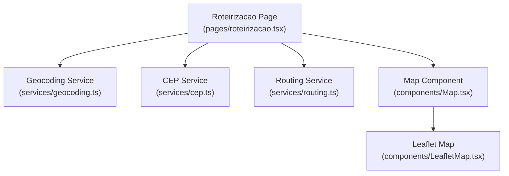
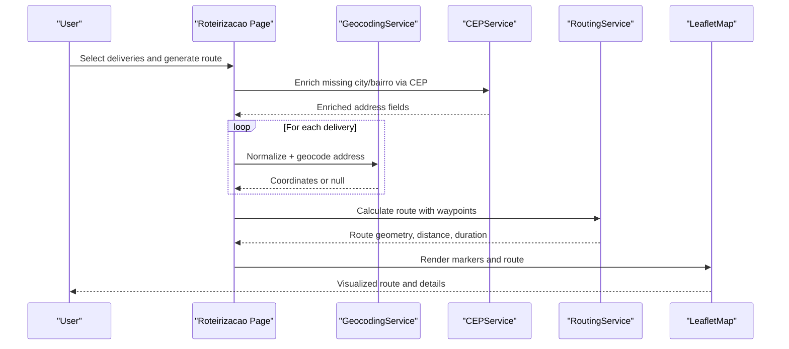
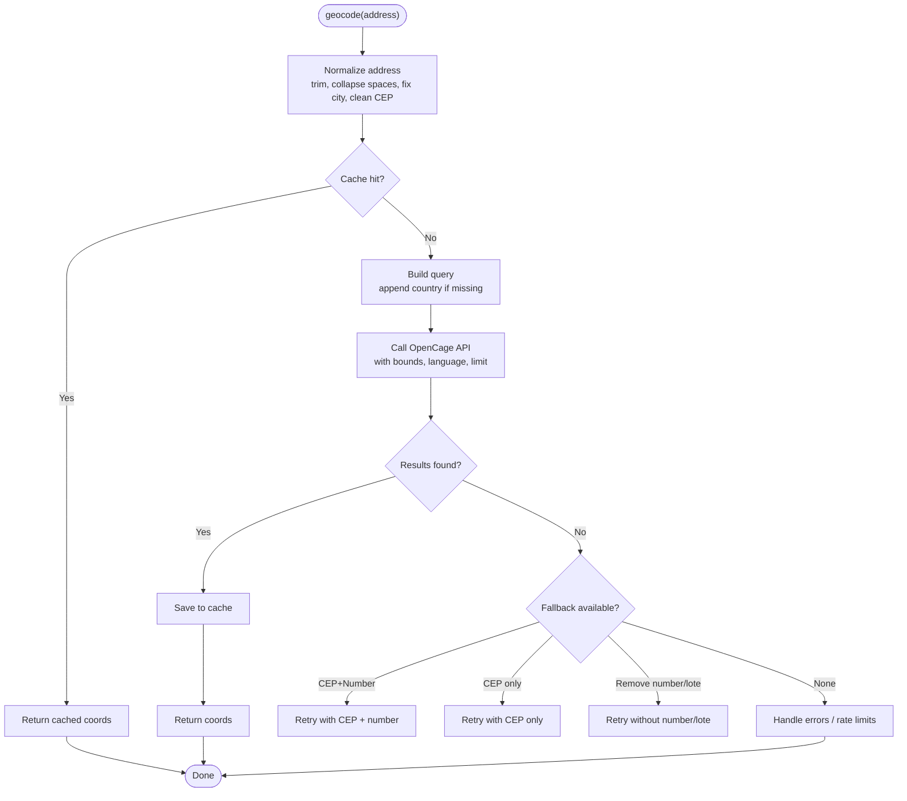
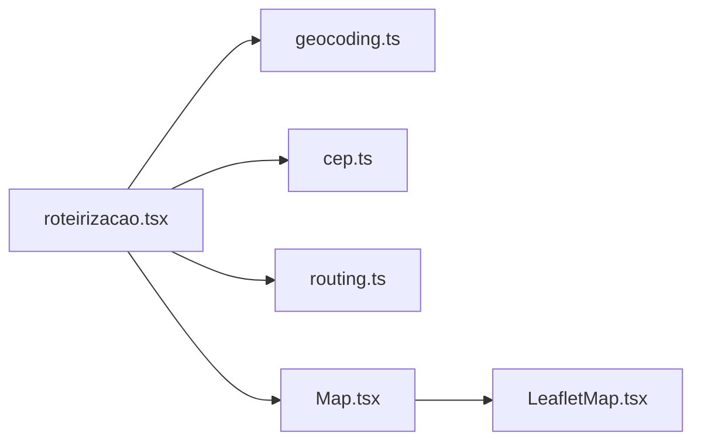

# Geocoding & Location Services

<cite>
**Referenced Files in This Document**
- [geocoding.ts](file://services/geocoding.ts)
- [cep.ts](file://services/cep.ts)
- [routing.ts](file://services/routing.ts)
- [LeafletMap.tsx](file://components/LeafletMap.tsx)
- [Map.tsx](file://components/Map.tsx)
- [roteirizacao.tsx](file://pages/roteirizacao.tsx)
- [env.example.txt](file://env.example.txt)
</cite>

## Table of Contents
1. Introduction
2. Project Structure
3. Core Components
4. Architecture Overview
5. Detailed Component Analysis
6. Dependency Analysis
7. Performance Considerations
8. Troubleshooting Guide
9. Conclusion
10. Appendices

## Introduction
This document explains the geocoding and location services used to validate addresses, convert addresses to coordinates, perform reverse enrichment via postal codes, compute routes, and integrate with mapping components. It covers address normalization, provider configuration, caching strategies, error handling, and performance optimization for bulk processing.

## Project Structure
The geolocation feature spans a few focused modules:
- Address normalization and geocoding service
- Postal code lookup and enrichment service
- Routing service for distance/duration calculation
- Map UI component for visualization and interaction
- Orchestration page that ties everything together

**Diagram sources**
- [roteirizacao.tsx:66-70](file://pages/roteirizacao.tsx#L66-L70)
- [Map.tsx:1-29](file://components/Map.tsx#L1-L29)
- [LeafletMap.tsx:1-10](file://components/LeafletMap.tsx#L1-L10)
- [geocoding.ts:1-10](file://services/geocoding.ts#L1-L10)
- [cep.ts:1-18](file://services/cep.ts#L1-L18)
- [routing.ts:1-10](file://services/routing.ts#L1-L10)

**Section sources**
- [roteirizacao.tsx:66-70](file://pages/roteirizacao.tsx#L66-L70)
- [Map.tsx:1-29](file://components/Map.tsx#L1-L29)
- [LeafletMap.tsx:1-10](file://components/LeafletMap.tsx#L1-L10)
- [geocoding.ts:1-10](file://services/geocoding.ts#L1-L10)
- [cep.ts:1-18](file://services/cep.ts#L1-L18)
- [routing.ts:1-10](file://services/routing.ts#L1-L10)

## Core Components
- GeocodingService: Normalizes addresses, queries OpenCage, caches results in localStorage, retries on rate limits/failures, and supports batch processing with throttling.
- CEPService: Enriches partial addresses using ViaCEP (postal code), with local cache and validation.
- RoutingService: Computes driving routes and durations via OSRM, formats distances and durations, and enforces waypoint limits.
- LeafletMap: Renders markers, popups, tooltips, route polylines, and integrates with routing data; supports marker dragging to adjust locations.
- Map: Dynamic import wrapper to avoid SSR issues while exposing types.
- Roteirizacao Page: Orchestrates loading deliveries, enriching with CEP, geocoding addresses, building waypoints, computing routes, and rendering the map.

**Section sources**
- [geocoding.ts:9-132](file://services/geocoding.ts#L9-L132)
- [cep.ts:17-59](file://services/cep.ts#L17-L59)
- [routing.ts:8-68](file://services/routing.ts#L8-L68)
- [LeafletMap.tsx:21-64](file://components/LeafletMap.tsx#L21-L64)
- [Map.tsx:1-29](file://components/Map.tsx#L1-L29)
- [roteirizacao.tsx:161-195](file://pages/roteirizacao.tsx#L161-L195)

## Architecture Overview
End-to-end flow from user action to mapped route:

**Diagram sources**
- [roteirizacao.tsx:820-944](file://pages/roteirizacao.tsx#L820-L944)
- [geocoding.ts:26-128](file://services/geocoding.ts#L26-L128)
- [cep.ts:33-56](file://services/cep.ts#L33-L56)
- [routing.ts:11-50](file://services/routing.ts#L11-L50)
- [LeafletMap.tsx:161-176](file://components/LeafletMap.tsx#L161-L176)

## Detailed Component Analysis

### GeocodingService
Responsibilities:
- Address normalization: collapses whitespace, standardizes city names, cleans CEP formatting, and appends country when needed.
- Provider integration: calls OpenCage with region bounds and language settings.
- Robust fallbacks: retries with CEP-only or without street number/lote when initial attempt fails.
- Rate limit handling: exponential backoff-like retry on 429 responses.
- Batch processing: sequential requests with delays to respect API quotas.

Key behaviors:
- LocalStorage-based cache keyed by normalized address.
- Returns coordinates and optional display name.
- Graceful degradation when provider returns no results.

**Diagram sources**
- [geocoding.ts:26-128](file://services/geocoding.ts#L26-L128)

**Section sources**
- [geocoding.ts:9-132](file://services/geocoding.ts#L9-L132)

### CEPService
Responsibilities:
- Validates and cleans CEP input.
- Queries ViaCEP to resolve street, neighborhood, city, state, and other fields.
- Caches results locally to reduce network calls.

Usage patterns:
- Enrich incomplete addresses before geocoding.
- Populate city/state when missing to improve geocoding success.

**Section sources**
- [cep.ts:17-59](file://services/cep.ts#L17-L59)

### RoutingService
Responsibilities:
- Builds OSRM route requests from waypoints.
- Enforces minimum and maximum waypoint constraints.
- Parses geometry, distance, and duration.
- Provides helpers to format distance and duration for UI.

Constraints:
- Minimum 2 waypoints.
- Maximum 25 waypoints per request.

**Section sources**
- [routing.ts:8-68](file://services/routing.ts#L8-L68)

### LeafletMap and Map
Responsibilities:
- Renders base tile layer and custom markers with rich popups/tooltips.
- Draws route polylines grouped by region and fits bounds.
- Supports marker dragging to update coordinates and recompute routes.
- Exposes share button to open Google Maps links.

Integration:
- Consumes route geometry and waypoints produced by the orchestration page.
- Uses RoutingService formatters for summary display.

**Section sources**
- [LeafletMap.tsx:108-506](file://components/LeafletMap.tsx#L108-L506)
- [Map.tsx:1-29](file://components/Map.tsx#L1-L29)

### Roteirizacao Page (Orchestrator)
Responsibilities:
- Loads deliveries from backend APIs.
- Enriches addresses via CEPService when city/bairro are missing.
- Normalizes and geocodes each delivery address using GeocodingService.
- Builds ordered waypoints (start depot + deliveries).
- Calculates routes with RoutingService and renders them on LeafletMap.
- Handles errors and provides user feedback.

Key flows:
- Bulk geocoding with progress updates and delays to respect provider limits.
- Proximity-based ordering option using Haversine distance.
- Route metrics computation and PDF export preparation.

**Section sources**
- [roteirizacao.tsx:479-566](file://pages/roteirizacao.tsx#L479-L566)
- [roteirizacao.tsx:820-1006](file://pages/roteirizacao.tsx#L820-L1006)
- [roteirizacao.tsx:756-790](file://pages/roteirizacao.tsx#L756-L790)

## Dependency Analysis
High-level dependencies between modules:

**Diagram sources**
- [roteirizacao.tsx:66-70](file://pages/roteirizacao.tsx#L66-L70)
- [Map.tsx:1-29](file://components/Map.tsx#L1-L29)
- [LeafletMap.tsx:1-10](file://components/LeafletMap.tsx#L1-L10)
- [geocoding.ts:1-10](file://services/geocoding.ts#L1-L10)
- [cep.ts:1-18](file://services/cep.ts#L1-L18)
- [routing.ts:1-10](file://services/routing.ts#L1-L10)

Coupling notes:
- The orchestrator depends on all three services and the map component.
- Geocoding and CEP services are independent utilities with local caching.
- Routing is decoupled and only requires coordinate arrays.

**Section sources**
- [roteirizacao.tsx:66-70](file://pages/roteirizacao.tsx#L66-L70)
- [geocoding.ts:1-10](file://services/geocoding.ts#L1-L10)
- [cep.ts:1-18](file://services/cep.ts#L1-L18)
- [routing.ts:1-10](file://services/routing.ts#L1-L10)
- [Map.tsx:1-29](file://components/Map.tsx#L1-L29)
- [LeafletMap.tsx:1-10](file://components/LeafletMap.tsx#L1-L10)

## Performance Considerations
- Caching strategy:
  - GeocodingService uses localStorage to cache normalized address results.
  - CEPService caches CEP lookups by cleaned numeric CEP.
- Throttling and batching:
  - GeocodingService.geocodeMany processes sequentially with a delay when not a cache hit to respect provider limits.
  - The orchestrator adds small delays between geocoding calls during bulk operations.
- Provider constraints:
  - RoutingService enforces a maximum of 25 waypoints per request; split large routes into smaller batches.
- Network resilience:
  - GeocodingService retries on 429 with backoff and general failures with limited retries.
- UI responsiveness:
  - Map component dynamically imports to avoid SSR overhead.
  - Progressive updates and snackbar notifications keep users informed.

[No sources needed since this section provides general guidance]

## Troubleshooting Guide
Common issues and resolutions:
- Geocoding returns null:
  - Check address normalization and ensure city/state are present.
  - Use CEP enrichment to fill missing fields.
  - Inspect logs for fallback attempts and provider errors.
- Rate limiting (429):
  - The service automatically retries; consider reducing batch size or increasing delays.
- Routing errors:
  - Ensure at least two waypoints and no more than 25 per request.
  - Validate coordinate order and availability of OSRM service.
- Map not rendering:
  - Confirm dynamic import succeeded and environment supports browser APIs.
  - Verify tile layer URL accessibility.

**Section sources**
- [geocoding.ts:96-110](file://services/geocoding.ts#L96-L110)
- [routing.ts:11-19](file://services/routing.ts#L11-L19)
- [LeafletMap.tsx:161-176](file://components/LeafletMap.tsx#L161-L176)
- [Map.tsx:18-27](file://components/Map.tsx#L18-L27)

## Conclusion
The geocoding and location stack combines robust address normalization, provider-backed geocoding, postal code enrichment, and routing to deliver accurate, visualized delivery routes. With local caching, throttling, and clear error handling, it scales well for moderate bulk workloads. For higher throughput, consider server-side caching, queueing, and provider-specific optimizations.

[No sources needed since this section summarizes without analyzing specific files]

## Appendices

### Configuration for Providers
- OpenCage API key:
  - Configure via environment variable referenced by GeocodingService.
- OSRM endpoint:
  - RoutingService uses a public OSRM instance; ensure connectivity.
- ViaCEP:
  - CEPService calls a free public endpoint; no key required.

Environment example keys:
- NEXT_PUBLIC_OPENCAGE_API_KEY (used by GeocodingService)
- Other application and security variables as needed

**Section sources**
- [geocoding.ts:11](file://services/geocoding.ts#L11)
- [routing.ts:9](file://services/routing.ts#L9)
- [env.example.txt:1-38](file://env.example.txt#L1-L38)

### Examples

- Convert an address to coordinates:
  - Compose a full address string (street, number, neighborhood, city, state, CEP).
  - Call GeocodingService.geocode and handle null results with fallbacks or user feedback.
  - Reference implementation usage in the orchestrator.

- Validate delivery locations:
  - Enrich with CEPService when city/bairro are missing.
  - Geocode and verify coordinates exist before adding to routes.

- Handle location errors:
  - Catch null results and provider errors.
  - Inform users and allow manual correction via marker dragging.

- Integrate with mapping services:
  - Pass coordinates as markers and waypoints to the Map component.
  - Compute routes with RoutingService and render polylines on LeafletMap.

**Section sources**
- [roteirizacao.tsx:820-944](file://pages/roteirizacao.tsx#L820-L944)
- [LeafletMap.tsx:161-176](file://components/LeafletMap.tsx#L161-L176)
- [routing.ts:11-50](file://services/routing.ts#L11-L50)