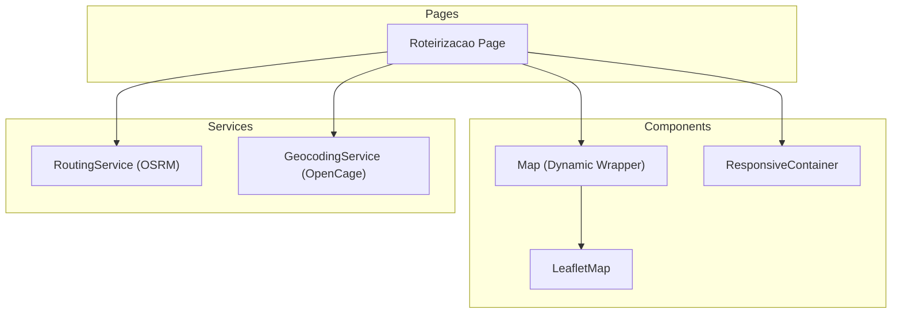
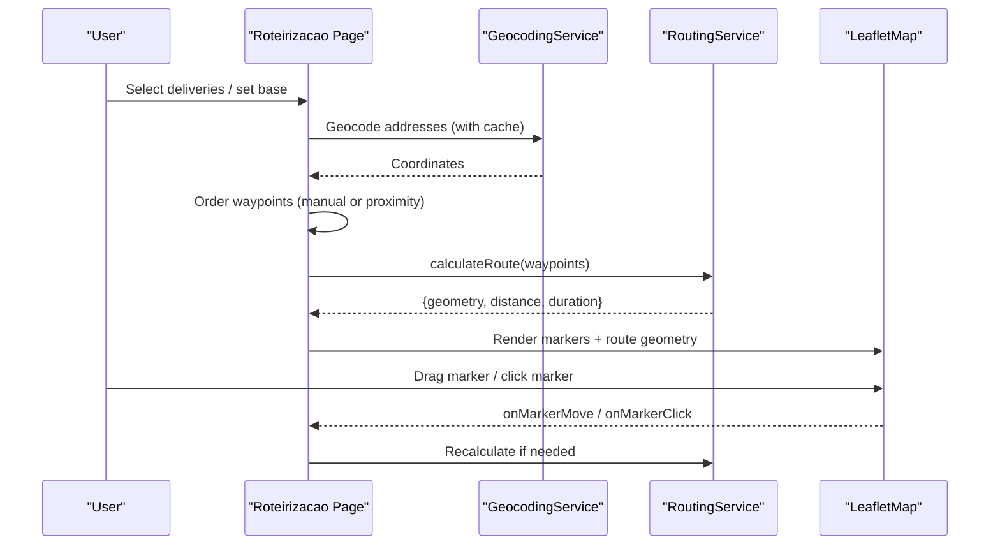
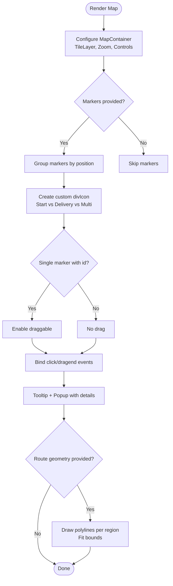
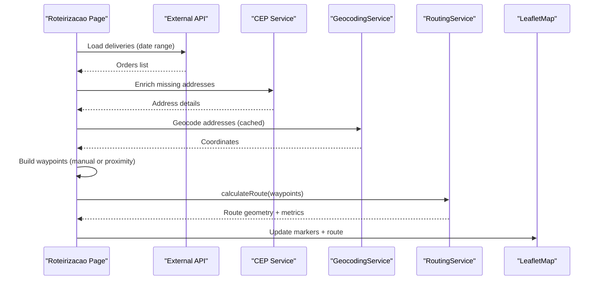
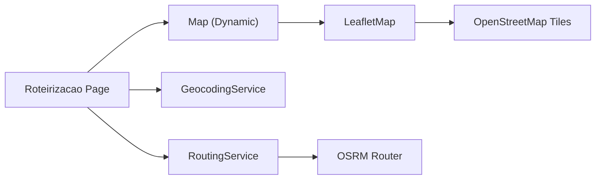

# Mapping & Navigation Integration

<cite>
**Referenced Files in This Document**
- [LeafletMap.tsx](file://components/LeafletMap.tsx)
- [Map.tsx](file://components/Map.tsx)
- [roteirizacao.tsx](file://pages/roteirizacao.tsx)
- [routing.ts](file://services/routing.ts)
- [geocoding.ts](file://services/geocoding.ts)
- [ResponsiveContainer.tsx](file://components/ResponsiveContainer.tsx)
</cite>

## Table of Contents
1. [Introduction](#introduction)
2. [Project Structure](#project-structure)
3. [Core Components](#core-components)
4. [Architecture Overview](#architecture-overview)
5. [Detailed Component Analysis](#detailed-component-analysis)
6. [Dependency Analysis](#dependency-analysis)
7. [Performance Considerations](#performance-considerations)
8. [Troubleshooting Guide](#troubleshooting-guide)
9. [Conclusion](#conclusion)
10. [Appendices](#appendices)

## Introduction
This document explains the mapping and navigation integration used to display delivery routes, manage markers, render polylines for routes, and handle interactive map features. It covers configuration of the map component, marker management, polyline rendering, event handling, integration with routing providers, geocoding support, offline considerations, mobile responsiveness, and accessibility guidance.

## Project Structure
The mapping feature is implemented as a reusable Leaflet-based map component, a dynamic wrapper for SSR safety, and a page that orchestrates data loading, geocoding, route calculation, and visualization. Supporting services provide routing via OSRM and geocoding via OpenCage.

**Diagram sources**
- [roteirizacao.tsx:1-120](file://pages/roteirizacao.tsx#L1-L120)
- [Map.tsx:1-30](file://components/Map.tsx#L1-L30)
- [LeafletMap.tsx:1-120](file://components/LeafletMap.tsx#L1-L120)
- [routing.ts:1-68](file://services/routing.ts#L1-L68)
- [geocoding.ts:1-132](file://services/geocoding.ts#L1-L132)
- [ResponsiveContainer.tsx:1-155](file://components/ResponsiveContainer.tsx#L1-L155)

**Section sources**
- [Map.tsx:1-30](file://components/Map.tsx#L1-L30)
- [LeafletMap.tsx:1-120](file://components/LeafletMap.tsx#L1-L120)
- [roteirizacao.tsx:1-120](file://pages/roteirizacao.tsx#L1-L120)

## Core Components
- LeafletMap: Renders the interactive map using react-leaflet, manages markers, popups, tooltips, and polyline routes. Supports draggable markers and grouped multi-delivery markers.
- Map (dynamic wrapper): Provides SSR-safe dynamic import of LeafletMap and exposes shared types.
- Roteirizacao Page: Orchestrates fetching deliveries, geocoding addresses, building waypoints, calculating routes, ordering stops, and updating the map state.
- RoutingService: Calculates driving routes via OSRM, formats distance/duration, and enforces waypoint limits.
- GeocodingService: Resolves addresses to coordinates via OpenCage with caching and retry logic.
- ResponsiveContainer: Provides responsive layout wrappers used by pages.

**Section sources**
- [LeafletMap.tsx:21-64](file://components/LeafletMap.tsx#L21-L64)
- [Map.tsx:1-30](file://components/Map.tsx#L1-L30)
- [roteirizacao.tsx:161-200](file://pages/roteirizacao.tsx#L161-L200)
- [routing.ts:1-68](file://services/routing.ts#L1-L68)
- [geocoding.ts:1-132](file://services/geocoding.ts#L1-L132)
- [ResponsiveContainer.tsx:15-155](file://components/ResponsiveContainer.tsx#L15-L155)

## Architecture Overview
The page loads delivery data, enriches addresses via geocoding, builds ordered waypoints, requests routes from OSRM, and renders them on the map alongside markers. The map supports dragging markers to adjust order or base location, recalculating routes when needed.

**Diagram sources**
- [roteirizacao.tsx:792-860](file://pages/roteirizacao.tsx#L792-L860)
- [geocoding.ts:26-112](file://services/geocoding.ts#L26-L112)
- [routing.ts:11-50](file://services/routing.ts#L11-L50)
- [LeafletMap.tsx:108-176](file://components/LeafletMap.tsx#L108-L176)
- [LeafletMap.tsx:178-384](file://components/LeafletMap.tsx#L178-L384)

## Detailed Component Analysis

### LeafletMap Component
- Configuration: Center, zoom, tile layer (OpenStreetMap), zoom controls, scroll wheel zoom, dragging, attribution.
- Markers: Custom div icons for start point and deliveries; grouping multiple deliveries at same location into a count badge; draggable markers for single points; tooltip and popup with details and share action.
- Routes: Polyline rendering per region with color coding; auto-fit bounds; summary overlay showing distance and duration.
- Events: Clicking markers selects related items; dragend updates coordinates and triggers recalculation in the parent.

**Diagram sources**
- [LeafletMap.tsx:108-176](file://components/LeafletMap.tsx#L108-L176)
- [LeafletMap.tsx:178-384](file://components/LeafletMap.tsx#L178-L384)
- [LeafletMap.tsx:378-440](file://components/LeafletMap.tsx#L378-L440)

**Section sources**
- [LeafletMap.tsx:108-176](file://components/LeafletMap.tsx#L108-L176)
- [LeafletMap.tsx:178-384](file://components/LeafletMap.tsx#L178-L384)
- [LeafletMap.tsx:378-440](file://components/LeafletMap.tsx#L378-L440)

### Map Dynamic Wrapper
- Purpose: Avoids server-side rendering issues by dynamically importing LeafletMap only on the client.
- Behavior: Shows a loading placeholder while the map loads; re-exports shared types for consumers.

**Section sources**
- [Map.tsx:1-30](file://components/Map.tsx#L1-L30)

### Roteirizacao Page
- Data Loading: Fetches closed delivery orders within a date range; enriches missing address fields via CEP lookup.
- Geocoding: Uses GeocodingService to resolve addresses to coordinates with caching and retries.
- Waypoint Ordering: Supports manual order or proximity-based nearest-neighbor algorithm starting from the base location.
- Route Calculation: Calls RoutingService.calculateRoute with up to 25 waypoints; handles errors and updates UI.
- Map Interaction: Updates markers and waypoints on drag; recalculates routes when base or delivery positions change; displays route summary.

**Diagram sources**
- [roteirizacao.tsx:479-566](file://pages/roteirizacao.tsx#L479-L566)
- [roteirizacao.tsx:727-754](file://pages/roteirizacao.tsx#L727-L754)
- [roteirizacao.tsx:756-790](file://pages/roteirizacao.tsx#L756-L790)
- [roteirizacao.tsx:792-860](file://pages/roteirizacao.tsx#L792-L860)
- [geocoding.ts:26-112](file://services/geocoding.ts#L26-L112)
- [routing.ts:11-50](file://services/routing.ts#L11-L50)

**Section sources**
- [roteirizacao.tsx:479-566](file://pages/roteirizacao.tsx#L479-L566)
- [roteirizacao.tsx:727-754](file://pages/roteirizacao.tsx#L727-L754)
- [roteirizacao.tsx:756-790](file://pages/roteirizacao.tsx#L756-L790)
- [roteirizacao.tsx:792-860](file://pages/roteirizacao.tsx#L792-L860)

### RoutingService
- Functionality: Builds OSRM URL from waypoints, fetches route geometry, distance, and duration; enforces minimum and maximum waypoint constraints; provides formatting helpers.
- Error Handling: Throws descriptive errors for invalid inputs, network failures, or no routes found.

**Section sources**
- [routing.ts:1-68](file://services/routing.ts#L1-L68)

### GeocodingService
- Functionality: Normalizes addresses, caches results in localStorage, calls OpenCage API with regional filters, implements retries on rate limits and failures, and supports batch geocoding with throttling.
- Fallbacks: Attempts variations of address parsing (e.g., CEP-only or removing number/lote).

**Section sources**
- [geocoding.ts:1-132](file://services/geocoding.ts#L1-L132)

### ResponsiveContainer
- Purpose: Provides consistent responsive layouts with adaptive padding, typography, and paper containers across devices.

**Section sources**
- [ResponsiveContainer.tsx:15-155](file://components/ResponsiveContainer.tsx#L15-L155)

## Dependency Analysis
- Page depends on Map wrapper, which depends on LeafletMap.
- Page uses GeocodingService for address-to-coordinate conversion and RoutingService for route computation.
- LeafletMap renders TileLayer from OpenStreetMap and draws polylines based on route geometry.

**Diagram sources**
- [roteirizacao.tsx:1-120](file://pages/roteirizacao.tsx#L1-L120)
- [Map.tsx:1-30](file://components/Map.tsx#L1-L30)
- [LeafletMap.tsx:173-176](file://components/LeafletMap.tsx#L173-L176)
- [routing.ts:9-23](file://services/routing.ts#L9-L23)
- [geocoding.ts:45-56](file://services/geocoding.ts#L45-L56)

**Section sources**
- [roteirizacao.tsx:1-120](file://pages/roteirizacao.tsx#L1-L120)
- [LeafletMap.tsx:173-176](file://components/LeafletMap.tsx#L173-L176)
- [routing.ts:9-23](file://services/routing.ts#L9-L23)
- [geocoding.ts:45-56](file://services/geocoding.ts#L45-L56)

## Performance Considerations
- Limit waypoints per route request to 25 to avoid OSRM constraints; split large routes into smaller segments when necessary.
- Use geocoding cache to reduce repeated API calls; throttle batch geocoding to respect provider limits.
- Defer map initialization to client-side via dynamic import to improve initial load time.
- Fit map bounds only after drawing all routes to minimize reflows.
- Prefer lightweight markers and avoid excessive DOM nodes; group multiple deliveries at the same location.

[No sources needed since this section provides general guidance]

## Troubleshooting Guide
- No route found: Ensure at least two waypoints are provided and that coordinates are valid; check OSRM response for code and routes presence.
- Too many waypoints: Split into multiple route calculations if exceeding the limit.
- Geocoding failures: Verify API key availability, handle rate limiting (429) retries, and try fallback address formats (e.g., CEP-only).
- Marker not draggable: Only single markers with an id are draggable; ensure grouping does not disable dragging.
- Map not visible on SSR: Confirm dynamic import is used and that the component mounts on the client.

**Section sources**
- [routing.ts:11-50](file://services/routing.ts#L11-L50)
- [geocoding.ts:96-112](file://services/geocoding.ts#L96-L112)
- [LeafletMap.tsx:252-265](file://components/LeafletMap.tsx#L252-L265)
- [Map.tsx:18-27](file://components/Map.tsx#L18-L27)

## Conclusion
The mapping and navigation integration combines a robust Leaflet-based map component with reliable geocoding and routing services to visualize delivery routes, manage markers, and support interactive adjustments. The design emphasizes performance, error resilience, and user experience through dynamic imports, caching, and clear feedback. Extending the system can include additional providers, offline tiles, turn-by-turn instructions, and enhanced accessibility features.

[No sources needed since this section summarizes without analyzing specific files]

## Appendices

### Examples and Usage Patterns
- Display delivery routes on maps:
  - Prepare markers with type 'start' and 'delivery', including sequence and optional metadata.
  - Compute waypoints from base and ordered deliveries, then call the routing service and pass geometry to the map.
  - Reference: [roteirizacao.tsx:756-860](file://pages/roteirizacao.tsx#L756-L860), [routing.ts:11-50](file://services/routing.ts#L11-L50), [LeafletMap.tsx:378-440](file://components/LeafletMap.tsx#L378-L440)
- Add custom markers for stops:
  - Use custom div icons with colors and labels; group multiple deliveries at the same location.
  - Reference: [LeafletMap.tsx:191-249](file://components/LeafletMap.tsx#L191-L249)
- Implement route visualization:
  - Render polylines per region with distinct colors and fit bounds automatically.
  - Reference: [LeafletMap.tsx:75-106](file://components/LeafletMap.tsx#L75-L106)
- Handle map events:
  - Bind click and dragend handlers to update selections and recalculate routes.
  - Reference: [LeafletMap.tsx:252-265](file://components/LeafletMap.tsx#L252-L265), [roteirizacao.tsx:727-754](file://pages/roteirizacao.tsx#L727-L754)

### Integration Notes
- Mapping provider: OpenStreetMap tiles via react-leaflet TileLayer.
- Routing provider: OSRM public router for driving routes.
- Geocoding provider: OpenCage with caching and retries.
- Offline map support: Not implemented; consider adding offline tile caching or alternative providers for offline scenarios.
- Mobile responsiveness: Use ResponsiveContainer for layout; ensure touch interactions work with draggable markers and zoom controls.
- Accessibility: Provide keyboard-accessible controls, meaningful labels for markers and popups, and ensure contrast and focus states are adequate.

**Section sources**
- [LeafletMap.tsx:173-176](file://components/LeafletMap.tsx#L173-L176)
- [routing.ts:9-23](file://services/routing.ts#L9-L23)
- [geocoding.ts:45-56](file://services/geocoding.ts#L45-L56)
- [ResponsiveContainer.tsx:37-51](file://components/ResponsiveContainer.tsx#L37-L51)