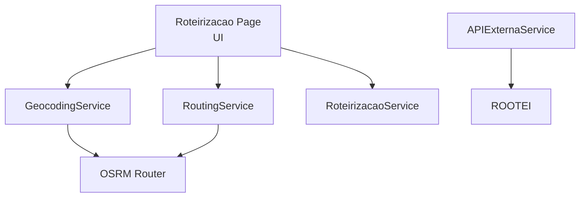
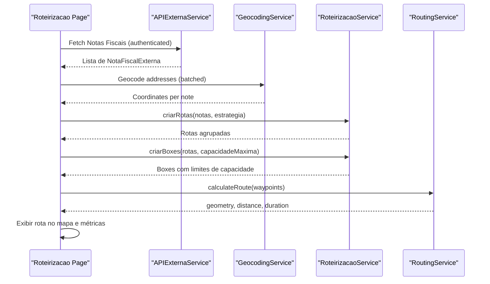
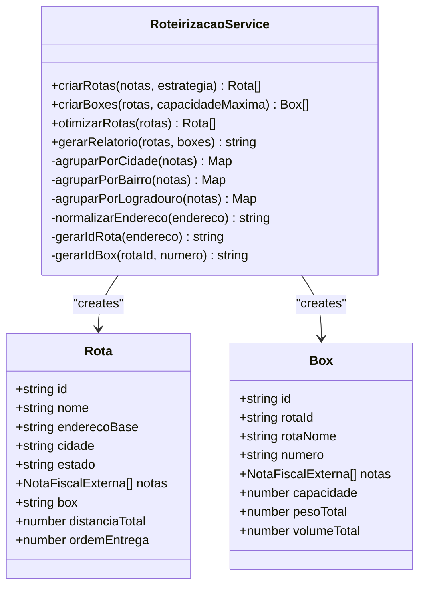
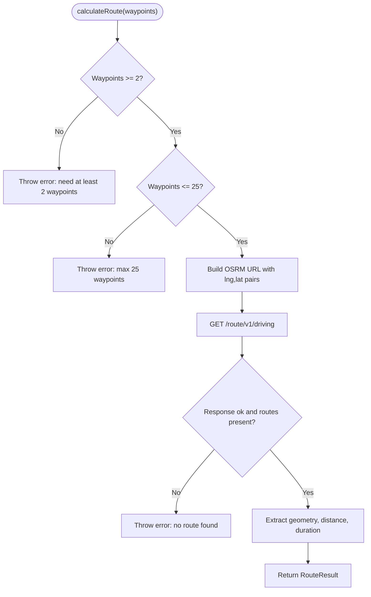
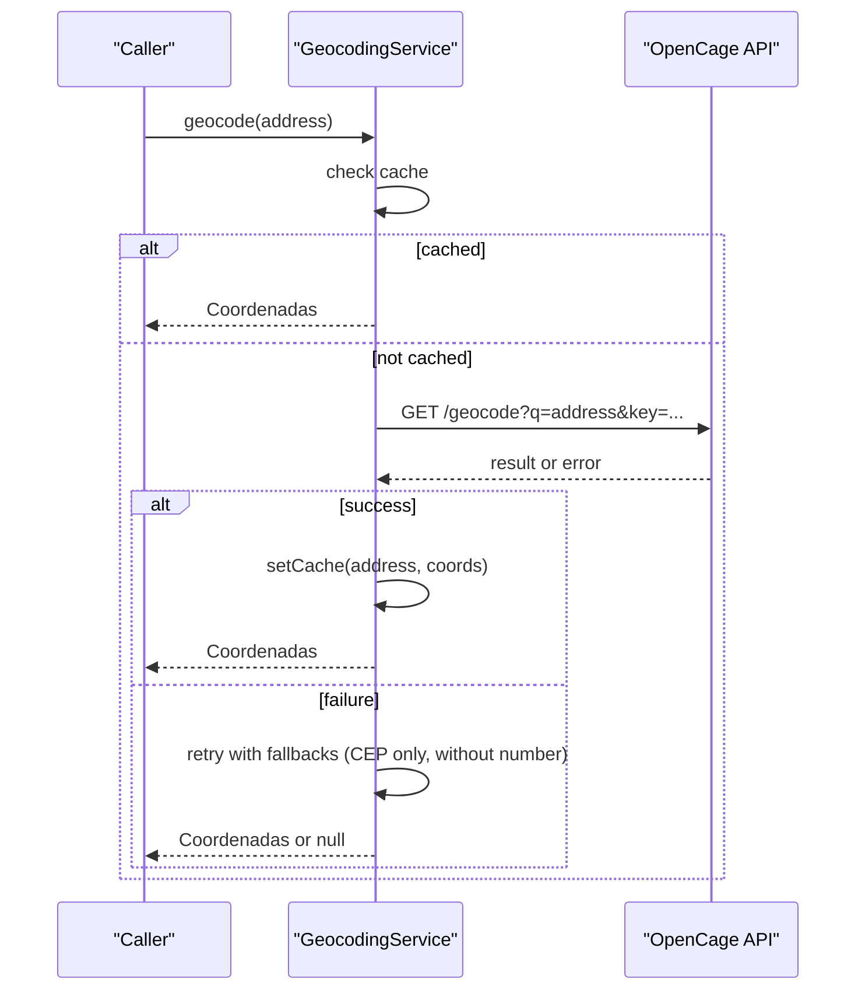
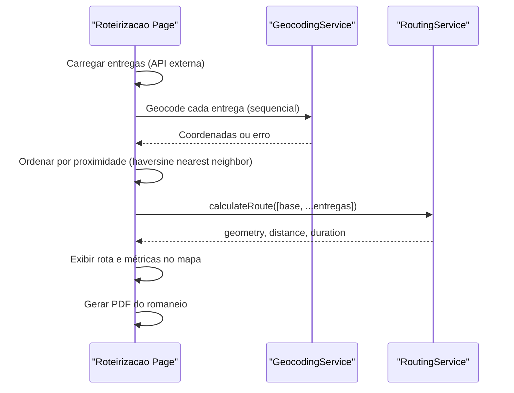
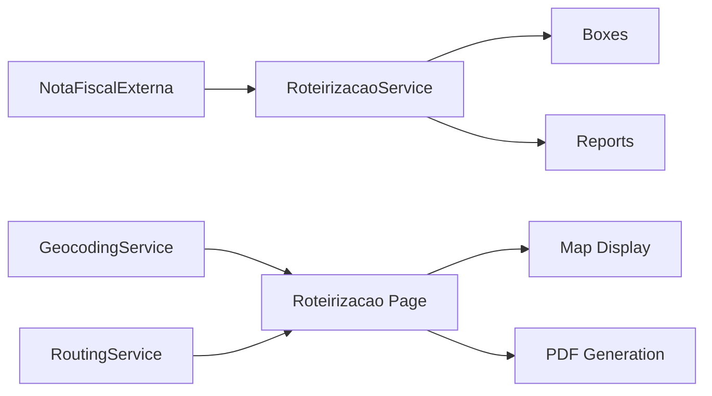

# Route Optimization Engine

<cite>
**Referenced Files in This Document**
- [roteirizacao.ts](file://services/roteirizacao.ts)
- [routing.ts](file://services/routing.ts)
- [geocoding.ts](file://services/geocoding.ts)
- [api-externa.ts](file://services/api-externa.ts)
- [roteirizacao.tsx](file://pages/roteirizacao.tsx)
</cite>

## Table of Contents
1. [Introduction](#introduction)
2. [Project Structure](#project-structure)
3. [Core Components](#core-components)
4. [Architecture Overview](#architecture-overview)
5. [Detailed Component Analysis](#detailed-component-analysis)
6. [Dependency Analysis](#dependency-analysis)
7. [Performance Considerations](#performance-considerations)
8. [Troubleshooting Guide](#troubleshooting-guide)
9. [Conclusion](#conclusion)

## Introduction
This document explains the route optimization engine for delivery planning and optimization. It focuses on the RoteirizacaoService class, strategies for grouping deliveries by city, neighborhood, or street address, route creation algorithms, box allocation logic for capacity management, and route optimization techniques. It also documents NotaFiscalExterna integration, distance calculations, and performance considerations for large delivery datasets.

## Project Structure
The routing system is implemented across services and a frontend page:
- Service layer:
  - Grouping, boxes, and reporting: RoteirizacaoService
  - Routing and distance/duration via OSRM: RoutingService
  - Geocoding addresses to coordinates: GeocodingService
  - External API client for Nota Fiscal data: APIExternaService (NotaFiscalExterna model)
- Frontend orchestration:
  - Interactive route planning UI that geocodes, orders, and calculates routes

**Diagram sources**
- [roteirizacao.tsx:792-1006](file://pages/roteirizacao.tsx#L792-L1006)
- [geocoding.ts:26-128](file://services/geocoding.ts#L26-L128)
- [routing.ts:11-50](file://services/routing.ts#L11-L50)
- [roteirizacao.ts:111-226](file://services/roteirizacao.ts#L111-L226)
- [api-externa.ts:21-42](file://services/api-externa.ts#L21-L42)

**Section sources**
- [roteirizacao.ts:1-231](file://services/roteirizacao.ts#L1-L231)
- [routing.ts:1-68](file://services/routing.ts#L1-L68)
- [geocoding.ts:1-132](file://services/geocoding.ts#L1-L132)
- [api-externa.ts:1-800](file://services/api-externa.ts#L1-L800)
- [roteirizacao.tsx:1-1200](file://pages/roteirizacao.tsx#L1-L1200)

## Core Components
- RoteirizacaoService: Groups deliveries into routes using strategies (city, neighborhood, street), creates boxes with capacity constraints, optimizes order within routes, and generates reports.
- RoutingService: Calculates real driving routes, distances, and durations using OSRM; formats metrics.
- GeocodingService: Converts addresses to coordinates with caching and retry logic; supports batch geocoding respecting rate limits.
- APIExternaService: Provides NotaFiscalExterna data retrieval and authentication; used as the data source for route planning.

Key responsibilities:
- Grouping strategies: city, neighborhood, street address normalization
- Box allocation: split notes per route into boxes with configurable capacity
- Route optimization: sort notes by normalized address; optional proximity-based ordering in UI
- Distance calculation: OSRM-based routing with geometry, distance, duration
- Reporting: summary text report including totals and per-box details

**Section sources**
- [roteirizacao.ts:35-226](file://services/roteirizacao.ts#L35-L226)
- [routing.ts:8-68](file://services/routing.ts#L8-L68)
- [geocoding.ts:9-132](file://services/geocoding.ts#L9-L132)
- [api-externa.ts:21-42](file://services/api-externa.ts#L21-L42)

## Architecture Overview
The end-to-end flow integrates external data, geocoding, grouping, capacity-aware boxing, and routing:

**Diagram sources**
- [api-externa.ts:569-693](file://services/api-externa.ts#L569-L693)
- [geocoding.ts:26-128](file://services/geocoding.ts#L26-L128)
- [roteirizacao.ts:111-181](file://services/roteirizacao.ts#L111-L181)
- [routing.ts:11-50](file://services/routing.ts#L11-L50)
- [roteirizacao.tsx:792-1006](file://pages/roteirizacao.tsx#L792-L1006)

## Detailed Component Analysis

### RoteirizacaoService
Responsibilities:
- Grouping strategies:
  - By city: groups notes by cliente.cidade
  - By neighborhood: groups notes by cliente.bairro
  - By street address: normalizes full address and groups by first token (logradouro)
- Route creation:
  - Generates unique route IDs based on normalized group key and timestamp
  - Assigns base address, city/state from first note in group
  - Orders routes sequentially
- Box allocation:
  - Splits notes per route into boxes with configurable maximum capacity
  - Computes total weight and volume per box
- Route optimization:
  - Sorts notes within each route by normalized address for better locality
- Reporting:
  - Produces a text report summarizing routes, boxes, totals, and per-box stats

**Diagram sources**
- [roteirizacao.ts:35-226](file://services/roteirizacao.ts#L35-L226)

Implementation highlights:
- Address normalization removes accents and special characters to improve grouping stability
- Grouping uses Maps keyed by city, neighborhood, or normalized street token
- Box capacity is enforced by slicing arrays into chunks of size capacidadeMaxima
- Report aggregates counts and per-box metrics

Usage examples:
- Create routes grouped by city:
  - Input: array of NotaFiscalExterna
  - Call: criarRotas(notas, 'cidade')
  - Output: Rota[] with grouped notes
- Create boxes with capacity limit:
  - Input: Rota[], capacidadeMaxima (e.g., 10)
  - Call: criarBoxes(rotas, 10)
  - Output: Box[] with pesoTotal/volumeTotal per box
- Optimize route order:
  - Input: Rota[]
  - Call: otimizarRotas(rotas)
  - Output: Rota[] with notes sorted by normalized address
- Generate report:
  - Input: Rota[], Box[]
  - Call: gerarRelatorio(rotas, boxes)
  - Output: formatted string with totals and per-box details

**Section sources**
- [roteirizacao.ts:62-109](file://services/roteirizacao.ts#L62-L109)
- [roteirizacao.ts:111-149](file://services/roteirizacao.ts#L111-L149)
- [roteirizacao.ts:151-181](file://services/roteirizacao.ts#L151-L181)
- [roteirizacao.ts:183-201](file://services/roteirizacao.ts#L183-L201)
- [roteirizacao.ts:203-226](file://services/roteirizacao.ts#L203-L226)

### RoutingService
Responsibilities:
- Calculate driving routes via OSRM with waypoints
- Enforce waypoint limits (max 25 per request)
- Return geometry, distance (meters), and duration (seconds)
- Format distance and duration for display

**Diagram sources**
- [routing.ts:11-50](file://services/routing.ts#L11-L50)

Notes:
- Coordinates are converted to OSRM format (lng,lat)
- Errors include HTTP status and messages
- Formatting helpers convert meters to km/m and seconds to minutes/hours

**Section sources**
- [routing.ts:1-68](file://services/routing.ts#L1-L68)

### GeocodingService
Responsibilities:
- Convert addresses to coordinates using OpenCage
- Cache results in localStorage to reduce API calls
- Retry on rate limits and failures
- Batch geocoding with sequential requests to respect rate limits

**Diagram sources**
- [geocoding.ts:26-128](file://services/geocoding.ts#L26-L128)

Performance considerations:
- Sequential processing avoids rate limit errors
- LocalStorage cache reduces repeated lookups
- Fallback strategies improve success rate for partial addresses

**Section sources**
- [geocoding.ts:1-132](file://services/geocoding.ts#L1-L132)

### NotaFiscalExterna Integration (APIExternaService)
Responsibilities:
- Authenticate with external API using token management and retry blocking
- Retrieve NotaFiscalExterna records by various identifiers (numero/serie, chave, identificacao-nfe)
- List notes with filters and pagination
- Handle timeouts and error responses gracefully

Key aspects:
- Token lifecycle: login, expiration handling, automatic re-authentication attempts
- Robust search methods with fallback endpoints
- Consistent error logging and safe returns (null or empty arrays)

Data model:
- NotaFiscalExterna includes customer info (endereco, bairro, cidade, estado, cep), volumes, peso, observacoes

**Section sources**
- [api-externa.ts:21-42](file://services/api-externa.ts#L21-L42)
- [api-externa.ts:117-248](file://services/api-externa.ts#L117-L248)
- [api-externa.ts:250-347](file://services/api-externa.ts#L250-L347)
- [api-externa.ts:569-693](file://services/api-externa.ts#L569-L693)

### Frontend Orchestration (Roteirizacao Page)
Responsibilities:
- Load deliveries from external APIs
- Enrich missing address fields via CEP lookup
- Geocode selected deliveries and build markers
- Order deliveries manually or by proximity (nearest neighbor heuristic)
- Calculate routes and return metrics (distance, duration)
- Generate PDF reports with route details

**Diagram sources**
- [roteirizacao.tsx:756-790](file://pages/roteirizacao.tsx#L756-L790)
- [roteirizacao.tsx:792-1006](file://pages/roteirizacao.tsx#L792-L1006)

Optimization technique:
- Proximity mode uses a nearest neighbor algorithm based on haversine distance to approximate optimal sequence when manual ordering is not used

**Section sources**
- [roteirizacao.tsx:756-790](file://pages/roteirizacao.tsx#L756-L790)
- [roteirizacao.tsx:792-1006](file://pages/roteirizacao.tsx#L792-L1006)

## Dependency Analysis
- RoteirizacaoService depends on NotaFiscalExterna structure for grouping and boxing
- RoutingService depends on OSRM endpoint; enforces waypoint limits
- GeocodingService depends on OpenCage API; caches results locally
- Frontend orchestrates all services and handles user interactions and PDF generation

**Diagram sources**
- [api-externa.ts:21-42](file://services/api-externa.ts#L21-L42)
- [roteirizacao.ts:111-226](file://services/roteirizacao.ts#L111-L226)
- [geocoding.ts:26-128](file://services/geocoding.ts#L26-L128)
- [routing.ts:11-50](file://services/routing.ts#L11-L50)
- [roteirizacao.tsx:792-1006](file://pages/roteirizacao.tsx#L792-L1006)

**Section sources**
- [roteirizacao.ts:111-226](file://services/roteirizacao.ts#L111-L226)
- [routing.ts:11-50](file://services/routing.ts#L11-L50)
- [geocoding.ts:26-128](file://services/geocoding.ts#L26-L128)
- [api-externa.ts:21-42](file://services/api-externa.ts#L21-L42)
- [roteirizacao.tsx:792-1006](file://pages/roteirizacao.tsx#L792-L1006)

## Performance Considerations
- Large datasets:
  - Use batching for geocoding; the service processes sequentially to avoid rate limits
  - Limit OSRM waypoints to 25 per request; split larger routes into smaller segments
- Caching:
  - Geocoding results are cached in localStorage to reduce API usage
- Timeouts:
  - External API calls have timeouts; handle retries and block rapid re-login attempts
- Sorting complexity:
  - Grouping uses Map operations O(n); sorting within routes is O(n log n)
  - Nearest neighbor heuristic is O(n^2) for ordering; acceptable for moderate sizes but consider splitting very large sets

Recommendations:
- For very large delivery sets, segment by city/neighborhood before calling OSRM
- Pre-filter notes to exclude those without valid addresses
- Monitor OSRM response times and adjust batch sizes accordingly

[No sources needed since this section provides general guidance]

## Troubleshooting Guide
Common issues and resolutions:
- Authentication failures:
  - Ensure credentials are correct; token refresh is handled automatically
  - If blocked due to repeated failures, wait for the retry window
- Geocoding failures:
  - Verify address completeness; use CEP enrichment to fill missing fields
  - Rate limit errors trigger retries; if persistent, reduce batch size
- Routing errors:
  - Too many waypoints (>25): split routes into smaller groups
  - No route found: check coordinate validity and OSRM availability
- Capacity constraints:
  - Adjust capacidadeMaxima in criarBoxes to fit vehicle constraints
  - Review pesoTotal/volumeTotal per box to ensure compliance

Operational tips:
- Use the UI’s proximity mode to quickly generate sequences for small batches
- Generate PDF reports after calculating routes to capture metrics and sequences
- Log and inspect errors returned by external APIs for debugging

**Section sources**
- [api-externa.ts:117-248](file://services/api-externa.ts#L117-L248)
- [geocoding.ts:96-110](file://services/geocoding.ts#L96-L110)
- [routing.ts:11-50](file://services/routing.ts#L11-L50)
- [roteirizacao.tsx:979-1019](file://pages/roteirizacao.tsx#L979-L1019)

## Conclusion
The route optimization engine combines robust grouping strategies, capacity-aware box allocation, and OSRM-based routing to deliver efficient delivery planning. The RoteirizacaoService provides flexible grouping and reporting, while the frontend offers interactive control over route sequencing and visualization. Integrating NotaFiscalExterna ensures accurate delivery data, and geocoding enables precise mapping and routing. For large datasets, segmentation and caching are essential to maintain performance and reliability.