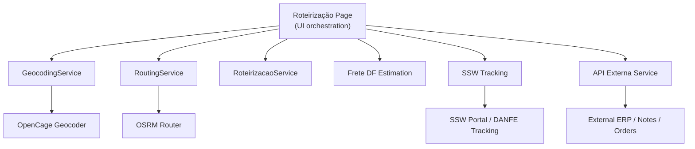
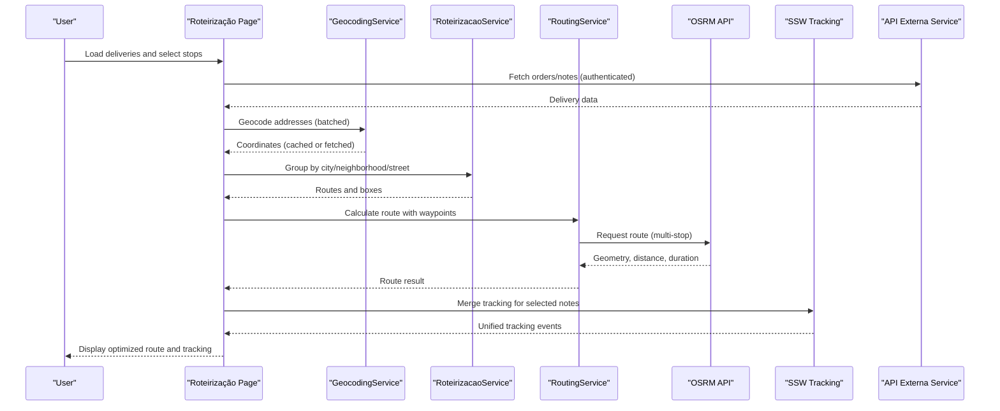
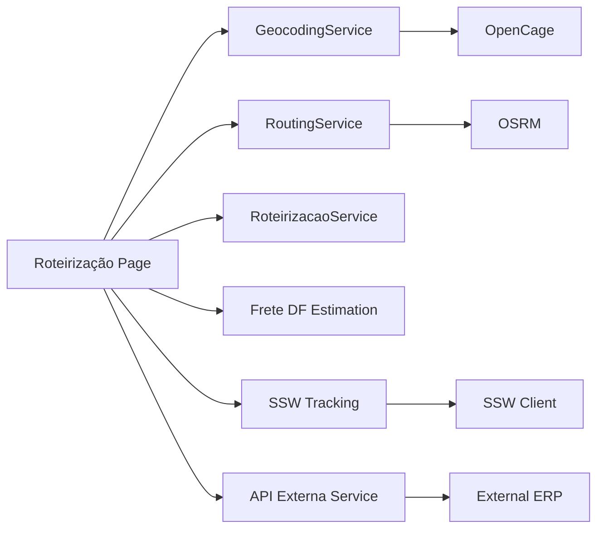

# Routing & Logistics Services

<cite>
**Referenced Files in This Document**
- [services/routing.ts](file://services/routing.ts)
- [services/geocoding.ts](file://services/geocoding.ts)
- [services/roteirizacao.ts](file://services/roteirizacao.ts)
- [lib/freteDf.ts](file://lib/freteDf.ts)
- [services/sswClient.ts](file://services/sswClient.ts)
- [services/sswTracking.ts](file://services/sswTracking.ts)
- [services/api-externa.ts](file://services/api-externa.ts)
- [pages/roteirizacao.tsx](file://pages/roteirizacao.tsx)
- [lib/logistica-snapshot.ts](file://lib/logistica-snapshot.ts)
</cite>

## Table of Contents
1. [Introduction](#introduction)
2. [Project Structure](#project-structure)
3. [Core Components](#core-components)
4. [Architecture Overview](#architecture-overview)
5. [Detailed Component Analysis](#detailed-component-analysis)
6. [Dependency Analysis](#dependency-analysis)
7. [Performance Considerations](#performance-considerations)
8. [Troubleshooting Guide](#troubleshooting-guide)
9. [Conclusion](#conclusion)
10. [Appendices](#appendices)

## Introduction
This document explains the routing and logistics services implemented in the project. It covers route optimization, geocoding integration, delivery planning, freight calculation, mapping service integrations, distance calculations, traffic considerations, multi-stop route planning, configuration for different logistics providers, real-time tracking integration, and performance optimization for large delivery datasets. It also provides examples of calculating optimal routes, handling delivery constraints, integrating with external logistics APIs, and providing drivers with navigation instructions.

## Project Structure
The routing and logistics capabilities are implemented across several modules:
- Routing service for OSRM-based route calculation and formatting utilities
- Geocoding service using OpenCage with caching and fallback strategies
- Route grouping and box packing for delivery planning
- Freight estimation rules for a specific region
- External logistics client integrations (SSW portal and tracking)
- A comprehensive UI page orchestrating geocoding, map markers, manual and proximity-based ordering, and route generation
- Snapshot synchronization to consolidate order statuses from external systems

**Diagram sources**
- [pages/roteirizacao.tsx:161-800](file://pages/roteirizacao.tsx#L161-L800)
- [services/geocoding.ts:9-132](file://services/geocoding.ts#L9-L132)
- [services/routing.ts:8-68](file://services/routing.ts#L8-L68)
- [services/roteirizacao.ts:35-231](file://services/roteirizacao.ts#L35-L231)
- [lib/freteDf.ts:140-197](file://lib/freteDf.ts#L140-L197)
- [services/sswTracking.ts:393-479](file://services/sswTracking.ts#L393-L479)
- [services/sswClient.ts:50-222](file://services/sswClient.ts#L50-L222)
- [services/api-externa.ts:117-800](file://services/api-externa.ts#L117-L800)

**Section sources**
- [pages/roteirizacao.tsx:161-800](file://pages/roteirizacao.tsx#L161-L800)
- [services/geocoding.ts:9-132](file://services/geocoding.ts#L9-L132)
- [services/routing.ts:8-68](file://services/routing.ts#L8-L68)
- [services/roteirizacao.ts:35-231](file://services/roteirizacao.ts#L35-L231)
- [lib/freteDf.ts:140-197](file://lib/freteDf.ts#L140-L197)
- [services/sswTracking.ts:393-479](file://services/sswTracking.ts#L393-L479)
- [services/sswClient.ts:50-222](file://services/sswClient.ts#L50-L222)
- [services/api-externa.ts:117-800](file://services/api-externa.ts#L117-L800)

## Core Components
- RoutingService: Calculates multi-stop routes via OSRM, returns geometry, distance, duration, and provides formatting helpers.
- GeocodingService: Converts addresses to coordinates using OpenCage, caches results locally, normalizes inputs, and retries on rate limits or failures.
- RoteirizacaoService: Groups deliveries by city, neighborhood, or street; creates boxes with capacity constraints; sorts orders for optimized sequencing.
- Frete DF Estimation: Estimates freight costs based on region aliases and rules for a specific state district.
- SSW Client and Tracking: Integrates with SSW portal and DANFE tracking, merges events, normalizes occurrences, and detects delivery status.
- API Externa Service: Authenticates and queries external ERP endpoints for notes, clients, orders, and logistics details.
- Roteirização Page: Orchestrates data loading, geocoding, map interactions, manual/proximity ordering, and route generation.

**Section sources**
- [services/routing.ts:8-68](file://services/routing.ts#L8-L68)
- [services/geocoding.ts:9-132](file://services/geocoding.ts#L9-L132)
- [services/roteirizacao.ts:35-231](file://services/roteirizacao.ts#L35-L231)
- [lib/freteDf.ts:140-197](file://lib/freteDf.ts#L140-L197)
- [services/sswClient.ts:50-222](file://services/sswClient.ts#L50-L222)
- [services/sswTracking.ts:393-479](file://services/sswTracking.ts#L393-L479)
- [services/api-externa.ts:117-800](file://services/api-externa.ts#L117-L800)
- [pages/roteirizacao.tsx:161-800](file://pages/roteirizacao.tsx#L161-L800)

## Architecture Overview
The system integrates multiple external services to support end-to-end logistics operations:
- Data ingestion: External ERP via API Externa Service provides orders, notes, and logistics context.
- Address resolution: GeocodingService resolves addresses to coordinates with caching and fallbacks.
- Route planning: RoteirizacaoService groups and sequences deliveries; RoutingService computes actual routes and metrics via OSRM.
- Freight estimation: Region-based rules estimate freight costs for local deliveries.
- Tracking: SSW Client and Tracking merge portal and DANFE tracking to provide unified delivery status and event history.
- UI orchestration: The Roteirização Page ties these components together for interactive planning and visualization.

**Diagram sources**
- [pages/roteirizacao.tsx:479-800](file://pages/roteirizacao.tsx#L479-L800)
- [services/geocoding.ts:26-128](file://services/geocoding.ts#L26-L128)
- [services/roteirizacao.ts:111-201](file://services/roteirizacao.ts#L111-L201)
- [services/routing.ts:11-49](file://services/routing.ts#L11-L49)
- [services/sswTracking.ts:393-479](file://services/sswTracking.ts#L393-L479)
- [services/api-externa.ts:695-749](file://services/api-externa.ts#L695-L749)

## Detailed Component Analysis

### RoutingService
Responsibilities:
- Validate waypoint count and format coordinates for OSRM
- Call OSRM route endpoint and parse response
- Return geometry, distance, and duration
- Provide formatting helpers for distance and duration

Key behaviors:
- Enforces minimum and maximum waypoint limits
- Throws errors for invalid requests or no routes found
- Uses fetch to call OSRM and handles non-OK responses

Complexity:
- Time complexity is O(n) for coordinate formatting where n is number of waypoints
- Network latency depends on OSRM availability

Optimization opportunities:
- Cache recent routes by waypoint signature to reduce repeated calls
- Implement retry with exponential backoff for transient network errors

Error handling:
- Validates input parameters
- Handles HTTP errors and empty route results

**Section sources**
- [services/routing.ts:8-68](file://services/routing.ts#L8-L68)

### GeocodingService
Responsibilities:
- Normalize addresses and cache results in localStorage
- Query OpenCage geocoder with regional bounds and language settings
- Retry on rate limits and handle fallbacks (CEP-only, removing numbers/lotes)
- Batch geocoding with sequential processing to respect API limits

Key behaviors:
- Normalizes Brasília spelling and CEP formats
- Applies country code and bounds to improve accuracy
- Implements retry logic for 429 responses and general failures

Complexity:
- Sequential batch processing ensures compliance with API rate limits
- Local cache reduces repeated requests

Optimization opportunities:
- Extend TTL for cached coordinates
- Add concurrency control with token bucket for high-volume batches

Error handling:
- Graceful degradation when address parsing fails
- Retries up to configured limits before returning null

**Section sources**
- [services/geocoding.ts:9-132](file://services/geocoding.ts#L9-L132)

### RoteirizacaoService
Responsibilities:
- Group deliveries by city, neighborhood, or street
- Create boxes with capacity constraints and aggregate weight/volume
- Sort deliveries within each route for improved sequencing
- Generate summary reports

Key behaviors:
- Generates stable IDs for routes and boxes
- Normalizes addresses for consistent grouping
- Computes totals per box for operational planning

Complexity:
- Grouping is O(n) over deliveries
- Sorting is O(k log k) per route where k is number of deliveries in that route

Optimization opportunities:
- Integrate geographic clustering (e.g., Voronoi or k-means) for better grouping
- Use heuristic TSP solvers for intra-route sequencing

Error handling:
- Handles missing fields gracefully with defaults

**Section sources**
- [services/roteirizacao.ts:35-231](file://services/roteirizacao.ts#L35-L231)

### Frete DF Estimation
Responsibilities:
- Estimate freight cost based on region aliases for a specific state district
- Normalize inputs and match against predefined rules
- Provide source metadata indicating public reference vs operational inference

Key behaviors:
- Supports multiple aliases per region
- Returns null value for non-local regions with descriptive observation
- Includes source URL and observation date for traceability

Complexity:
- Matching is O(m) per rule set where m is number of aliases

Optimization opportunities:
- Precompute normalized alias sets for faster matching
- Allow dynamic rule updates without redeployment

Error handling:
- Fallback to conservative estimate for unmapped regions

**Section sources**
- [lib/freteDf.ts:140-197](file://lib/freteDf.ts#L140-L197)

### SSW Client and Tracking
Responsibilities:
- Authenticate with SSW portal and manage token lifecycle
- Query tracking via DANFE and portal endpoints
- Merge tracking events and normalize occurrences
- Detect delivery status and extract photo/receiver info

Key behaviors:
- Token caching with validity parsing and forced refresh
- Robust error handling for non-JSON responses
- Merges portal and DANFE tracking, marking source

Complexity:
- Event extraction uses depth-limited DFS to avoid deep recursion
- Sorting events by effective time for chronological display

Optimization opportunities:
- Parallelize independent tracking queries when safe
- Deduplicate events by timestamp and type

Error handling:
- Handles malformed JSON and HTTP errors
- Provides clear messages for missing documents or credentials

**Section sources**
- [services/sswClient.ts:50-222](file://services/sswClient.ts#L50-L222)
- [services/sswTracking.ts:393-479](file://services/sswTracking.ts#L393-L479)

### API Externa Service
Responsibilities:
- Authenticate with external ERP and maintain token state
- Query notes, clients, orders, and logistics details
- Handle timeouts and retries for robustness

Key behaviors:
- Interceptors attach Authorization headers and handle 401 flows
- Flexible parameter building for various endpoints
- Timeout configurations tuned for dashboard and login flows

Complexity:
- Concurrency controlled by caller; service focuses on auth and request hygiene

Optimization opportunities:
- Implement request deduplication for identical queries
- Add circuit breaker for failing endpoints

Error handling:
- Captures and logs detailed error contexts
- Blocks rapid re-login attempts after failures

**Section sources**
- [services/api-externa.ts:117-800](file://services/api-externa.ts#L117-L800)

### Roteirização Page
Responsibilities:
- Load deliveries from external APIs
- Enrich data via CEP lookup
- Geocode addresses and plot markers on map
- Support manual and proximity-based ordering
- Generate routes and display metrics

Key behaviors:
- Loads closed delivery orders with filters
- Enhances missing neighborhood/city/state via CEP service
- Uses Haversine distance for nearest-neighbor ordering
- Updates waypoints and recalculates routes on marker moves

Complexity:
- Loading and enrichment scale with number of deliveries
- Proximity sorting is O(n^2) naive nearest neighbor

Optimization opportunities:
- Use spatial indexing for nearest neighbor search
- Paginate and chunk API calls for large datasets

Error handling:
- Shows snackbar notifications for user feedback
- Handles API failures gracefully

**Section sources**
- [pages/roteirizacao.tsx:479-800](file://pages/roteirizacao.tsx#L479-L800)

## Dependency Analysis
The following diagram shows how components depend on each other and external services:

**Diagram sources**
- [pages/roteirizacao.tsx:161-800](file://pages/roteirizacao.tsx#L161-L800)
- [services/geocoding.ts:9-132](file://services/geocoding.ts#L9-L132)
- [services/routing.ts:8-68](file://services/routing.ts#L8-L68)
- [services/roteirizacao.ts:35-231](file://services/roteirizacao.ts#L35-L231)
- [lib/freteDf.ts:140-197](file://lib/freteDf.ts#L140-L197)
- [services/sswTracking.ts:393-479](file://services/sswTracking.ts#L393-L479)
- [services/sswClient.ts:50-222](file://services/sswClient.ts#L50-L222)
- [services/api-externa.ts:117-800](file://services/api-externa.ts#L117-L800)

**Section sources**
- [pages/roteirizacao.tsx:161-800](file://pages/roteirizacao.tsx#L161-L800)
- [services/geocoding.ts:9-132](file://services/geocoding.ts#L9-L132)
- [services/routing.ts:8-68](file://services/routing.ts#L8-L68)
- [services/roteirizacao.ts:35-231](file://services/roteirizacao.ts#L35-L231)
- [lib/freteDf.ts:140-197](file://lib/freteDf.ts#L140-L197)
- [services/sswTracking.ts:393-479](file://services/sswTracking.ts#L393-L479)
- [services/sswClient.ts:50-222](file://services/sswClient.ts#L50-L222)
- [services/api-externa.ts:117-800](file://services/api-externa.ts#L117-L800)

## Performance Considerations
- Geocoding batching: Process addresses sequentially with delays to respect API limits; use local cache to minimize calls.
- Route calculation: Limit waypoints per OSRM request; split large routes into smaller segments if needed.
- Proximity sorting: For large datasets, replace naive nearest neighbor with spatial indexes or clustering algorithms.
- External API timeouts: Configure appropriate timeouts and implement retries with backoff for resilience.
- Caching: Extend caching for tokens, geocoded coordinates, and frequently accessed logistics snapshots.
- Concurrency: Use bounded concurrency for parallel tasks (e.g., snapshot sync uses worker pools).

[No sources needed since this section provides general guidance]

## Troubleshooting Guide
Common issues and resolutions:
- Geocoding failures: Check API key configuration, address normalization, and retry behavior; verify rate limit handling.
- No route found: Ensure at least two waypoints and within OSRM limits; validate coordinate format and network connectivity.
- SSW tracking errors: Verify credentials and token validity; handle non-JSON responses and malformed payloads.
- External ERP authentication: Confirm username/password and token expiration; check blocked login windows after failures.
- Large dataset performance: Reduce batch sizes, enable pagination, and leverage caching mechanisms.

**Section sources**
- [services/geocoding.ts:96-110](file://services/geocoding.ts#L96-L110)
- [services/routing.ts:11-49](file://services/routing.ts#L11-L49)
- [services/sswClient.ts:77-100](file://services/sswClient.ts#L77-L100)
- [services/api-externa.ts:167-231](file://services/api-externa.ts#L167-L231)

## Conclusion
The routing and logistics services provide a robust foundation for delivery planning, route optimization, freight estimation, and real-time tracking. By integrating geocoding, OSRM routing, external ERP data, and SSW tracking, the system supports efficient multi-stop route planning and driver navigation. Performance optimizations such as caching, batching, and concurrency controls ensure scalability for large delivery datasets. Future enhancements can include advanced clustering, TSP solvers, and richer traffic-aware routing.

[No sources needed since this section summarizes without analyzing specific files]

## Appendices

### Examples

#### Calculating an Optimal Route
- Select deliveries on the Roteirização Page
- Geocode addresses to obtain coordinates
- Choose manual or proximity-based ordering
- Generate route to compute geometry, distance, and duration via OSRM

**Section sources**
- [pages/roteirizacao.tsx:792-800](file://pages/roteirizacao.tsx#L792-L800)
- [services/routing.ts:11-49](file://services/routing.ts#L11-L49)

#### Handling Delivery Constraints
- Group deliveries by city, neighborhood, or street
- Create boxes with capacity constraints and aggregate weight/volume
- Sort deliveries within each route for improved sequencing

**Section sources**
- [services/roteirizacao.ts:111-201](file://services/roteirizacao.ts#L111-L201)

#### Integrating with External Logistics APIs
- Authenticate with external ERP via API Externa Service
- Fetch orders, notes, and logistics details
- Use SSW Client to query tracking and merge events

**Section sources**
- [services/api-externa.ts:167-231](file://services/api-externa.ts#L167-L231)
- [services/sswClient.ts:50-222](file://services/sswClient.ts#L50-L222)
- [services/sswTracking.ts:393-479](file://services/sswTracking.ts#L393-L479)

#### Providing Drivers with Navigation Instructions
- Use OSRM route geometry to render turn-by-turn directions
- Format distance and duration for driver readability
- Update waypoints dynamically as drivers adjust stops

**Section sources**
- [services/routing.ts:42-68](file://services/routing.ts#L42-L68)
- [pages/roteirizacao.tsx:727-754](file://pages/roteirizacao.tsx#L727-L754)