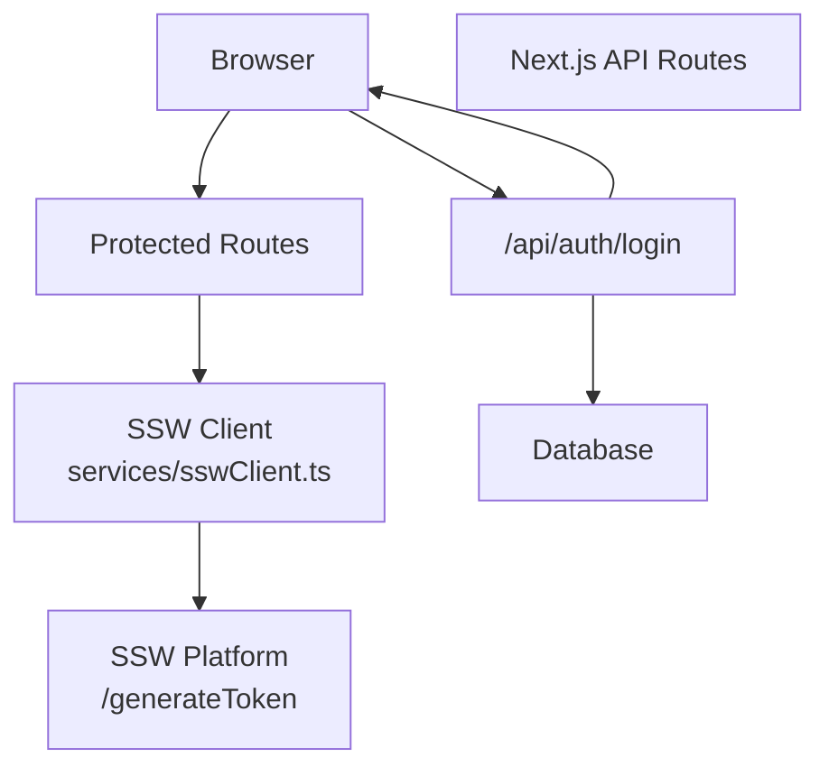
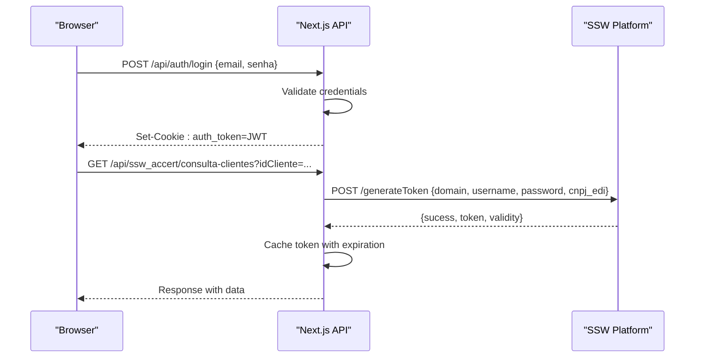
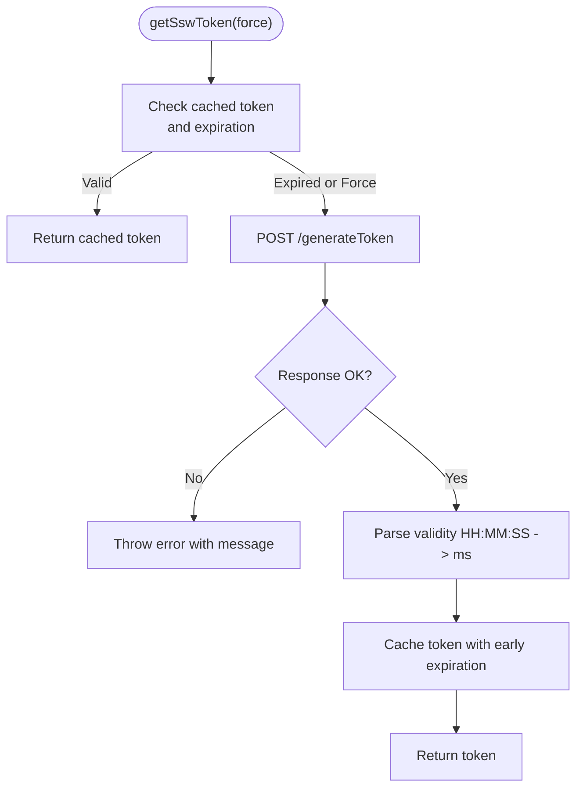
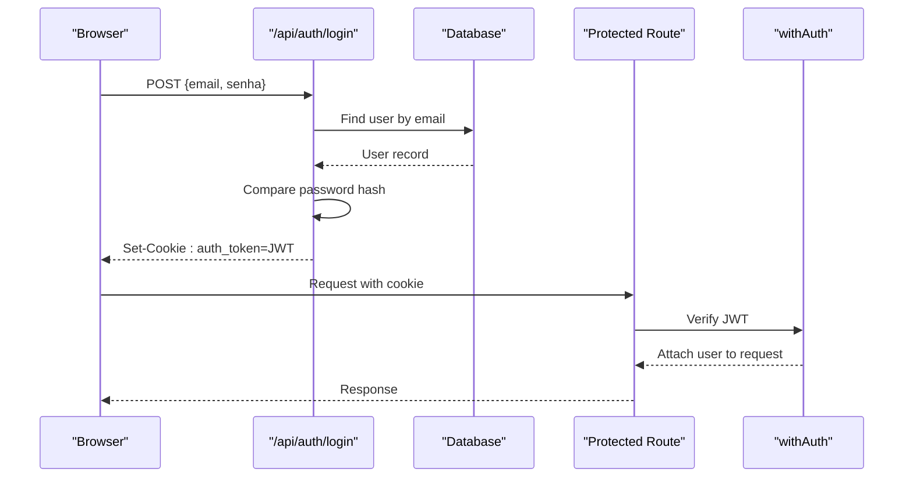
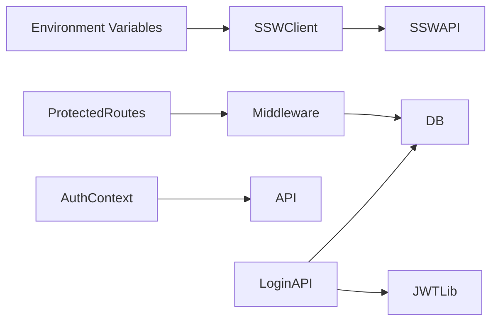

# Authentication & Token Management

<cite>
**Referenced Files in This Document**
- [sswClient.ts](file://services/sswClient.ts)
- [login.ts](file://pages/api/auth/login.ts)
- [AuthContext.tsx](file://contexts/AuthContext.tsx)
- [auth.ts](file://lib/auth.ts)
- [server-auth.ts](file://lib/server-auth.ts)
- [auth.ts (middleware)](file://middleware/auth.ts)
- [consulta-clientes.ts](file://pages/api/ssw_accert/consulta-clientes.ts)
- [env.example.txt](file://env.example.txt)
</cite>

## Table of Contents
1. [Introduction](#introduction)
2. [Project Structure](#project-structure)
3. [Core Components](#core-components)
4. [Architecture Overview](#architecture-overview)
5. [Detailed Component Analysis](#detailed-component-analysis)
6. [Dependency Analysis](#dependency-analysis)
7. [Performance Considerations](#performance-considerations)
8. [Troubleshooting Guide](#troubleshooting-guide)
9. [Conclusion](#conclusion)
10. [Appendices](#appendices)

## Introduction
This document explains the SSW ERP authentication system used by the application, focusing on:
- Token-based authentication flow for SSW ACCERT integration
- Credential validation and token generation via the /generateToken endpoint
- Automatic token caching with expiration handling
- Configuration requirements and environment setup
- Token lifecycle management including validity parsing from HH:MM:SS format, automatic refresh before expiration, and force refresh capabilities
- Error handling strategies for authentication failures, network issues, and invalid credentials
- Examples of implementing custom authentication flows and extending the token cache mechanism

The system integrates two layers:
- Application-level authentication using JWT stored in HTTP-only cookies for internal routes
- SSW ACCERT API authentication using a server-side token obtained from the SSW platform and cached to minimize network calls

## Project Structure
Key files involved in authentication and token management:
- services/sswClient.ts: SSW ACCERT client with token generation, caching, and API helpers
- pages/api/auth/login.ts: Internal login endpoint that issues JWTs and sets HTTP-only cookies
- contexts/AuthContext.tsx: Frontend auth state, cookie usage, and session checks
- lib/auth.ts: Utilities to extract tokens from cookies and verify JWTs on the server
- lib/server-auth.ts: Server helper to get authenticated user from cookies or Authorization header
- middleware/auth.ts: Route-level authorization middleware for protected endpoints
- pages/api/ssw_accert/consulta-clientes.ts: Example SSW ACCERT API route using the token client
- env.example.txt: Environment variables template

**Diagram sources**
- [login.ts:112-424](file://pages/api/auth/login.ts#L112-L424)
- [sswClient.ts:50-100](file://services/sswClient.ts#L50-L100)

**Section sources**
- [sswClient.ts:1-100](file://services/sswClient.ts#L1-L100)
- [login.ts:1-461](file://pages/api/auth/login.ts#L1-L461)
- [AuthContext.tsx:1-508](file://contexts/AuthContext.tsx#L1-L508)
- [auth.ts:1-121](file://lib/auth.ts#L1-L121)
- [server-auth.ts:1-41](file://lib/server-auth.ts#L1-L41)
- [auth.ts (middleware):1-91](file://middleware/auth.ts#L1-L91)
- [consulta-clientes.ts:1-32](file://pages/api/ssw_accert/consulta-clientes.ts#L1-L32)
- [env.example.txt:1-38](file://env.example.txt#L1-L38)

## Core Components
- SSW ACCERT Token Client:
  - Reads configuration from environment variables
  - Generates tokens via POST to /generateToken
  - Caches tokens with expiration derived from validity string
  - Provides helper methods for GET/POST requests with Authorization header
- Internal Authentication:
  - Login endpoint validates credentials, signs JWT, sets HTTP-only cookie
  - Auth context manages frontend state and redirects based on roles
  - Middleware verifies JWT for protected routes
- Server Helpers:
  - Extract tokens from cookies or Authorization header
  - Verify JWT and fetch user details

**Section sources**
- [sswClient.ts:1-100](file://services/sswClient.ts#L1-L100)
- [login.ts:112-424](file://pages/api/auth/login.ts#L112-L424)
- [AuthContext.tsx:228-338](file://contexts/AuthContext.tsx#L228-L338)
- [auth.ts:10-121](file://lib/auth.ts#L10-L121)
- [server-auth.ts:11-41](file://lib/server-auth.ts#L11-L41)
- [auth.ts (middleware):16-80](file://middleware/auth.ts#L16-L80)

## Architecture Overview
The authentication architecture consists of:
- Frontend uses HTTP-only cookies for session persistence and relies on the backend to validate sessions
- Backend issues JWTs upon successful login and stores them in secure cookies
- For SSW ACCERT integrations, the backend obtains a token from the SSW platform and caches it per process lifetime with expiration handling

**Diagram sources**
- [login.ts:112-424](file://pages/api/auth/login.ts#L112-L424)
- [sswClient.ts:50-100](file://services/sswClient.ts#L50-L100)
- [consulta-clientes.ts:8-30](file://pages/api/ssw_accert/consulta-clientes.ts#L8-L30)

## Detailed Component Analysis

### SSW ACCERT Token Generation and Caching
- Configuration:
  - Reads domain, username, password, and CNPJ EDI from environment variables
  - Validates required configuration before making requests
- Token Lifecycle:
  - Parses validity string in HH:MM:SS format into milliseconds
  - Caches token with an early expiration buffer to avoid edge cases near expiry
  - Supports force refresh to bypass cache when needed
- API Usage:
  - Adds Authorization header with token for subsequent requests
  - Handles non-OK responses and invalid JSON gracefully

**Diagram sources**
- [sswClient.ts:33-100](file://services/sswClient.ts#L33-L100)

**Section sources**
- [sswClient.ts:1-100](file://services/sswClient.ts#L1-L100)

### Internal Authentication Flow
- Login Endpoint:
  - Validates email format and password length
  - Compares hashed password using bcrypt
  - Signs JWT with user info and sets HTTP-only cookie
- Auth Context:
  - Manages login/logout state
  - Checks token expiration by calling /api/auth/me
  - Redirects users based on role after login
- Middleware:
  - Verifies Bearer token for protected routes
  - Enforces role-based access control

**Diagram sources**
- [login.ts:112-424](file://pages/api/auth/login.ts#L112-L424)
- [auth.ts (middleware):16-80](file://middleware/auth.ts#L16-L80)

**Section sources**
- [login.ts:112-424](file://pages/api/auth/login.ts#L112-L424)
- [AuthContext.tsx:228-338](file://contexts/AuthContext.tsx#L228-L338)
- [auth.ts (middleware):16-80](file://middleware/auth.ts#L16-L80)

### Server-Side Token Extraction and Verification
- Cookie Parsing:
  - Extracts token from multiple possible cookie names
  - Falls back to manual parsing if necessary
- JWT Verification:
  - Verifies token signature and payload structure
  - Logs detailed information for debugging
- Helper for Authenticated User:
  - Accepts token from cookie or Authorization header
  - Returns user details from database

**Section sources**
- [auth.ts:10-121](file://lib/auth.ts#L10-L121)
- [server-auth.ts:11-41](file://lib/server-auth.ts#L11-L41)

### SSW ACCERT API Integration Example
- Consulta Clientes Endpoint:
  - Validates client ID format
  - Calls SSW client to fetch client data
  - Handles errors and returns appropriate status codes

**Section sources**
- [consulta-clientes.ts:1-32](file://pages/api/ssw_accert/consulta-clientes.ts#L1-L32)

## Dependency Analysis
- SSW Client depends on environment variables for configuration
- Login endpoint depends on database and JWT signing library
- Auth context depends on API service and routing
- Middleware depends on JWT verification and database access

**Diagram sources**
- [sswClient.ts:1-100](file://services/sswClient.ts#L1-L100)
- [login.ts:112-424](file://pages/api/auth/login.ts#L112-L424)
- [AuthContext.tsx:228-338](file://contexts/AuthContext.tsx#L228-L338)
- [auth.ts (middleware):16-80](file://middleware/auth.ts#L16-L80)

**Section sources**
- [sswClient.ts:1-100](file://services/sswClient.ts#L1-L100)
- [login.ts:112-424](file://pages/api/auth/login.ts#L112-L424)
- [AuthContext.tsx:228-338](file://contexts/AuthContext.tsx#L228-L338)
- [auth.ts (middleware):16-80](file://middleware/auth.ts#L16-L80)

## Performance Considerations
- Token caching reduces network calls to SSW platform
- Early expiration buffer prevents race conditions near token expiry
- Process-level caching is suitable for single-process deployments; consider distributed caching for multi-instance environments
- Database queries are optimized with specific field selection in authentication flows

[No sources needed since this section provides general guidance]

## Troubleshooting Guide
Common issues and solutions:
- Missing environment variables: Ensure SSW_ACCERT_DOMAIN, SSW_ACCERT_USERNAME, SSW_ACCERT_PASSWORD, and SSW_ACCERT_CNPJ_EDI are configured
- Invalid credentials: Check email format and password strength during login
- Network issues: Handle non-OK responses and parse errors gracefully
- Token expiration: Implement retry logic with force refresh when tokens expire
- Cookie problems: Verify HTTP-only cookie settings and CORS configuration

**Section sources**
- [sswClient.ts:41-100](file://services/sswClient.ts#L41-L100)
- [login.ts:138-315](file://pages/api/auth/login.ts#L138-L315)
- [AuthContext.tsx:298-338](file://contexts/AuthContext.tsx#L298-L338)

## Conclusion
The SSW ERP authentication system provides a robust foundation for both internal application authentication and external SSW ACCERT integration. The token-based approach ensures secure communication with external APIs while maintaining user sessions through HTTP-only cookies. Proper configuration, error handling, and performance optimizations make the system reliable for production use.

[No sources needed since this section summarizes without analyzing specific files]

## Appendices

### Configuration Requirements
Required environment variables for SSW ACCERT integration:
- SSW_ACCERT_DOMAIN: SSW platform domain
- SSW_ACCERT_USERNAME: Username for SSW authentication
- SSW_ACCERT_PASSWORD: Password for SSW authentication
- SSW_ACCERT_CNPJ_EDI: Company identifier for SSW integration

Additional environment variables for application:
- JWT_SECRET: Secret key for JWT signing
- DATABASE_URL: Database connection string
- NEXT_PUBLIC_APP_URL: Application URL

**Section sources**
- [sswClient.ts:3-6](file://services/sswClient.ts#L3-L6)
- [env.example.txt:10-13](file://env.example.txt#L10-L13)

### Extending the Token Cache Mechanism
To extend the token cache:
- Add new token types with separate cache entries
- Implement token refresh strategies based on different expiration policies
- Add monitoring and logging for cache hit rates and refresh events
- Consider adding persistence layer for multi-instance deployments

[No sources needed since this section provides general guidance]

### Custom Authentication Flows
Examples of implementing custom authentication:
- OAuth2 integration with third-party providers
- Multi-factor authentication workflows
- Role-based access control extensions
- Session management with refresh tokens

[No sources needed since this section provides general guidance]