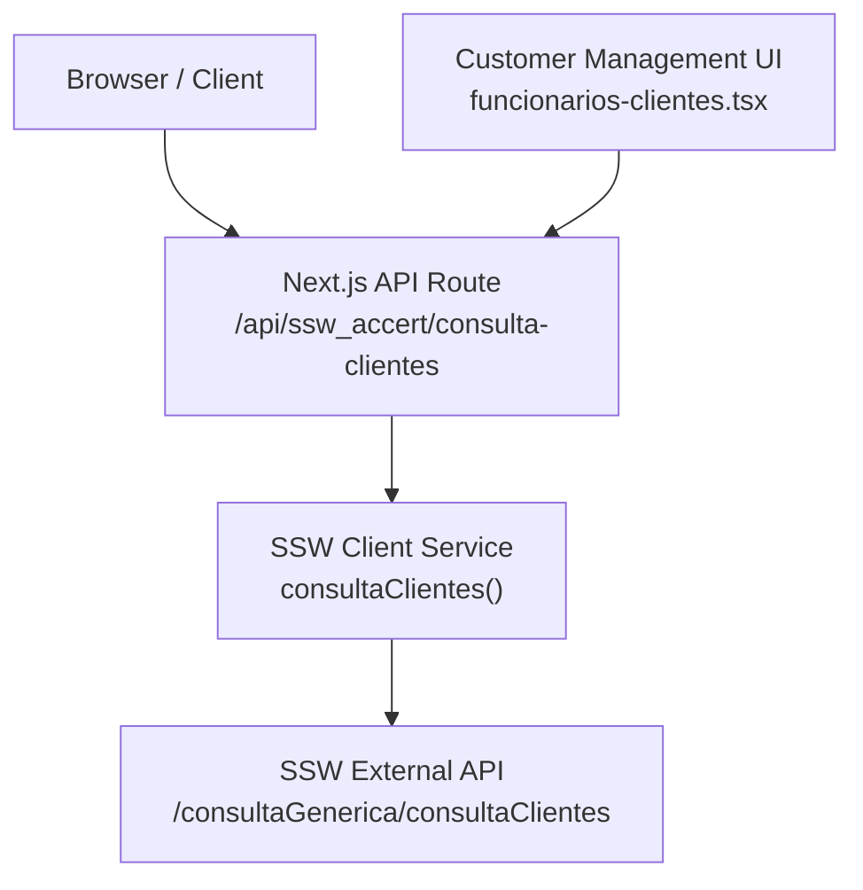
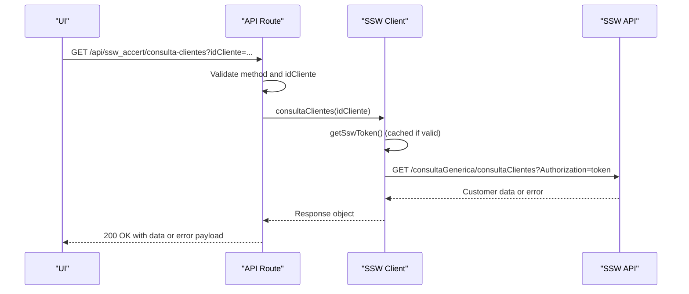
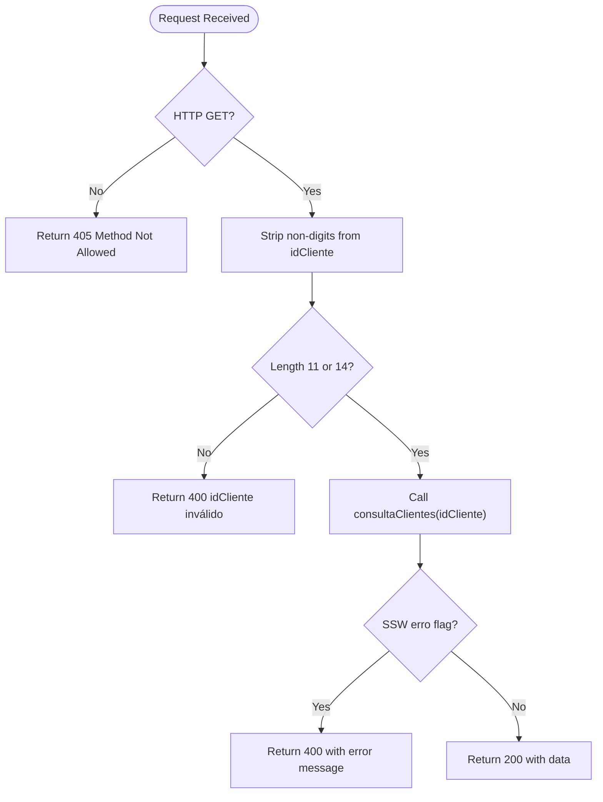
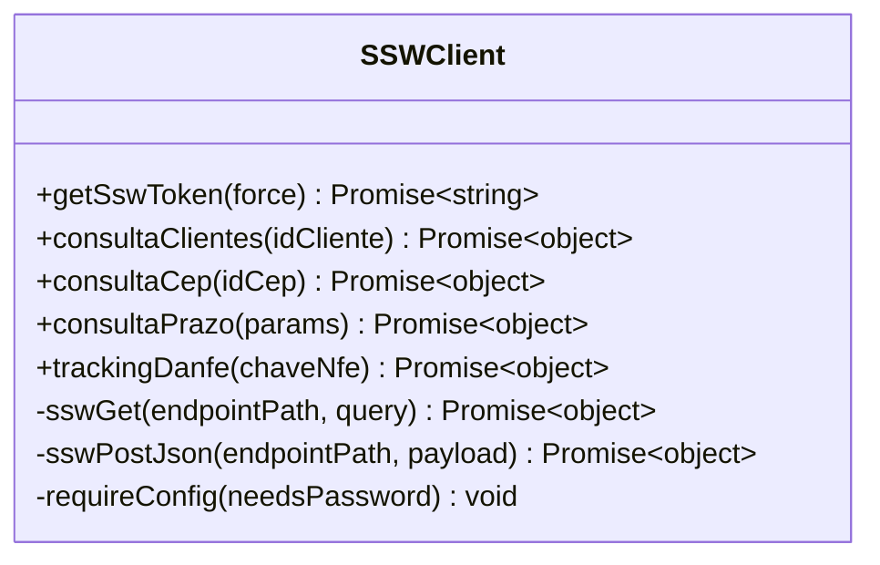
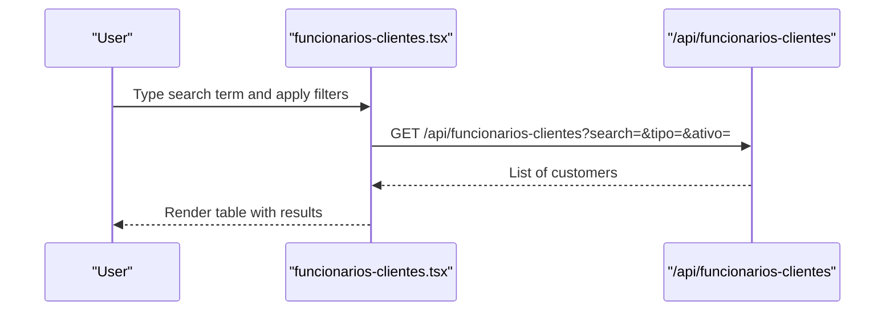
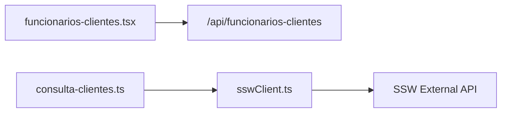

# Customer Data Services

<cite>
**Referenced Files in This Document**
- [sswClient.ts](file://services/sswClient.ts)
- [consulta-clientes.ts](file://pages/api/ssw_accert/consulta-clientes.ts)
- [funcionarios-clientes.tsx](file://pages/funcionarios-clientes.tsx)
</cite>

## Table of Contents
1. [Introduction](#introduction)
2. [Project Structure](#project-structure)
3. [Core Components](#core-components)
4. [Architecture Overview](#architecture-overview)
5. [Detailed Component Analysis](#detailed-component-analysis)
6. [Dependency Analysis](#dependency-analysis)
7. [Performance Considerations](#performance-considerations)
8. [Troubleshooting Guide](#troubleshooting-guide)
9. [Conclusion](#conclusion)

## Introduction
This document explains the customer lookup functionality integrated with the SSW system, focusing on retrieving customer information by ID via the consultaClientes endpoint. It covers request parameters, response handling, data mapping, and how customer data flows into the application’s search and validation workflows. It also addresses error handling for invalid IDs, network issues, and synchronization concerns, along with performance considerations and caching strategies for large datasets.

## Project Structure
The customer lookup feature spans a Next.js API route that validates input and proxies requests to an internal service layer, which communicates with the external SSW system. A UI page demonstrates how customers are searched and managed within the application.

**Diagram sources**
- [consulta-clientes.ts:8-31](file://pages/api/ssw_accert/consulta-clientes.ts#L8-L31)
- [sswClient.ts:102-157](file://services/sswClient.ts#L102-L157)
- [funcionarios-clientes.tsx:112-137](file://pages/funcionarios-clientes.tsx#L112-L137)

**Section sources**
- [consulta-clientes.ts:1-32](file://pages/api/ssw_accert/consulta-clientes.ts#L1-L32)
- [sswClient.ts:1-157](file://services/sswClient.ts#L1-L157)
- [funcionarios-clientes.tsx:1-137](file://pages/funcionarios-clientes.tsx#L1-L137)

## Core Components
- Next.js API route for customer lookup:
  - Validates HTTP method and input parameters.
  - Normalizes the customer ID by stripping non-digits and enforcing length constraints.
  - Calls the service layer to fetch customer data from SSW.
  - Returns standardized responses or errors.

- SSW client service:
  - Handles authentication token acquisition and caching.
  - Provides a typed function to call the SSW customer lookup endpoint.
  - Encapsulates GET requests with Authorization headers and JSON parsing.

- Customer management UI:
  - Implements search and filtering for employees and customers.
  - Demonstrates integration patterns for loading and displaying customer-related records.

**Section sources**
- [consulta-clientes.ts:8-31](file://pages/api/ssw_accert/consulta-clientes.ts#L8-L31)
- [sswClient.ts:50-157](file://services/sswClient.ts#L50-L157)
- [funcionarios-clientes.tsx:112-137](file://pages/funcionarios-clientes.tsx#L112-L137)

## Architecture Overview
The customer lookup follows a layered architecture:
- Presentation layer (UI) triggers searches and displays results.
- API route enforces input validation and delegates to the service layer.
- Service layer manages SSW authentication and performs HTTP calls.
- External SSW API returns customer data, which is propagated back through layers.

**Diagram sources**
- [consulta-clientes.ts:8-31](file://pages/api/ssw_accert/consulta-clientes.ts#L8-L31)
- [sswClient.ts:50-157](file://services/sswClient.ts#L50-L157)

## Detailed Component Analysis

### ConsultaClientes API Endpoint
- Purpose: Retrieve customer information by ID from the SSW system.
- Request:
  - Method: GET
  - Path: /api/ssw_accert/consulta-clientes
  - Query parameter:
    - idCliente: string (digits only; must be 11 or 14 characters)
- Validation:
  - Strips non-digit characters from idCliente.
  - Enforces length constraints (11 or 14 digits).
  - Rejects unsupported HTTP methods.
- Response:
  - On success: 200 OK with customer data returned from SSW.
  - On SSW error: 400 Bad Request with error message and payload.
  - On server error: 500 Internal Server Error with error message.

**Diagram sources**
- [consulta-clientes.ts:8-31](file://pages/api/ssw_accert/consulta-clientes.ts#L8-L31)

**Section sources**
- [consulta-clientes.ts:1-32](file://pages/api/ssw_accert/consulta-clientes.ts#L1-L32)

### SSW Client Service
- Authentication:
  - Acquires a token via generateToken with domain, username, password, and CNPJ.
  - Caches the token until expiration, reducing repeated auth calls.
- Request helpers:
  - sswGet: Builds URL with query parameters, attaches Authorization header, parses JSON, and throws on non-ok responses or invalid payloads.
  - sswPostJson: Posts JSON payloads with Authorization header and handles errors similarly.
- Customer lookup:
  - consultaClientes(idCliente): Calls SSW endpoint /consultaGenerica/consultaClientes with idCliente.

**Diagram sources**
- [sswClient.ts:50-157](file://services/sswClient.ts#L50-L157)

**Section sources**
- [sswClient.ts:1-157](file://services/sswClient.ts#L1-L157)

### Customer Search and Display in UI
- Search functionality:
  - The UI supports searching by name, CPF, phone, or email using a text field.
  - Filters can be applied by type (e.g., CLIENTE) and status (active/inactive).
- Data loading:
  - Fetches data from an internal API (/api/funcionarios-clientes) with query parameters for search and filters.
- Display:
  - Renders a table with columns for name, type, CPF, phone, email, transportadora, and status.
  - Uses chips and icons to visually differentiate types and statuses.

**Diagram sources**
- [funcionarios-clientes.tsx:112-137](file://pages/funcionarios-clientes.tsx#L112-L137)
- [funcionarios-clientes.tsx:342-407](file://pages/funcionarios-clientes.tsx#L342-L407)

**Section sources**
- [funcionarios-clientes.tsx:112-137](file://pages/funcionarios-clientes.tsx#L112-L137)
- [funcionarios-clientes.tsx:342-407](file://pages/funcionarios-clientes.tsx#L342-L407)

## Dependency Analysis
- The API route depends on the SSW client service for fetching customer data.
- The SSW client service depends on environment variables for credentials and token management.
- The UI depends on internal APIs for listing and managing customers, demonstrating integration patterns applicable to SSW-based lookups.

**Diagram sources**
- [funcionarios-clientes.tsx:112-137](file://pages/funcionarios-clientes.tsx#L112-L137)
- [consulta-clientes.ts:8-31](file://pages/api/ssw_accert/consulta-clientes.ts#L8-L31)
- [sswClient.ts:50-157](file://services/sswClient.ts#L50-L157)

**Section sources**
- [funcionarios-clientes.tsx:112-137](file://pages/funcionarios-clientes.tsx#L112-L137)
- [consulta-clientes.ts:8-31](file://pages/api/ssw_accert/consulta-clientes.ts#L8-L31)
- [sswClient.ts:50-157](file://services/sswClient.ts#L50-L157)

## Performance Considerations
- Token caching:
  - The SSW client caches authentication tokens to avoid repeated login calls, improving latency and reducing load on the SSW authentication endpoint.
- Input normalization:
  - Stripping non-digits and validating length reduces unnecessary network calls to SSW for invalid IDs.
- Large datasets:
  - For extensive customer lists, consider pagination and server-side filtering at the internal API level to minimize payload size and improve rendering performance.
- Caching strategies:
  - Implement client-side caching for frequently accessed customer details (e.g., in-memory cache or browser storage) with TTL-based expiration to reduce redundant requests.
  - Use server-side caching (e.g., Redis) for hot customer records when integrating with SSW repeatedly.

[No sources needed since this section provides general guidance]

## Troubleshooting Guide
Common issues and resolutions:
- Invalid customer ID:
  - Ensure idCliente contains only digits and has a length of 11 or 14 characters.
  - The API route returns a 400 error with a descriptive message if validation fails.
- Network timeouts or failures:
  - The SSW client throws errors for non-ok HTTP responses or invalid JSON payloads.
  - Wrap calls with try/catch and implement retries with exponential backoff for transient network issues.
- Data synchronization issues:
  - If SSW data changes frequently, refresh cached tokens and consider cache invalidation policies for customer details.
  - Validate responses from SSW and handle unexpected structures gracefully.

**Section sources**
- [consulta-clientes.ts:8-31](file://pages/api/ssw_accert/consulta-clientes.ts#L8-L31)
- [sswClient.ts:102-157](file://services/sswClient.ts#L102-L157)

## Conclusion
The customer lookup functionality integrates seamlessly with the SSW system through a robust API route and service layer. Input validation, token caching, and error handling ensure reliable operations. The UI demonstrates effective search and display patterns that can be extended to support autocomplete and advanced filtering. For large datasets, adopt caching and pagination strategies to maintain performance and responsiveness.

[No sources needed since this section summarizes without analyzing specific files]