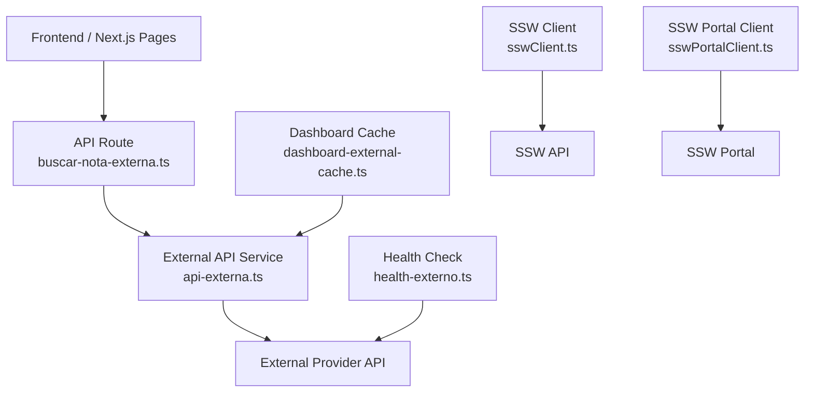
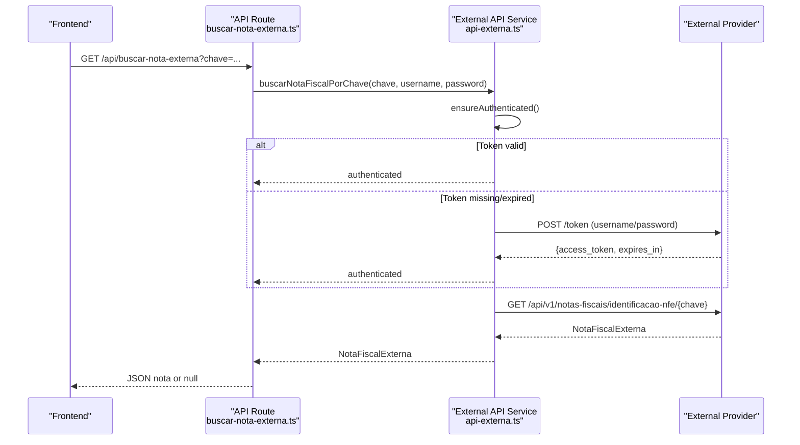
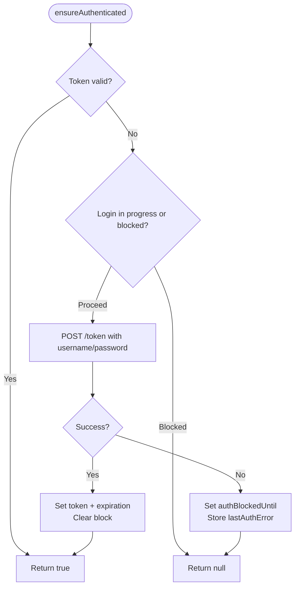
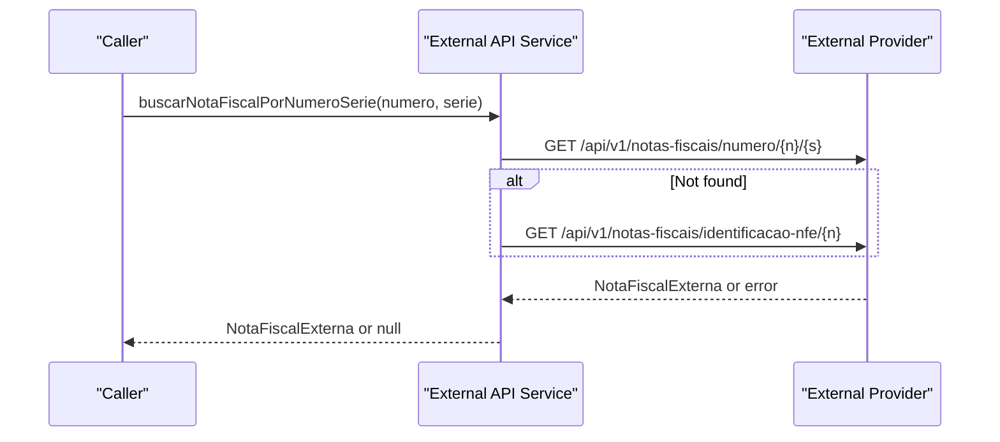
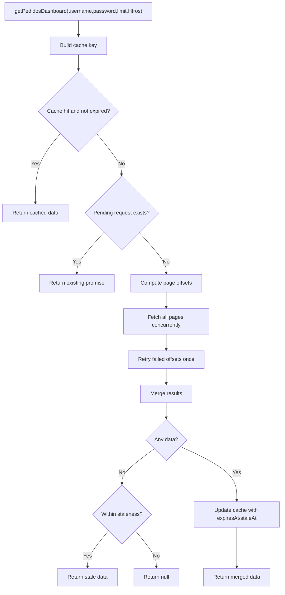
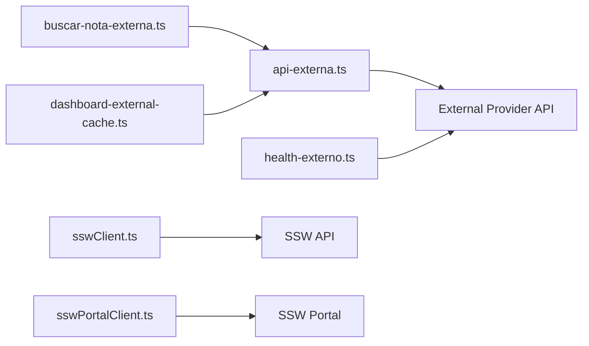

# External API Integration

<cite>
**Referenced Files in This Document**
- [api-externa.ts](file://services/api-externa.ts)
- [buscar-nota-externa.ts](file://pages/api/buscar-nota-externa.ts)
- [sswClient.ts](file://services/sswClient.ts)
- [dashboard-external-cache.ts](file://lib/dashboard-external-cache.ts)
- [health-externo.ts](file://pages/api/admin/health-externo.ts)
- [sswPortalClient.ts](file://services/sswPortalClient.ts)
- [env.example.txt](file://env.example.txt)
</cite>

## Table of Contents
1. [Introduction](#introduction)
2. [Project Structure](#project-structure)
3. [Core Components](#core-components)
4. [Architecture Overview](#architecture-overview)
5. [Detailed Component Analysis](#detailed-component-analysis)
6. [Dependency Analysis](#dependency-analysis)
7. [Performance Considerations](#performance-considerations)
8. [Troubleshooting Guide](#troubleshooting-guide)
9. [Conclusion](#conclusion)
10. [Appendices](#appendices)

## Introduction
This document explains the external API integration layer that communicates with third-party services beyond the core SSW ERP. It covers authentication using separate credentials, token management and caching, request/response patterns for nota fiscal (electronic invoice) queries, error handling and retry strategies, fallback mechanisms when external services are unavailable, rate limiting considerations, monitoring approaches, and guidance for adding new integrations, implementing circuit breakers, and logging interactions for debugging and analytics.

## Project Structure
The external integration spans several modules:
- A dedicated service for a generic external API with robust authentication, token lifecycle, and nota fiscal endpoints.
- An API route exposing nota fiscal lookup to the frontend.
- A client for an SSW-based service with its own token caching and tracking capabilities.
- A dashboard cache layer that batches and retries external calls efficiently.
- A health check endpoint to monitor external API availability.
- A portal client for multi-account SSW portal interactions with session and request queuing.

**Diagram sources**
- [buscar-nota-externa.ts:1-37](file://pages/api/buscar-nota-externa.ts#L1-L37)
- [api-externa.ts:117-248](file://services/api-externa.ts#L117-L248)
- [dashboard-external-cache.ts:15-92](file://lib/dashboard-external-cache.ts#L15-L92)
- [health-externo.ts:1-42](file://pages/api/admin/health-externo.ts#L1-L42)
- [sswClient.ts:50-100](file://services/sswClient.ts#L50-L100)
- [sswPortalClient.ts:176-222](file://services/sswPortalClient.ts#L176-L222)

**Section sources**
- [buscar-nota-externa.ts:1-37](file://pages/api/buscar-nota-externa.ts#L1-L37)
- [api-externa.ts:117-248](file://services/api-externa.ts#L117-L248)
- [dashboard-external-cache.ts:15-92](file://lib/dashboard-external-cache.ts#L15-L92)
- [health-externo.ts:1-42](file://pages/api/admin/health-externo.ts#L1-L42)
- [sswClient.ts:50-100](file://services/sswClient.ts#L50-L100)
- [sswPortalClient.ts:176-222](file://services/sswPortalClient.ts#L176-L222)

## Core Components
- External API Service: Centralizes authentication, token caching, and nota fiscal query methods with fallbacks and timeouts.
- Nota Fiscal API Route: Exposes a simple GET endpoint to look up invoices by number/series or key, reading credentials from environment variables.
- Dashboard Cache: Caches aggregated pedidos data with TTL, staleness, and retry on partial failures.
- SSW Client: Provides tokenized access to SSW APIs with local token caching and helper functions for notes and tracking.
- SSW Portal Client: Manages multi-account sessions, request queues, and robust photo retrieval with retries.
- Health Endpoint: Probes external API health and reports connectivity and database status.

**Section sources**
- [api-externa.ts:117-248](file://services/api-externa.ts#L117-L248)
- [buscar-nota-externa.ts:1-37](file://pages/api/buscar-nota-externa.ts#L1-L37)
- [dashboard-external-cache.ts:15-92](file://lib/dashboard-external-cache.ts#L15-L92)
- [sswClient.ts:50-100](file://services/sswClient.ts#L50-L100)
- [sswPortalClient.ts:176-222](file://services/sswPortalClient.ts#L176-L222)
- [health-externo.ts:1-42](file://pages/api/admin/health-externo.ts#L1-L42)

## Architecture Overview
The system uses a layered approach:
- Frontend triggers requests via Next.js API routes.
- Routes delegate to domain-specific clients (external API, SSW, portal).
- Clients handle authentication, token caching, retries, and response normalization.
- A shared cache reduces load and improves responsiveness for dashboard data.
- Health checks provide observability into external dependencies.

**Diagram sources**
- [buscar-nota-externa.ts:9-31](file://pages/api/buscar-nota-externa.ts#L9-L31)
- [api-externa.ts:167-248](file://services/api-externa.ts#L167-L248)
- [api-externa.ts:302-347](file://services/api-externa.ts#L302-L347)

## Detailed Component Analysis

### External API Authentication and Token Management
- Credentials: The service reads API_EXTERNA_USERNAME and API_EXTERNA_PASSWORD from environment variables.
- Login Flow: Uses form-encoded POST to /token with grant_type=password. On success, stores access_token and computes expiration based on expires_in or a fallback TTL.
- Interceptors: Automatically attaches Bearer token to requests except /token; clears auth state on 401 responses.
- Concurrency Safety: login is deduplicated via a promise guard to avoid concurrent logins.
- Rate Protection: After failed logins, subsequent attempts are blocked for a short window to prevent abuse.

**Diagram sources**
- [api-externa.ts:167-248](file://services/api-externa.ts#L167-L248)

**Section sources**
- [api-externa.ts:117-248](file://services/api-externa.ts#L117-L248)

### Nota Fiscal Consultation Endpoints
- Lookup by Number/Series: Tries /api/v1/notas-fiscais/numero/{numero}/{serie}, then falls back to identificacao-nfe using the number.
- Lookup by Key: Tries identificacao-nfe first, then falls back to chave/{chave}.
- Lookup by Identificação NFe: Direct call to identificacao-nfe/{id}.
- Listing and Filtering: Supports listing notas fiscais with date ranges and client filters; supports paginated complete notes.
- Error Handling: Each method validates status codes, logs errors, and returns null or empty arrays on failure to keep callers resilient.

**Diagram sources**
- [api-externa.ts:250-300](file://services/api-externa.ts#L250-L300)

**Section sources**
- [api-externa.ts:250-347](file://services/api-externa.ts#L250-L347)
- [api-externa.ts:569-693](file://services/api-externa.ts#L569-L693)

### API Route for Nota Fiscal Lookup
- Reads credentials from environment variables and enforces their presence.
- Supports lookup by chave or numero+serie.
- Returns 200 with null when not found to avoid client-side errors.
- Wraps errors in a server error response.

**Section sources**
- [buscar-nota-externa.ts:1-37](file://pages/api/buscar-nota-externa.ts#L1-L37)

### Dashboard External Cache
- Purpose: Reduce external API load and improve dashboard responsiveness by caching pedidos data with TTL and staleness windows.
- Behavior:
  - Aggregates results across multiple offset pages concurrently.
  - Retries failed offsets once.
  - Serves stale data if fresh data is empty and within staleness window.
  - Deduplicates concurrent requests per cache key.

**Diagram sources**
- [dashboard-external-cache.ts:15-92](file://lib/dashboard-external-cache.ts#L15-L92)

**Section sources**
- [dashboard-external-cache.ts:15-92](file://lib/dashboard-external-cache.ts#L15-L92)

### SSW Client Tokenization and Notes
- Token Management: Local in-memory cache with validity parsing and early expiry buffer.
- Notes Query: Uses external provider base URL and token to fetch nota fiscal by identificacao NFe.
- Fallback Strategies: Includes helpers to search for keys by ORCAMENTO_ID and period-based matching.

**Section sources**
- [sswClient.ts:50-100](file://services/sswClient.ts#L50-L100)
- [sswClient.ts:239-305](file://services/sswClient.ts#L239-L305)
- [sswClient.ts:309-421](file://services/sswClient.ts#L309-L421)

### SSW Portal Client Multi-Account Handling
- Accounts: Supports multiple configured accounts (ACCERT, EXPRESSO_GOIAS, ZANUELLO) with preferred selection based on transportadora.
- Session Management: Maintains cookie sessions with expiration and re-login on failure.
- Request Queuing: Serializes requests per account to avoid race conditions and reduce load.
- Photo Retrieval: Robust logic to handle placeholders, redirects, and embedded images with retries.

**Section sources**
- [sswPortalClient.ts:15-37](file://services/sswPortalClient.ts#L15-L37)
- [sswPortalClient.ts:176-222](file://services/sswPortalClient.ts#L176-L222)
- [sswPortalClient.ts:380-483](file://services/sswPortalClient.ts#L380-L483)
- [sswPortalClient.ts:534-578](file://services/sswPortalClient.ts#L534-L578)

### Health Monitoring
- Endpoint: /api/admin/health-externo probes the external API’s /health.
- Output: Reports api_online, credentials_configured, database_connected, timestamp, and details.
- Use Case: Enables dashboards and alerting to detect external API outages or misconfiguration.

**Section sources**
- [health-externo.ts:1-42](file://pages/api/admin/health-externo.ts#L1-L42)

## Dependency Analysis
- External API Service depends on axios and environment configuration for base URL and timeouts.
- API Route depends on External API Service and environment variables for credentials.
- Dashboard Cache depends on External API Service for fetching pedidos with pagination and retries.
- SSW Client depends on environment variables for domain, username, password, CNPJ_EDI and caches tokens locally.
- SSW Portal Client manages multiple accounts and serializes requests per account.
- Health Endpoint depends on axios to probe external API health.

**Diagram sources**
- [buscar-nota-externa.ts:1-37](file://pages/api/buscar-nota-externa.ts#L1-L37)
- [api-externa.ts:117-248](file://services/api-externa.ts#L117-L248)
- [dashboard-external-cache.ts:15-92](file://lib/dashboard-external-cache.ts#L15-L92)
- [health-externo.ts:1-42](file://pages/api/admin/health-externo.ts#L1-L42)
- [sswClient.ts:50-100](file://services/sswClient.ts#L50-L100)
- [sswPortalClient.ts:176-222](file://services/sswPortalClient.ts#L176-L222)

**Section sources**
- [api-externa.ts:117-248](file://services/api-externa.ts#L117-L248)
- [buscar-nota-externa.ts:1-37](file://pages/api/buscar-nota-externa.ts#L1-L37)
- [dashboard-external-cache.ts:15-92](file://lib/dashboard-external-cache.ts#L15-L92)
- [health-externo.ts:1-42](file://pages/api/admin/health-externo.ts#L1-L42)
- [sswClient.ts:50-100](file://services/sswClient.ts#L50-L100)
- [sswPortalClient.ts:176-222](file://services/sswPortalClient.ts#L176-L222)

## Performance Considerations
- Timeouts: External API requests use configurable timeouts to avoid hanging calls.
- Caching: Dashboard cache reduces repeated calls and serves stale data during transient failures.
- Concurrency: Concurrent page fetching with retries balances throughput and resilience.
- Token Reuse: Both external and SSW clients cache tokens to minimize authentication overhead.
- Request Serialization: Portal client serializes per-account requests to prevent contention.

[No sources needed since this section provides general guidance]

## Troubleshooting Guide
- Authentication Failures:
  - Ensure API_EXTERNA_USERNAME and API_EXTERNA_PASSWORD are set.
  - Check login retry block and last auth error logs for clues.
- Nota Fiscal Not Found:
  - Verify whether lookup is by chave or numero/serie; try alternate endpoints used by the service.
  - Confirm external provider endpoints are reachable via health check.
- Dashboard Data Missing:
  - Inspect cache TTL and staleness; check for partial failures and retries in logs.
- SSW Token Issues:
  - Validate domain, username, password, and CNPJ_EDI; confirm token validity parsing.
- Portal Session Problems:
  - Re-login forced on session errors; verify cookies and referer headers.

**Section sources**
- [api-externa.ts:167-248](file://services/api-externa.ts#L167-L248)
- [buscar-nota-externa.ts:9-31](file://pages/api/buscar-nota-externa.ts#L9-L31)
- [dashboard-external-cache.ts:32-87](file://lib/dashboard-external-cache.ts#L32-L87)
- [sswClient.ts:50-100](file://services/sswClient.ts#L50-L100)
- [sswPortalClient.ts:176-222](file://services/sswPortalClient.ts#L176-L222)

## Conclusion
The external API integration layer provides a robust foundation for communicating with third-party services, featuring secure credential handling, token lifecycle management, resilient nota fiscal queries, efficient caching, and comprehensive monitoring. By following the patterns outlined here, teams can extend integrations safely, implement circuit breakers, and maintain high availability even when external providers experience issues.

[No sources needed since this section summarizes without analyzing specific files]

## Appendices

### Adding a New External API Integration
- Create a new client module similar to api-externa.ts:
  - Define base URL, timeouts, and types.
  - Implement authentication and token caching.
  - Add methods for each endpoint with error handling and fallbacks.
- Expose an API route if needed, reading credentials from environment variables.
- Integrate with dashboard cache if applicable.
- Add health checks to monitor the new service.

[No sources needed since this section provides general guidance]

### Implementing Circuit Breakers for Resilience
- Pattern: Track consecutive failures and open the circuit after a threshold; allow half-open probing.
- Apply around external calls to fail fast and degrade gracefully.
- Combine with retries and timeouts for better resilience.

[No sources needed since this section provides general guidance]

### Logging External API Interactions
- Log authentication attempts, token refreshes, and endpoint calls with context (user, parameters, timestamps).
- Capture response statuses and payloads where appropriate for debugging.
- Use structured logs to enable analytics and alerting.

[No sources needed since this section provides general guidance]

### Environment Variables Reference
- API_EXTERNA_BASE_URL or API_URL: Base URL for external API.
- API_EXTERNA_USERNAME, API_EXTERNA_PASSWORD: Credentials for external API authentication.
- SSW_ACCERT_DOMAIN, SSW_ACCERT_USERNAME, SSW_ACCERT_PASSWORD, SSW_ACCERT_CNPJ_EDI: Credentials for SSW API.
- Additional SSW portal accounts: DOMAIN/USERNAME/PASSWORD per account.

**Section sources**
- [env.example.txt:1-38](file://env.example.txt#L1-L38)
- [sswClient.ts:3-7](file://services/sswClient.ts#L3-L7)
- [sswPortalClient.ts:15-37](file://services/sswPortalClient.ts#L15-L37)