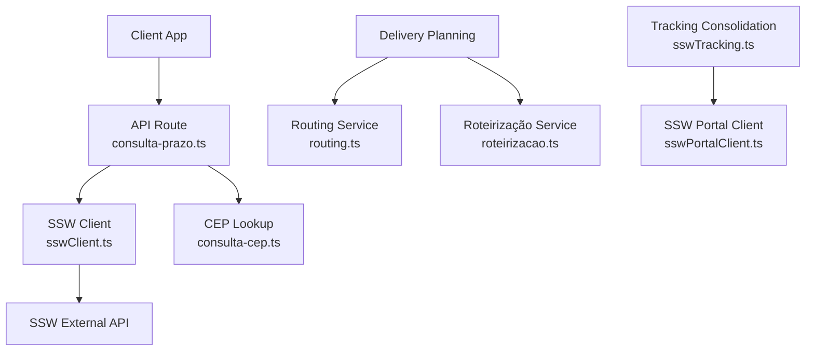
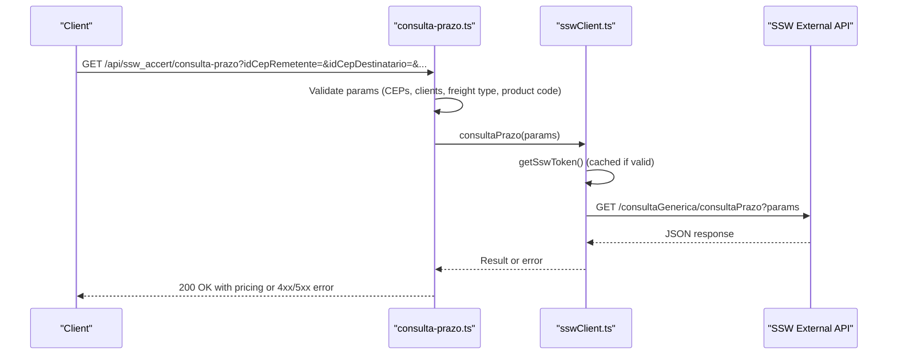
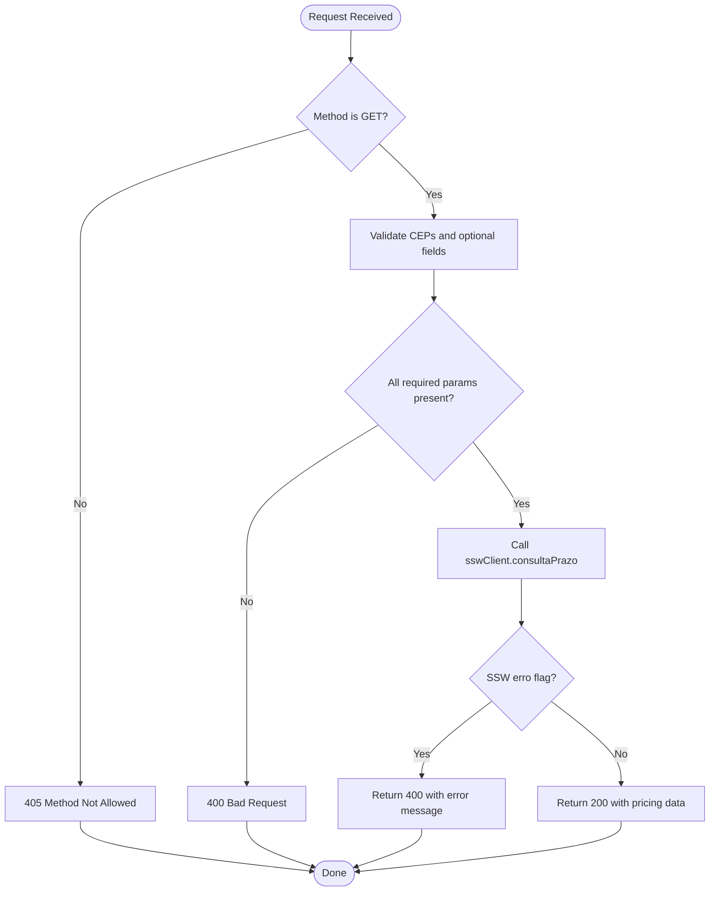
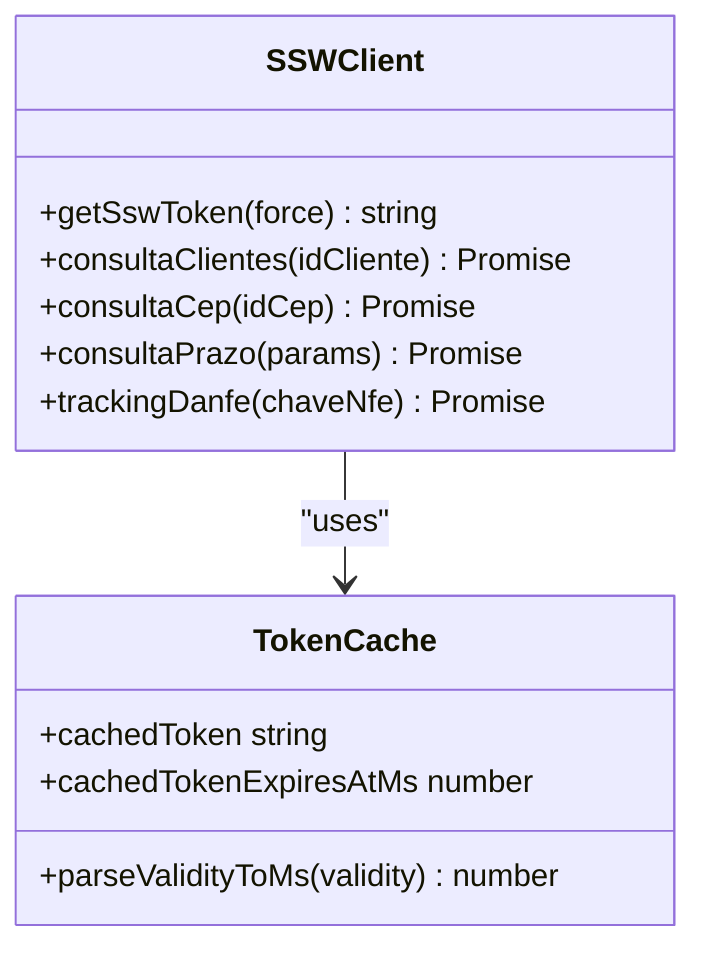
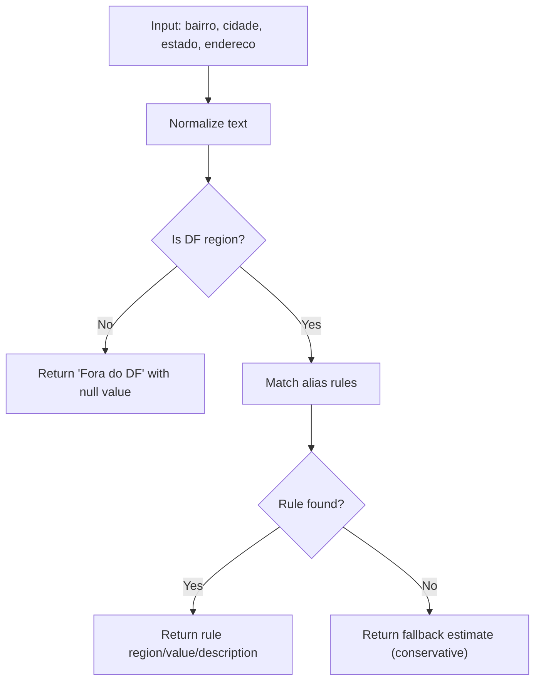
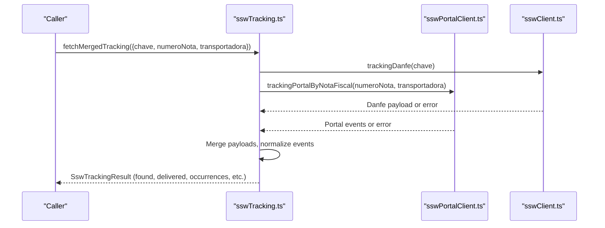
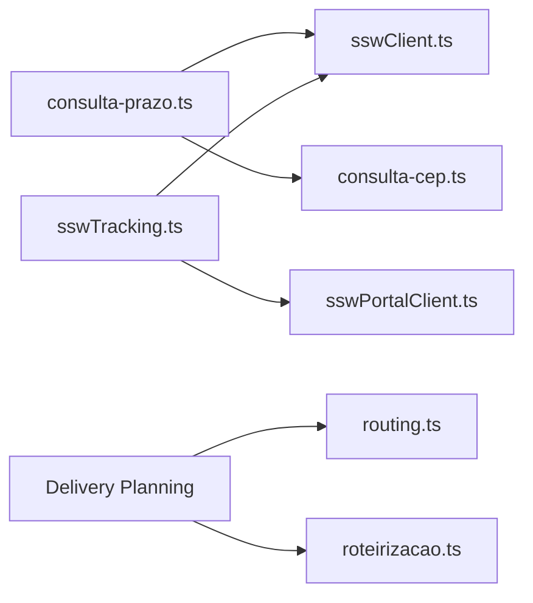

# Freight Pricing & Delivery Time

<cite>
**Referenced Files in This Document**
- [consulta-prazo.ts](file://pages/api/ssw_accert/consulta-prazo.ts)
- [sswClient.ts](file://services/sswClient.ts)
- [consulta-cep.ts](file://pages/api/ssw_accert/consulta-cep.ts)
- [consultar-entrega.ts](file://pages/api/ssw_accert/consultar-entrega.ts)
- [sswTracking.ts](file://services/sswTracking.ts)
- [sswPortalClient.ts](file://services/sswPortalClient.ts)
- [freteDf.ts](file://lib/freteDf.ts)
- [routing.ts](file://services/routing.ts)
- [roteirizacao.ts](file://services/roteirizacao.ts)
</cite>

## Table of Contents
1. [Introduction](#introduction)
2. [Project Structure](#project-structure)
3. [Core Components](#core-components)
4. [Architecture Overview](#architecture-overview)
5. [Detailed Component Analysis](#detailed-component-analysis)
6. [Dependency Analysis](#dependency-analysis)
7. [Performance Considerations](#performance-considerations)
8. [Troubleshooting Guide](#troubleshooting-guide)
9. [Conclusion](#conclusion)
10. [Appendices](#appendices)

## Introduction
This document explains the freight pricing and delivery time calculation services exposed by the system, with a focus on the consultaPrazo API endpoint that estimates shipping costs and delivery times between locations. It also covers integration points with order processing workflows, cost estimation tools, and delivery planning systems, including route optimization utilities and tracking consolidation.

## Project Structure
The freight pricing capability is implemented as a Next.js API route that validates inputs and delegates to an SSW client for pricing queries. Complementary services provide:
- CEP lookup to validate origin/destination postal codes
- Local DF freight estimation rules for quick fallback pricing
- Routing and route optimization helpers for delivery planning
- Tracking consolidation across multiple sources for delivery status



**Diagram sources**
- [consulta-prazo.ts:1-36](file://pages/api/ssw_accert/consulta-prazo.ts#L1-L36)
- [sswClient.ts:102-181](file://services/sswClient.ts#L102-L181)
- [consulta-cep.ts:1-32](file://pages/api/ssw_accert/consulta-cep.ts#L1-L32)
- [routing.ts:1-68](file://services/routing.ts#L1-L68)
- [roteirizacao.ts:111-201](file://services/roteirizacao.ts#L111-L201)
- [sswTracking.ts:393-479](file://services/sswTracking.ts#L393-L479)
- [sswPortalClient.ts:485-577](file://services/sswPortalClient.ts#L485-L577)

**Section sources**
- [consulta-prazo.ts:1-36](file://pages/api/ssw_accert/consulta-prazo.ts#L1-L36)
- [sswClient.ts:1-181](file://services/sswClient.ts#L1-L181)
- [consulta-cep.ts:1-32](file://pages/api/ssw_accert/consulta-cep.ts#L1-L32)
- [routing.ts:1-68](file://services/routing.ts#L1-L68)
- [roteirizacao.ts:1-231](file://services/roteirizacao.ts#L1-L231)
- [sswTracking.ts:1-481](file://services/sswTracking.ts#L1-L481)
- [sswPortalClient.ts:1-578](file://services/sswPortalClient.ts#L1-L578)

## Core Components
- consultaPrazo API endpoint: Validates required parameters (origin/destination CEPs, optional client IDs, freight type, product code), calls SSW pricing service, and returns results or errors.
- SSW client: Handles token management, caching, and HTTP calls to SSW endpoints for pricing and other queries.
- CEP validation: Ensures valid 8-digit postal codes before calling external services.
- DF freight estimator: Provides local region-based freight values when SSW pricing is unavailable or not applicable.
- Routing and route optimization: Computes routes and durations using OSRM; groups deliveries into routes and boxes for planning.
- Tracking consolidation: Merges tracking data from SSW portal and DANFE tracking to present unified delivery status.

**Section sources**
- [consulta-prazo.ts:1-36](file://pages/api/ssw_accert/consulta-prazo.ts#L1-L36)
- [sswClient.ts:50-181](file://services/sswClient.ts#L50-L181)
- [consulta-cep.ts:1-32](file://pages/api/ssw_accert/consulta-cep.ts#L1-L32)
- [freteDf.ts:140-190](file://lib/freteDf.ts#L140-L190)
- [routing.ts:8-68](file://services/routing.ts#L8-L68)
- [roteirizacao.ts:111-201](file://services/roteirizacao.ts#L111-L201)
- [sswTracking.ts:393-479](file://services/sswTracking.ts#L393-L479)

## Architecture Overview
The consultaPrazo flow validates inputs, optionally checks CEP validity, and requests pricing from SSW. The SSW client manages authentication tokens with caching and forwards the query to the external API. Responses are normalized and returned to the caller. For delivery planning, routing and roteirizacao services compute distances, durations, and group deliveries into efficient routes and boxes.



**Diagram sources**
- [consulta-prazo.ts:4-35](file://pages/api/ssw_accert/consulta-prazo.ts#L4-L35)
- [sswClient.ts:50-181](file://services/sswClient.ts#L50-L181)

## Detailed Component Analysis

### consultaPrazo API Endpoint
- Purpose: Calculate shipping costs and estimated delivery times between two locations.
- Required parameters:
  - idCepRemetente: Origin postal code ID
  - idCepDestinatario: Destination postal code ID
- Optional parameters:
  - idClienteRemetente: Origin client ID
  - idClienteDestinatario: Destination client ID
  - idClientePagador: Paying client ID
  - tpFrete: Freight type
  - idCodigoMercadoria: Product code
- Behavior:
  - Validates method (GET only)
  - Validates presence of origin/destination CEPs
  - Calls SSW client to fetch pricing
  - Returns SSW result or error message
  - Error handling:
    - Missing parameters return 400
    - SSW errors propagate with message
    - Unexpected exceptions return 500



**Diagram sources**
- [consulta-prazo.ts:4-35](file://pages/api/ssw_accert/consulta-prazo.ts#L4-L35)

**Section sources**
- [consulta-prazo.ts:4-35](file://pages/api/ssw_accert/consulta-prazo.ts#L4-L35)

### SSW Client and Token Management
- Authentication:
  - Retrieves domain, username, password, CNPJ EDI from environment variables
  - Generates and caches tokens with expiration derived from SSW validity
- Query helpers:
  - sswGet and sswPostJson wrap HTTP calls with Authorization header
- consultaPrazo:
  - Maps input parameters to SSW endpoint /consultaGenerica/consultaPrazo
  - Returns generic response structure with possible erro/mensagem fields
- Error handling:
  - Throws errors for invalid responses or non-OK HTTP status
  - Normalizes messages for callers



**Diagram sources**
- [sswClient.ts:30-100](file://services/sswClient.ts#L30-L100)
- [sswClient.ts:102-181](file://services/sswClient.ts#L102-L181)

**Section sources**
- [sswClient.ts:30-100](file://services/sswClient.ts#L30-L100)
- [sswClient.ts:102-181](file://services/sswClient.ts#L102-L181)

### CEP Validation
- Purpose: Ensure origin/destination postal codes are valid 8-digit numbers before querying SSW.
- Behavior:
  - Strips non-digits
  - Validates length equals 8
  - Returns 400 for invalid CEP
  - Delegates to SSW client for further lookups

**Section sources**
- [consulta-cep.ts:8-30](file://pages/api/ssw_accert/consulta-cep.ts#L8-L30)

### DF Freight Estimator
- Purpose: Provide quick freight estimates for Brasília (DF) regions when SSW pricing is not available or not applicable.
- Algorithm:
  - Normalizes input strings (neighborhood, city, state, address)
  - Detects DF region via state/city/aliases
  - Matches against predefined regional rules with fixed values
  - Falls back to conservative estimate for unmapped regions
- Output includes region name, value (if available), source type, description, and observation.



**Diagram sources**
- [freteDf.ts:127-190](file://lib/freteDf.ts#L127-L190)

**Section sources**
- [freteDf.ts:127-190](file://lib/freteDf.ts#L127-L190)

### Routing and Route Optimization
- RoutingService:
  - Calculates routes using OSRM with waypoints
  - Returns geometry, distance (meters), duration (seconds)
  - Enforces waypoint limits and handles errors
- RoteirizacaoService:
  - Groups notes into routes by city, neighborhood, or street
  - Creates boxes per route with capacity constraints
  - Sorts notes within routes for basic optimization
  - Generates reports summarizing routes and boxes

```mermaid
sequenceDiagram
participant Planner as "Delivery Planner"
participant RS as "RoutingService"
participant OSRM as "OSRM API"
Planner->>RS : calculateRoute(waypoints)
RS->>OSRM : GET /route/v1/driving;coordinates=...
OSRM-->>RS : Route data (distance, duration, geometry)
RS-->>Planner : RouteResult
Planner->>Roteirizacao : criarRotas(notas, strategy)
Roteirizacao-->>Planner : Routes grouped by criteria
Planner->>Roteirizacao : criarBoxes(rotas, capacity)
Roteirizacao-->>Planner : Boxes with totals
```

**Diagram sources**
- [routing.ts:8-68](file://services/routing.ts#L8-L68)
- [roteirizacao.ts:111-201](file://services/roteirizacao.ts#L111-L201)

**Section sources**
- [routing.ts:8-68](file://services/routing.ts#L8-L68)
- [roteirizacao.ts:111-201](file://services/roteirizacao.ts#L111-L201)

### Tracking Consolidation and Delivery Status
- SSW Tracking:
  - Merges tracking data from SSW portal and DANFE tracking
  - Normalizes occurrences, detects delivery status, extracts photo URLs and receiver names
  - Supports concurrent fetching and fallback strategies
- SSW Portal Client:
  - Manages sessions and cookies for portal access
  - Queries CTRC status and parses occurrence rows
  - Provides secure photo retrieval with signed tokens



**Diagram sources**
- [sswTracking.ts:393-479](file://services/sswTracking.ts#L393-L479)
- [sswPortalClient.ts:485-577](file://services/sswPortalClient.ts#L485-L577)
- [sswClient.ts:183-222](file://services/sswClient.ts#L183-L222)

**Section sources**
- [sswTracking.ts:393-479](file://services/sswTracking.ts#L393-L479)
- [sswPortalClient.ts:485-577](file://services/sswPortalClient.ts#L485-L577)
- [sswClient.ts:183-222](file://services/sswClient.ts#L183-L222)

## Dependency Analysis
- consulta-prazo depends on sswClient for pricing queries and may use CEP validation for pre-checks.
- sswClient depends on environment configuration for credentials and manages token caching.
- sswTracking depends on both sswClient (DANFE tracking) and sswPortalClient (portal session-based queries).
- routing and roteirizacao are independent utilities used by delivery planning workflows.



**Diagram sources**
- [consulta-prazo.ts:1-36](file://pages/api/ssw_accert/consulta-prazo.ts#L1-L36)
- [sswClient.ts:102-181](file://services/sswClient.ts#L102-L181)
- [consulta-cep.ts:1-32](file://pages/api/ssw_accert/consulta-cep.ts#L1-L32)
- [sswTracking.ts:393-479](file://services/sswTracking.ts#L393-L479)
- [sswPortalClient.ts:485-577](file://services/sswPortalClient.ts#L485-L577)
- [routing.ts:8-68](file://services/routing.ts#L8-L68)
- [roteirizacao.ts:111-201](file://services/roteirizacao.ts#L111-L201)

**Section sources**
- [consulta-prazo.ts:1-36](file://pages/api/ssw_accert/consulta-prazo.ts#L1-L36)
- [sswClient.ts:102-181](file://services/sswClient.ts#L102-L181)
- [consulta-cep.ts:1-32](file://pages/api/ssw_accert/consulta-cep.ts#L1-L32)
- [sswTracking.ts:393-479](file://services/sswTracking.ts#L393-L479)
- [sswPortalClient.ts:485-577](file://services/sswPortalClient.ts#L485-L577)
- [routing.ts:8-68](file://services/routing.ts#L8-L68)
- [roteirizacao.ts:111-201](file://services/roteirizacao.ts#L111-L201)

## Performance Considerations
- Token caching: SSW tokens are cached with expiration based on validity minus a safety margin to avoid mid-request expiry.
- Concurrency: Delivery status queries can be executed concurrently with bounded concurrency to reduce latency.
- Waypoint limits: Routing respects OSRM waypoint limits and suggests splitting large routes.
- CEP validation: Early validation reduces unnecessary external calls.
- DF estimator: Fast path for local DF regions avoids external calls when appropriate.

[No sources needed since this section provides general guidance]

## Troubleshooting Guide
- Invalid route combinations:
  - Ensure origin/destination CEPs are valid 8-digit codes
  - If SSW returns an error, inspect the mensagem field for details
- Service limitations:
  - SSW token generation requires all credentials; missing fields cause explicit errors
  - OSRM routing enforces maximum waypoints; split routes accordingly
- Dynamic pricing updates:
  - SSW pricing responses include error flags; handle them gracefully
  - Use DF estimator as fallback when SSW pricing is unavailable
- Common errors:
  - 405: Incorrect HTTP method
  - 400: Missing or invalid parameters
  - 500: Unexpected server-side exceptions

**Section sources**
- [consulta-prazo.ts:4-35](file://pages/api/ssw_accert/consulta-prazo.ts#L4-L35)
- [consulta-cep.ts:8-30](file://pages/api/ssw_accert/consulta-cep.ts#L8-L30)
- [sswClient.ts:41-100](file://services/sswClient.ts#L41-L100)
- [routing.ts:11-39](file://services/routing.ts#L11-L39)

## Conclusion
The sistema exposes a robust consultaPrazo endpoint for freight pricing and delivery time estimation, backed by SSW integration with secure token management and caching. Complementary services support CEP validation, local DF freight estimation, route computation, and consolidated tracking. Together, these components enable accurate cost estimation, efficient delivery planning, and reliable status monitoring across multiple logistics providers.

[No sources needed since this section summarizes without analyzing specific files]

## Appendices

### API Parameters Reference
- consultaPrazo parameters:
  - idCepRemetente: Origin postal code ID (required)
  - idCepDestinatario: Destination postal code ID (required)
  - idClienteRemetente: Origin client ID (optional)
  - idClienteDestinatario: Destination client ID (optional)
  - idClientePagador: Paying client ID (optional)
  - tpFrete: Freight type (optional)
  - idCodigoMercadoria: Product code (optional)

**Section sources**
- [consulta-prazo.ts:9-25](file://pages/api/ssw_accert/consulta-prazo.ts#L9-L25)
- [sswClient.ts:163-181](file://services/sswClient.ts#L163-L181)

### Example Workflows
- Implementing a freight calculator:
  - Validate CEPs using consulta-cep
  - Call consulta-prazo with required and optional parameters
  - Handle SSW errors and fallback to DF estimator if needed
- Comparing shipping options:
  - Use different tpFrete values to compare costs and delivery times
  - Aggregate results and present best options to users
- Optimizing delivery routes:
  - Group deliveries by city/neighborhood/street using roteirizacao
  - Compute routes with routing service and respect waypoint limits
  - Create boxes to manage capacity constraints

[No sources needed since this section provides general guidance]