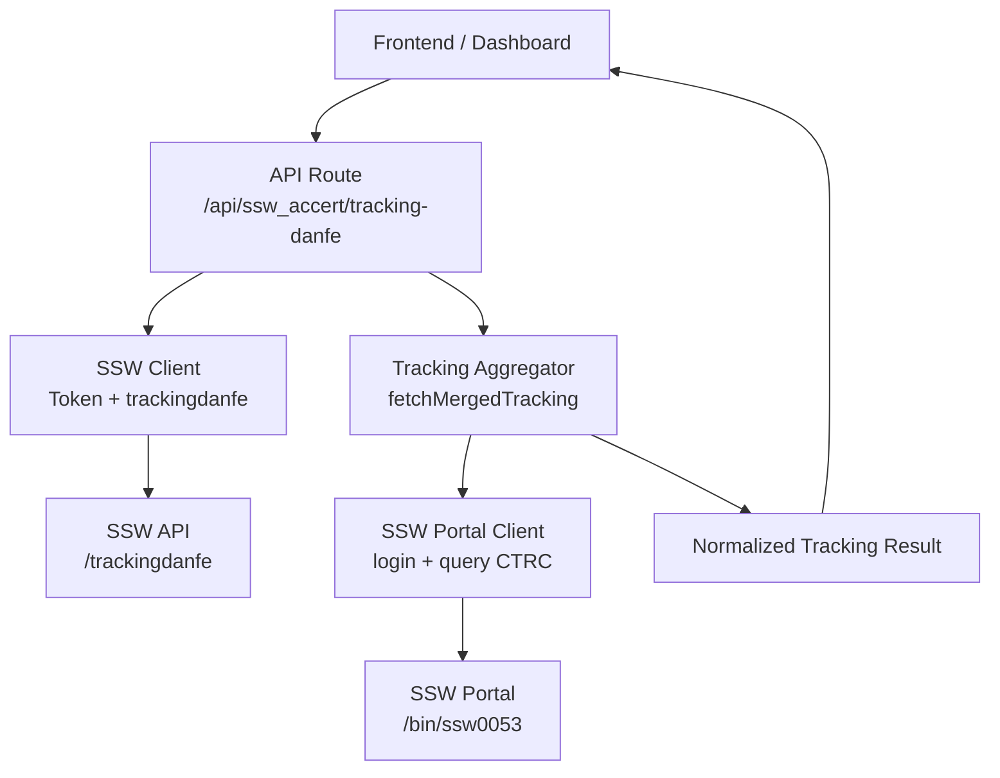
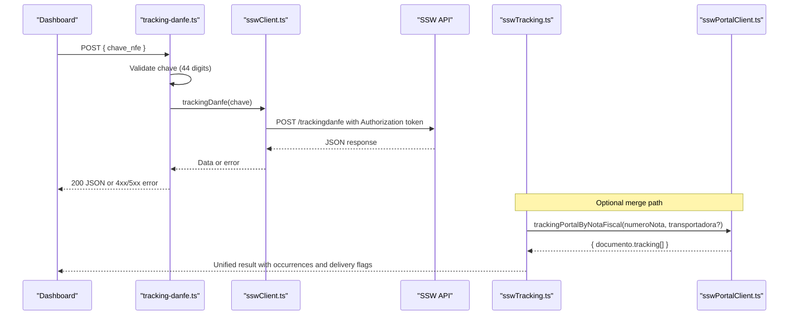
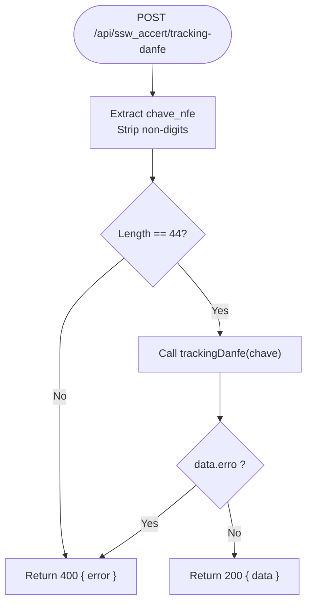
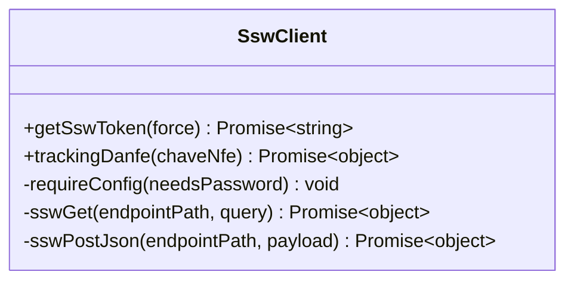
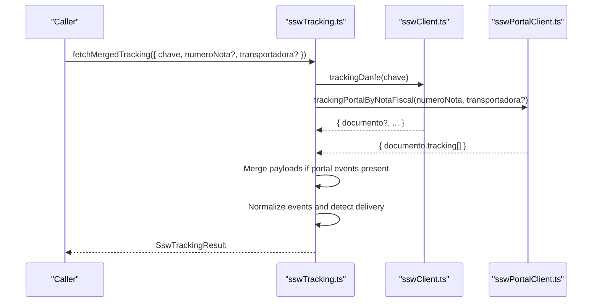
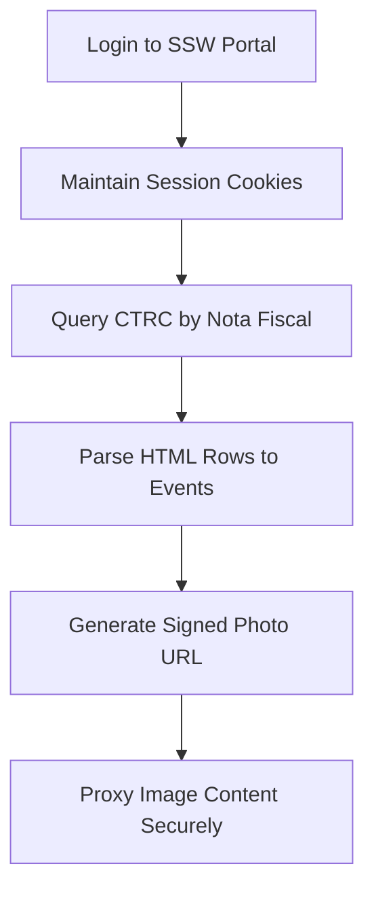
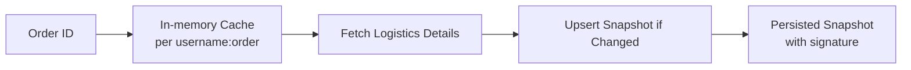
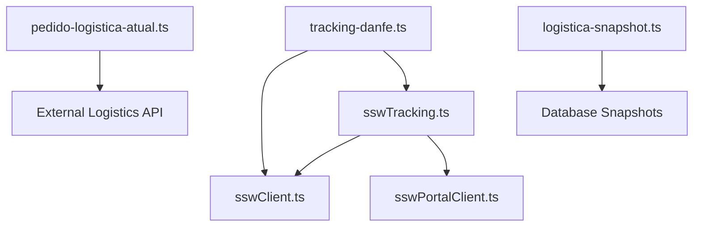

# Invoice Tracking & Status

<cite>
**Referenced Files in This Document**
- [tracking-danfe.ts](file://pages/api/ssw_accert/tracking-danfe.ts)
- [sswClient.ts](file://services/sswClient.ts)
- [sswTracking.ts](file://services/sswTracking.ts)
- [sswPortalClient.ts](file://services/sswPortalClient.ts)
- [pedido-logistica-atual.ts](file://lib/pedido-logistica-atual.ts)
- [logistica-snapshot.ts](file://lib/logistica-snapshot.ts)
</cite>

## Table of Contents
1. [Introduction](#introduction)
2. [Project Structure](#project-structure)
3. [Core Components](#core-components)
4. [Architecture Overview](#architecture-overview)
5. [Detailed Component Analysis](#detailed-component-analysis)
6. [Dependency Analysis](#dependency-analysis)
7. [Performance Considerations](#performance-considerations)
8. [Troubleshooting Guide](#troubleshooting-guide)
9. [Conclusion](#conclusion)
10. [Appendices](#appendices)

## Introduction
This document explains the invoice tracking and status monitoring services that integrate with the SSW Accert ecosystem to track electronic invoices (NFe) by their unique identification keys (chave NFe). It covers the trackingDanfe API endpoint, request/response formats, status interpretation, integration points with logistics workflows, delivery confirmation processes, audit trails, error handling, performance strategies for bulk operations, caching, fallbacks when external services are unavailable, and relationships with other logistics modules.

## Project Structure
The tracking capability is implemented across a Next.js API route and several service modules:
- API route exposes a POST endpoint for tracking by chave NFe.
- Client module handles authentication token management and calls to the SSW API.
- Tracking aggregator normalizes events from multiple sources (SSW portal and tracking DANFE).
- Portal client authenticates to the SSW web portal and extracts detailed tracking events.
- Logistics utilities cache and synchronize order-level logistics data used by dashboards and reports.

**Diagram sources**
- [tracking-danfe.ts:8-31](file://pages/api/ssw_accert/tracking-danfe.ts#L8-L31)
- [sswClient.ts:183-222](file://services/sswClient.ts#L183-L222)
- [sswTracking.ts:393-479](file://services/sswTracking.ts#L393-L479)
- [sswPortalClient.ts:176-222](file://services/sswPortalClient.ts#L176-L222)
- [sswPortalClient.ts:485-532](file://services/sswPortalClient.ts#L485-L532)

**Section sources**
- [tracking-danfe.ts:8-31](file://pages/api/ssw_accert/tracking-danfe.ts#L8-L31)
- [sswClient.ts:183-222](file://services/sswClient.ts#L183-L222)
- [sswTracking.ts:393-479](file://services/sswTracking.ts#L393-L479)
- [sswPortalClient.ts:176-222](file://services/sswPortalClient.ts#L176-L222)
- [sswPortalClient.ts:485-532](file://services/sswPortalClient.ts#L485-L532)

## Core Components
- trackingDanfe API endpoint: Validates input, calls SSW tracking, returns normalized response or errors.
- SSW Client: Manages token lifecycle, performs HTTP requests to SSW API endpoints, including tracking.
- Tracking Aggregator: Merges results from tracking DANFE and SSW portal into a unified result with occurrences and delivery detection.
- SSW Portal Client: Authenticates to the SSW portal, queries CTRC status, parses HTML responses into structured events, and provides secure photo retrieval.
- Logistics Utilities: Cache per-request logistics lookups and synchronize snapshots for dashboards and reporting.

Key responsibilities:
- Input validation and sanitization at the API boundary.
- Robust token caching and retry behavior for external APIs.
- Normalization of heterogeneous event structures into a consistent model.
- Delivery detection based on textual patterns and timestamps.
- Secure handling of proof-of-delivery images via signed URLs.

**Section sources**
- [tracking-danfe.ts:8-31](file://pages/api/ssw_accert/tracking-danfe.ts#L8-L31)
- [sswClient.ts:50-100](file://services/sswClient.ts#L50-L100)
- [sswClient.ts:183-222](file://services/sswClient.ts#L183-L222)
- [sswTracking.ts:8-36](file://services/sswTracking.ts#L8-L36)
- [sswTracking.ts:293-384](file://services/sswTracking.ts#L293-L384)
- [sswPortalClient.ts:176-222](file://services/sswPortalClient.ts#L176-L222)
- [sswPortalClient.ts:485-532](file://services/sswPortalClient.ts#L485-L532)
- [pedido-logistica-atual.ts:7-21](file://lib/pedido-logistica-atual.ts#L7-L21)

## Architecture Overview
The system composes two primary tracking sources:
- SSW API tracking (DANFE): Direct API call using an access token.
- SSW Portal (CTRC): Web portal login and query to extract detailed events and photos.

A merged flow ensures maximum coverage: if portal events exist, they are combined with DANFE payload; otherwise, the best available source is used. The aggregator normalizes all events into a common structure and infers delivery status and timestamps.

**Diagram sources**
- [tracking-danfe.ts:8-31](file://pages/api/ssw_accert/tracking-danfe.ts#L8-L31)
- [sswClient.ts:183-222](file://services/sswClient.ts#L183-L222)
- [sswTracking.ts:393-479](file://services/sswTracking.ts#L393-L479)
- [sswPortalClient.ts:534-577](file://services/sswPortalClient.ts#L534-L577)

## Detailed Component Analysis

### trackingDanfe API Endpoint
- Method: POST
- Request body:
  - chave_nfe: string (must be exactly 44 digits after stripping non-digits)
- Response:
  - On success: 200 with the raw SSW tracking response object
  - On business error: 400 with { error, mensagem }
  - On server error: 500 with { error }
- Behavior:
  - Strips non-digit characters from chave_nfe
  - Validates length equals 44
  - Calls SSW tracking via client
  - Propagates SSW error flag as 400

**Diagram sources**
- [tracking-danfe.ts:8-31](file://pages/api/ssw_accert/tracking-danfe.ts#L8-L31)

**Section sources**
- [tracking-danfe.ts:8-31](file://pages/api/ssw_accert/tracking-danfe.ts#L8-L31)

### SSW Client (Token Management and Tracking)
- Token management:
  - Retrieves credentials from environment variables
  - Caches token with expiration derived from validity field
  - Forces refresh when needed
- trackingDanfe function:
  - Sends POST to /trackingdanfe with Authorization header
  - Parses JSON response; throws on invalid JSON or non-OK HTTP
  - Returns the full response object for upstream normalization

**Diagram sources**
- [sswClient.ts:50-100](file://services/sswClient.ts#L50-L100)
- [sswClient.ts:183-222](file://services/sswClient.ts#L183-L222)

**Section sources**
- [sswClient.ts:50-100](file://services/sswClient.ts#L50-L100)
- [sswClient.ts:183-222](file://services/sswClient.ts#L183-L222)

### Tracking Aggregator (Merged Results and Normalization)
- fetchMergedTracking:
  - Runs trackingDanfe and optional portal query concurrently
  - If portal events exist, merges them into the DANFE payload
  - Normalizes events into a consistent occurrence list
  - Infers delivered status and extracted fields (deliveredAt, receiverName, photoUrl)
  - Returns a unified result with source attribution

**Diagram sources**
- [sswTracking.ts:393-479](file://services/sswTracking.ts#L393-L479)
- [sswClient.ts:183-222](file://services/sswClient.ts#L183-L222)
- [sswPortalClient.ts:534-577](file://services/sswPortalClient.ts#L534-L577)

**Section sources**
- [sswTracking.ts:8-36](file://services/sswTracking.ts#L8-L36)
- [sswTracking.ts:293-384](file://services/sswTracking.ts#L293-L384)
- [sswTracking.ts:393-479](file://services/sswTracking.ts#L393-L479)

### SSW Portal Client (Authentication, Querying, Photos)
- Authentication:
  - Logs into the SSW portal with domain/username/password
  - Maintains session cookies and re-authenticates on expiry
- Querying CTRC:
  - Queries historical events for a given nota fiscal number
  - Parses HTML rows into structured events with dates, descriptions, and types
- Photo retrieval:
  - Generates signed URLs for images with HMAC signature
  - Proxies image content securely through a dedicated endpoint

**Diagram sources**
- [sswPortalClient.ts:176-222](file://services/sswPortalClient.ts#L176-L222)
- [sswPortalClient.ts:243-255](file://services/sswPortalClient.ts#L243-L255)
- [sswPortalClient.ts:485-532](file://services/sswPortalClient.ts#L485-L532)

**Section sources**
- [sswPortalClient.ts:176-222](file://services/sswPortalClient.ts#L176-L222)
- [sswPortalClient.ts:243-255](file://services/sswPortalClient.ts#L243-L255)
- [sswPortalClient.ts:485-532](file://services/sswPortalClient.ts#L485-L532)

### Logistics Integration and Audit Trails
- Per-request caching:
  - Caches logistics lookup results per user and order ID with short TTL
  - Deduplicates concurrent requests for the same key
- Snapshot synchronization:
  - Periodically syncs dashboard-relevant logistics data
  - Persists changes only when signatures differ, reducing noise
  - Captures control info (manifest numbers, carrier names) for auditability

**Diagram sources**
- [pedido-logistica-atual.ts:7-21](file://lib/pedido-logistica-atual.ts#L7-L21)
- [logistica-snapshot.ts:769-800](file://lib/logistica-snapshot.ts#L769-L800)

**Section sources**
- [pedido-logistica-atual.ts:7-21](file://lib/pedido-logistica-atual.ts#L7-L21)
- [logistica-snapshot.ts:769-800](file://lib/logistica-snapshot.ts#L769-L800)

## Dependency Analysis
- API route depends on SSW client for direct tracking calls.
- Aggregator depends on both SSW client and portal client to maximize coverage.
- Portal client depends on environment-configured accounts and maintains sessions.
- Logistics utilities depend on external API services and persist snapshots for dashboards and compliance.

**Diagram sources**
- [tracking-danfe.ts:8-31](file://pages/api/ssw_accert/tracking-danfe.ts#L8-L31)
- [sswClient.ts:183-222](file://services/sswClient.ts#L183-L222)
- [sswTracking.ts:393-479](file://services/sswTracking.ts#L393-L479)
- [sswPortalClient.ts:534-577](file://services/sswPortalClient.ts#L534-L577)
- [pedido-logistica-atual.ts:7-21](file://lib/pedido-logistica-atual.ts#L7-L21)
- [logistica-snapshot.ts:769-800](file://lib/logistica-snapshot.ts#L769-L800)

**Section sources**
- [tracking-danfe.ts:8-31](file://pages/api/ssw_accert/tracking-danfe.ts#L8-L31)
- [sswClient.ts:183-222](file://services/sswClient.ts#L183-L222)
- [sswTracking.ts:393-479](file://services/sswTracking.ts#L393-L479)
- [sswPortalClient.ts:534-577](file://services/sswPortalClient.ts#L534-L577)
- [pedido-logistica-atual.ts:7-21](file://lib/pedido-logistica-atual.ts#L7-L21)
- [logistica-snapshot.ts:769-800](file://lib/logistica-snapshot.ts#L769-L800)

## Performance Considerations
- Bulk tracking operations:
  - Use the aggregator’s concurrent fetching of DANFE and portal data to reduce latency.
  - For large batches, fan out requests with controlled concurrency and debounce repeated keys.
- Caching strategies:
  - Token caching avoids repeated authentication overhead.
  - Per-request logistics cache reduces redundant external calls.
  - Snapshot persistence minimizes repeated writes and supports efficient reads.
- Fallback mechanisms:
  - If portal credentials are missing or queries fail, fall back to DANFE-only results.
  - If DANFE returns an error, aggregate still attempts portal if configured.
- Timeouts and retries:
  - Respect timeouts for external calls to avoid hanging requests.
  - Re-authenticate portal sessions automatically on failure.

[No sources needed since this section provides general guidance]

## Troubleshooting Guide
Common issues and resolutions:
- Invalid invoice key:
  - Ensure chave_nfe contains exactly 44 digits after stripping non-digits.
  - The API returns 400 with a descriptive error message.
- Tracking service outage:
  - Non-OK HTTP responses or invalid JSON trigger errors; wrap calls with retries and circuit breakers.
  - Use aggregator fallback to portal if DANFE fails and credentials are configured.
- Data synchronization issues:
  - Verify snapshot signatures and persisted records to detect drift.
  - Re-run synchronization jobs with appropriate date ranges to reconcile discrepancies.
- Portal session expired:
  - Automatic re-login is handled; ensure credentials are correctly configured.
  - Photo proxy validates tokens and signatures; regenerate links if expired.

**Section sources**
- [tracking-danfe.ts:13-29](file://pages/api/ssw_accert/tracking-danfe.ts#L13-L29)
- [sswClient.ts:77-100](file://services/sswClient.ts#L77-L100)
- [sswClient.ts:213-222](file://services/sswClient.ts#L213-L222)
- [sswPortalClient.ts:206-222](file://services/sswPortalClient.ts#L206-L222)
- [sswPortalClient.ts:343-378](file://services/sswPortalClient.ts#L343-L378)
- [logistica-snapshot.ts:769-800](file://lib/logistica-snapshot.ts#L769-L800)

## Conclusion
The invoice tracking and status monitoring system integrates SSW API and portal capabilities to provide robust, normalized tracking information for electronic invoices. It includes strong input validation, resilient token management, concurrent multi-source aggregation, delivery detection, secure proof-of-delivery handling, and reliable logistics synchronization. These components collectively support real-time dashboards, automated notifications, and compliance reporting while maintaining performance and reliability under varying external service conditions.

[No sources needed since this section summarizes without analyzing specific files]

## Appendices

### API Definition: trackingDanfe
- Endpoint: POST /api/ssw_accert/tracking-danfe
- Request:
  - Body: { chave_nfe: string }
  - Validation: Must be 44 digits after stripping non-digits
- Responses:
  - 200 OK: { ... } (SSW tracking response)
  - 400 Bad Request: { error: string } (invalid key or SSW error)
  - 500 Internal Server Error: { error: string }

**Section sources**
- [tracking-danfe.ts:8-31](file://pages/api/ssw_accert/tracking-danfe.ts#L8-L31)

### Normalized Tracking Result Model
- Fields include:
  - found: boolean
  - delivered: boolean
  - status: string | null
  - message: string | null
  - deliveredAt: string | null
  - receiverName: string | null
  - photoUrl: string | null
  - occurrences: array of normalized events
  - source: 'trackingdanfe' | 'ssw_portal' | 'trackingdanfe+ssw_portal' | null

**Section sources**
- [sswTracking.ts:8-36](file://services/sswTracking.ts#L8-L36)

### Logistics Snapshot Persistence
- Upserts changed snapshots keyed by period and filters
- Stores signatures to detect changes and minimize updates
- Captures control info for audit trails

**Section sources**
- [logistica-snapshot.ts:769-800](file://lib/logistica-snapshot.ts#L769-L800)