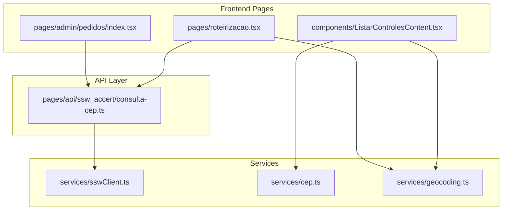
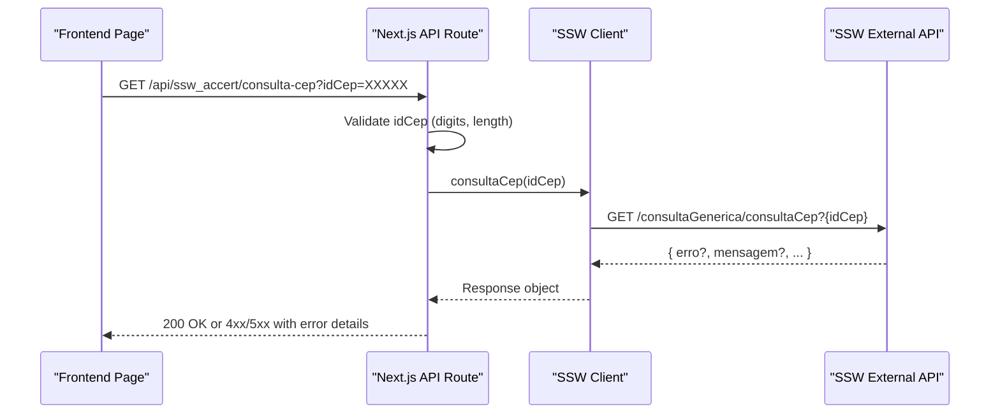
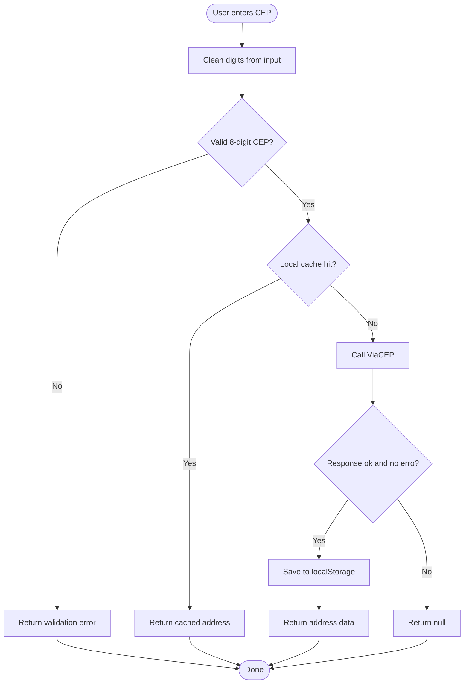
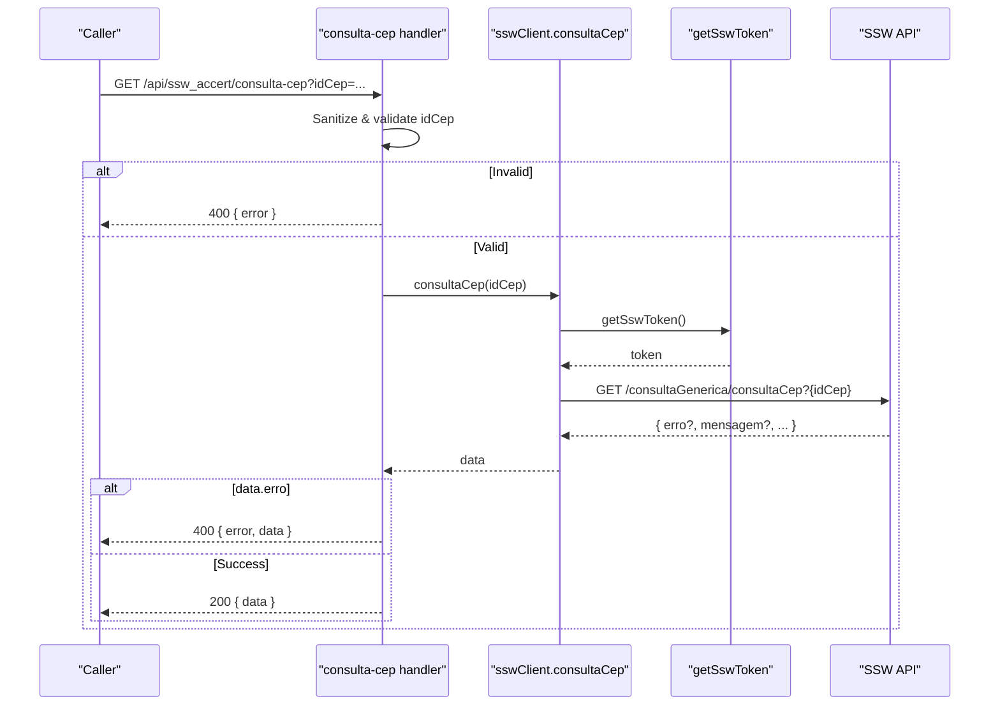
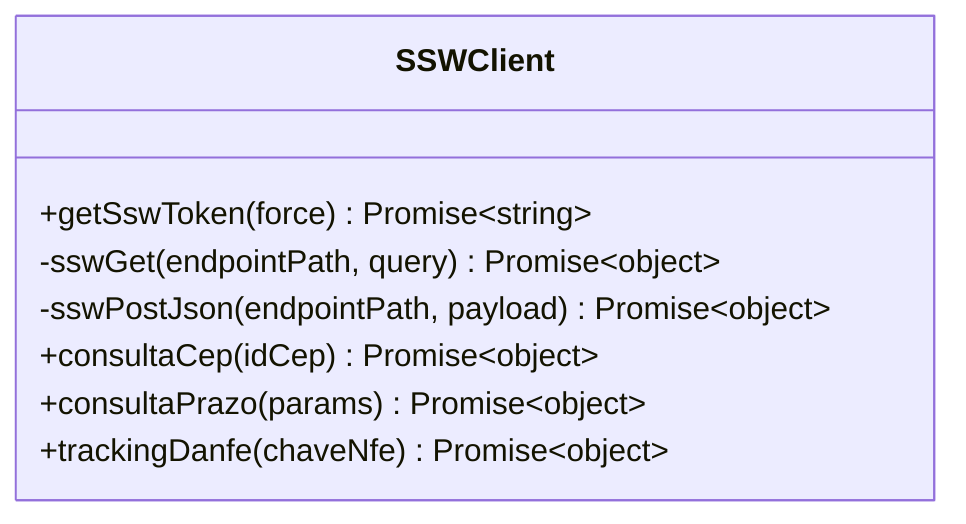
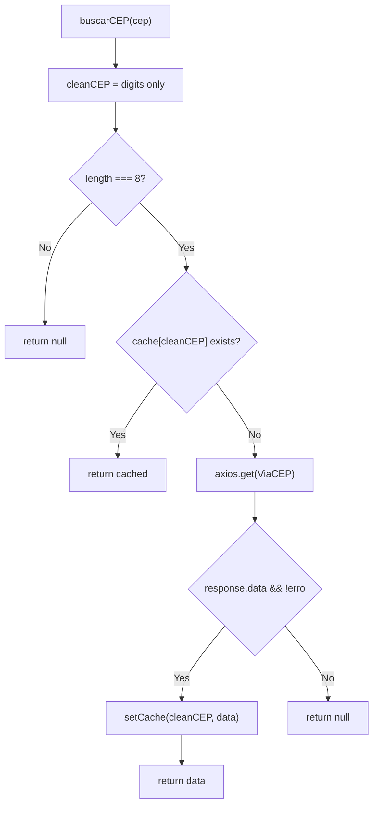
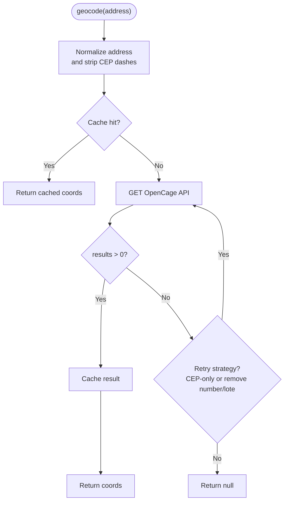
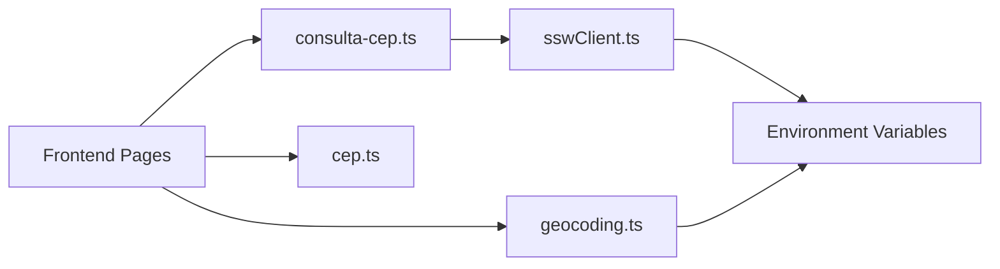

# Postal Code (CEP) Services

<cite>
**Referenced Files in This Document**
- [consulta-cep.ts](file://pages/api/ssw_accert/consulta-cep.ts)
- [sswClient.ts](file://services/sswClient.ts)
- [cep.ts](file://services/cep.ts)
- [geocoding.ts](file://services/geocoding.ts)
- [ListarControlesContent.tsx](file://components/ListarControlesContent.tsx)
- [index.tsx](file://pages/admin/pedidos/index.tsx)
- [roteirizacao.tsx](file://pages/roteirizacao.tsx)
</cite>

## Table of Contents
1. [Introduction](#introduction)
2. [Project Structure](#project-structure)
3. [Core Components](#core-components)
4. [Architecture Overview](#architecture-overview)
5. [Detailed Component Analysis](#detailed-component-analysis)
6. [Dependency Analysis](#dependency-analysis)
7. [Performance Considerations](#performance-considerations)
8. [Troubleshooting Guide](#troubleshooting-guide)
9. [Conclusion](#conclusion)
10. [Appendices](#appendices)

## Introduction
This document explains the postal code (CEP) lookup services integrated with SSW (Accert) and complementary geocoding utilities used across the application. It focuses on:
- The consultaCep API endpoint for retrieving address information based on Brazilian postal codes
- Parameter validation, response formatting, and address data normalization
- Integration patterns for address completion forms, geocoding workflows, and location-based services
- Error handling for invalid CEP formats, non-existent addresses, and service unavailability
- Examples for implementing address autocomplete, validating delivery addresses, and integrating with mapping services
- Performance optimization through CEP caching and batch processing for address validation scenarios

## Project Structure
The CEP functionality spans server-side Next.js API routes, an SSW client wrapper, a browser-friendly CEP utility, and geocoding helpers. Frontend pages consume these services to enrich addresses and power routing features.

**Diagram sources**
- [consulta-cep.ts:1-32](file://pages/api/ssw_accert/consulta-cep.ts#L1-L32)
- [sswClient.ts:159-161](file://services/sswClient.ts#L159-L161)
- [cep.ts:17-56](file://services/cep.ts#L17-L56)
- [geocoding.ts:9-128](file://services/geocoding.ts#L9-L128)
- [index.tsx:46-655](file://pages/admin/pedidos/index.tsx#L46-L655)
- [roteirizacao.tsx:70-530](file://pages/roteirizacao.tsx#L70-L530)
- [ListarControlesContent.tsx:52-1677](file://components/ListarControlesContent.tsx#L52-L1677)

**Section sources**
- [consulta-cep.ts:1-32](file://pages/api/ssw_accert/consulta-cep.ts#L1-L32)
- [sswClient.ts:159-161](file://services/sswClient.ts#L159-L161)
- [cep.ts:17-56](file://services/cep.ts#L17-L56)
- [geocoding.ts:9-128](file://services/geocoding.ts#L9-L128)
- [index.tsx:46-655](file://pages/admin/pedidos/index.tsx#L46-L655)
- [roteirizacao.tsx:70-530](file://pages/roteirizacao.tsx#L70-L530)
- [ListarControlesContent.tsx:52-1677](file://components/ListarControlesContent.tsx#L52-L1677)

## Core Components
- SSW consultaCep API route: Validates input, calls SSW via token-authenticated client, normalizes errors, and returns structured JSON responses.
- SSW client: Handles token lifecycle, base URL configuration, and generic GET/POST wrappers; exposes consultaCep.
- CEP service (browser): Lightweight utility that queries ViaCEP with local caching and returns normalized address fields.
- Geocoding service: Normalizes addresses, caches coordinates locally, and provides single and batch geocoding with retry logic.

Key responsibilities:
- Input validation and sanitization at the API boundary
- Secure authentication and token caching for SSW
- Robust error handling and consistent response shapes
- Local caching to reduce external calls and improve UX
- Batch operations for geocoding with rate-limit awareness

**Section sources**
- [consulta-cep.ts:8-31](file://pages/api/ssw_accert/consulta-cep.ts#L8-L31)
- [sswClient.ts:30-100](file://services/sswClient.ts#L30-L100)
- [sswClient.ts:102-161](file://services/sswClient.ts#L102-L161)
- [cep.ts:17-56](file://services/cep.ts#L17-L56)
- [geocoding.ts:9-128](file://services/geocoding.ts#L9-L128)

## Architecture Overview
The system supports two primary flows for CEP lookups:
- Server-side SSW integration via Next.js API route
- Client-side ViaCEP lookup with local caching

Geocoding complements CEP by converting addresses into coordinates for mapping and routing.

**Diagram sources**
- [consulta-cep.ts:8-31](file://pages/api/ssw_accert/consulta-cep.ts#L8-L31)
- [sswClient.ts:102-161](file://services/sswClient.ts#L102-L161)

**Diagram sources**
- [cep.ts:17-56](file://services/cep.ts#L17-L56)

**Section sources**
- [consulta-cep.ts:8-31](file://pages/api/ssw_accert/consulta-cep.ts#L8-L31)
- [sswClient.ts:102-161](file://services/sswClient.ts#L102-L161)
- [cep.ts:17-56](file://services/cep.ts#L17-L56)

## Detailed Component Analysis

### SSW consultaCep API Endpoint
- Purpose: Provide a secure, validated server-side endpoint to retrieve address information using SSW’s consultaCep.
- Input: Query parameter idCep (string), sanitized to digits only.
- Validation: Rejects missing or non-8-digit values with a 400 status.
- Processing: Calls SSW client which authenticates via token and performs GET request.
- Response: Returns SSW response on success; maps SSW erro flag to 400 with message; wraps unexpected errors as 500.

**Diagram sources**
- [consulta-cep.ts:8-31](file://pages/api/ssw_accert/consulta-cep.ts#L8-L31)
- [sswClient.ts:50-100](file://services/sswClient.ts#L50-L100)
- [sswClient.ts:102-161](file://services/sswClient.ts#L102-L161)

**Section sources**
- [consulta-cep.ts:8-31](file://pages/api/ssw_accert/consulta-cep.ts#L8-L31)
- [sswClient.ts:50-100](file://services/sswClient.ts#L50-L100)
- [sswClient.ts:102-161](file://services/sswClient.ts#L102-L161)

### SSW Client (Authentication and Request Wrappers)
- Token management: Retrieves and caches token with expiration derived from validity string; reduces auth overhead.
- Generic GET/POST: Builds URLs, attaches Authorization header, parses JSON, and throws descriptive errors on failures.
- Exposed functions: Includes consultaCep for address lookup and other logistics endpoints.

**Diagram sources**
- [sswClient.ts:30-100](file://services/sswClient.ts#L30-L100)
- [sswClient.ts:102-161](file://services/sswClient.ts#L102-L161)
- [sswClient.ts:183-222](file://services/sswClient.ts#L183-L222)

**Section sources**
- [sswClient.ts:30-100](file://services/sswClient.ts#L30-L100)
- [sswClient.ts:102-161](file://services/sswClient.ts#L102-L161)
- [sswClient.ts:183-222](file://services/sswClient.ts#L183-L222)

### CEP Service (Browser Utility)
- Purpose: Quick client-side address lookup using ViaCEP with local caching to minimize network calls.
- Input: CEP string cleaned to digits; validates 8-digit length.
- Output: Normalized address fields (street, neighborhood, city, state, etc.) or null on failure.
- Caching: Uses localStorage keyed by numeric CEP to persist results across sessions.

**Diagram sources**
- [cep.ts:17-56](file://services/cep.ts#L17-L56)

**Section sources**
- [cep.ts:17-56](file://services/cep.ts#L17-L56)

### Geocoding Service (Address to Coordinates)
- Purpose: Convert human-readable addresses to latitude/longitude using OpenCage, with robust fallbacks and retries.
- Features:
  - Address normalization (spaces, diacritics, CEP format)
  - Local caching of coordinates per normalized address
  - Retry on rate limits and transient failures
  - Batch geocoding with sequential requests and delays to respect API quotas

**Diagram sources**
- [geocoding.ts:9-128](file://services/geocoding.ts#L9-L128)

**Section sources**
- [geocoding.ts:9-128](file://services/geocoding.ts#L9-L128)

### Frontend Integration Patterns
- Address completion forms:
  - Use CEP service to auto-fill street, neighborhood, city, and state after CEP entry
  - Validate CEP length before calling service
  - Handle null responses to prompt user correction
- Delivery validation:
  - On form submit, call SSW consultaCep via API route to confirm address against internal system
  - Map SSW erro flag to user-facing messages
- Mapping and routing:
  - Use geocoding service to obtain coordinates for markers and routes
  - Leverage batch geocoding for multiple deliveries with rate-limit safeguards

Examples in codebase:
- Admin orders page uses CEP service to enrich customer addresses
- Routing page fetches CEP data for notes and integrates with map components
- Listar controles content retrieves CEP data for display and actions

**Section sources**
- [index.tsx:46-655](file://pages/admin/pedidos/index.tsx#L46-L655)
- [roteirizacao.tsx:70-530](file://pages/roteirizacao.tsx#L70-L530)
- [ListarControlesContent.tsx:52-1677](file://components/ListarControlesContent.tsx#L52-L1677)

## Dependency Analysis
- API route depends on SSW client for authenticated requests
- SSW client depends on environment variables for domain, credentials, and CNPJ
- CEP service depends on browser APIs (localStorage) and external ViaCEP
- Geocoding service depends on OpenCage API key and handles rate limiting
- Frontend pages depend on both CEP and geocoding services for UX and mapping

**Diagram sources**
- [consulta-cep.ts:1-32](file://pages/api/ssw_accert/consulta-cep.ts#L1-L32)
- [sswClient.ts:1-7](file://services/sswClient.ts#L1-L7)
- [cep.ts:17-56](file://services/cep.ts#L17-L56)
- [geocoding.ts:9-128](file://services/geocoding.ts#L9-L128)

**Section sources**
- [consulta-cep.ts:1-32](file://pages/api/ssw_accert/consulta-cep.ts#L1-L32)
- [sswClient.ts:1-7](file://services/sswClient.ts#L1-L7)
- [cep.ts:17-56](file://services/cep.ts#L17-L56)
- [geocoding.ts:9-128](file://services/geocoding.ts#L9-L128)

## Performance Considerations
- CEP caching:
  - Browser localStorage cache avoids repeated ViaCEP calls for the same CEP
  - Keyed by numeric CEP to handle different input formats
- SSW token caching:
  - Token is cached until expiration minus a safety margin to prevent mid-request expiry
- Geocoding batching:
  - Sequential requests with delays to respect API quotas
  - Local cache prevents redundant geocoding for identical addresses
- Recommendations:
  - Debounce CEP input to avoid excessive calls during typing
  - Implement server-side cache for frequent CEP lookups if needed
  - Monitor SSW token validity and refresh proactively
  - Use batch geocoding for large datasets and enforce rate limits

[No sources needed since this section provides general guidance]

## Troubleshooting Guide
Common issues and resolutions:
- Invalid CEP format:
  - Ensure input is sanitized to digits and exactly 8 characters
  - API returns 400 with error message when invalid
- Non-existent address:
  - SSW may return erro flag; surface mensagem to users
  - ViaCEP may return erro; handle gracefully and prompt correction
- Service unavailability:
  - Network errors or timeouts should be caught and retried where appropriate
  - Geocoding includes retry logic for rate limits and transient failures
- Authentication failures:
  - Verify environment variables for SSW domain, username, password, and CNPJ
  - Check token generation and expiration handling

**Section sources**
- [consulta-cep.ts:8-31](file://pages/api/ssw_accert/consulta-cep.ts#L8-L31)
- [sswClient.ts:41-48](file://services/sswClient.ts#L41-L48)
- [sswClient.ts:77-100](file://services/sswClient.ts#L77-L100)
- [geocoding.ts:96-110](file://services/geocoding.ts#L96-L110)

## Conclusion
The CEP services provide robust, user-friendly address lookup capabilities through both server-side SSW integration and client-side ViaCEP access. With strong validation, caching, and error handling, they support efficient address completion, delivery validation, and mapping integrations. Following the recommended patterns ensures reliable performance and a smooth user experience.

[No sources needed since this section summarizes without analyzing specific files]

## Appendices

### API Definition: consultaCep
- Method: GET
- Path: /api/ssw_accert/consulta-cep
- Query parameters:
  - idCep: string (required, digits only, length 8)
- Success response:
  - Status: 200
  - Body: SSW response object containing address fields
- Error responses:
  - 400: Invalid idCep or SSW reports erro with mensagem
  - 500: Unexpected server error

**Section sources**
- [consulta-cep.ts:8-31](file://pages/api/ssw_accert/consulta-cep.ts#L8-L31)

### Data Models
- CEPData (browser utility):
  - cep: string
  - logradouro: string
  - complemento: string
  - bairro: string
  - localidade: string
  - uf: string
  - ibge: string
  - gia: string
  - ddd: string
  - siafi: string
  - erro?: boolean

- Coordenadas (geocoding):
  - lat: number
  - lng: number
  - display_name?: string

**Section sources**
- [cep.ts:3-15](file://services/cep.ts#L3-L15)
- [geocoding.ts:3-7](file://services/geocoding.ts#L3-L7)