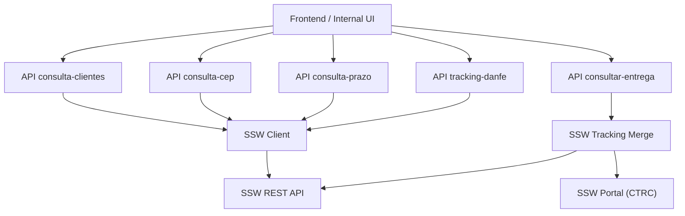
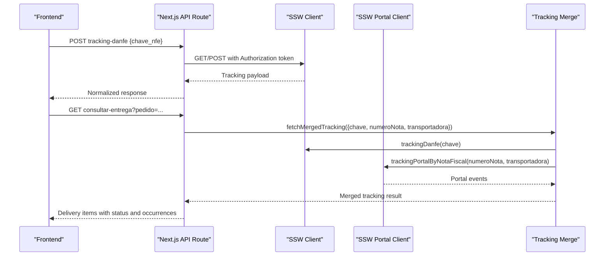
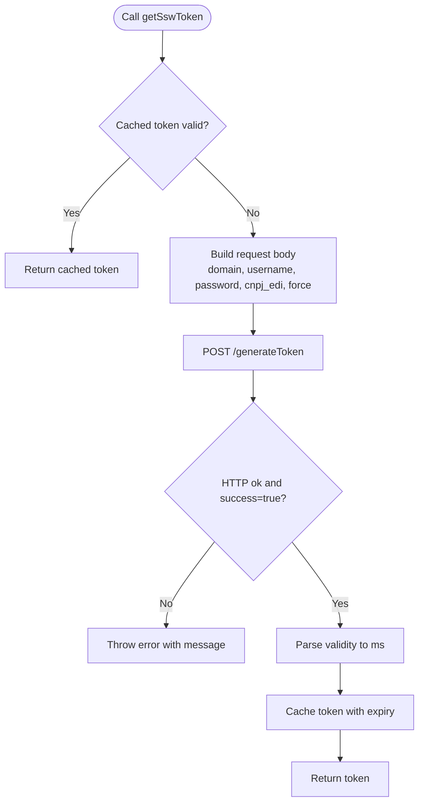
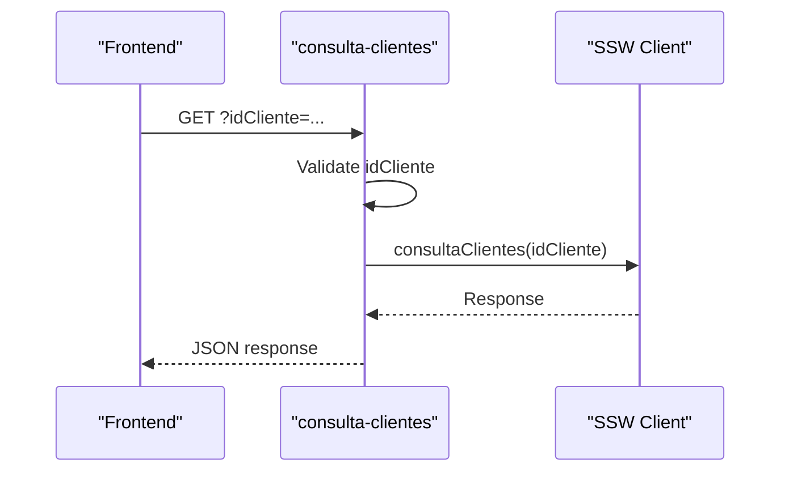
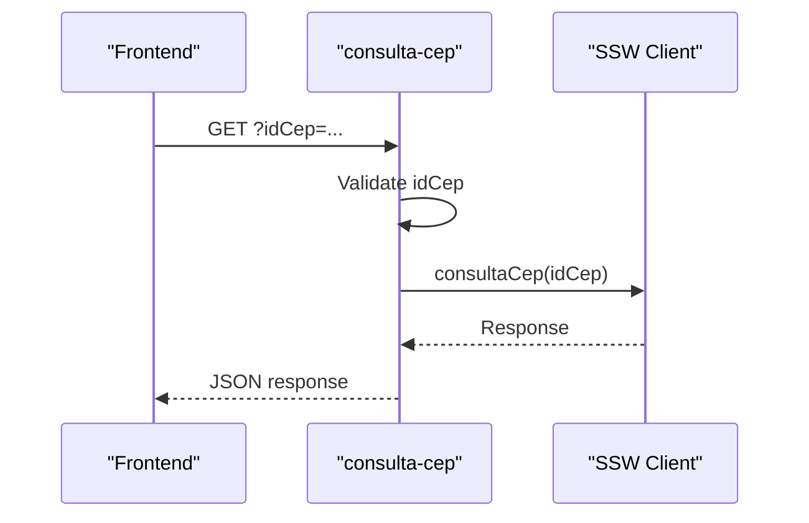
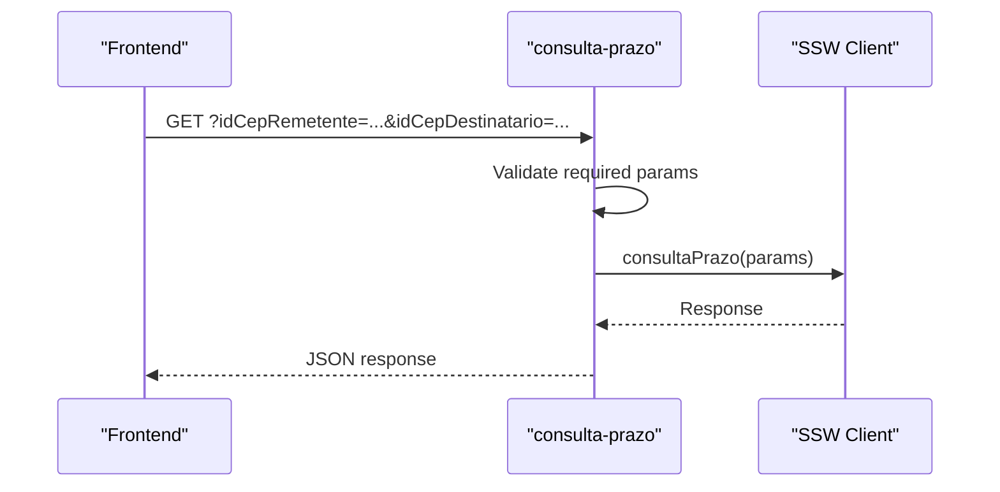
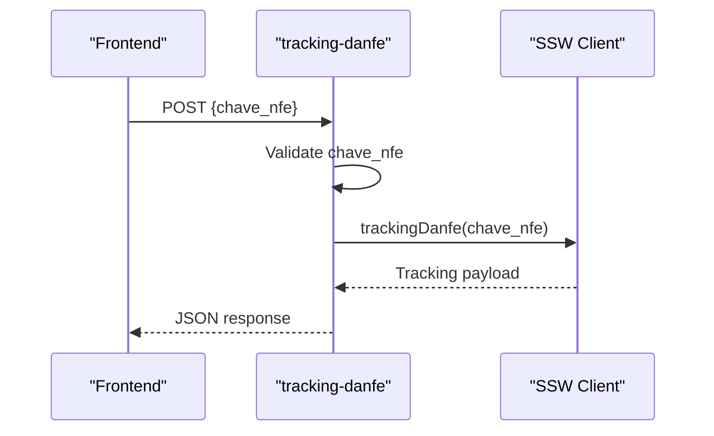
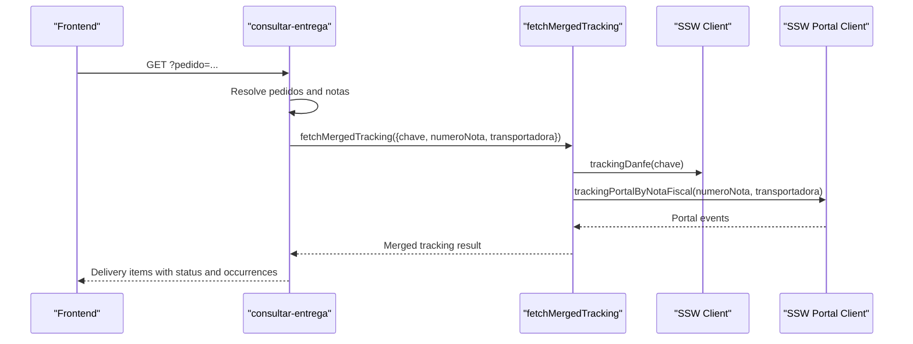
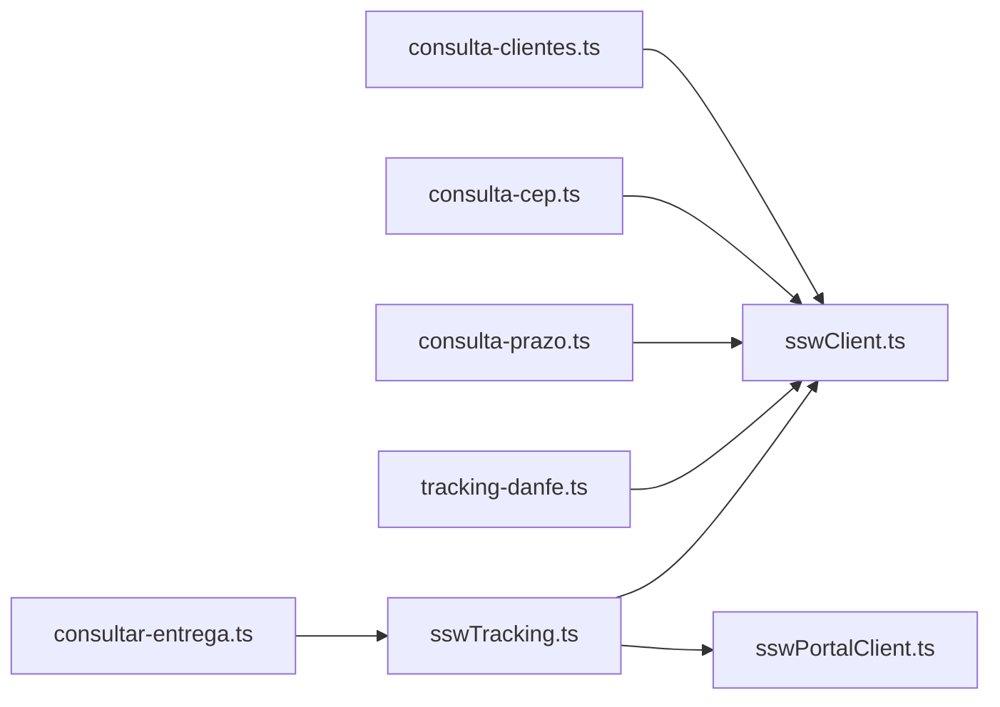

# SSW ERP Integration

<cite>
**Referenced Files in This Document**
- [sswClient.ts](file://services/sswClient.ts)
- [sswPortalClient.ts](file://services/sswPortalClient.ts)
- [sswTracking.ts](file://services/sswTracking.ts)
- [consulta-clientes.ts](file://pages/api/ssw_accert/consulta-clientes.ts)
- [consulta-cep.ts](file://pages/api/ssw_accert/consulta-cep.ts)
- [consulta-prazo.ts](file://pages/api/ssw_accert/consulta-prazo.ts)
- [consultar-entrega.ts](file://pages/api/ssw_accert/consultar-entrega.ts)
- [tracking-danfe.ts](file://pages/api/ssw_accert/tracking-danfe.ts)
- [env.example.txt](file://env.example.txt)
</cite>

## Table of Contents
1. [Introduction](#introduction)
2. [Project Structure](#project-structure)
3. [Core Components](#core-components)
4. [Architecture Overview](#architecture-overview)
5. [Detailed Component Analysis](#detailed-component-analysis)
6. [Dependency Analysis](#dependency-analysis)
7. [Performance Considerations](#performance-considerations)
8. [Troubleshooting Guide](#troubleshooting-guide)
9. [Conclusion](#conclusion)
10. [Appendices](#appendices)

## Introduction
This document explains the SSW ERP integration used by the application to authenticate with SSW, cache tokens for performance, and call endpoints for customer lookup, postal code (CEP) queries, freight pricing calculations, and invoice tracking. It also covers configuration requirements (domain, username, password, CNPJ), error handling strategies, network failure recovery, rate limiting considerations, and how to integrate new SSW endpoints with fallback mechanisms when the external service is unavailable.

## Project Structure
The SSW integration spans a small set of services and Next.js API routes:
- Service layer:
  - sswClient.ts: Token management, generic GET/POST helpers, and SSW API wrappers for customers, CEP, freight lead time, and DANFE tracking.
  - sswPortalClient.ts: Portal session management, login, and tracking via the SSW portal (Situacao do CTRC).
  - sswTracking.ts: Normalization and merging of tracking data from multiple sources (DANFE and portal).
- API routes:
  - pages/api/ssw_accert/*: Thin HTTP handlers that validate inputs and delegate to service functions.

**Diagram sources**
- [consulta-clientes.ts:8-31](file://pages/api/ssw_accert/consulta-clientes.ts#L8-L31)
- [consulta-cep.ts:8-31](file://pages/api/ssw_accert/consulta-cep.ts#L8-L31)
- [consulta-prazo.ts:4-35](file://pages/api/ssw_accert/consulta-prazo.ts#L4-L35)
- [tracking-danfe.ts:8-31](file://pages/api/ssw_accert/tracking-danfe.ts#L8-L31)
- [consultar-entrega.ts:427-719](file://pages/api/ssw_accert/consultar-entrega.ts#L427-L719)
- [sswClient.ts:50-222](file://services/sswClient.ts#L50-L222)
- [sswTracking.ts:393-479](file://services/sswTracking.ts#L393-L479)
- [sswPortalClient.ts:534-577](file://services/sswPortalClient.ts#L534-L577)

**Section sources**
- [consulta-clientes.ts:8-31](file://pages/api/ssw_accert/consulta-clientes.ts#L8-L31)
- [consulta-cep.ts:8-31](file://pages/api/ssw_accert/consulta-cep.ts#L8-L31)
- [consulta-prazo.ts:4-35](file://pages/api/ssw_accert/consulta-prazo.ts#L4-L35)
- [tracking-danfe.ts:8-31](file://pages/api/ssw_accert/tracking-danfe.ts#L8-L31)
- [consultar-entrega.ts:427-719](file://pages/api/ssw_accert/consultar-entrega.ts#L427-L719)
- [sswClient.ts:50-222](file://services/sswClient.ts#L50-L222)
- [sswTracking.ts:393-479](file://services/sswTracking.ts#L393-L479)
- [sswPortalClient.ts:534-577](file://services/sswPortalClient.ts#L534-L577)

## Core Components
- Authentication and token caching:
  - The client obtains an access token from the SSW API and caches it until expiration or forced refresh.
  - A separate external API token is cached for Nota Fiscal lookups.
- API clients:
  - Customer lookup, CEP query, freight lead time calculation, and DANFE tracking are exposed as typed functions.
- Portal integration:
  - Session-based portal login and tracking retrieval for “Situacao do CTRC”.
- Tracking merge:
  - Combines DANFE tracking with portal events into a normalized result.

**Section sources**
- [sswClient.ts:50-100](file://services/sswClient.ts#L50-L100)
- [sswClient.ts:102-181](file://services/sswClient.ts#L102-L181)
- [sswClient.ts:183-222](file://services/sswClient.ts#L183-L222)
- [sswClient.ts:239-305](file://services/sswClient.ts#L239-L305)
- [sswPortalClient.ts:176-222](file://services/sswPortalClient.ts#L176-L222)
- [sswTracking.ts:393-479](file://services/sswTracking.ts#L393-L479)

## Architecture Overview
The system uses a layered approach:
- API routes validate inputs and return standardized responses.
- Services encapsulate authentication, token caching, and calls to SSW APIs and portals.
- Tracking normalization abstracts differences between sources.

**Diagram sources**
- [tracking-danfe.ts:8-31](file://pages/api/ssw_accert/tracking-danfe.ts#L8-L31)
- [sswClient.ts:183-222](file://services/sswClient.ts#L183-L222)
- [sswTracking.ts:393-479](file://services/sswTracking.ts#L393-L479)
- [sswPortalClient.ts:534-577](file://services/sswPortalClient.ts#L534-L577)
- [consultar-entrega.ts:574-603](file://pages/api/ssw_accert/consultar-entrega.ts#L574-L603)

## Detailed Component Analysis

### Authentication Flow with Token Caching
- Token acquisition:
  - The client sends domain, username, password, and CNPJ EDI to generate a token.
  - Validity is parsed and the token is cached with an expiry slightly earlier than the reported validity to avoid edge cases.
- Usage:
  - Subsequent requests attach the Authorization header with the cached token.
  - If the token is expired or force refresh is requested, a new token is obtained.

**Diagram sources**
- [sswClient.ts:50-100](file://services/sswClient.ts#L50-L100)

**Section sources**
- [sswClient.ts:50-100](file://services/sswClient.ts#L50-L100)

### API Client Methods

#### Customer Lookup
- Endpoint: GET /api/ssw_accert/consulta-clientes?idCliente=...
- Behavior:
  - Validates idCliente digits length (11 or 14).
  - Calls consultaClientes which uses the authenticated SSW client.
  - Returns SSW response or error.

**Diagram sources**
- [consulta-clientes.ts:8-31](file://pages/api/ssw_accert/consulta-clientes.ts#L8-L31)
- [sswClient.ts:155-157](file://services/sswClient.ts#L155-L157)

**Section sources**
- [consulta-clientes.ts:8-31](file://pages/api/ssw_accert/consulta-clientes.ts#L8-L31)
- [sswClient.ts:155-157](file://services/sswClient.ts#L155-L157)

#### CEP (Postal Code) Query
- Endpoint: GET /api/ssw_accert/consulta-cep?idCep=...
- Behavior:
  - Validates idCep digits length (8).
  - Calls consultaCep using the authenticated SSW client.
  - Returns SSW response or error.

**Diagram sources**
- [consulta-cep.ts:8-31](file://pages/api/ssw_accert/consulta-cep.ts#L8-L31)
- [sswClient.ts:159-161](file://services/sswClient.ts#L159-L161)

**Section sources**
- [consulta-cep.ts:8-31](file://pages/api/ssw_accert/consulta-cep.ts#L8-L31)
- [sswClient.ts:159-161](file://services/sswClient.ts#L159-L161)

#### Freight Pricing Calculation (Lead Time)
- Endpoint: GET /api/ssw_accert/consulta-prazo?idCepRemetente=...&idCepDestinatario=...
- Behavior:
  - Requires origin and destination CEPs.
  - Optional parameters include client IDs, freight type, and product code.
  - Calls consultaPrazo using the authenticated SSW client.

**Diagram sources**
- [consulta-prazo.ts:4-35](file://pages/api/ssw_accert/consulta-prazo.ts#L4-L35)
- [sswClient.ts:163-181](file://services/sswClient.ts#L163-L181)

**Section sources**
- [consulta-prazo.ts:4-35](file://pages/api/ssw_accert/consulta-prazo.ts#L4-L35)
- [sswClient.ts:163-181](file://services/sswClient.ts#L163-L181)

#### Invoice Tracking (DANFE)
- Endpoint: POST /api/ssw_accert/tracking-danfe
- Behavior:
  - Validates chave_nfe (44 digits).
  - Calls trackingDanfe which authenticates and posts to SSW.
  - Returns tracking payload or error.

**Diagram sources**
- [tracking-danfe.ts:8-31](file://pages/api/ssw_accert/tracking-danfe.ts#L8-L31)
- [sswClient.ts:183-222](file://services/sswClient.ts#L183-L222)

**Section sources**
- [tracking-danfe.ts:8-31](file://pages/api/ssw_accert/tracking-danfe.ts#L8-L31)
- [sswClient.ts:183-222](file://services/sswClient.ts#L183-L222)

#### Merged Tracking and Delivery Status
- Endpoint: GET /api/ssw_accert/consultar-entrega?pedido=... or &cnpj=...
- Behavior:
  - Resolves pedidos via external API and local notes.
  - For each nota fiscal key, fetches merged tracking from DANFE and portal.
  - Computes delivery status and enriches with confirmation data.

**Diagram sources**
- [consultar-entrega.ts:574-603](file://pages/api/ssw_accert/consultar-entrega.ts#L574-L603)
- [sswTracking.ts:393-479](file://services/sswTracking.ts#L393-L479)
- [sswPortalClient.ts:534-577](file://services/sswPortalClient.ts#L534-L577)

**Section sources**
- [consultar-entrega.ts:427-719](file://pages/api/ssw_accert/consultar-entrega.ts#L427-L719)
- [sswTracking.ts:393-479](file://services/sswTracking.ts#L393-L479)
- [sswPortalClient.ts:534-577](file://services/sswPortalClient.ts#L534-L577)

### Configuration Requirements
- SSW credentials:
  - Domain, username, password, and CNPJ EDI are read from environment variables.
  - Basic credentials must be present; password is required for token generation.
- Portal accounts:
  - Multiple accounts can be configured (ACCERT, Expresso Goias, Zanuello).
  - Preferred account selection based on transportadora normalization.
- External Nota Fiscal API:
  - Separate base URL and credentials are used for Nota Fiscal queries.

Environment variables referenced:
- SSW_ACCERT_DOMAIN, SSW_ACCERT_USERNAME, SSW_ACCERT_PASSWORD, SSW_ACCERT_CNPJ_EDI
- SSW_EXPRESSO_GOIAS_DOMAIN, SSW_EXPRESSO_GOIAS_USERNAME, SSW_EXPRESSO_GOIAS_PASSWORD
- SSW_ZANUELLO_DOMAIN, SSW_ZANUELLO_USERNAME, SSW_ZANUELLO_PASSWORD
- API_EXTERNA_USERNAME, API_EXTERNA_PASSWORD

**Section sources**
- [sswClient.ts:1-7](file://services/sswClient.ts#L1-L7)
- [sswClient.ts:41-48](file://services/sswClient.ts#L41-L48)
- [sswPortalClient.ts:15-37](file://services/sswPortalClient.ts#L15-L37)
- [sswPortalClient.ts:72-84](file://services/sswPortalClient.ts#L72-L84)
- [sswClient.ts:232-235](file://services/sswClient.ts#L232-L235)
- [env.example.txt:1-38](file://env.example.txt#L1-L38)

### Error Handling Strategies
- Input validation:
  - API routes validate parameters (e.g., CEP length, NFe key length) and return 400 errors.
- SSW API errors:
  - Non-OK HTTP responses throw errors with status context.
  - Invalid JSON responses are caught and converted to user-friendly errors.
- Network failures:
  - Errors propagate to API routes and return 500 with messages.
- Portal session issues:
  - Login and photo retrieval handle session expiration and retry once.

Examples:
- Token generation failure returns a descriptive message.
- CEP and customer lookup return structured errors if SSW reports erro=true.
- Tracking DANFE endpoint validates input and handles parsing errors.

**Section sources**
- [consulta-clientes.ts:8-31](file://pages/api/ssw_accert/consulta-clientes.ts#L8-L31)
- [consulta-cep.ts:8-31](file://pages/api/ssw_accert/consulta-cep.ts#L8-L31)
- [consulta-prazo.ts:4-35](file://pages/api/ssw_accert/consulta-prazo.ts#L4-L35)
- [tracking-danfe.ts:8-31](file://pages/api/ssw_accert/tracking-danfe.ts#L8-L31)
- [sswClient.ts:77-91](file://services/sswClient.ts#L77-L91)
- [sswClient.ts:118-127](file://services/sswClient.ts#L118-L127)
- [sswClient.ts:144-152](file://services/sswClient.ts#L144-L152)
- [sswClient.ts:200-219](file://services/sswClient.ts#L200-L219)
- [sswPortalClient.ts:176-204](file://services/sswPortalClient.ts#L176-L204)
- [sswPortalClient.ts:343-378](file://services/sswPortalClient.ts#L343-L378)

### Network Failure Recovery
- Token caching reduces repeated authentication calls and mitigates transient failures.
- Portal session retry:
  - On session failure, the portal client retries once with a fresh session.
- Request queuing per account:
  - Prevents concurrent login storms and ensures sequential portal requests per account.

**Section sources**
- [sswClient.ts:50-100](file://services/sswClient.ts#L50-L100)
- [sswPortalClient.ts:206-222](file://services/sswPortalClient.ts#L206-L222)
- [sswPortalClient.ts:110-116](file://services/sswPortalClient.ts#L110-L116)

### Performance Optimization through Token Caching
- In-memory token cache:
  - Tokens are cached until their calculated expiry minus a safety margin.
  - Force refresh option available for explicit re-authentication.
- External Nota Fiscal token cache:
  - Separate cache with one-hour lifetime.

**Section sources**
- [sswClient.ts:30-39](file://services/sswClient.ts#L30-L39)
- [sswClient.ts:50-100](file://services/sswClient.ts#L50-L100)
- [sswClient.ts:236-273](file://services/sswClient.ts#L236-L273)

### Integrating New SSW Endpoints
Steps to add a new endpoint:
1. Add a typed function in sswClient.ts using sswGet or sswPostJson.
2. Create a Next.js API route under pages/api/ssw_accert/ to validate inputs and call the function.
3. Handle errors consistently and return structured JSON responses.
4. If the endpoint requires additional credentials, update requireConfig checks.

Example pattern:
- Define function with parameters and return type.
- Use sswGet for GET endpoints with query parameters.
- Use sswPostJson for POST endpoints with JSON payloads.
- Wrap in try/catch at the API route level.

**Section sources**
- [sswClient.ts:102-153](file://services/sswClient.ts#L102-L153)
- [consulta-clientes.ts:8-31](file://pages/api/ssw_accert/consulta-clientes.ts#L8-L31)
- [consulta-cep.ts:8-31](file://pages/api/ssw_accert/consulta-cep.ts#L8-L31)
- [consulta-prazo.ts:4-35](file://pages/api/ssw_accert/consulta-prazo.ts#L4-L35)

### Handling Rate Limiting
- Current implementation does not implement explicit rate limiting for SSW calls.
- Recommendations:
  - Add exponential backoff on 429 responses.
  - Implement per-account request queues with delays.
  - Use token caching to reduce auth calls.
  - Consider adding a global rate limiter middleware for API routes.

[No sources needed since this section provides general guidance]

### Fallback Mechanisms When External Service Is Unavailable
- Merged tracking:
  - Tries both DANFE and portal sources; if one fails, continues with the other.
  - If both fail, returns a clear error message and empty occurrences.
- Portal photo retrieval:
  - Retries multiple endpoints and formats to handle placeholders and redirects.

**Section sources**
- [sswTracking.ts:408-479](file://services/sswTracking.ts#L408-L479)
- [sswPortalClient.ts:407-483](file://services/sswPortalClient.ts#L407-L483)

## Dependency Analysis
The integration has clear separation between API routes and services:
- API routes depend on services for business logic and external calls.
- Services encapsulate authentication, caching, and external integrations.
- Tracking merge depends on both DANFE and portal clients.

**Diagram sources**
- [consulta-clientes.ts:8-31](file://pages/api/ssw_accert/consulta-clientes.ts#L8-L31)
- [consulta-cep.ts:8-31](file://pages/api/ssw_accert/consulta-cep.ts#L8-L31)
- [consulta-prazo.ts:4-35](file://pages/api/ssw_accert/consulta-prazo.ts#L4-L35)
- [tracking-danfe.ts:8-31](file://pages/api/ssw_accert/tracking-danfe.ts#L8-L31)
- [consultar-entrega.ts:427-719](file://pages/api/ssw_accert/consultar-entrega.ts#L427-L719)
- [sswClient.ts:50-222](file://services/sswClient.ts#L50-L222)
- [sswTracking.ts:393-479](file://services/sswTracking.ts#L393-L479)
- [sswPortalClient.ts:534-577](file://services/sswPortalClient.ts#L534-L577)

**Section sources**
- [consulta-clientes.ts:8-31](file://pages/api/ssw_accert/consulta-clientes.ts#L8-L31)
- [consulta-cep.ts:8-31](file://pages/api/ssw_accert/consulta-cep.ts#L8-L31)
- [consulta-prazo.ts:4-35](file://pages/api/ssw_accert/consulta-prazo.ts#L4-L35)
- [tracking-danfe.ts:8-31](file://pages/api/ssw_accert/tracking-danfe.ts#L8-L31)
- [consultar-entrega.ts:427-719](file://pages/api/ssw_accert/consultar-entrega.ts#L427-L719)
- [sswClient.ts:50-222](file://services/sswClient.ts#L50-L222)
- [sswTracking.ts:393-479](file://services/sswTracking.ts#L393-L479)
- [sswPortalClient.ts:534-577](file://services/sswPortalClient.ts#L534-L577)

## Performance Considerations
- Token caching significantly reduces authentication overhead.
- Portal sessions are cached per account with expiration and deduplicated login attempts.
- Merged tracking runs DANFE and portal queries concurrently to minimize latency.
- Concurrency control in delivery status aggregation limits external calls.

Recommendations:
- Add circuit breakers for failing endpoints.
- Introduce request-level timeouts.
- Log slow endpoints and consider pagination or filtering to reduce payload sizes.

[No sources needed since this section provides general guidance]

## Troubleshooting Guide
Common issues and resolutions:
- Missing credentials:
  - Ensure all required environment variables are set.
  - Password is required for token generation; missing it will cause an error.
- Invalid inputs:
  - CEP must be 8 digits; customer ID must be 11 or 14 digits; NFe key must be 44 digits.
- SSW API errors:
  - Check HTTP status and response message; non-OK responses throw errors.
- Portal session issues:
  - Re-login automatically on failure; verify account credentials and domain.
- Network failures:
  - Retry with exponential backoff; check connectivity and DNS.

**Section sources**
- [sswClient.ts:41-48](file://services/sswClient.ts#L41-L48)
- [consulta-clientes.ts:13-29](file://pages/api/ssw_accert/consulta-clientes.ts#L13-L29)
- [consulta-cep.ts:13-29](file://pages/api/ssw_accert/consulta-cep.ts#L13-L29)
- [consulta-prazo.ts:9-33](file://pages/api/ssw_accert/consulta-prazo.ts#L9-L33)
- [tracking-danfe.ts:13-29](file://pages/api/ssw_accert/tracking-danfe.ts#L13-L29)
- [sswPortalClient.ts:176-204](file://services/sswPortalClient.ts#L176-L204)

## Conclusion
The SSW ERP integration provides robust authentication with token caching, well-structured API clients for customer lookup, CEP queries, freight lead time calculations, and invoice tracking. It combines DANFE and portal tracking data into a unified view, supports multiple portal accounts, and includes comprehensive error handling. To extend the system, follow the established patterns for adding new endpoints, implementing rate limiting, and building fallback mechanisms for resilience.

[No sources needed since this section summarizes without analyzing specific files]

## Appendices

### Environment Variables Reference
- SSW_ACCERT_DOMAIN, SSW_ACCERT_USERNAME, SSW_ACCERT_PASSWORD, SSW_ACCERT_CNPJ_EDI
- SSW_EXPRESSO_GOIAS_DOMAIN, SSW_EXPRESSO_GOIAS_USERNAME, SSW_EXPRESSO_GOIAS_PASSWORD
- SSW_ZANUELLO_DOMAIN, SSW_ZANUELLO_USERNAME, SSW_ZANUELLO_PASSWORD
- API_EXTERNA_USERNAME, API_EXTERNA_PASSWORD

**Section sources**
- [sswClient.ts:1-7](file://services/sswClient.ts#L1-L7)
- [sswPortalClient.ts:15-37](file://services/sswPortalClient.ts#L15-L37)
- [env.example.txt:1-38](file://env.example.txt#L1-L38)