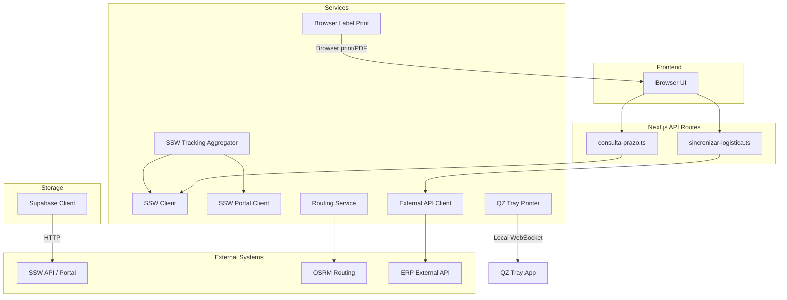
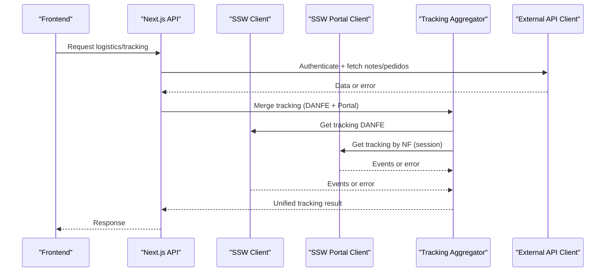
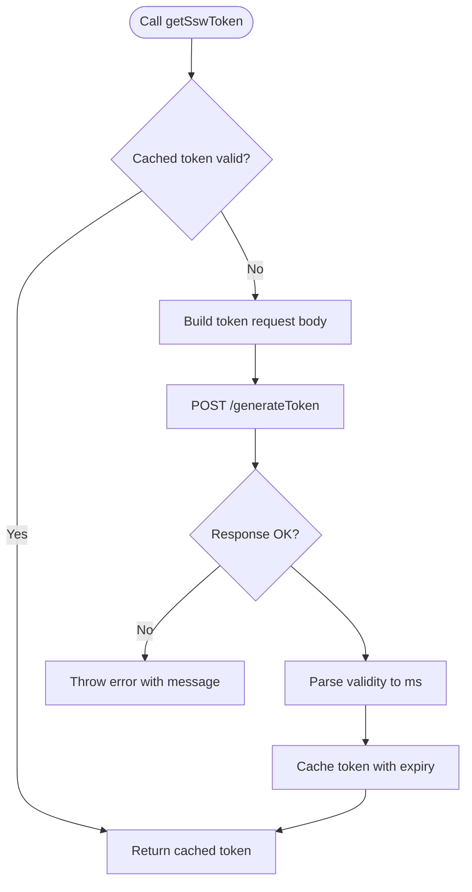
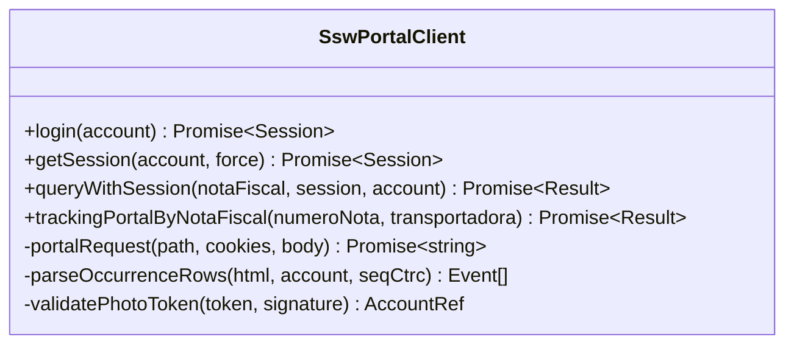
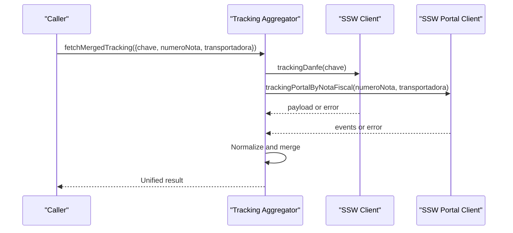
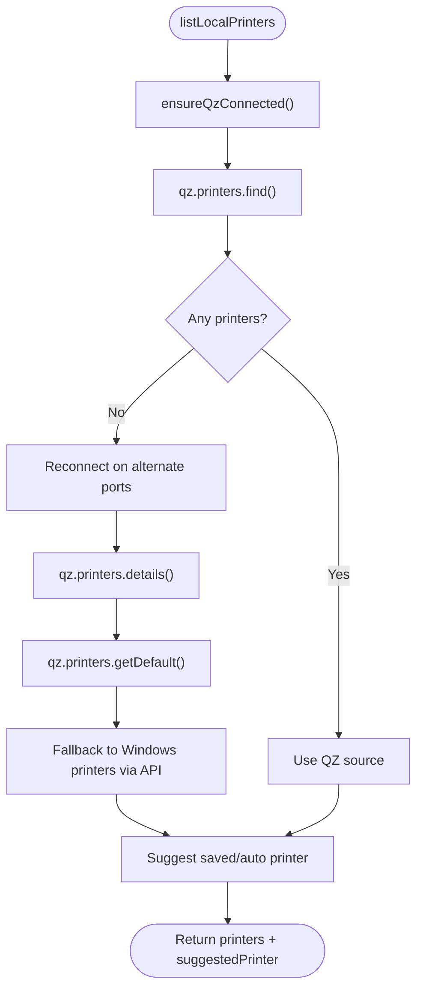
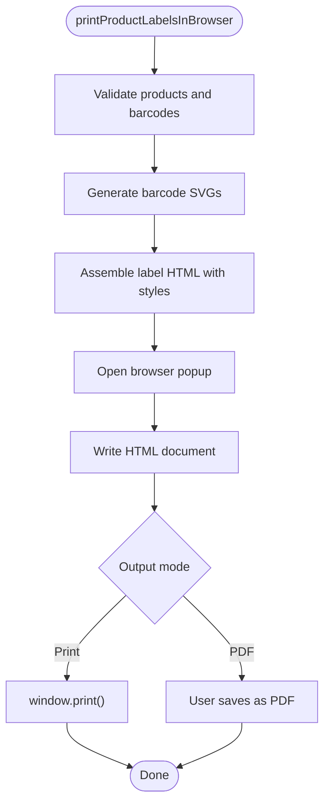
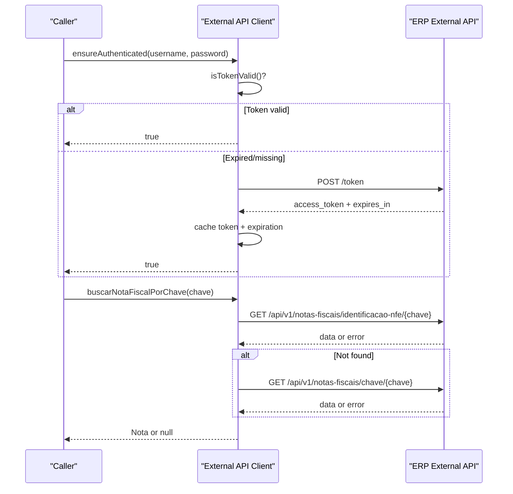
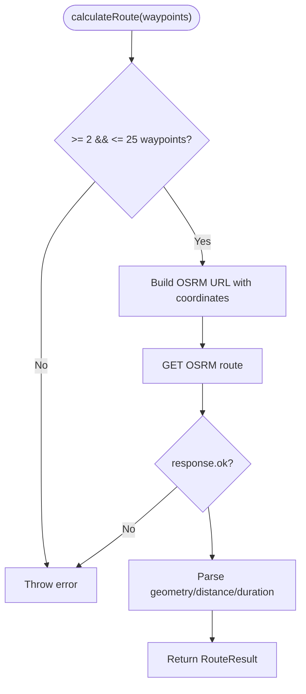
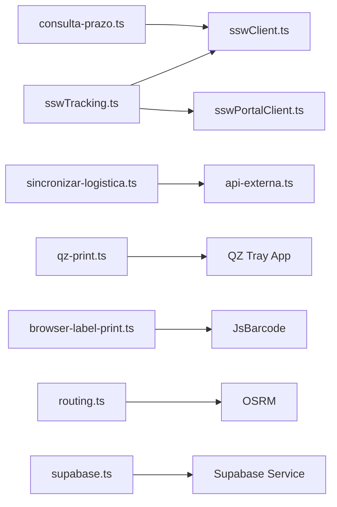

# Services & Integrations

<cite>
**Referenced Files in This Document**
- [sswClient.ts](file://services/sswClient.ts)
- [sswPortalClient.ts](file://services/sswPortalClient.ts)
- [sswTracking.ts](file://services/sswTracking.ts)
- [qz-print.ts](file://services/qz-print.ts)
- [browser-label-print.ts](file://services/browser-label-print.ts)
- [supabase.ts](file://lib/supabase.ts)
- [roteirizacao.ts](file://services/roteirizacao.ts)
- [routing.ts](file://services/routing.ts)
- [api-externa.ts](file://services/api-externa.ts)
- [consulta-prazo.ts](file://pages/api/ssw_accert/consulta-prazo.ts)
- [sincronizar-logistica.ts](file://pages/api/dashboard/sincronizar-logistica.ts)
</cite>

## Table of Contents
1. [Introduction](#introduction)
2. [Project Structure](#project-structure)
3. [Core Components](#core-components)
4. [Architecture Overview](#architecture-overview)
5. [Detailed Component Analysis](#detailed-component-analysis)
6. [Dependency Analysis](#dependency-analysis)
7. [Performance Considerations](#performance-considerations)
8. [Troubleshooting Guide](#troubleshooting-guide)
9. [Conclusion](#conclusion)
10. [Appendices](#appendices)

## Introduction
This document explains the external services and integrations used by the application, focusing on:
- SSW ERP client for external data synchronization and tracking
- QZ Tray integration for Zebra printer support
- Browser-based label printing
- Supabase storage integration
- Route planning services (local routing service and OSRM)

For each service, you will find configuration requirements, authentication methods, API usage patterns, error handling strategies, and fallback mechanisms. It also includes guidance for integrating new services, handling network failures, and optimizing performance for external API calls.

## Project Structure
External integrations are primarily implemented under:
- services/: HTTP clients and domain-specific logic for SSW, QZ Tray, browser printing, routing, and external APIs
- lib/: Shared utilities including Supabase client
- pages/api/: Next.js API routes that expose internal integrations to the frontend or scheduled jobs

**Diagram sources**
- [consulta-prazo.ts:1-36](file://pages/api/ssw_accert/consulta-prazo.ts#L1-L36)
- [sincronizar-logistica.ts:1-76](file://pages/api/dashboard/sincronizar-logistica.ts#L1-L76)
- [sswClient.ts:1-445](file://services/sswClient.ts#L1-L445)
- [sswPortalClient.ts:1-578](file://services/sswPortalClient.ts#L1-L578)
- [sswTracking.ts:1-481](file://services/sswTracking.ts#L1-L481)
- [qz-print.ts:1-205](file://services/qz-print.ts#L1-L205)
- [browser-label-print.ts:1-1026](file://services/browser-label-print.ts#L1-L1026)
- [routing.ts:1-68](file://services/routing.ts#L1-L68)
- [api-externa.ts:1-1058](file://services/api-externa.ts#L1-L1058)
- [supabase.ts:1-9](file://lib/supabase.ts#L1-L9)

**Section sources**
- [consulta-prazo.ts:1-36](file://pages/api/ssw_accert/consulta-prazo.ts#L1-L36)
- [sincronizar-logistica.ts:1-76](file://pages/api/dashboard/sincronizar-logistica.ts#L1-L76)

## Core Components
- SSW ERP Client: Token-based access to SSW API endpoints; supports token caching and validity parsing.
- SSW Portal Client: Session-based scraping of SSW portal with cookie management, multi-account support, and image retrieval.
- SSW Tracking Aggregator: Merges results from SSW tracking DANFE and portal into a unified result set.
- QZ Tray Integration: Connects to local QZ Tray app, lists printers, prints raw ZPL, and detects status/fallbacks.
- Browser Label Printing: Generates HTML labels with barcodes and opens a print dialog or PDF via browser.
- External API Client: Axios-based client with login, token caching, timeouts, retries, and multiple query strategies.
- Routing Services: Local route planner and OSRM-based distance/duration calculation.
- Supabase Client: Minimal client initialization for storage and database operations.

**Section sources**
- [sswClient.ts:1-445](file://services/sswClient.ts#L1-L445)
- [sswPortalClient.ts:1-578](file://services/sswPortalClient.ts#L1-L578)
- [sswTracking.ts:1-481](file://services/sswTracking.ts#L1-L481)
- [qz-print.ts:1-205](file://services/qz-print.ts#L1-L205)
- [browser-label-print.ts:1-1026](file://services/browser-label-print.ts#L1-L1026)
- [api-externa.ts:1-1058](file://services/api-externa.ts#L1-L1058)
- [routing.ts:1-68](file://services/routing.ts#L1-L68)
- [supabase.ts:1-9](file://lib/supabase.ts#L1-L9)

## Architecture Overview
The system integrates with multiple external systems through dedicated service modules. Authentication is handled per service:
- SSW API uses token-based auth with cached tokens and validity windows.
- SSW Portal uses session cookies with multi-account support and request queuing.
- External ERP API uses OAuth-like password grant with token caching and retry backoff.
- QZ Tray uses local WebSocket connection with certificate/signature support.
- Routing uses public OSRM endpoint without credentials.

**Diagram sources**
- [sswClient.ts:50-153](file://services/sswClient.ts#L50-L153)
- [sswPortalClient.ts:176-222](file://services/sswPortalClient.ts#L176-L222)
- [sswTracking.ts:393-479](file://services/sswTracking.ts#L393-L479)
- [api-externa.ts:167-248](file://services/api-externa.ts#L167-L248)

## Detailed Component Analysis

### SSW ERP Client
- Configuration: Base URL and environment variables for domain, username, password, CNPJ EDI.
- Authentication: POST to generateToken with domain/username/password/cnpj_EDI; token cached with parsed validity window minus buffer.
- API Usage: Generic GET/POST helpers attach Authorization header; specific functions for clients, CEP, prazo, and tracking DANFE.
- Error Handling: Throws errors for non-OK responses, invalid JSON, missing fields; logs messages for debugging.
- Fallbacks: None at this layer; higher layers may retry or switch sources.

**Diagram sources**
- [sswClient.ts:50-100](file://services/sswClient.ts#L50-L100)

**Section sources**
- [sswClient.ts:1-222](file://services/sswClient.ts#L1-L222)

### SSW Portal Client
- Configuration: Multiple accounts (ACCERT, Expresso Goias, Zanuello) via environment variables; preferred account selection based on transportadora normalization.
- Authentication: Login flow posts to portal login page, captures cookies, navigates menus, sets session with expiration.
- API Usage: Scrapes HTML for occurrences and images; queues requests per account to avoid race conditions; validates photo tokens with HMAC signatures.
- Error Handling: Throws errors for failed logins, expired sessions, invalid image references; retries with forced re-login when needed.
- Fallbacks: Tries multiple URLs for image retrieval; falls back to alternative endpoints if placeholder detected.

**Diagram sources**
- [sswPortalClient.ts:176-222](file://services/sswPortalClient.ts#L176-L222)
- [sswPortalClient.ts:485-578](file://services/sswPortalClient.ts#L485-L578)

**Section sources**
- [sswPortalClient.ts:1-578](file://services/sswPortalClient.ts#L1-L578)

### SSW Tracking Aggregator
- Purpose: Merges tracking data from SSW DANFE and SSW Portal into a normalized result set.
- Behavior: Runs both queries concurrently; prefers portal events if available; otherwise falls back to DANFE; normalizes fields and determines delivery status.
- Error Handling: Captures errors from both sources; returns not found state with aggregated message if no payload.

**Diagram sources**
- [sswTracking.ts:393-479](file://services/sswTracking.ts#L393-L479)
- [sswClient.ts:183-222](file://services/sswClient.ts#L183-L222)
- [sswPortalClient.ts:534-578](file://services/sswPortalClient.ts#L534-L578)

**Section sources**
- [sswTracking.ts:1-481](file://services/sswTracking.ts#L1-L481)

### QZ Tray Integration
- Configuration: Security certificate and signature endpoint via environment variables; connection options for host and ports; auto-detection of Zebra-compatible printers.
- Authentication: Optional signature endpoint for secure signing; certificate configured via promise.
- API Usage: Connects via WebSocket; lists printers using qz.printers.find/details/default; prints raw ZPL commands.
- Error Handling: Detects installation/authorization issues; maps error messages to codes like not_installed, authorization_required, error.
- Fallbacks: If QZ cannot list printers, tries Windows printers via local API endpoint; reconnects on port mismatch.

**Diagram sources**
- [qz-print.ts:52-146](file://services/qz-print.ts#L52-L146)

**Section sources**
- [qz-print.ts:1-205](file://services/qz-print.ts#L1-L205)

### Browser-Based Label Printing
- Configuration: Supports multiple label types (unitary, closed box, A4 horizontal/vertical variants); generates SVG barcodes using JsBarcode.
- API Usage: Builds HTML with embedded styles and scripts; opens a popup window for preview/print; supports PDF generation via browser print dialog.
- Error Handling: Validates barcode formats; throws errors for invalid barcodes or blocked popups.
- Fallbacks: Uses default printer name if none provided; adjusts layout based on label type.

**Diagram sources**
- [browser-label-print.ts:109-185](file://services/browser-label-print.ts#L109-L185)
- [browser-label-print.ts:675-684](file://services/browser-label-print.ts#L675-L684)

**Section sources**
- [browser-label-print.ts:1-1026](file://services/browser-label-print.ts#L1-L1026)

### External API Client
- Configuration: Base URL from environment variables; timeouts for general and login requests; token TTL fallback.
- Authentication: Password grant to /token; attaches Bearer token via interceptor; handles 401 by clearing state and rejecting to trigger refresh.
- API Usage: Methods to fetch notes, clients, orders, and paginated lists; supports multiple query strategies and fallbacks (e.g., buscarNotaFiscalPorNumeroSerie tries identificacao-nfe).
- Error Handling: Logs detailed errors; blocks rapid login retries; returns null or empty arrays on failure to keep UI responsive.
- Fallbacks: Tries multiple endpoints for note lookup; validates status < 500 to capture 4xx gracefully.

**Diagram sources**
- [api-externa.ts:167-248](file://services/api-externa.ts#L167-L248)
- [api-externa.ts:302-347](file://services/api-externa.ts#L302-L347)

**Section sources**
- [api-externa.ts:1-1058](file://services/api-externa.ts#L1-L1058)

### Routing Services
- Local Route Planner: Groups deliveries by city/bairro/logradouro; creates boxes with capacity limits; sorts addresses for optimization.
- OSRM Routing: Calculates geometry, distance, duration using public OSRM endpoint; enforces waypoint limits; formats units.
- Error Handling: Throws errors for insufficient waypoints, exceeding limits, or non-OK responses; returns formatted strings for display.

**Diagram sources**
- [routing.ts:11-49](file://services/routing.ts#L11-L49)

**Section sources**
- [roteirizacao.ts:35-231](file://services/roteirizacao.ts#L35-L231)
- [routing.ts:1-68](file://services/routing.ts#L1-L68)

### Supabase Storage Integration
- Configuration: Initializes client with NEXT_PUBLIC_SUPABASE_URL and NEXT_PUBLIC_SUPABASE_ANON_KEY.
- Usage: Exported client instance for database/storage operations throughout the app.
- Error Handling: Relies on Supabase SDK error handling; minimal wrapper here.

**Section sources**
- [supabase.ts:1-9](file://lib/supabase.ts#L1-L9)

## Dependency Analysis
- SSW Tracking depends on both SSW Client and SSW Portal Client; merges results and normalizes fields.
- External API Client is used by dashboard synchronization and other features; provides robust authentication and fallback strategies.
- QZ Tray and Browser Label Printing are independent; QZ targets local hardware while Browser printing targets user’s browser.
- Routing Services are independent; local grouping vs OSRM calculation.

**Diagram sources**
- [sswTracking.ts:393-479](file://services/sswTracking.ts#L393-L479)
- [consulta-prazo.ts:1-36](file://pages/api/ssw_accert/consulta-prazo.ts#L1-L36)
- [sincronizar-logistica.ts:1-76](file://pages/api/dashboard/sincronizar-logistica.ts#L1-L76)
- [qz-print.ts:1-205](file://services/qz-print.ts#L1-L205)
- [browser-label-print.ts:1-1026](file://services/browser-label-print.ts#L1-L1026)
- [routing.ts:1-68](file://services/routing.ts#L1-L68)
- [supabase.ts:1-9](file://lib/supabase.ts#L1-L9)

**Section sources**
- [sswTracking.ts:1-481](file://services/sswTracking.ts#L1-L481)
- [consulta-prazo.ts:1-36](file://pages/api/ssw_accert/consulta-prazo.ts#L1-L36)
- [sincronizar-logistica.ts:1-76](file://pages/api/dashboard/sincronizar-logistica.ts#L1-L76)

## Performance Considerations
- Token Caching: SSW and External API clients cache tokens with validity checks to reduce authentication overhead.
- Concurrency: SSW Tracking aggregator runs DANFE and Portal queries concurrently to minimize latency.
- Timeouts: External API client defines explicit timeouts for general and login requests to prevent hanging.
- Retry Backoff: External API client blocks repeated login attempts after failures to avoid abuse.
- Printer Discovery: QZ Tray tries multiple discovery methods and fallbacks to improve reliability.
- Batch Limits: External API listing methods cap limits to avoid large payloads and timeouts.

[No sources needed since this section provides general guidance]

## Troubleshooting Guide
- SSW Token Generation Failures:
  - Ensure environment variables for domain, username, password, CNPJ EDI are set.
  - Check response messages for details; token validity parsing assumes HH:MM:SS format.
- SSW Portal Login Issues:
  - Verify all account credentials; prefer account matching transportadora.
  - If session expires, forced re-login is attempted automatically.
- QZ Tray Not Found:
  - Install QZ Tray and keep it running; check certificate/signature configuration.
  - Use fallback to Windows printers via local API if QZ cannot list devices.
- External API Errors:
  - Inspect logs for 401/403/5xx; ensure credentials are correct.
  - Use fallback endpoints for note lookups; validate status < 500 to handle client errors gracefully.
- Routing Errors:
  - Ensure at least 2 waypoints and no more than 25 per request.
  - Handle non-OK responses from OSRM; use formatting helpers for display.

**Section sources**
- [sswClient.ts:41-100](file://services/sswClient.ts#L41-L100)
- [sswPortalClient.ts:176-222](file://services/sswPortalClient.ts#L176-L222)
- [qz-print.ts:159-205](file://services/qz-print.ts#L159-L205)
- [api-externa.ts:167-248](file://services/api-externa.ts#L167-L248)
- [routing.ts:11-49](file://services/routing.ts#L11-L49)

## Conclusion
The application integrates multiple external services with robust authentication, caching, and error-handling strategies. SSW ERP interactions cover both API and portal flows, merged into a unified tracking experience. QZ Tray and browser printing provide flexible label output options. The external API client offers resilient access to ERP data with fallbacks and timeouts. Routing services support local planning and OSRM-based calculations. Following the configuration and troubleshooting guidance will help maintain reliable integrations and optimize performance.

[No sources needed since this section summarizes without analyzing specific files]

## Appendices

### Configuration Requirements Summary
- SSW ERP Client:
  - Environment variables: SSW_ACCERT_DOMAIN, SSW_ACCERT_USERNAME, SSW_ACCERT_PASSWORD, SSW_ACCERT_CNPJ_EDI
- SSW Portal Client:
  - Environment variables: SSW_ACCERT_* and equivalents for EXPRESSO_GOIAS and ZANUELLO
- External API Client:
  - Environment variables: API_EXTERNA_BASE_URL (or API_URL), API_EXTERNA_USERNAME, API_EXTERNA_PASSWORD
- QZ Tray:
  - Environment variables: NEXT_PUBLIC_QZ_TRAY_CERT, NEXT_PUBLIC_QZ_TRAY_SIGNATURE_ENDPOINT
- Supabase:
  - Environment variables: NEXT_PUBLIC_SUPABASE_URL, NEXT_PUBLIC_SUPABASE_ANON_KEY

[No sources needed since this section aggregates known configuration from referenced files]

### Example: Integrating a New External Service
- Define base URL and timeouts in a dedicated service module.
- Implement authentication with token/session caching and retry/backoff logic.
- Add error handling that distinguishes network, auth, and server errors.
- Provide fallback strategies (alternate endpoints, degraded modes).
- Expose typed methods for consumers; add API routes if needed for frontend access.
- Log detailed context for debugging and monitoring.

[No sources needed since this section provides general guidance]