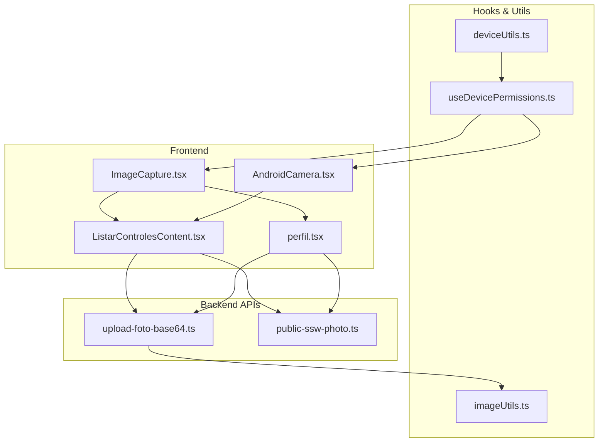
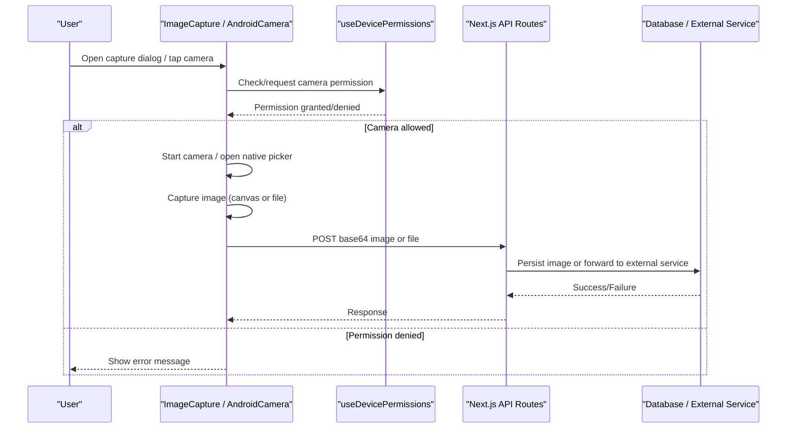
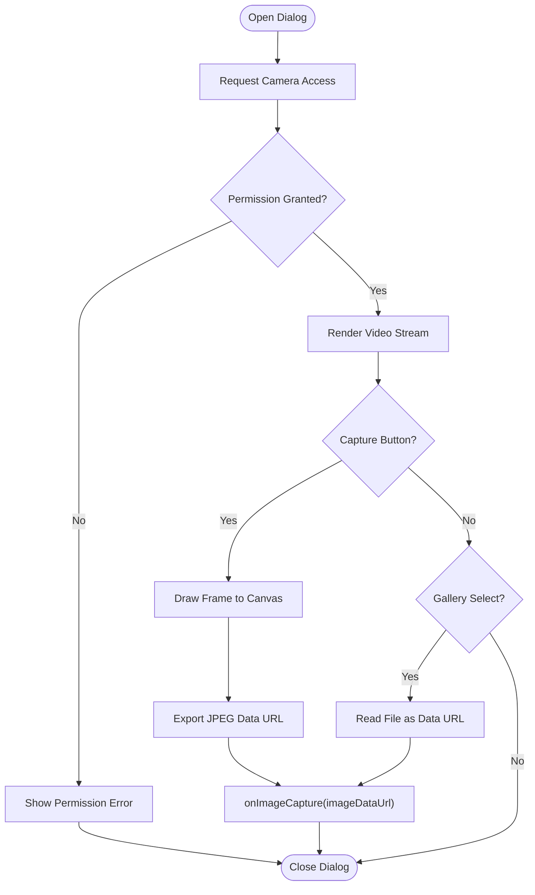
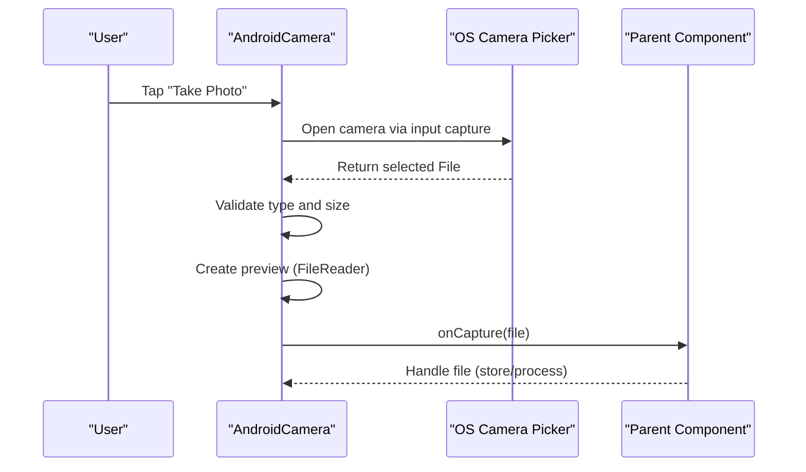
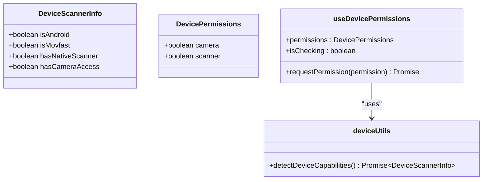
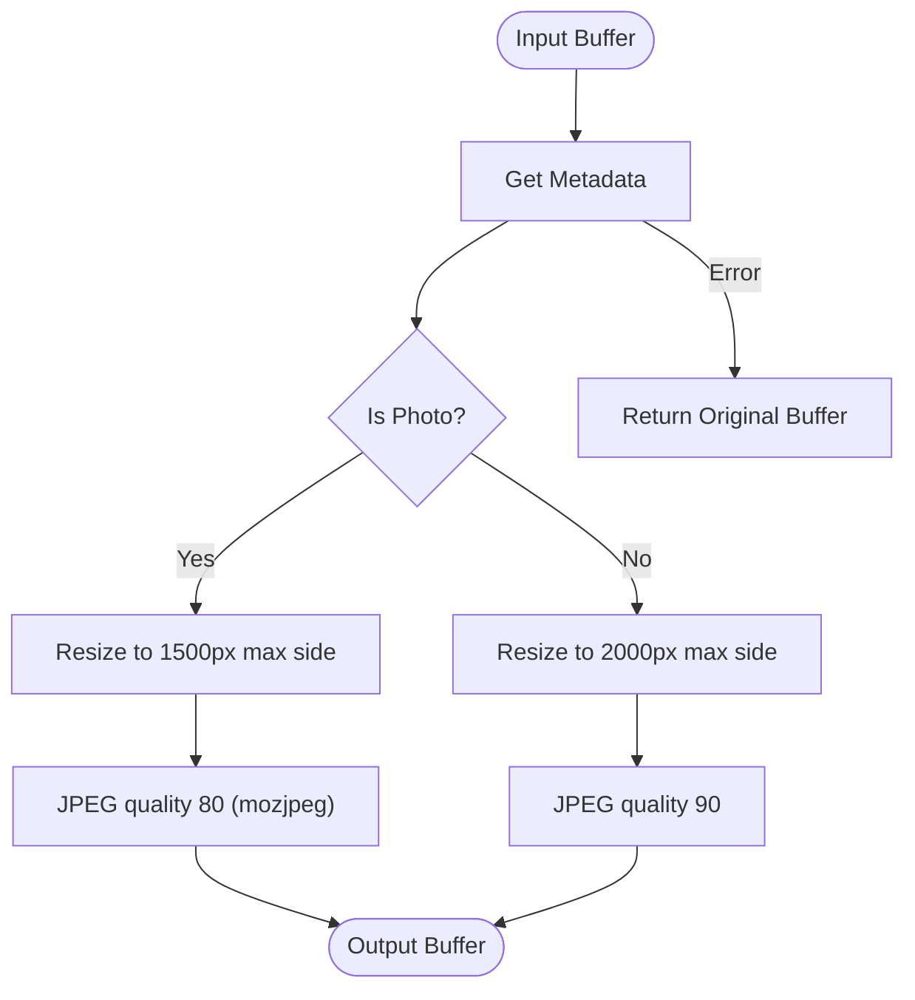
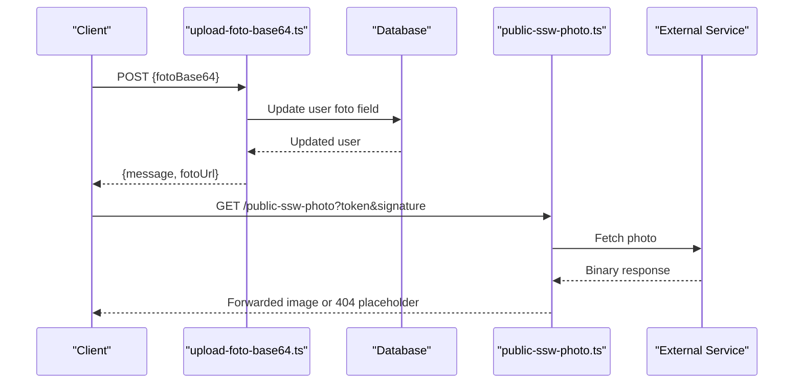
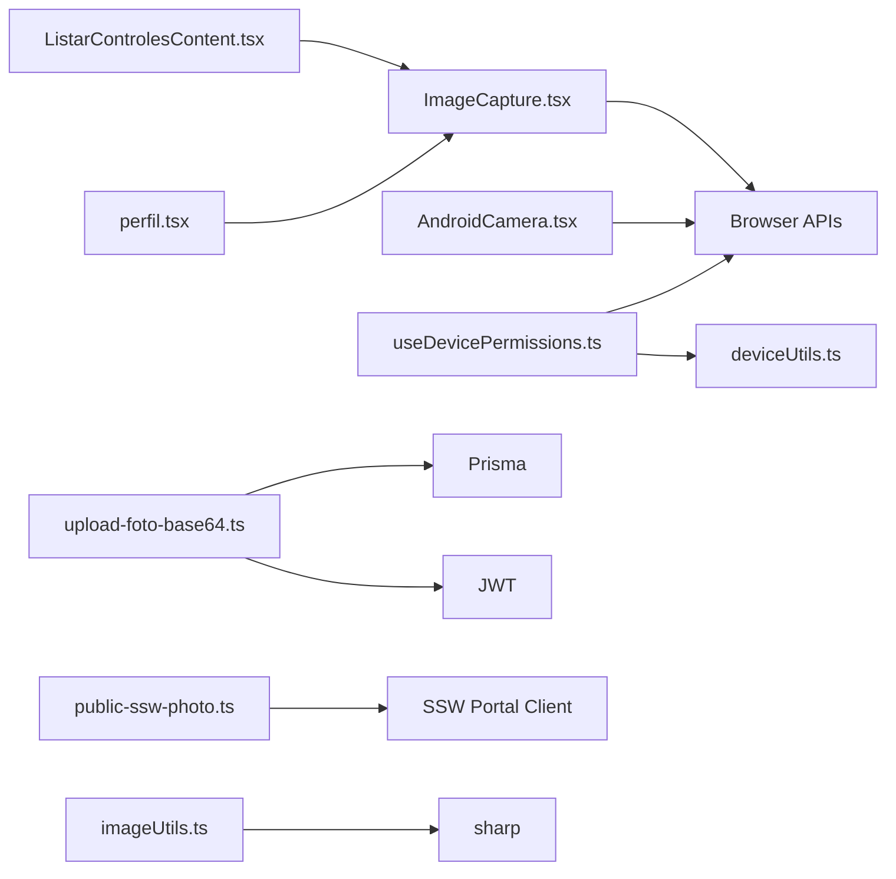

# Image Processing & Capture

<cite>
**Referenced Files in This Document**
- [ImageCapture.tsx](file://components/ImageCapture.tsx)
- [AndroidCamera.tsx](file://components/AndroidCamera.tsx)
- [imageUtils.ts](file://lib/imageUtils.ts)
- [useDevicePermissions.ts](file://hooks/useDevicePermissions.ts)
- [deviceUtils.ts](file://lib/deviceUtils.ts)
- [upload-foto-base64.ts](file://pages/api/usuarios/upload-foto-base64.ts)
- [public-ssw-photo.ts](file://pages/api/public-ssw-photo.ts)
- [ListarControlesContent.tsx](file://components/ListarControlesContent.tsx)
- [perfil.tsx](file://pages/perfil.tsx)
</cite>

## Table of Contents
1. Introduction
2. Project Structure
3. Core Components
4. Architecture Overview
5. Detailed Component Analysis
6. Dependency Analysis
7. Performance Considerations
8. Troubleshooting Guide
9. Conclusion

## Introduction
This document explains the image capture, processing, and storage capabilities implemented in the application. It covers:
- Camera capture on desktop and mobile (including Android), gallery selection, and file uploads
- Image optimization using server-side compression and resizing
- Format handling and metadata considerations
- API endpoints for storing base64 images and proxying external photos
- Device capability detection and permission flows
- Practical workflows for product photos, uploaded images, thumbnails, and optimized storage
- Performance guidance for large batches, memory management, and error handling

## Project Structure
The image-related functionality is organized across UI components, hooks, utilities, and API routes:
- UI capture components:
  - Desktop/mobile camera dialog with canvas-based capture and gallery selection
  - Mobile-native camera picker via input capture attribute
- Utilities:
  - Server-side image optimization with resizing and JPEG compression
  - Device capability detection and permission helpers
- API routes:
  - Base64 photo upload to persist user profile images
  - Proxy endpoint to fetch external photos with caching and content-type forwarding

**Diagram sources**
- [ImageCapture.tsx:1-234](file://components/ImageCapture.tsx#L1-L234)
- [AndroidCamera.tsx:1-219](file://components/AndroidCamera.tsx#L1-L219)
- [useDevicePermissions.ts:1-69](file://hooks/useDevicePermissions.ts#L1-L69)
- [deviceUtils.ts:1-39](file://lib/deviceUtils.ts#L1-L39)
- [imageUtils.ts:1-38](file://lib/imageUtils.ts#L1-L38)
- [upload-foto-base64.ts:1-49](file://pages/api/usuarios/upload-foto-base64.ts#L1-L49)
- [public-ssw-photo.ts:1-48](file://pages/api/public-ssw-photo.ts#L1-L48)
- [ListarControlesContent.tsx:3038-3044](file://components/ListarControlesContent.tsx#L3038-L3044)
- [perfil.tsx:481](file://pages/perfil.tsx#L481)

**Section sources**
- [ImageCapture.tsx:1-234](file://components/ImageCapture.tsx#L1-L234)
- [AndroidCamera.tsx:1-219](file://components/AndroidCamera.tsx#L1-L219)
- [useDevicePermissions.ts:1-69](file://hooks/useDevicePermissions.ts#L1-L69)
- [deviceUtils.ts:1-39](file://lib/deviceUtils.ts#L1-L39)
- [imageUtils.ts:1-38](file://lib/imageUtils.ts#L1-L38)
- [upload-foto-base64.ts:1-49](file://pages/api/usuarios/upload-foto-base64.ts#L1-L49)
- [public-ssw-photo.ts:1-48](file://pages/api/public-ssw-photo.ts#L1-L48)
- [ListarControlesContent.tsx:3038-3044](file://components/ListarControlesContent.tsx#L3038-L3044)
- [perfil.tsx:481](file://pages/perfil.tsx#L481)

## Core Components
- ImageCapture component:
  - Opens a dialog to start the camera, stream video, capture frames to a canvas, and convert to data URL (JPEG at a fixed quality). Also supports selecting from the device gallery.
  - Handles camera lifecycle (start/stop) and shows errors if permissions are denied.
- AndroidCamera component:
  - Uses an input element with capture="environment" to open the native camera on mobile devices. Validates file type and size, generates a preview, and emits the selected File to the parent.
- useDevicePermissions hook:
  - Detects device capabilities and requests camera permission by probing getUserMedia. Returns current permission state and a request function.
- deviceUtils utility:
  - Detects platform features such as Android presence and native scanner availability; also checks for camera access via enumerateDevices.
- imageUtils utility:
  - Server-side optimization using sharp: resizes oversized images and compresses to JPEG with configurable quality. Differentiates between photos and documents with different thresholds and quality settings.
- API endpoints:
  - upload-foto-base64.ts: Accepts a base64-encoded image payload, validates it, and persists it to the database for the authenticated user.
  - public-ssw-photo.ts: Proxies external photos with content-type forwarding, caching headers, and placeholder detection.

**Section sources**
- [ImageCapture.tsx:44-103](file://components/ImageCapture.tsx#L44-L103)
- [AndroidCamera.tsx:43-77](file://components/AndroidCamera.tsx#L43-L77)
- [useDevicePermissions.ts:17-62](file://hooks/useDevicePermissions.ts#L17-L62)
- [deviceUtils.ts:8-38](file://lib/deviceUtils.ts#L8-L38)
- [imageUtils.ts:3-38](file://lib/imageUtils.ts#L3-L38)
- [upload-foto-base64.ts:13-48](file://pages/api/usuarios/upload-foto-base64.ts#L13-L48)
- [public-ssw-photo.ts:10-47](file://pages/api/public-ssw-photo.ts#L10-L47)

## Architecture Overview
The capture flow integrates frontend components with backend services:
- Frontend captures images via camera or gallery, optionally optimizes client-side (e.g., JPEG conversion), and sends payloads to APIs.
- Backend validates inputs, persists images, and proxies external resources when needed.
- Device capability detection informs UI behavior and permission prompts.

**Diagram sources**
- [ImageCapture.tsx:44-103](file://components/ImageCapture.tsx#L44-L103)
- [AndroidCamera.tsx:43-77](file://components/AndroidCamera.tsx#L43-L77)
- [useDevicePermissions.ts:17-62](file://hooks/useDevicePermissions.ts#L17-L62)
- [upload-foto-base64.ts:13-48](file://pages/api/usuarios/upload-foto-base64.ts#L13-L48)
- [public-ssw-photo.ts:10-47](file://pages/api/public-ssw-photo.ts#L10-L47)

## Detailed Component Analysis

### ImageCapture Component
Responsibilities:
- Request camera access and render a live video stream
- Capture frames to a hidden canvas and export as JPEG data URL
- Allow gallery selection via a hidden file input
- Manage camera lifecycle and display errors for permission issues

Key behaviors:
- Camera start uses navigator.mediaDevices.getUserMedia with environment-facing preference
- Capture draws video frame onto canvas and exports toDataURL with JPEG quality
- Gallery selection reads files and converts to data URL
- Error states inform users about permission problems

**Diagram sources**
- [ImageCapture.tsx:44-103](file://components/ImageCapture.tsx#L44-L103)
- [ImageCapture.tsx:110-229](file://components/ImageCapture.tsx#L110-L229)

**Section sources**
- [ImageCapture.tsx:44-103](file://components/ImageCapture.tsx#L44-L103)
- [ImageCapture.tsx:110-229](file://components/ImageCapture.tsx#L110-L229)

### AndroidCamera Component
Responsibilities:
- Trigger native camera on mobile using capture="environment"
- Validate file type and size (max 10MB)
- Generate preview and emit File to parent
- Provide UI feedback and replace/clear actions

Key behaviors:
- Hidden input with accept="image/*" and capture="environment"
- FileReader used to create preview
- Parent receives File via onCapture callback

**Diagram sources**
- [AndroidCamera.tsx:43-77](file://components/AndroidCamera.tsx#L43-L77)
- [AndroidCamera.tsx:94-213](file://components/AndroidCamera.tsx#L94-L213)

**Section sources**
- [AndroidCamera.tsx:43-77](file://components/AndroidCamera.tsx#L43-L77)
- [AndroidCamera.tsx:94-213](file://components/AndroidCamera.tsx#L94-L213)

### Device Permissions and Capabilities
Responsibilities:
- Detect device capabilities (Android, native scanner)
- Probe camera permission by attempting getUserMedia
- Expose functions to request permissions and report status

Key behaviors:
- detectDeviceCapabilities enumerates devices and infers scanner availability
- useDevicePermissions attempts camera access and updates state accordingly
- Provides a requestPermission helper to re-attempt permission

**Diagram sources**
- [useDevicePermissions.ts:1-69](file://hooks/useDevicePermissions.ts#L1-L69)
- [deviceUtils.ts:1-39](file://lib/deviceUtils.ts#L1-L39)

**Section sources**
- [useDevicePermissions.ts:17-62](file://hooks/useDevicePermissions.ts#L17-L62)
- [deviceUtils.ts:8-38](file://lib/deviceUtils.ts#L8-L38)

### Server-Side Image Optimization
Responsibilities:
- Resize images exceeding dimension thresholds while preserving aspect ratio
- Convert to JPEG with quality settings tailored for photos vs documents
- Return optimized buffer or fallback to original on error

Optimization details:
- Photos: resize max side to 1500px, then JPEG with quality 80 and mozjpeg enabled
- Documents: resize max side to 2000px, then JPEG with quality 90
- Errors return the original buffer to avoid data loss

**Diagram sources**
- [imageUtils.ts:3-38](file://lib/imageUtils.ts#L3-L38)

**Section sources**
- [imageUtils.ts:3-38](file://lib/imageUtils.ts#L3-L38)

### API Endpoints for Images
- Upload base64 photo:
  - Validates method, authenticates via token, ensures payload starts with data:image/ prefix
  - Persists base64 string to the user record
  - Returns success with updated URL or error messages
- Public photo proxy:
  - Forwards external photo responses with appropriate content-type and cache headers
  - Detects loading placeholders and returns 404 with descriptive error
  - Catches and reports transport errors

**Diagram sources**
- [upload-foto-base64.ts:13-48](file://pages/api/usuarios/upload-foto-base64.ts#L13-L48)
- [public-ssw-photo.ts:10-47](file://pages/api/public-ssw-photo.ts#L10-L47)

**Section sources**
- [upload-foto-base64.ts:13-48](file://pages/api/usuarios/upload-foto-base64.ts#L13-L48)
- [public-ssw-photo.ts:10-47](file://pages/api/public-ssw-photo.ts#L10-L47)

### Integration Points in Pages
- ListarControlesContent uses ImageCapture to add images to controls and invokes handlers to process captured images.
- perfil page includes ImageCapture for updating user profile photos.

These pages orchestrate opening dialogs, handling callbacks, and integrating with backend APIs.

**Section sources**
- [ListarControlesContent.tsx:3038-3044](file://components/ListarControlesContent.tsx#L3038-L3044)
- [perfil.tsx:481](file://pages/perfil.tsx#L481)

## Dependency Analysis
- Frontend dependencies:
  - ImageCapture depends on browser APIs (getUserMedia, Canvas) and MUI components
  - AndroidCamera depends on HTML input capture and FileReader
  - useDevicePermissions depends on deviceUtils and browser media APIs
- Backend dependencies:
  - upload-foto-base64 depends on Prisma and JWT verification
  - public-ssw-photo depends on external portal client for fetching photos
- Utility dependencies:
  - imageUtils depends on sharp for image processing

**Diagram sources**
- [ImageCapture.tsx:1-234](file://components/ImageCapture.tsx#L1-L234)
- [AndroidCamera.tsx:1-219](file://components/AndroidCamera.tsx#L1-L219)
- [useDevicePermissions.ts:1-69](file://hooks/useDevicePermissions.ts#L1-L69)
- [deviceUtils.ts:1-39](file://lib/deviceUtils.ts#L1-L39)
- [upload-foto-base64.ts:1-49](file://pages/api/usuarios/upload-foto-base64.ts#L1-L49)
- [public-ssw-photo.ts:1-48](file://pages/api/public-ssw-photo.ts#L1-L48)
- [imageUtils.ts:1-38](file://lib/imageUtils.ts#L1-L38)

**Section sources**
- [ImageCapture.tsx:1-234](file://components/ImageCapture.tsx#L1-L234)
- [AndroidCamera.tsx:1-219](file://components/AndroidCamera.tsx#L1-L219)
- [useDevicePermissions.ts:1-69](file://hooks/useDevicePermissions.ts#L1-L69)
- [deviceUtils.ts:1-39](file://lib/deviceUtils.ts#L1-L39)
- [upload-foto-base64.ts:1-49](file://pages/api/usuarios/upload-foto-base64.ts#L1-L49)
- [public-ssw-photo.ts:1-48](file://pages/api/public-ssw-photo.ts#L1-L48)
- [imageUtils.ts:1-38](file://lib/imageUtils.ts#L1-L38)

## Performance Considerations
- Client-side capture:
  - Use JPEG conversion at moderate quality to reduce payload size before sending
  - Limit maximum image dimensions where possible to avoid large buffers
  - Reuse canvas elements and avoid unnecessary redraws
- Server-side optimization:
  - Apply resizing thresholds to prevent oversized images
  - Use efficient codecs (mozjpeg) for photos; higher quality for documents
  - Batch processing should be queued to avoid blocking event loops
- Memory management:
  - Release MediaStream tracks after capture to free camera resources
  - Clear temporary buffers and previews promptly
  - Avoid holding large base64 strings in memory longer than necessary
- Network and storage:
  - Enforce payload size limits on API routes
  - Cache proxied images with appropriate headers to reduce repeated fetches
  - Consider chunked uploads for very large images

[No sources needed since this section provides general guidance]

## Troubleshooting Guide
Common issues and resolutions:
- Camera permission denied:
  - Ensure HTTPS context and user-initiated gesture
  - Use permission probe to detect and prompt users to enable camera
  - Display clear error messages guiding users to browser/system settings
- No camera detected:
  - Verify enumerateDevices returns videoinput
  - On Android, ensure capture="environment" is set to trigger back camera
- Invalid image format:
  - Validate MIME types and data URL prefixes before processing
  - Reject non-image files early to save bandwidth and CPU
- Large files:
  - Enforce size limits on client and server
  - Provide feedback when files exceed limits
- External photo proxy failures:
  - Handle placeholder detection and return informative 404
  - Log and surface transport errors for debugging

**Section sources**
- [ImageCapture.tsx:44-58](file://components/ImageCapture.tsx#L44-L58)
- [AndroidCamera.tsx:49-61](file://components/AndroidCamera.tsx#L49-L61)
- [useDevicePermissions.ts:17-62](file://hooks/useDevicePermissions.ts#L17-L62)
- [upload-foto-base64.ts:28-32](file://pages/api/usuarios/upload-foto-base64.ts#L28-L32)
- [public-ssw-photo.ts:22-47](file://pages/api/public-ssw-photo.ts#L22-L47)

## Conclusion
The application implements a robust image capture and processing pipeline:
- Flexible capture options for desktop and mobile, including native camera integration
- Server-side optimization ensuring balanced quality and size
- Secure and validated API endpoints for storing and proxying images
- Device-aware permission handling to improve user experience
Adhering to the performance and troubleshooting recommendations will help maintain responsiveness and reliability across devices and usage scenarios.

[No sources needed since this section summarizes without analyzing specific files]