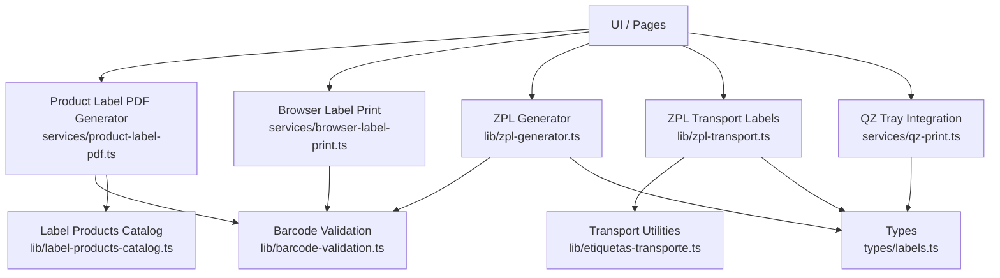
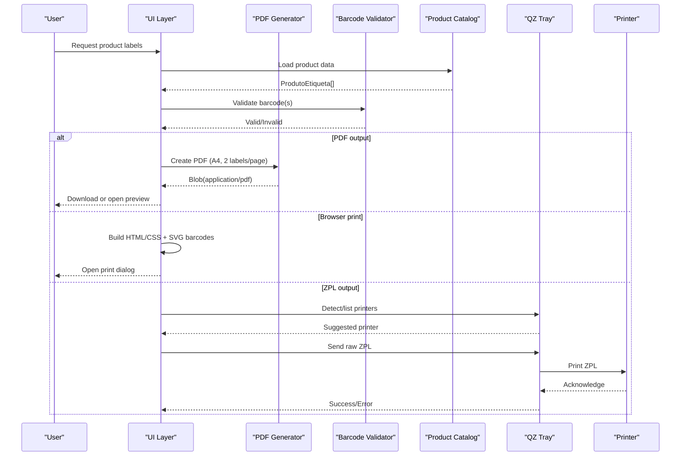
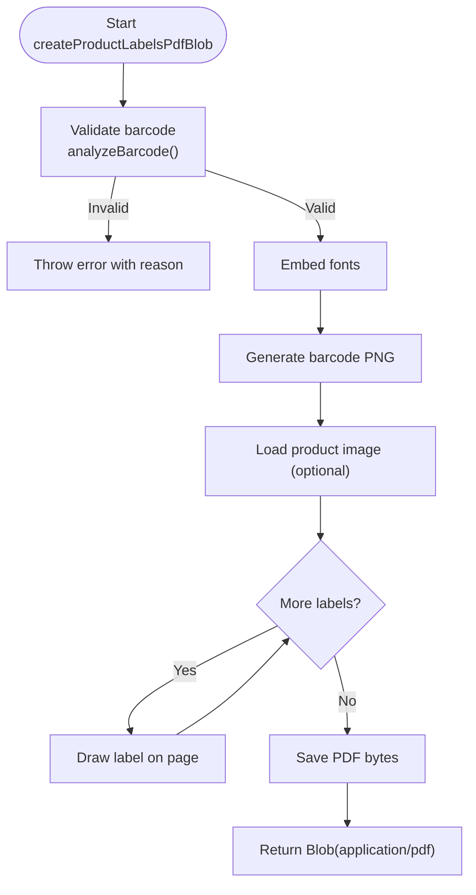
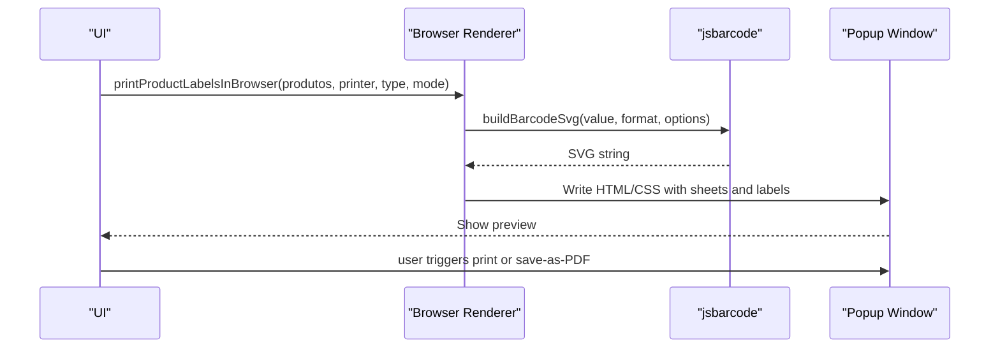
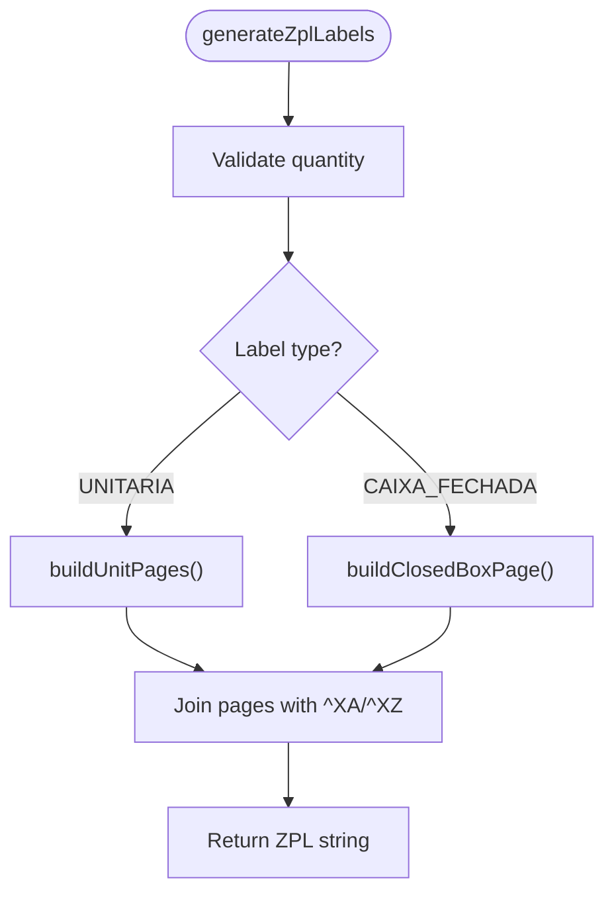
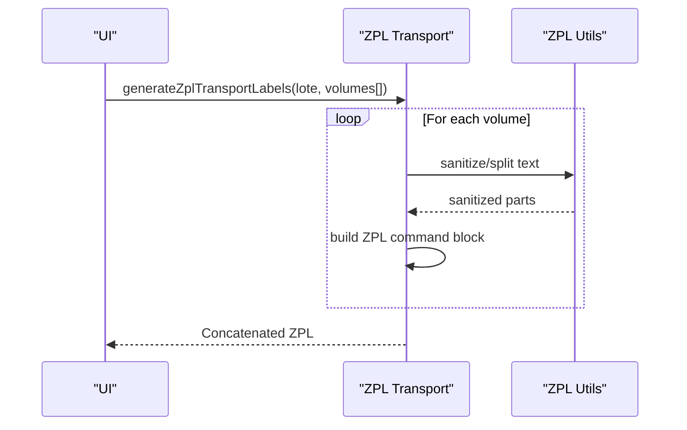
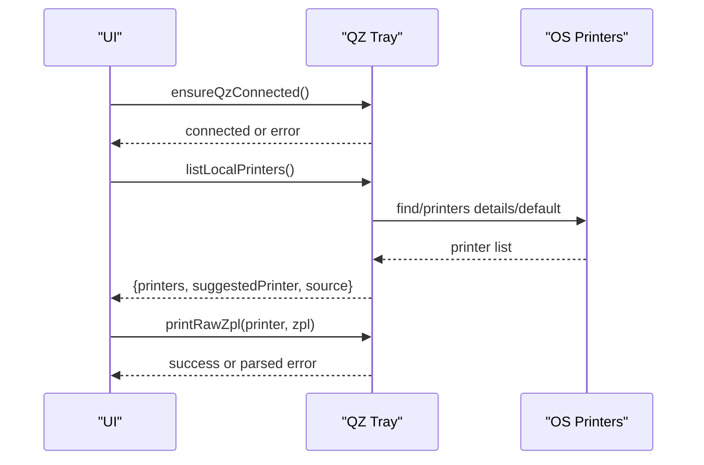
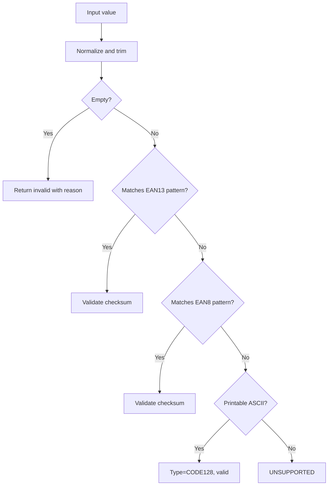
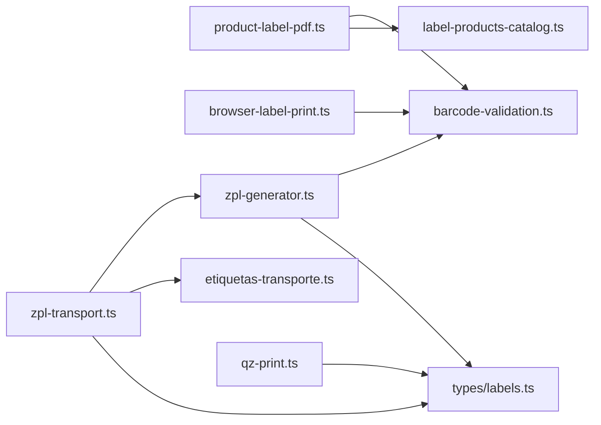

# PDF Generation Service

<cite>
**Referenced Files in This Document**
- [product-label-pdf.ts](file://services/product-label-pdf.ts)
- [zpl-generator.ts](file://lib/zpl-generator.ts)
- [zpl-transport.ts](file://lib/zpl-transport.ts)
- [browser-label-print.ts](file://services/browser-label-print.ts)
- [qz-print.ts](file://services/qz-print.ts)
- [barcode-validation.ts](file://lib/barcode-validation.ts)
- [label-products-catalog.ts](file://lib/label-products-catalog.ts)
- [etiquetas-repo.ts](file://lib/etiquetas-repo.ts)
- [etiquetas-transporte.ts](file://lib/etiquetas-transporte.ts)
- [labels.ts](file://types/labels.ts)
</cite>

## Table of Contents
1. Introduction
2. Project Structure
3. Core Components
4. Architecture Overview
5. Detailed Component Analysis
6. Dependency Analysis
7. Performance Considerations
8. Troubleshooting Guide
9. Conclusion
10. Appendices

## Introduction
This document explains the PDF generation and label printing services for product labels, shipping labels, and custom documents. It covers the end-to-end workflow from data input to final output, including template rendering, image embedding, barcode generation, supported formats, paper sizes, printer compatibility, batch processing performance, memory management, error handling, and integration with ZPL generators for direct printer communication via QZ Tray.

## Project Structure
The system is organized into reusable libraries and services:
- Product label PDF generation (client-side) using pdf-lib and jsbarcode
- Browser-based label preview and print (HTML/CSS + jsbarcode)
- ZPL generation for thermal printers (unit labels and closed box labels)
- Transport label ZPL generation per volume
- Barcode validation utilities
- Product catalog mapping for labels
- Persistence helpers for transport label batches and volumes
- QZ Tray integration for local printer discovery and raw ZPL printing

**Diagram sources**
- [product-label-pdf.ts:101-225](file://services/product-label-pdf.ts#L101-L225)
- [browser-label-print.ts:109-185](file://services/browser-label-print.ts#L109-L185)
- [zpl-generator.ts:78-170](file://lib/zpl-generator.ts#L78-L170)
- [zpl-transport.ts:13-70](file://lib/zpl-transport.ts#L13-L70)
- [qz-print.ts:52-157](file://services/qz-print.ts#L52-L157)
- [barcode-validation.ts:42-88](file://lib/barcode-validation.ts#L42-L88)
- [label-products-catalog.ts:14-43](file://lib/label-products-catalog.ts#L14-L43)
- [labels.ts:1-21](file://types/labels.ts#L1-L21)

**Section sources**
- [product-label-pdf.ts:1-402](file://services/product-label-pdf.ts#L1-L402)
- [browser-label-print.ts:1-800](file://services/browser-label-print.ts#L1-L800)
- [zpl-generator.ts:1-171](file://lib/zpl-generator.ts#L1-L171)
- [zpl-transport.ts:1-71](file://lib/zpl-transport.ts#L1-L71)
- [qz-print.ts:1-205](file://services/qz-print.ts#L1-L205)
- [barcode-validation.ts:1-89](file://lib/barcode-validation.ts#L1-L89)
- [label-products-catalog.ts:1-54](file://lib/label-products-catalog.ts#L1-L54)
- [etiquetas-repo.ts:1-309](file://lib/etiquetas-repo.ts#L1-L309)
- [etiquetas-transporte.ts:1-350](file://lib/etiquetas-transporte.ts#L1-L350)
- [labels.ts:1-121](file://types/labels.ts#L1-L121)

## Core Components
- Product label PDF generator: Creates A4 sheets with two 180x110 mm product labels per page, embeds images, draws barcodes, and supports multi-product batch generation.
- Browser label renderer: Generates HTML/CSS pages with embedded SVG barcodes for immediate print or PDF export via browser print dialog.
- ZPL generator: Produces Zebra Printer Language commands for unit labels and closed-box labels, with text splitting and barcode fields.
- Transport label ZPL generator: Builds per-volume shipping labels with order info, transport name, volume index, and CODE128 barcode.
- QZ Tray integration: Discovers local printers, detects status, and sends raw ZPL to compatible printers.
- Barcode validation: Validates EAN-13/EAN-8 checksums and detects supported formats; rejects unsupported codes early.
- Product catalog mapper: Converts catalog entries into label-ready products with normalized barcodes and metadata.
- Transport batch persistence: Stores label batches and per-volume codes with dynamic column handling for robust deployments.

**Section sources**
- [product-label-pdf.ts:16-225](file://services/product-label-pdf.ts#L16-L225)
- [browser-label-print.ts:109-185](file://services/browser-label-print.ts#L109-L185)
- [zpl-generator.ts:78-170](file://lib/zpl-generator.ts#L78-L170)
- [zpl-transport.ts:13-70](file://lib/zpl-transport.ts#L13-L70)
- [qz-print.ts:18-157](file://services/qz-print.ts#L18-L157)
- [barcode-validation.ts:25-88](file://lib/barcode-validation.ts#L25-L88)
- [label-products-catalog.ts:14-43](file://lib/label-products-catalog.ts#L14-L43)
- [etiquetas-repo.ts:176-226](file://lib/etiquetas-repo.ts#L176-L226)

## Architecture Overview
The system supports three primary outputs:
- Client-side PDF with product labels (A4 sheet layout)
- Browser-rendered labels for direct printing or PDF export
- ZPL streams for direct thermal printer output

**Diagram sources**
- [product-label-pdf.ts:101-225](file://services/product-label-pdf.ts#L101-L225)
- [browser-label-print.ts:109-185](file://services/browser-label-print.ts#L109-L185)
- [zpl-generator.ts:78-170](file://lib/zpl-generator.ts#L78-L170)
- [qz-print.ts:85-157](file://services/qz-print.ts#L85-L157)

## Detailed Component Analysis

### Product Label PDF Generator
- Layout: A4 width/height constants; two 180x110 mm labels per page with vertical spacing and margins.
- Rendering: Embeds Helvetica fonts, draws borders and separators, scales images to fit a fixed box, wraps description text, fits font size to available width, and centers barcodes.
- Barcode: Uses jsbarcode to generate PNG bytes, then embeds into PDF. Supports EAN13, EAN8, CODE128.
- Multi-product: Adds one page per product with two labels per page.
- Exports: Download blob and open-in-new-tab preview functions.

**Diagram sources**
- [product-label-pdf.ts:101-225](file://services/product-label-pdf.ts#L101-L225)
- [barcode-validation.ts:42-88](file://lib/barcode-validation.ts#L42-L88)

**Section sources**
- [product-label-pdf.ts:16-225](file://services/product-label-pdf.ts#L16-L225)
- [product-label-pdf.ts:227-350](file://services/product-label-pdf.ts#L227-L350)
- [product-label-pdf.ts:352-401](file://services/product-label-pdf.ts#L352-L401)

### Browser Label Renderer
- Generates HTML/CSS with grid layouts for different label variants (horizontal A4, vertical A4, vertical double).
- Embeds SVG barcodes via jsbarcode with variant-specific dimensions.
- Opens a popup window with toolbar and print/PDF actions.
- Supports copies-per-product and multiple products in one run.

**Diagram sources**
- [browser-label-print.ts:16-41](file://services/browser-label-print.ts#L16-L41)
- [browser-label-print.ts:109-185](file://services/browser-label-print.ts#L109-L185)
- [browser-label-print.ts:187-673](file://services/browser-label-print.ts#L187-L673)

**Section sources**
- [browser-label-print.ts:109-673](file://services/browser-label-print.ts#L109-L673)

### ZPL Generator (Unit and Closed Box Labels)
- Text splitting and sanitization for safe ZPL content.
- Unit labels: Three columns per page at defined positions; builds barcode field based on detected type; includes title lines, brand, ADM code.
- Closed box labels: Larger page height, centered barcode, box quantity line, and ADM footer.
- Output: Concatenated ZPL pages ready for QZ Tray or direct printer.

**Diagram sources**
- [zpl-generator.ts:149-170](file://lib/zpl-generator.ts#L149-L170)
- [zpl-generator.ts:78-121](file://lib/zpl-generator.ts#L78-L121)
- [zpl-generator.ts:123-147](file://lib/zpl-generator.ts#L123-L147)

**Section sources**
- [zpl-generator.ts:1-171](file://lib/zpl-generator.ts#L1-L171)

### ZPL Transport Labels
- Per-volume shipping label with order number, transport name, date, CODE128 barcode for volume code, and client/CNPJ if present.
- Uses shared ZPL utilities for text splitting and sanitization.
- Generates one ZPL command block per volume; concatenates for batch printing.

**Diagram sources**
- [zpl-transport.ts:13-70](file://lib/zpl-transport.ts#L13-L70)
- [zpl-generator.ts:11-42](file://lib/zpl-generator.ts#L11-L42)

**Section sources**
- [zpl-transport.ts:1-71](file://lib/zpl-transport.ts#L1-L71)

### QZ Tray Integration
- Connects to QZ Tray via WebSocket with configurable hosts and ports.
- Lists local printers with fallback mechanisms (details, default printer, Windows API fallback).
- Auto-detects ZPL-compatible printers by name patterns.
- Sends raw ZPL to selected printer; parses errors into structured statuses.

**Diagram sources**
- [qz-print.ts:52-157](file://services/qz-print.ts#L52-L157)
- [qz-print.ts:18-30](file://services/qz-print.ts#L18-L30)

**Section sources**
- [qz-print.ts:1-205](file://services/qz-print.ts#L1-L205)

### Barcode Validation
- Validates EAN-13 and EAN-8 checksums; detects CODE128 when printable ASCII; returns UNSUPPORTED otherwise.
- Normalizes values and provides human-readable reasons for invalid codes.

**Diagram sources**
- [barcode-validation.ts:25-88](file://lib/barcode-validation.ts#L25-L88)

**Section sources**
- [barcode-validation.ts:1-89](file://lib/barcode-validation.ts#L1-L89)

### Product Catalog Mapping
- Maps catalog entries to label-ready products, normalizing names and extracting barcode types.
- Filters active products with images under a specific path and sorts by product name.

**Section sources**
- [label-products-catalog.ts:1-54](file://lib/label-products-catalog.ts#L1-L54)

### Transport Batch Persistence
- Dynamic column detection for optional CNPJ column to avoid schema mismatch during migrations.
- Bulk inserts for volumes with parameter chunking to avoid database limits.
- Queries today’s batches and joins creator names; maps rows to application types.

**Section sources**
- [etiquetas-repo.ts:1-309](file://lib/etiquetas-repo.ts#L1-L309)

## Dependency Analysis
- Product label PDF depends on barcode validation, product formatting, and pdf-lib/jsbarcode.
- Browser renderer depends on jsbarcode and CSS layout; no server dependencies.
- ZPL generators depend on barcode validation and text utilities; produce printer-ready commands.
- QZ Tray integration depends on qz-tray library and environment configuration; interacts with OS printers.
- Transport utilities provide consistent normalization and unique volume code generation.

**Diagram sources**
- [product-label-pdf.ts:1-6](file://services/product-label-pdf.ts#L1-L6)
- [browser-label-print.ts:1-5](file://services/browser-label-print.ts#L1-L5)
- [zpl-generator.ts:1-3](file://lib/zpl-generator.ts#L1-L3)
- [zpl-transport.ts:1-4](file://lib/zpl-transport.ts#L1-L4)
- [qz-print.ts:1-3](file://services/qz-print.ts#L1-L3)

**Section sources**
- [product-label-pdf.ts:1-6](file://services/product-label-pdf.ts#L1-L6)
- [browser-label-print.ts:1-5](file://services/browser-label-print.ts#L1-L5)
- [zpl-generator.ts:1-3](file://lib/zpl-generator.ts#L1-L3)
- [zpl-transport.ts:1-4](file://lib/zpl-transport.ts#L1-L4)
- [qz-print.ts:1-3](file://services/qz-print.ts#L1-L3)

## Performance Considerations
- Batch PDF generation:
  - Two labels per A4 page reduce page count; use getPageCount helper to estimate pages.
  - Image loading is asynchronous and scaled to max dimension to control memory usage.
  - Font measurement and text wrapping are O(n) per label; keep descriptions concise.
- Browser rendering:
  - SVG barcodes are lightweight; avoid excessive copies per product to prevent large DOM trees.
  - Use copiesPerProduct to limit generated markup size.
- ZPL generation:
  - Text splitting prevents oversized fields; sanitize removes problematic characters.
  - Chunked prints via QZ Tray can be queued to avoid overwhelming the printer.
- Memory management:
  - Revoke object URLs after download/preview to free memory.
  - Avoid keeping large Blobs in memory longer than necessary.
- Database operations:
  - Volume inserts are chunked to avoid parameter limits; queries join efficiently and map results.

[No sources needed since this section provides general guidance]

## Troubleshooting Guide
Common issues and resolutions:
- Invalid barcode:
  - Cause: Missing or malformed barcode; unsupported format.
  - Resolution: Ensure EAN-13/EAN-8 checksums are correct or use CODE128 with printable ASCII.
- QZ Tray not found:
  - Symptom: Connection refused or cannot connect.
  - Resolution: Install QZ Tray, keep it running, and allow certificate/signature if required.
- Authorization required:
  - Symptom: Certificate or signature blocked.
  - Resolution: Configure certificate and signature endpoint; approve site access in QZ Tray.
- No printers detected:
  - Symptom: Empty printer list.
  - Resolution: Try reconnecting QZ Tray; use fallback methods (details/default printer); verify OS printer drivers.
- Large PDF memory spikes:
  - Symptom: Slow generation or crashes.
  - Resolution: Reduce image sizes; limit copies; process batches sequentially; revoke URLs promptly.

**Section sources**
- [qz-print.ts:159-205](file://services/qz-print.ts#L159-L205)
- [barcode-validation.ts:42-88](file://lib/barcode-validation.ts#L42-L88)
- [product-label-pdf.ts:352-380](file://services/product-label-pdf.ts#L352-L380)

## Conclusion
The PDF generation service provides flexible label creation across PDF, browser print, and ZPL outputs. It validates barcodes, renders images and text with precise layouts, and integrates with QZ Tray for direct printer communication. By following the recommended practices for batching, memory management, and error handling, teams can reliably generate shipping labels, product tags, and custom documents at scale.

[No sources needed since this section summarizes without analyzing specific files]

## Appendices

### Supported Formats and Paper Sizes
- PDF labels: A4 pages with two 180x110 mm labels per page; margins and spacing configured for consistent print.
- Browser labels: A4 portrait or landscape depending on variant; grid layouts adapt to label dimensions.
- ZPL labels: Unit labels with three columns per page; closed box labels with larger page height; transport labels with per-volume layout.

**Section sources**
- [product-label-pdf.ts:7-18](file://services/product-label-pdf.ts#L7-L18)
- [browser-label-print.ts:200-285](file://services/browser-label-print.ts#L200-L285)
- [zpl-generator.ts:4-9](file://lib/zpl-generator.ts#L4-L9)
- [zpl-transport.ts:5-7](file://lib/zpl-transport.ts#L5-L7)

### Examples
- Creating shipping labels:
  - Generate per-volume codes and persist batches; render transport labels via browser or ZPL; send to QZ Tray for printing.
- Creating product tags:
  - Use product label PDF generator or browser renderer to produce A4 sheets with product images, barcodes, and metadata.
- Custom documents:
  - Leverage browser renderer with custom HTML/CSS for non-standard layouts; embed SVG barcodes where needed.

**Section sources**
- [etiquetas-transporte.ts:73-108](file://lib/etiquetas-transporte.ts#L73-L108)
- [etiquetas-repo.ts:176-226](file://lib/etiquetas-repo.ts#L176-L226)
- [browser-label-print.ts:109-185](file://services/browser-label-print.ts#L109-L185)
- [product-label-pdf.ts:101-225](file://services/product-label-pdf.ts#L101-L225)