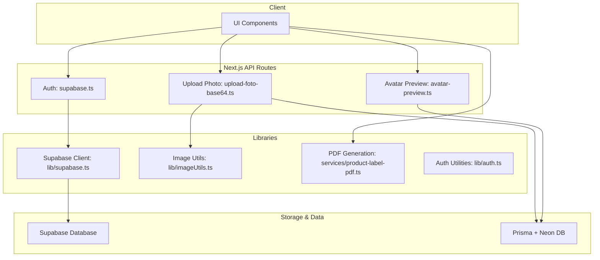
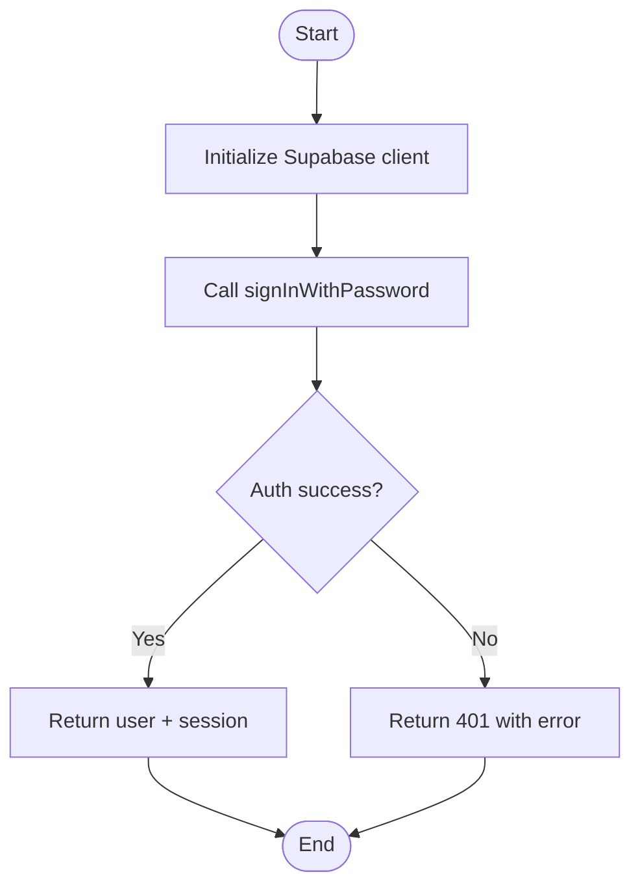
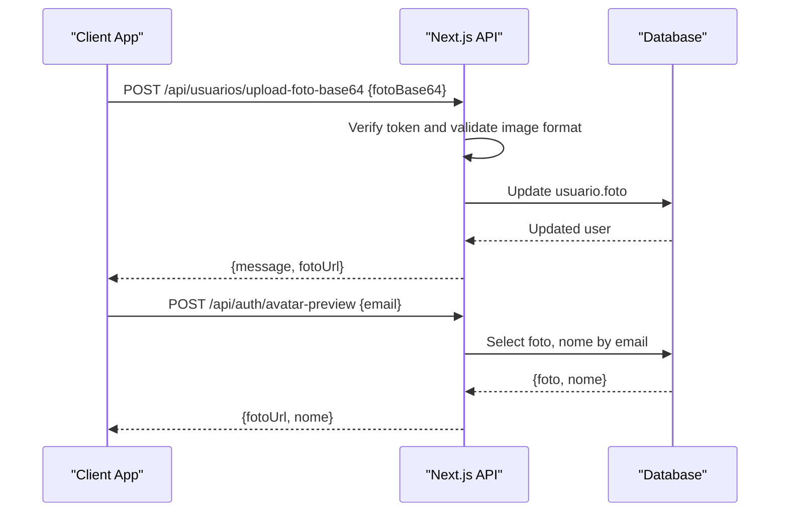
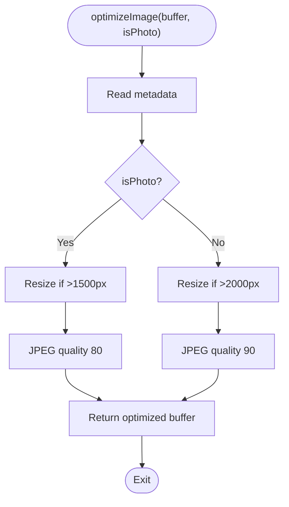
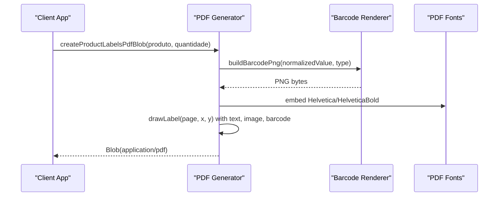
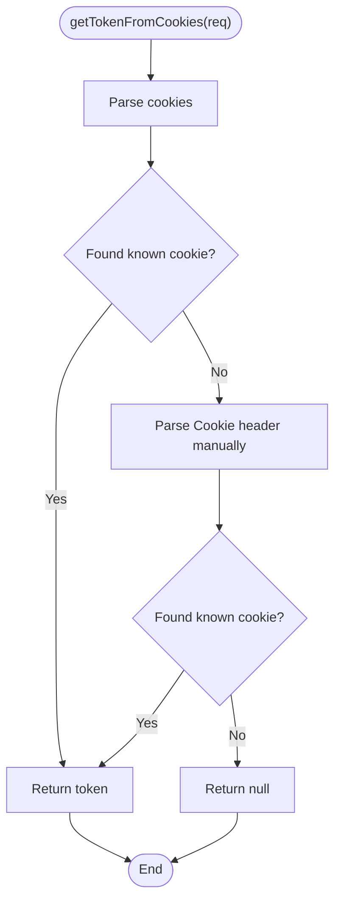
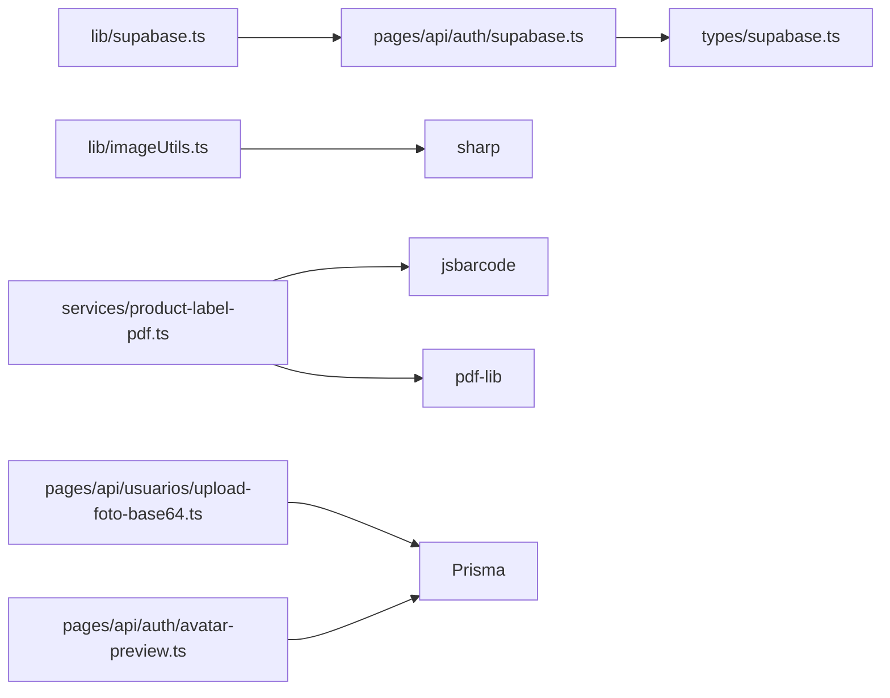

# Storage Integrations

<cite>
**Referenced Files in This Document**
- [supabase.ts](file://lib/supabase.ts)
- [auth.ts](file://pages/api/auth/supabase.ts)
- [schema.sql](file://supabase/schema.sql)
- [imageUtils.ts](file://lib/imageUtils.ts)
- [product-label-pdf.ts](file://services/product-label-pdf.ts)
- [upload-foto-base64.ts](file://pages/api/usuarios/upload-foto-base64.ts)
- [avatar-preview.ts](file://pages/api/auth/avatar-preview.ts)
- [auth.ts](file://lib/auth.ts)
</cite>

## Table of Contents
1. Introduction
2. Project Structure
3. Core Components
4. Architecture Overview
5. Detailed Component Analysis
6. Dependency Analysis
7. Performance Considerations
8. Troubleshooting Guide
9. Conclusion

## Introduction
This document explains how the application integrates storage and media workflows, focusing on Supabase connectivity, file upload/download patterns, image processing utilities, and PDF generation for product labels. It also covers authentication setup, data access policies, performance optimization techniques, and practical examples such as uploading product images, generating PDF labels, managing file versions, and implementing backup strategies for critical business data.

## Project Structure
The storage-related functionality is implemented across a few key areas:
- Supabase client initialization and environment configuration
- Authentication endpoints that integrate with Supabase Auth
- Image optimization utilities using server-side processing
- API routes for handling user photos (base64 upload and preview)
- Client-side PDF generation for product labels



**Diagram sources**
- [supabase.ts](file://lib/supabase.ts)
- [auth.ts](file://pages/api/auth/supabase.ts)
- [upload-foto-base64.ts](file://pages/api/usuarios/upload-foto-base64.ts)
- [avatar-preview.ts](file://pages/api/auth/avatar-preview.ts)
- [imageUtils.ts](file://lib/imageUtils.ts)
- [product-label-pdf.ts](file://services/product-label-pdf.ts)
- [auth.ts](file://lib/auth.ts)

**Section sources**
- [supabase.ts:1-9](file://lib/supabase.ts#L1-L9)
- [auth.ts:1-34](file://pages/api/auth/supabase.ts#L1-L34)
- [upload-foto-base64.ts:1-49](file://pages/api/usuarios/upload-foto-base64.ts#L1-L49)
- [avatar-preview.ts:1-43](file://pages/api/auth/avatar-preview.ts#L1-L43)
- [imageUtils.ts:1-38](file://lib/imageUtils.ts#L1-L38)
- [product-label-pdf.ts:1-402](file://services/product-label-pdf.ts#L1-L402)
- [auth.ts:1-121](file://lib/auth.ts#L1-L121)

## Core Components
- Supabase client initialization: Creates a configured client from environment variables for database and storage operations.
- Authentication endpoint: Proxies login to Supabase Auth and returns session/user data.
- Image optimization utility: Compresses and resizes images using server-side processing to reduce payload size while preserving quality.
- User photo upload: Accepts base64-encoded images, validates format, and persists them to the database via Prisma.
- Avatar preview: Returns user profile photo and name without exposing existence details.
- Product label PDF generator: Builds printable PDFs with barcodes, product images, and formatted text directly in the browser.

**Section sources**
- [supabase.ts:1-9](file://lib/supabase.ts#L1-L9)
- [auth.ts:1-34](file://pages/api/auth/supabase.ts#L1-L34)
- [imageUtils.ts:1-38](file://lib/imageUtils.ts#L1-L38)
- [upload-foto-base64.ts:1-49](file://pages/api/usuarios/upload-foto-base64.ts#L1-L49)
- [avatar-preview.ts:1-43](file://pages/api/auth/avatar-preview.ts#L1-L43)
- [product-label-pdf.ts:1-402](file://services/product-label-pdf.ts#L1-L402)

## Architecture Overview
The system combines Supabase for authentication and potential storage usage, a Next.js API layer for secure operations, and client-side PDF generation for label printing.

```mermaid
sequenceDiagram
participant Client as "Client App"
participant API as "Next.js API"
participant Supabase as "Supabase Auth"
participant DB as "Database"
Client->>API : POST /api/auth/supabase {email, senha}
API->>Supabase : signInWithPassword(email, password)
Supabase-->>API : {user, session} or error
API-->>Client : {user, session} or 401
Note over Client,DB : For user photos, uploads go through API to DB; images can be stored as base64 or referenced URLs.
```

**Diagram sources**
- [auth.ts:1-34](file://pages/api/auth/supabase.ts#L1-L34)
- [supabase.ts:1-9](file://lib/supabase.ts#L1-L9)

## Detailed Component Analysis

### Supabase Connectivity and Authentication
- Client initialization reads environment variables and exports a configured client instance used by auth flows.
- The auth endpoint authenticates users against Supabase and returns session information to the client.
- Database schema includes policies that restrict access based on authenticated user IDs.



**Diagram sources**
- [supabase.ts:1-9](file://lib/supabase.ts#L1-L9)
- [auth.ts:1-34](file://pages/api/auth/supabase.ts#L1-L34)

**Section sources**
- [supabase.ts:1-9](file://lib/supabase.ts#L1-L9)
- [auth.ts:1-34](file://pages/api/auth/supabase.ts#L1-L34)
- [schema.sql:113-133](file://supabase/schema.sql#L113-L133)

### File Upload and Download Patterns
- Base64 photo upload: Validates request method, extracts token, verifies JWT, checks image format, updates user record with new photo, and returns confirmation.
- Avatar preview: Accepts email, queries user photo and name, and always responds with 200 to avoid leaking user existence.



**Diagram sources**
- [upload-foto-base64.ts:1-49](file://pages/api/usuarios/upload-foto-base64.ts#L1-L49)
- [avatar-preview.ts:1-43](file://pages/api/auth/avatar-preview.ts#L1-L43)

**Section sources**
- [upload-foto-base64.ts:1-49](file://pages/api/usuarios/upload-foto-base64.ts#L1-L49)
- [avatar-preview.ts:1-43](file://pages/api/auth/avatar-preview.ts#L1-L43)

### Image Processing Utilities
- Optimization function resizes large images and compresses JPEG output with different quality settings depending on whether the image is a photo or document.
- On failure, it returns the original buffer to avoid breaking downstream processes.



**Diagram sources**
- [imageUtils.ts:1-38](file://lib/imageUtils.ts#L1-L38)

**Section sources**
- [imageUtils.ts:1-38](file://lib/imageUtils.ts#L1-L38)

### PDF Generation Services
- Generates product label PDFs with barcodes, product images, and formatted text. Supports single-product batches and multi-product brand sheets.
- Uses client-side libraries to render barcodes and embed images into PDF pages, then triggers download or print preview.



**Diagram sources**
- [product-label-pdf.ts:1-402](file://services/product-label-pdf.ts#L1-L402)

**Section sources**
- [product-label-pdf.ts:1-402](file://services/product-label-pdf.ts#L1-L402)

### Authentication Setup and Token Handling
- Token extraction supports multiple cookie names and manual parsing when necessary.
- Token verification decodes JWT payloads, checks required fields, and logs detailed diagnostics for troubleshooting.



**Diagram sources**
- [auth.ts:1-121](file://lib/auth.ts#L1-L121)

**Section sources**
- [auth.ts:1-121](file://lib/auth.ts#L1-L121)

## Dependency Analysis
- Supabase client depends on environment variables for URL and anon key.
- Auth endpoint depends on Supabase client and types.
- Image utils depend on sharp for server-side image processing.
- PDF generator depends on jsbarcode and pdf-lib for rendering and embedding content.
- API routes depend on Prisma for database interactions and JWT for authorization.



**Diagram sources**
- [supabase.ts:1-9](file://lib/supabase.ts#L1-L9)
- [auth.ts:1-34](file://pages/api/auth/supabase.ts#L1-L34)
- [imageUtils.ts:1-38](file://lib/imageUtils.ts#L1-L38)
- [product-label-pdf.ts:1-402](file://services/product-label-pdf.ts#L1-L402)
- [upload-foto-base64.ts:1-49](file://pages/api/usuarios/upload-foto-base64.ts#L1-L49)
- [avatar-preview.ts:1-43](file://pages/api/auth/avatar-preview.ts#L1-L43)

**Section sources**
- [supabase.ts:1-9](file://lib/supabase.ts#L1-L9)
- [auth.ts:1-34](file://pages/api/auth/supabase.ts#L1-L34)
- [imageUtils.ts:1-38](file://lib/imageUtils.ts#L1-L38)
- [product-label-pdf.ts:1-402](file://services/product-label-pdf.ts#L1-L402)
- [upload-foto-base64.ts:1-49](file://pages/api/usuarios/upload-foto-base64.ts#L1-L49)
- [avatar-preview.ts:1-43](file://pages/api/auth/avatar-preview.ts#L1-L43)

## Performance Considerations
- Image optimization reduces bandwidth and improves load times by resizing and compressing images before storage or display.
- PDF generation runs client-side to offload server CPU and network overhead; ensure images are scaled appropriately to keep PDF sizes manageable.
- Use efficient queries and selective field retrieval in avatar preview to minimize database load.
- Configure API body size limits appropriately for uploads to balance usability and resource constraints.

[No sources needed since this section provides general guidance]

## Troubleshooting Guide
- Authentication failures: Check Supabase credentials and network connectivity; verify error messages returned by the auth endpoint.
- Token issues: Ensure cookies are set correctly and match expected names; use token extraction utilities to diagnose missing or malformed tokens.
- Upload errors: Validate image format and size; confirm JWT presence and validity; check database write permissions and connection.
- PDF generation errors: Confirm barcode formats are supported; handle cases where product images are unavailable; review canvas-to-PNG conversion steps.

**Section sources**
- [auth.ts:1-34](file://pages/api/auth/supabase.ts#L1-L34)
- [auth.ts:1-121](file://lib/auth.ts#L1-L121)
- [upload-foto-base64.ts:1-49](file://pages/api/usuarios/upload-foto-base64.ts#L1-L49)
- [product-label-pdf.ts:1-402](file://services/product-label-pdf.ts#L1-L402)

## Conclusion
The application integrates Supabase for authentication and provides robust image processing and PDF generation capabilities. By combining server-side validation and compression with client-side rendering, it achieves efficient workflows for storing and presenting media assets. Policies and careful API design help maintain security and performance. For production readiness, consider adding explicit bucket management, versioning, and automated backups aligned with your operational requirements.

[No sources needed since this section summarizes without analyzing specific files]