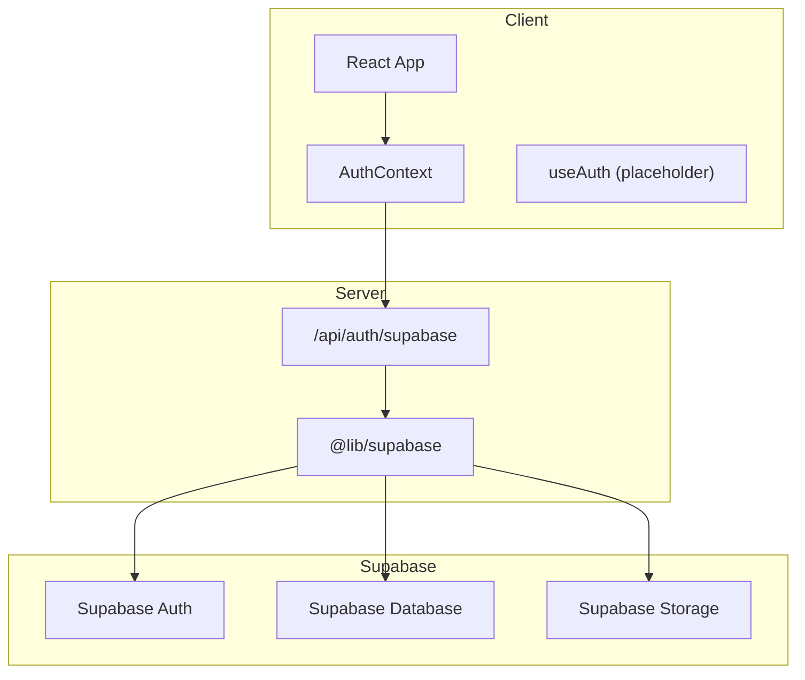
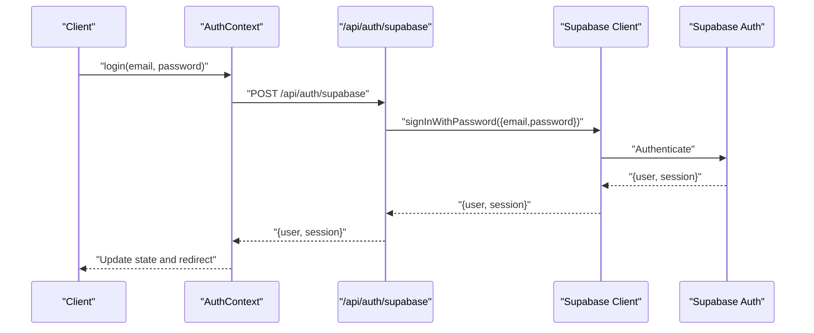
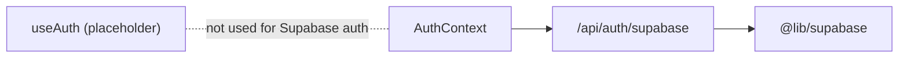
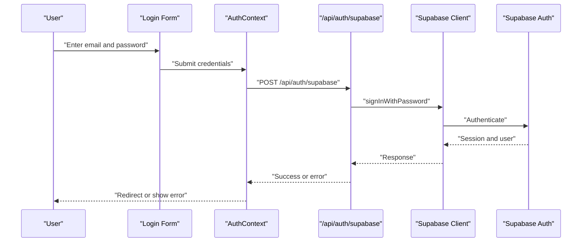

# Supabase Integration

<cite>
**Referenced Files in This Document**
- [supabase.ts](file://lib/supabase.ts)
- [supabase.ts (API)](file://pages/api/auth/supabase.ts)
- [AuthContext.tsx](file://contexts/AuthContext.tsx)
- [useAuth.ts](file://hooks/useAuth.ts)
- [schema.sql](file://supabase/schema.sql)
- [env.example.txt](file://env.example.txt)
</cite>

## Table of Contents
1. [Introduction](#introduction)
2. [Project Structure](#project-structure)
3. [Core Components](#core-components)
4. [Architecture Overview](#architecture-overview)
5. [Detailed Component Analysis](#detailed-component-analysis)
6. [Dependency Analysis](#dependency-analysis)
7. [Performance Considerations](#performance-considerations)
8. [Troubleshooting Guide](#troubleshooting-guide)
9. [Conclusion](#conclusion)
10. [Appendices](#appendices)

## Introduction
This document explains how the application integrates with Supabase for client configuration, authentication setup, and database connectivity. It covers environment variables, client initialization patterns, connection management, storage buckets, security policies, row-level security, file uploads/downloads, real-time subscriptions, error handling strategies, and performance optimization techniques such as caching and query optimization.

## Project Structure
The Supabase integration spans a few key areas:
- Client initialization and exports live in a dedicated module to centralize configuration and reuse across the app.
- A server-side API route demonstrates authenticated sign-in using Supabase Auth.
- The React context manages application-wide authentication state and redirects based on user roles.
- A placeholder hook exists for compatibility; the primary auth flow is implemented via the context and API routes.
- A Supabase schema file is present for reference or future use.

**Diagram sources**
- [supabase.ts](file://lib/supabase.ts)
- [supabase.ts (API)](file://pages/api/auth/supabase.ts)
- [AuthContext.tsx](file://contexts/AuthContext.tsx)
- [useAuth.ts](file://hooks/useAuth.ts)

**Section sources**
- [supabase.ts](file://lib/supabase.ts)
- [supabase.ts (API)](file://pages/api/auth/supabase.ts)
- [AuthContext.tsx](file://contexts/AuthContext.tsx)
- [useAuth.ts](file://hooks/useAuth.ts)

## Core Components
- Supabase client module: Creates and exports a single Supabase client instance initialized with environment variables.
- Server-side auth endpoint: Uses the Supabase client to authenticate users via email/password and returns session data.
- Authentication context: Manages login/logout flows, token validation, and routing based on user roles.
- Placeholder hook: Provides a minimal interface to avoid build errors; not used for actual auth logic.

Key responsibilities:
- Centralized client configuration ensures consistent connection settings across the app.
- Server-side auth endpoint validates credentials against Supabase and returns standardized responses.
- Context handles UI state and navigation after successful authentication.

**Section sources**
- [supabase.ts](file://lib/supabase.ts)
- [supabase.ts (API)](file://pages/api/auth/supabase.ts)
- [AuthContext.tsx](file://contexts/AuthContext.tsx)
- [useAuth.ts](file://hooks/useAuth.ts)

## Architecture Overview
The application uses a hybrid approach:
- Client-side Supabase client is available for direct operations where appropriate.
- Sensitive authentication flows are routed through Next.js API endpoints to leverage server-side capabilities and secure cookie handling.

**Diagram sources**
- [supabase.ts (API)](file://pages/api/auth/supabase.ts)
- [AuthContext.tsx](file://contexts/AuthContext.tsx)
- [supabase.ts](file://lib/supabase.ts)

## Detailed Component Analysis

### Supabase Client Initialization
- Reads environment variables for URL and anonymous key.
- Creates a single client instance and exports it for reuse.
- Ensures consistent configuration across modules.

Best practices:
- Keep environment variables out of source control.
- Use a single client instance to avoid duplicate connections.

**Section sources**
- [supabase.ts](file://lib/supabase.ts)

### Authentication Flow (Server-Side)
- Validates required fields.
- Calls Supabase Auth to sign in with email and password.
- Returns standardized JSON with user and session or an error.

Error handling:
- Logs errors and returns appropriate HTTP status codes.
- Normalizes error messages for clients.

**Section sources**
- [supabase.ts (API)](file://pages/api/auth/supabase.ts)

### Authentication Context
- Loads current user on mount by calling a protected endpoint.
- Handles login, logout, and periodic token checks.
- Redirects users based on role after login.
- Cleans up state and cookies on logout.

Notes:
- The context currently uses a custom API layer rather than direct Supabase calls for auth flows.
- A placeholder hook exists but does not implement Supabase-specific logic.

**Section sources**
- [AuthContext.tsx](file://contexts/AuthContext.tsx)
- [useAuth.ts](file://hooks/useAuth.ts)

### Environment Variables Setup
Required variables for Supabase client:
- NEXT_PUBLIC_SUPABASE_URL
- NEXT_PUBLIC_SUPABASE_ANON_KEY

Guidance:
- Ensure these variables are set in your deployment environment.
- Reference the example file for variable names and structure.

**Section sources**
- [env.example.txt](file://env.example.txt)

### Database Connectivity and Schema
- A Supabase schema file is included for reference or future migrations.
- For direct database operations, use the Supabase client’s REST or Realtime features from trusted contexts (server-side or with proper RLS).

Recommendations:
- Prefer Row-Level Security (RLS) policies over ad-hoc authorization checks.
- Use server-side functions or Edge Functions for sensitive operations.

**Section sources**
- [schema.sql](file://supabase/schema.sql)

### Storage Buckets, Security Policies, and Row-Level Security
Storage buckets:
- Create buckets for different content types (e.g., avatars, documents).
- Set bucket-level permissions (public vs private).

Security policies:
- Define policies to restrict access based on user roles or ownership.
- Enforce size limits and allowed MIME types at bucket level.

Row-Level Security:
- Enable RLS on tables that store sensitive data.
- Write policies that check user identity and permissions.
- Combine RLS with storage policies for end-to-end security.

Operational tips:
- Test policies in development before deploying to production.
- Log policy violations during development to identify misconfigurations.

[No sources needed since this section provides general guidance]

### File Uploads and Downloads
Uploads:
- Use the Supabase client’s storage API to upload files to buckets.
- Handle progress events and errors appropriately.
- Store metadata (e.g., owner, type) in the database alongside file references.

Downloads:
- Generate signed URLs for secure downloads when needed.
- Serve public files directly if the bucket is configured as public.

Error handling:
- Validate file size and type before upload.
- Retry transient network failures with exponential backoff.
- Provide user-friendly error messages.

[No sources needed since this section provides general guidance]

### Real-Time Subscriptions
- Subscribe to changes on tables or channels relevant to your feature.
- Manage subscription lifecycle (subscribe/unsubscribe) to avoid memory leaks.
- Debounce updates for high-frequency changes.

Performance considerations:
- Limit the scope of subscriptions to necessary rows using filters.
- Cache frequently accessed data locally to reduce re-renders.

[No sources needed since this section provides general guidance]

### Error Handling Strategies
- Normalize errors from Supabase into a consistent shape.
- Distinguish between network errors, validation errors, and permission errors.
- Surface actionable messages to users while logging detailed diagnostics server-side.

[No sources needed since this section provides general guidance]

## Dependency Analysis
The Supabase client is imported by the server-side auth endpoint and can be reused elsewhere. The authentication context orchestrates user sessions and navigation, while the placeholder hook remains inert.

**Diagram sources**
- [supabase.ts](file://lib/supabase.ts)
- [supabase.ts (API)](file://pages/api/auth/supabase.ts)
- [AuthContext.tsx](file://contexts/AuthContext.tsx)
- [useAuth.ts](file://hooks/useAuth.ts)

**Section sources**
- [supabase.ts](file://lib/supabase.ts)
- [supabase.ts (API)](file://pages/api/auth/supabase.ts)
- [AuthContext.tsx](file://contexts/AuthContext.tsx)
- [useAuth.ts](file://hooks/useAuth.ts)

## Performance Considerations
- Connection pooling:
  - Reuse a single Supabase client instance to minimize connection overhead.
  - Batch operations where possible to reduce round trips.
- Caching strategies:
  - Implement client-side caching for read-heavy data.
  - Use optimistic updates with rollback on failure.
  - Leverage browser cache for static assets and public storage files.
- Query optimization:
  - Select only required columns.
  - Use indexes on frequently filtered columns.
  - Paginate large datasets and avoid loading entire tables.
- Real-time efficiency:
  - Filter subscriptions to specific rows or channels.
  - Debounce frequent updates and coalesce changes.

[No sources needed since this section provides general guidance]

## Troubleshooting Guide
Common issues and resolutions:
- Missing environment variables:
  - Ensure NEXT_PUBLIC_SUPABASE_URL and NEXT_PUBLIC_SUPABASE_ANON_KEY are set.
- Authentication failures:
  - Verify credentials and Supabase project configuration.
  - Check CORS and allowed domains in Supabase dashboard.
- Storage access denied:
  - Confirm bucket policies and RLS rules allow the intended operations.
- Real-time disconnects:
  - Inspect network conditions and subscription scopes.
  - Reconnect logic should handle transient failures gracefully.

Diagnostics:
- Log request payloads and responses in development.
- Use Supabase logs to trace auth and storage events.

**Section sources**
- [supabase.ts (API)](file://pages/api/auth/supabase.ts)
- [AuthContext.tsx](file://contexts/AuthContext.tsx)

## Conclusion
The application integrates Supabase through a centralized client and a server-side authentication endpoint. The authentication context manages user sessions and navigation, while placeholders ensure compatibility. For robust integrations, configure environment variables correctly, enforce security via RLS and storage policies, optimize queries and caching, and implement resilient error handling and real-time subscriptions.

## Appendices

### Environment Variables Checklist
- NEXT_PUBLIC_SUPABASE_URL
- NEXT_PUBLIC_SUPABASE_ANON_KEY

Reference:
- [env.example.txt](file://env.example.txt)

### Example Flows

#### Sign-In Sequence

**Diagram sources**
- [supabase.ts (API)](file://pages/api/auth/supabase.ts)
- [AuthContext.tsx](file://contexts/AuthContext.tsx)
- [supabase.ts](file://lib/supabase.ts)