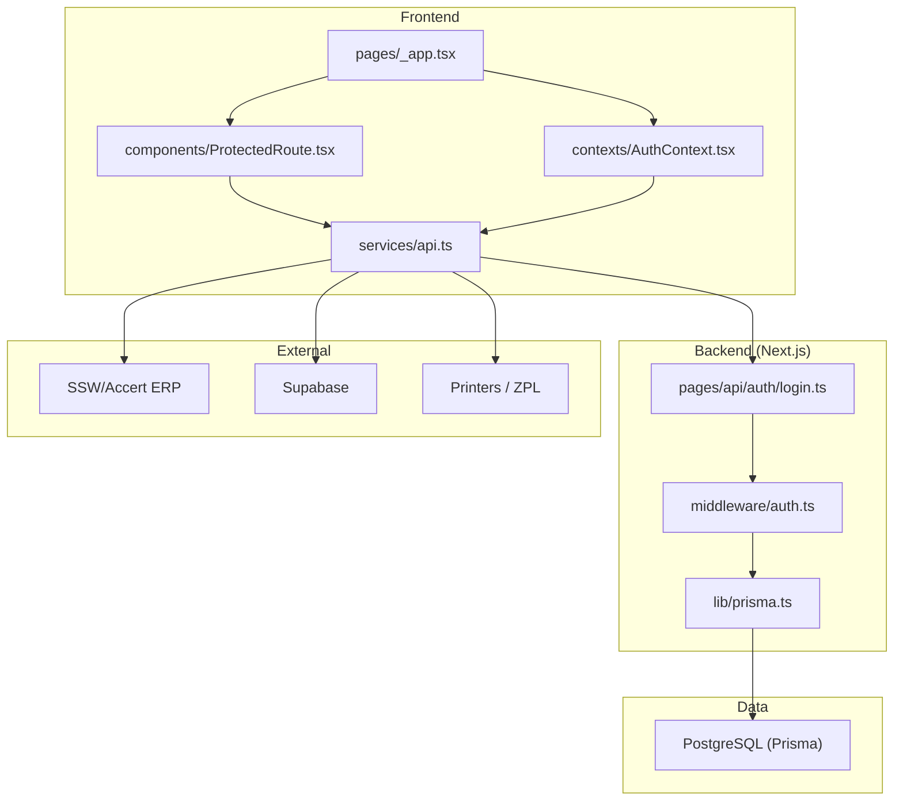
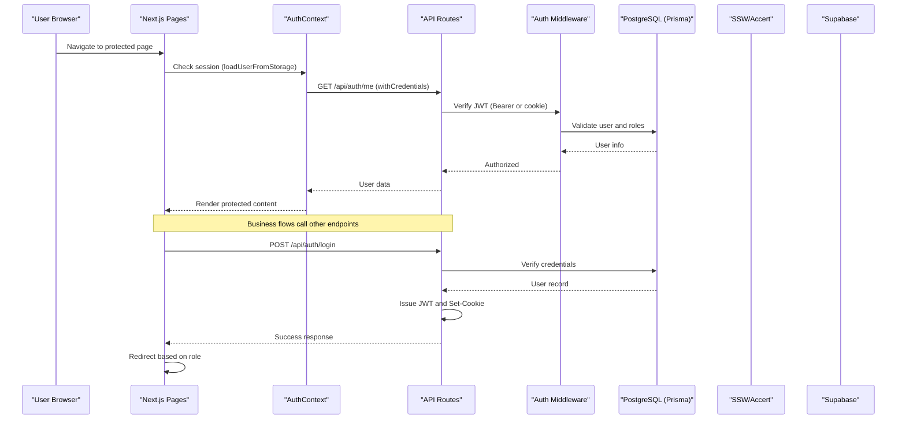
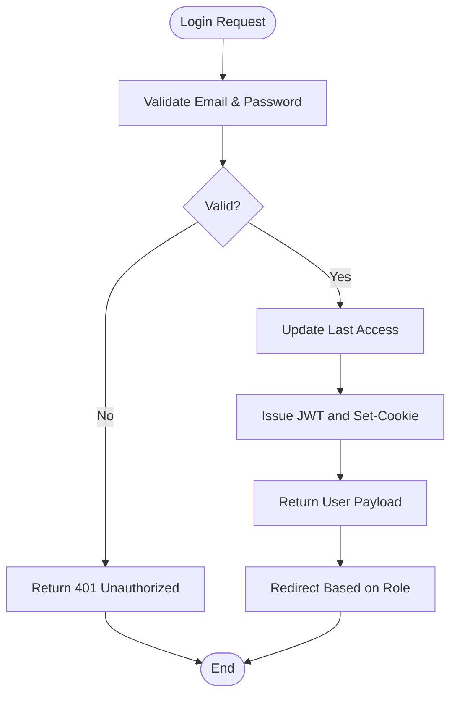
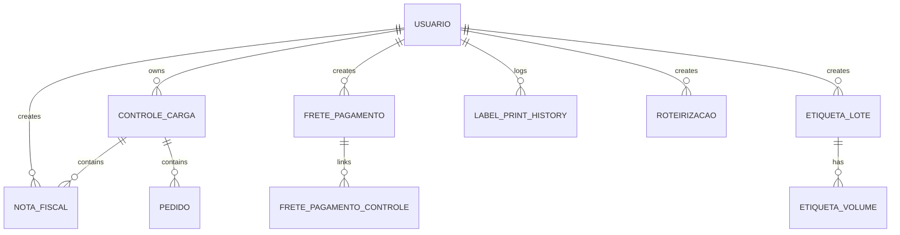
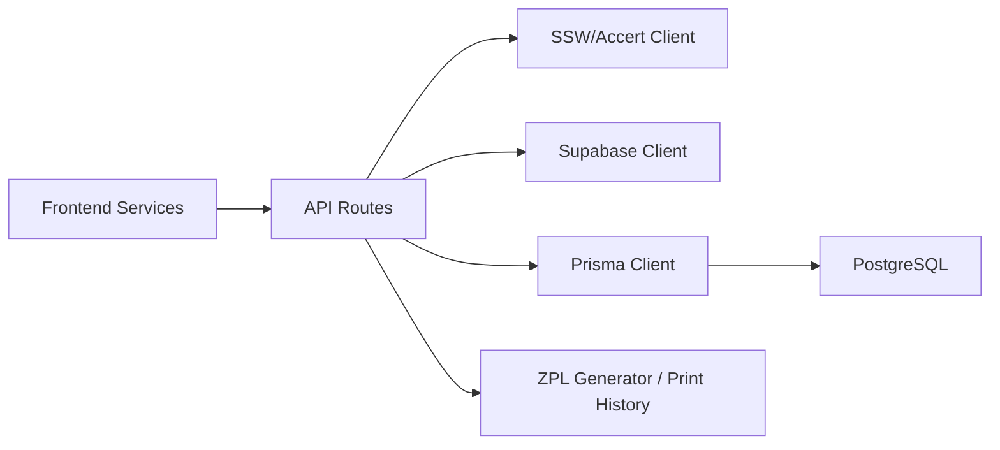
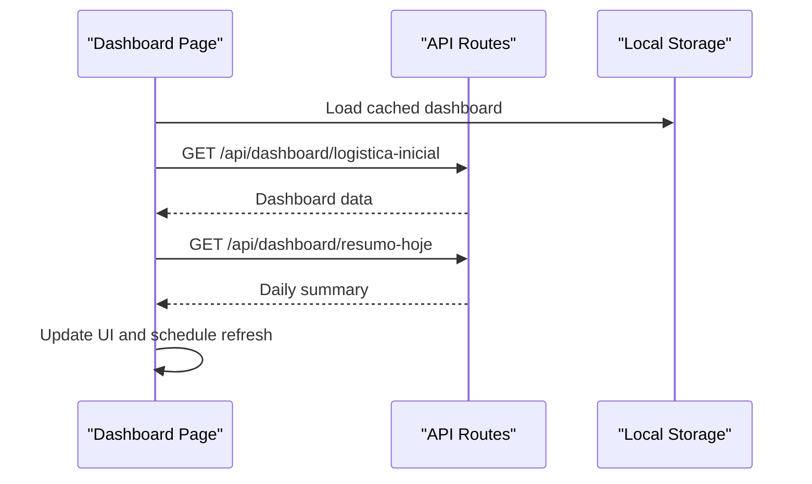
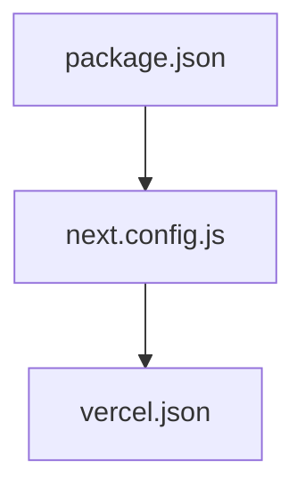

# System Architecture

<cite>
**Referenced Files in This Document**
- [package.json](file://package.json)
- [next.config.js](file://next.config.js)
- [pages/_app.tsx](file://pages/_app.tsx)
- [contexts/AuthContext.tsx](file://contexts/AuthContext.tsx)
- [components/ProtectedRoute.tsx](file://components/ProtectedRoute.tsx)
- [services/api.ts](file://services/api.ts)
- [pages/api/auth/login.ts](file://pages/api/auth/login.ts)
- [middleware/auth.ts](file://middleware/auth.ts)
- [lib/prisma.ts](file://lib/prisma.ts)
- [prisma/schema.prisma](file://prisma/schema.prisma)
- [vercel.json](file://vercel.json)
- [lib/supabase.ts](file://lib/supabase.ts)
- [services/sswClient.ts](file://services/sswClient.ts)
- [pages/index.tsx](file://pages/index.tsx)
</cite>

## Table of Contents
1. Introduction
2. Project Structure
3. Core Components
4. Architecture Overview
5. Detailed Component Analysis
6. Dependency Analysis
7. Performance Considerations
8. Troubleshooting Guide
9. Conclusion

## Introduction
Control Carga is a Next.js-based logistics and cargo control system with a React frontend, serverless API routes, a service-oriented backend layer, and a PostgreSQL data layer via Prisma. It integrates external ERP systems (SSW/Accert), label printing, and Supabase for storage. Authentication uses HTTP-only cookies with JWT verification, and state management relies on React Context. The application is deployed on Vercel with serverless functions and Prisma client configured for the runtime.

## Project Structure
The project follows Next.js file-based routing:
- pages/: Frontend pages and API routes under pages/api/*
- components/: Reusable UI components (Material-UI based)
- contexts/: Global state providers (Auth, Configuration)
- services/: Backend-facing clients and integrations (ERP, printers, Supabase)
- lib/: Shared utilities, Prisma client, and domain helpers
- prisma/: Data schema and migrations
- styles/, hooks/, types/, scripts/ for cross-cutting concerns

**Diagram sources**
- [pages/_app.tsx:1-206](file://pages/_app.tsx#L1-L206)
- [components/ProtectedRoute.tsx:1-79](file://components/ProtectedRoute.tsx#L1-L79)
- [contexts/AuthContext.tsx:1-508](file://contexts/AuthContext.tsx#L1-L508)
- [services/api.ts:1-175](file://services/api.ts#L1-L175)
- [pages/api/auth/login.ts:1-461](file://pages/api/auth/login.ts#L1-L461)
- [middleware/auth.ts:1-91](file://middleware/auth.ts#L1-L91)
- [lib/prisma.ts:1-19](file://lib/prisma.ts#L1-L19)
- [prisma/schema.prisma:1-559](file://prisma/schema.prisma#L1-L559)
- [lib/supabase.ts:1-9](file://lib/supabase.ts#L1-L9)
- [services/sswClient.ts:1-445](file://services/sswClient.ts#L1-L445)

**Section sources**
- [package.json:1-112](file://package.json#L1-L112)
- [next.config.js:1-29](file://next.config.js#L1-L29)
- [pages/_app.tsx:1-206](file://pages/_app.tsx#L1-L206)

## Core Components
- Application shell and providers:
  - Root app wraps Material-UI theme, Snackbar, AuthProvider, ConfiguracaoProvider, and route protection.
  - Public routes bypass authentication; protected routes enforce login and role checks.
- Authentication context:
  - Manages user session, token lifecycle, redirects, and periodic validation.
  - Uses HTTP-only cookies set by the server and Axios withCredentials for secure requests.
- Protected route guard:
  - Redirects unauthenticated users to login and unauthorized users to access-denied page.
- API client:
  - Centralized Axios instance with interceptors for auth headers, credentials, and error handling.

**Section sources**
- [pages/_app.tsx:1-206](file://pages/_app.tsx#L1-L206)
- [contexts/AuthContext.tsx:1-508](file://contexts/AuthContext.tsx#L1-L508)
- [components/ProtectedRoute.tsx:1-79](file://components/ProtectedRoute.tsx#L1-L79)
- [services/api.ts:1-175](file://services/api.ts#L1-L175)

## Architecture Overview
High-level design:
- Frontend: Next.js pages + React components (Material-UI). State via Context API.
- Backend: Next.js API routes with middleware for authorization and business logic.
- Data: Prisma ORM over PostgreSQL.
- External integrations: SSW/Accert ERP, Supabase, local printer integration via ZPL.

**Diagram sources**
- [pages/_app.tsx:1-206](file://pages/_app.tsx#L1-L206)
- [contexts/AuthContext.tsx:1-508](file://contexts/AuthContext.tsx#L1-L508)
- [pages/api/auth/login.ts:1-461](file://pages/api/auth/login.ts#L1-L461)
- [middleware/auth.ts:1-91](file://middleware/auth.ts#L1-L91)
- [lib/prisma.ts:1-19](file://lib/prisma.ts#L1-L19)
- [services/sswClient.ts:1-445](file://services/sswClient.ts#L1-L445)
- [lib/supabase.ts:1-9](file://lib/supabase.ts#L1-L9)

## Detailed Component Analysis

### Authentication Flow
- Login:
  - Client sends credentials to /api/auth/login.
  - Server validates email/password, updates last access, issues JWT, sets HTTP-only cookie, returns user payload.
- Session validation:
  - On mount, AuthContext calls /api/auth/me to verify session and populate user state.
  - Periodic checks refresh validity and redirect to login if expired.
- Authorization:
  - ProtectedRoute enforces public vs protected routes and role-based access.
  - API middleware verifies JWT and roles for protected endpoints.

**Diagram sources**
- [pages/api/auth/login.ts:1-461](file://pages/api/auth/login.ts#L1-L461)
- [contexts/AuthContext.tsx:1-508](file://contexts/AuthContext.tsx#L1-L508)
- [components/ProtectedRoute.tsx:1-79](file://components/ProtectedRoute.tsx#L1-L79)
- [middleware/auth.ts:1-91](file://middleware/auth.ts#L1-L91)

**Section sources**
- [pages/api/auth/login.ts:1-461](file://pages/api/auth/login.ts#L1-L461)
- [contexts/AuthContext.tsx:1-508](file://contexts/AuthContext.tsx#L1-L508)
- [components/ProtectedRoute.tsx:1-79](file://components/ProtectedRoute.tsx#L1-L79)
- [middleware/auth.ts:1-91](file://middleware/auth.ts#L1-L91)

### Data Layer and Domain Models
- Prisma schema defines core entities: ControleCarga, Pedido, NotaFiscal, Usuario, Motorista, EtiquetaLote, EtiquetaVolume, LabelPrintHistory, Roteirizacao, and related audit/history tables.
- Relationships include many-to-one between controls and notes/orders, user relationships across multiple modules, and transport enumerations.

**Diagram sources**
- [prisma/schema.prisma:1-559](file://prisma/schema.prisma#L1-L559)

**Section sources**
- [prisma/schema.prisma:1-559](file://prisma/schema.prisma#L1-L559)
- [lib/prisma.ts:1-19](file://lib/prisma.ts#L1-L19)

### External Integrations
- SSW/Accert ERP:
  - Token caching and retrieval, client methods for queries and tracking, and external nota fiscal lookup.
- Supabase:
  - Client initialization using environment variables for URL and anon key.
- Printers:
  - ZPL generation and print history logging for labels and transport labels.

**Diagram sources**
- [services/sswClient.ts:1-445](file://services/sswClient.ts#L1-L445)
- [lib/supabase.ts:1-9](file://lib/supabase.ts#L1-L9)
- [lib/prisma.ts:1-19](file://lib/prisma.ts#L1-L19)
- [prisma/schema.prisma:1-559](file://prisma/schema.prisma#L1-L559)

**Section sources**
- [services/sswClient.ts:1-445](file://services/sswClient.ts#L1-L445)
- [lib/supabase.ts:1-9](file://lib/supabase.ts#L1-L9)

### Dashboard and Data Flow
- Dashboard page orchestrates fetching initial logistics data, alerts, and daily summary with local caching and background refresh.
- Uses relative API paths with credentials included and no-store cache policy for fresh data.

**Diagram sources**
- [pages/index.tsx:1-800](file://pages/index.tsx#L1-L800)

**Section sources**
- [pages/index.tsx:1-800](file://pages/index.tsx#L1-L800)

## Dependency Analysis
- Frontend dependencies:
  - React, Next.js, Material-UI, Notistack, Leaflet, Chart.js, Zustand, Zod, etc.
- Backend/runtime:
  - Next.js API routes, Prisma client, JSON Web Tokens, bcryptjs, cookies serialization.
- Deployment configuration:
  - Vercel function limits and Prisma settings for serverless.

**Diagram sources**
- [package.json:1-112](file://package.json#L1-L112)
- [next.config.js:1-29](file://next.config.js#L1-L29)
- [vercel.json:1-13](file://vercel.json#L1-L13)

**Section sources**
- [package.json:1-112](file://package.json#L1-L112)
- [next.config.js:1-29](file://next.config.js#L1-L29)
- [vercel.json:1-13](file://vercel.json#L1-L13)

## Performance Considerations
- Caching:
  - Local storage caching for dashboard data with versioned keys and stale-while-revalidate patterns.
  - Token caching for SSW/Accert to reduce external calls.
- Network efficiency:
  - Parallel fetches for dashboard indicators and summaries using Promise.allSettled.
  - No-store cache policies for live data where freshness matters.
- Build optimizations:
  - SWC minification, transpilation of specific packages, and disabling strict mode where appropriate.
- Database:
  - Prisma query logging and indexes defined in schema for performance-critical fields.

[No sources needed since this section provides general guidance]

## Troubleshooting Guide
- Authentication issues:
  - Ensure withCredentials is enabled in Axios and that cookies are not blocked by browser settings.
  - Verify CORS headers and allowed origins in login handler.
  - Check JWT secret configuration and cookie security flags in production.
- API errors:
  - Interceptors log request/response details and handle 401 by dispatching unauthorized events.
  - Use console logs in API routes to trace validation and database errors.
- External integrations:
  - Validate environment variables for SSW/Accert and Supabase.
  - Handle non-JSON responses and network failures gracefully.

**Section sources**
- [services/api.ts:1-175](file://services/api.ts#L1-L175)
- [pages/api/auth/login.ts:1-461](file://pages/api/auth/login.ts#L1-L461)
- [services/sswClient.ts:1-445](file://services/sswClient.ts#L1-L445)

## Conclusion
Control Carga employs a clear separation of concerns:
- Frontend: Next.js pages with React components and Material-UI, global state via Context API.
- Backend: Serverless API routes with middleware for auth and business logic.
- Data: Prisma-managed PostgreSQL schema with robust relationships and indexes.
- Integrations: SSW/Accert ERP, Supabase, and printer workflows via ZPL.
Security is enforced through HTTP-only cookies, JWT verification, and role-based access. Scalability is supported by serverless deployment on Vercel, efficient caching strategies, and optimized network requests.

[No sources needed since this section summarizes without analyzing specific files]