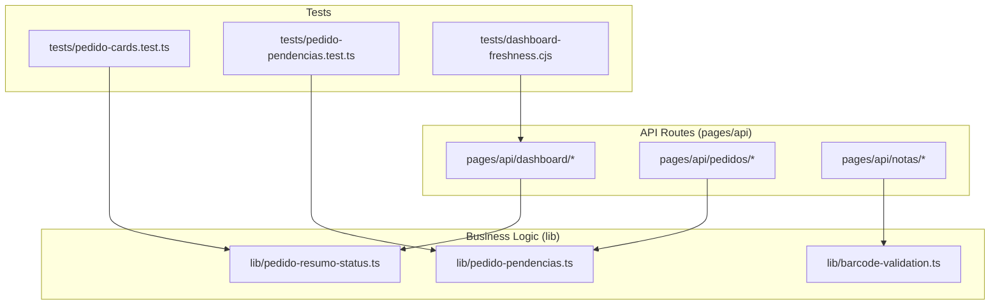
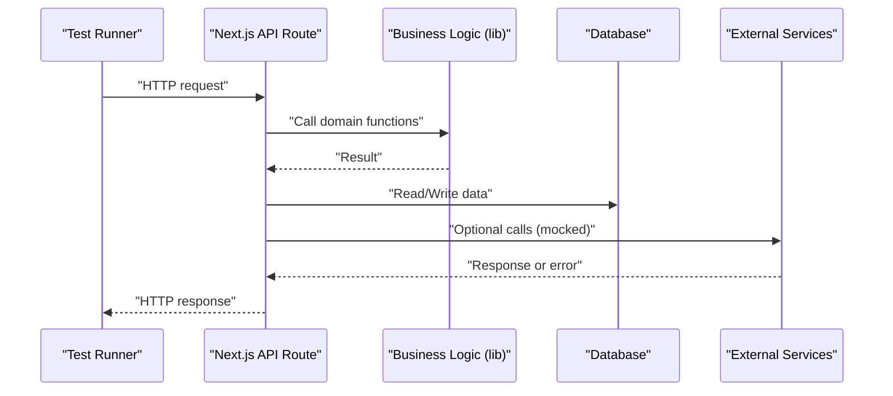
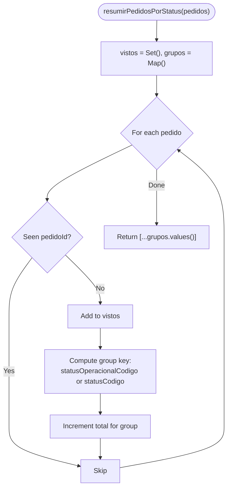
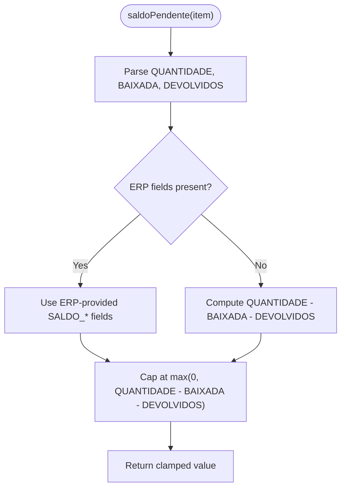
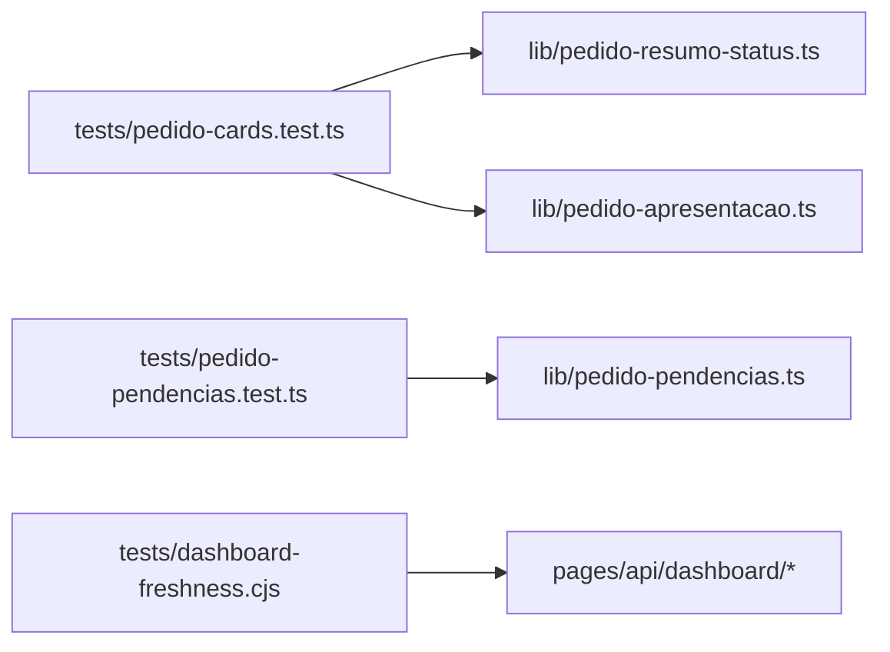
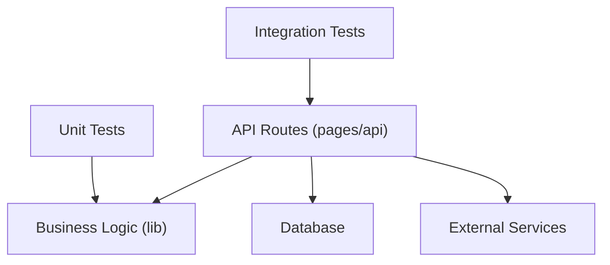

# Testing Strategy

<cite>
**Referenced Files in This Document**
- [package.json](file://package.json)
- [pedido-cards.test.ts](file://tests/pedido-cards.test.ts)
- [pedido-pendencias.test.ts](file://tests/pedido-pendencias.test.ts)
- [barcode-validation.ts](file://lib/barcode-validation.ts)
- [pedido-resumo-status.ts](file://lib/pedido-resumo-status.ts)
- [pedido-pendencias.ts](file://lib/pedido-pendencias.ts)
- [dashboard-freshness.cjs](file://tests/dashboard-freshness.cjs)
</cite>

## Table of Contents
1. Introduction
2. Project Structure
3. Core Components
4. Architecture Overview
5. Detailed Component Analysis
6. Dependency Analysis
7. Performance Considerations
8. Troubleshooting Guide
9. Conclusion

## Introduction
This document defines the testing strategy for the Control Carga system. It covers unit tests for business logic, integration tests for API endpoints, and end-to-end tests for critical user workflows. It also explains test organization, mocking strategies for external services, database testing approaches, performance testing methodologies, and continuous integration setup for automated testing. Examples include barcode validation, order processing, and dashboard functionality.

## Project Structure
The repository follows a Next.js layout with:
- Business logic in lib/
- API routes under pages/api/
- UI components under components/
- Tests under tests/ using Node’s assert module and ts-node execution via scripts

**Diagram sources**
- [package.json:5-18](file://package.json#L5-L18)
- [pedido-cards.test.ts:1-24](file://tests/pedido-cards.test.ts#L1-L24)
- [pedido-pendencias.test.ts:1-36](file://tests/pedido-pendencias.test.ts#L1-L36)
- [dashboard-freshness.cjs:1-200](file://tests/dashboard-freshness.cjs#L1-L200)
- [barcode-validation.ts:1-89](file://lib/barcode-validation.ts#L1-L89)
- [pedido-resumo-status.ts:1-31](file://lib/pedido-resumo-status.ts#L1-L31)
- [pedido-pendencias.ts:1-129](file://lib/pedido-pendencias.ts#L1-L129)

**Section sources**
- [package.json:5-18](file://package.json#L5-L18)

## Core Components
- Barcode validation utilities: EAN-13/EAN-8 checksums, format detection, and analysis pipeline.
- Order status summarization: groups orders by operational status and counts unique orders per group.
- Pending balance logic: computes pending balances considering returns, issued quantities, and ERP-provided fields; identifies items with pending balances and detects deliveries/returns.

These modules are pure or near-pure functions, making them ideal targets for unit tests.

**Section sources**
- [barcode-validation.ts:1-89](file://lib/barcode-validation.ts#L1-L89)
- [pedido-resumo-status.ts:1-31](file://lib/pedido-resumo-status.ts#L1-L31)
- [pedido-pendencias.ts:1-129](file://lib/pedido-pendencias.ts#L1-L129)

## Architecture Overview
Testing spans three layers:
- Unit tests: validate business logic in lib/
- Integration tests: exercise API routes against a test database and mocked external services
- End-to-end tests: simulate critical user flows across UI and backend

[No sources needed since this diagram shows conceptual workflow, not actual code structure]

## Detailed Component Analysis

### Barcode Validation
Focus areas:
- EAN-13 and EAN-8 checksum correctness
- Format detection (EAN13, EAN8, CODE128, UNSUPPORTED)
- Edge cases: empty input, non-ASCII characters, invalid lengths

Recommended unit tests:
- Valid EAN-13 and EAN-8 codes return true and correct type
- Invalid check digits return false with appropriate reason
- Non-digit strings classified as CODE128 if ASCII printable
- Empty/null/whitespace inputs treated as unsupported

```mermaid
flowchart TD
Start(["analyzeBarcode(value)"]) --> Normalize["Normalize value<br/>trim and cast to string"]
Normalize --> Empty{"Empty?"}
Empty --> |Yes| ReturnUnsupported["Return { isValid:false, type:'UNSUPPORTED' }"]
Empty --> |No| CheckEAN13{"Matches 13 digits?"}
CheckEAN13 --> |Yes| Validate13["Validate EAN-13 checksum"]
CheckEAN13 --> |No| CheckEAN8{"Matches 8 digits?"}
Validate13 --> |Invalid| ReturnEan13Error["Return { type:'EAN13', isValid:false }"]
Validate13 --> |Valid| DetectType["detectBarcodeType()"]
CheckEAN8 --> |Yes| Validate8["Validate EAN-8 checksum"]
CheckEAN8 --> |No| DetectType
Validate8 --> |Invalid| ReturnEan8Error["Return { type:'EAN8', isValid:false }"]
Validate8 --> |Valid| DetectType
DetectType --> Type{"Type"}
Type --> |EAN13/EAN8/CODE128| ReturnOK["Return { isValid:true, type }"]
Type --> |UNSUPPORTED| ReturnUnsupported
```

**Diagram sources**
- [barcode-validation.ts:1-89](file://lib/barcode-validation.ts#L1-L89)

**Section sources**
- [barcode-validation.ts:1-89](file://lib/barcode-validation.ts#L1-L89)

### Order Status Summarization
Focus areas:
- Deduplication by pedidoId
- Grouping by statusOperacionalCodigo when available, otherwise statusCodigo
- Handling alert categories prefixed with ALERTS_

Recommended unit tests:
- Duplicate pedidos counted once
- Alert statuses grouped correctly
- Empty arrays return empty results
- Mixed statuses produce correct totals and titles

**Diagram sources**
- [pedido-resumo-status.ts:1-31](file://lib/pedido-resumo-status.ts#L1-L31)

**Section sources**
- [pedido-resumo-status.ts:1-31](file://lib/pedido-resumo-status.ts#L1-L31)

### Pending Balance and Delivery Detection
Focus areas:
- Robust parsing of numeric fields from varied field names
- Handling returns that cap pending balances
- Determining whether a delivery has been generated
- Identifying items with pending balances across different data shapes

Recommended unit tests:
- saldoPendente with ERP-provided balances vs computed fallback
- Returns reducing pending balance to zero where applicable
- Null/undefined handling returning null or safe defaults
- pedidoTemDevolucao and pedidoTemEntregaGerada across nested structures

**Diagram sources**
- [pedido-pendencias.ts:1-129](file://lib/pedido-pendencias.ts#L1-L129)

**Section sources**
- [pedido-pendencias.ts:1-129](file://lib/pedido-pendencias.ts#L1-L129)

### Existing Tests and Coverage
Current tests validate:
- Order card summaries and separator name resolution
- Pending balance rules, return detection, and delivery generation checks
- Dashboard freshness utility (script-based)

**Diagram sources**
- [pedido-cards.test.ts:1-24](file://tests/pedido-cards.test.ts#L1-L24)
- [pedido-pendencias.test.ts:1-36](file://tests/pedido-pendencias.test.ts#L1-L36)
- [dashboard-freshness.cjs:1-200](file://tests/dashboard-freshness.cjs#L1-L200)

**Section sources**
- [pedido-cards.test.ts:1-24](file://tests/pedido-cards.test.ts#L1-L24)
- [pedido-pendencias.test.ts:1-36](file://tests/pedido-pendencias.test.ts#L1-L36)
- [dashboard-freshness.cjs:1-200](file://tests/dashboard-freshness.cjs#L1-L200)

## Dependency Analysis
- Unit tests depend on lib functions directly, ensuring fast, isolated verification.
- API routes depend on business logic and external integrations; integration tests should mock these dependencies.
- The project uses Node’s assert for assertions and ts-node for running TypeScript tests without compilation.

**Diagram sources**
- [package.json:5-18](file://package.json#L5-L18)
- [pedido-cards.test.ts:1-24](file://tests/pedido-cards.test.ts#L1-L24)
- [pedido-pendencias.test.ts:1-36](file://tests/pedido-pendencias.test.ts#L1-L36)

**Section sources**
- [package.json:5-18](file://package.json#L5-L18)

## Performance Considerations
- Keep unit tests small and focused on single functions to maintain speed.
- For integration tests, use an in-memory or lightweight test database and limit dataset size.
- Mock slow external services (ERP, logistics APIs) to avoid flaky and slow tests.
- Use batch operations in tests to reduce round-trips to the database.
- Profile critical paths like barcode scanning and order aggregation under load using synthetic datasets.

[No sources needed since this section provides general guidance]

## Troubleshooting Guide
Common issues and resolutions:
- Missing test runner configuration: add a test script in package.json to run tests consistently.
- TypeScript path resolution: ensure tsconfig-paths is configured so imports resolve in tests.
- Database connectivity in integration tests: isolate environment variables and use a dedicated test database URL.
- Flaky network calls: stub fetch/axios or HTTP clients used by API routes.
- Assertion failures due to locale-specific number formats: normalize numeric fields before comparisons.

**Section sources**
- [package.json:5-18](file://package.json#L5-L18)

## Conclusion
Control Carga’s testing strategy centers on robust unit tests for core business logic, supplemented by integration and end-to-end tests for APIs and critical workflows. The existing tests cover order summarization and pending balance rules. Expanding coverage to barcode validation, API endpoints, and end-to-end scenarios will increase confidence in releases. Adopt consistent scripts, mocking, and CI automation to keep quality high and feedback fast.