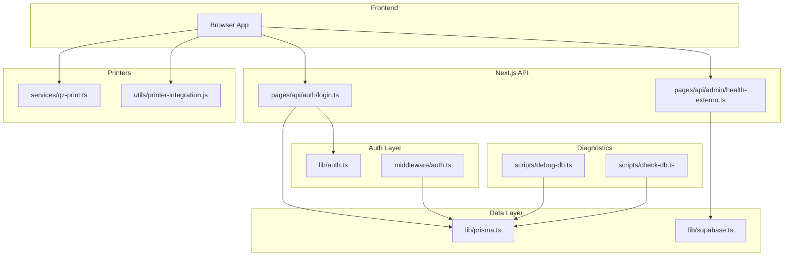
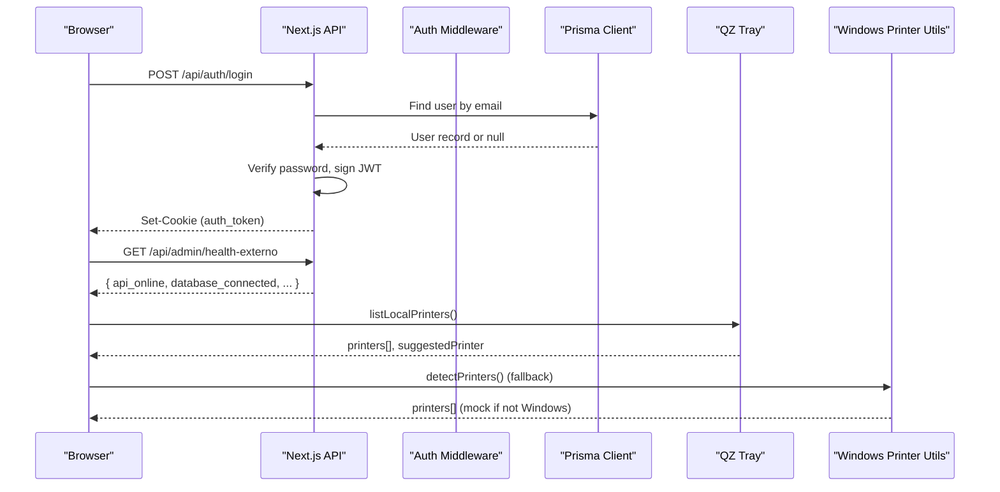
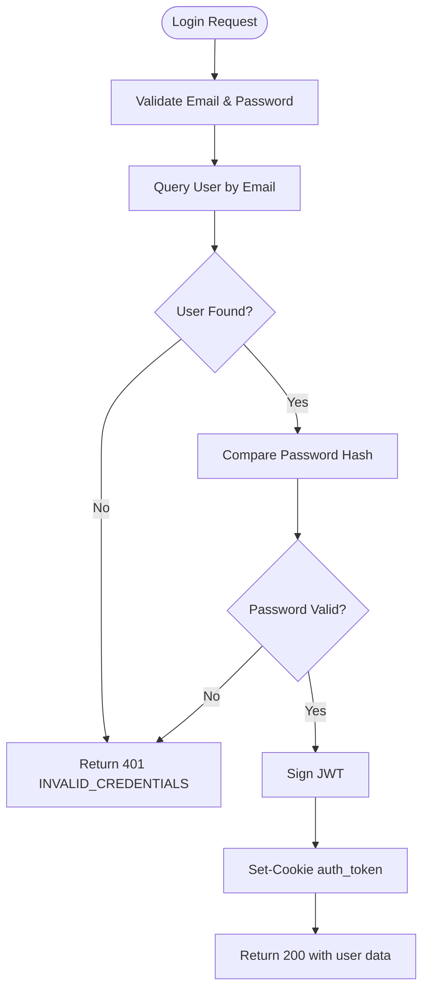
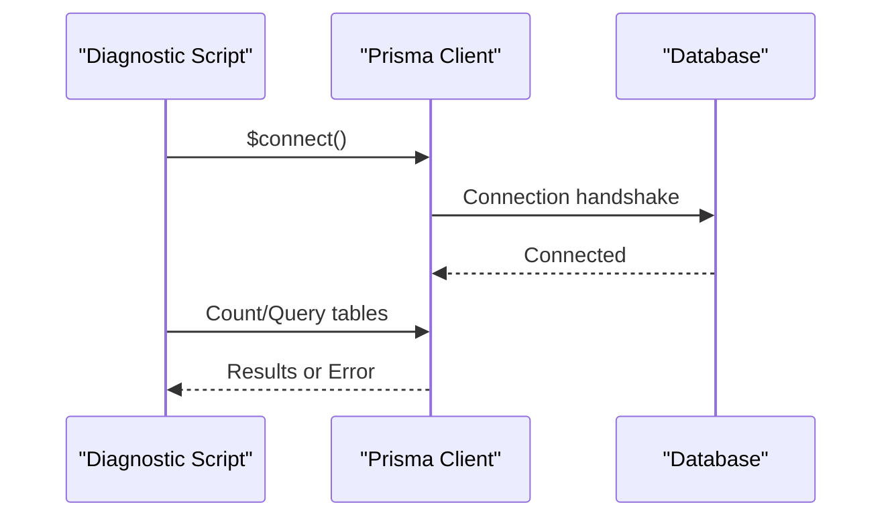
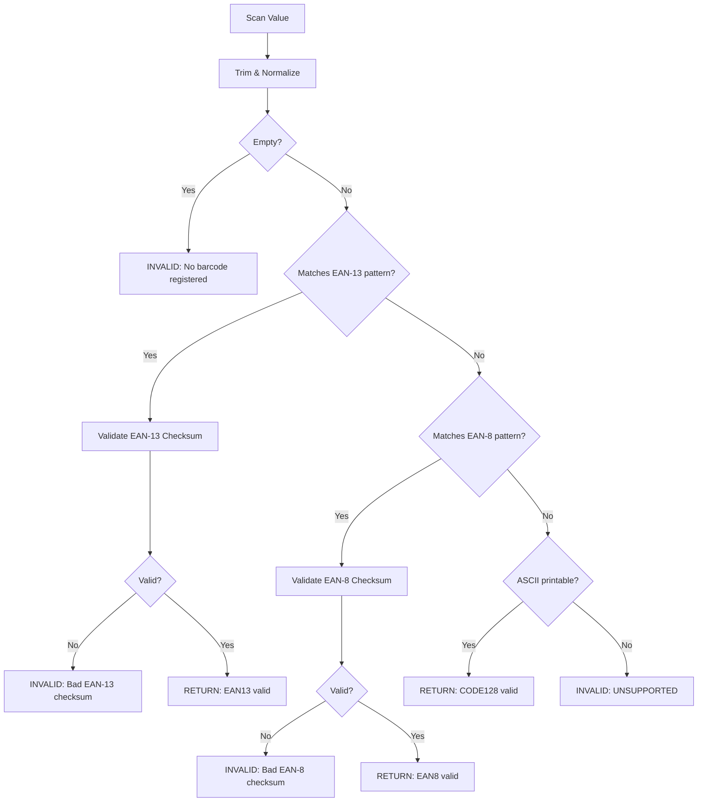
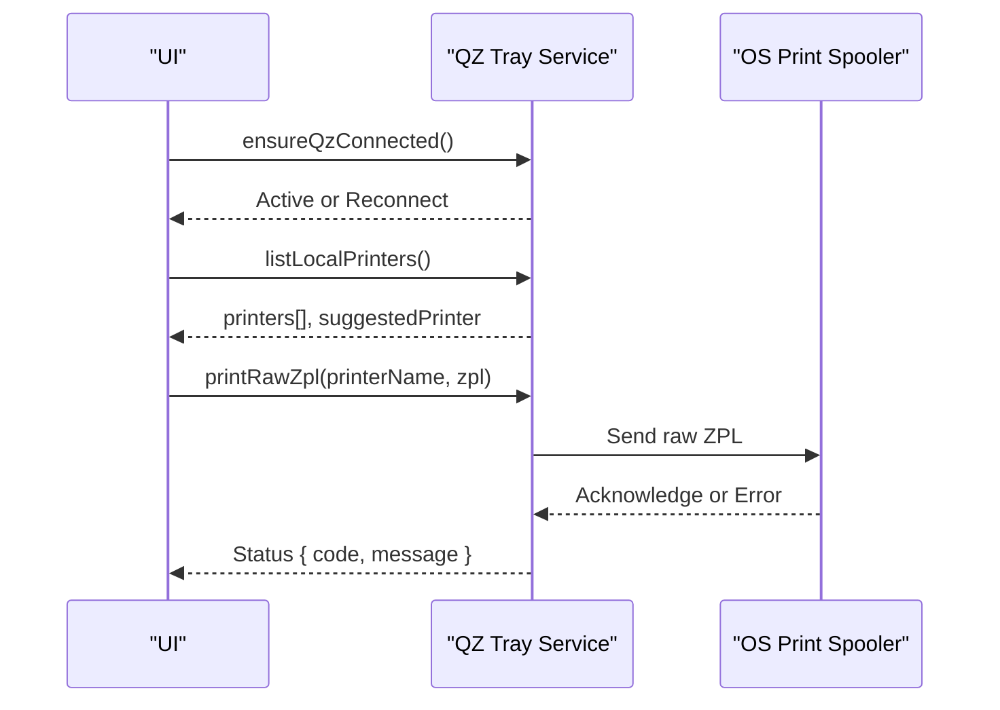
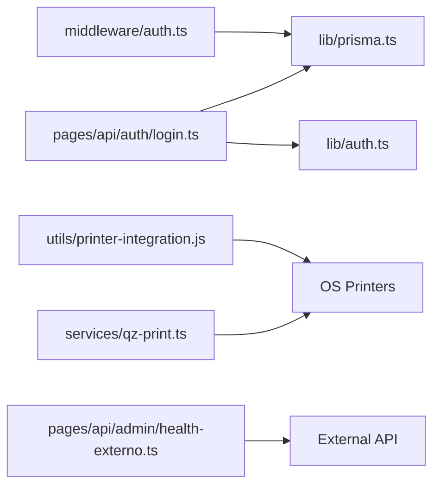
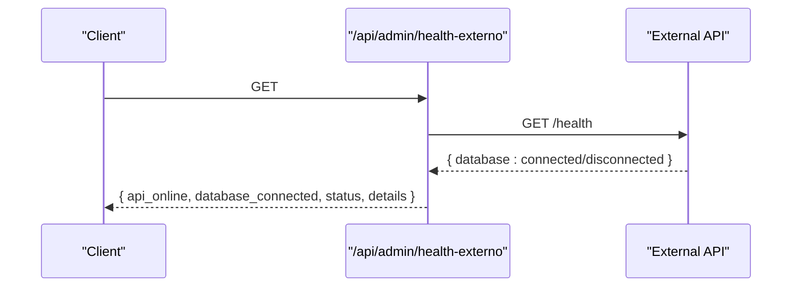

# Troubleshooting & Maintenance

<cite>
**Referenced Files in This Document**
- [lib/auth.ts](file://lib/auth.ts)
- [lib/prisma.ts](file://lib/prisma.ts)
- [lib/barcode-validation.ts](file://lib/barcode-validation.ts)
- [utils/printer-integration.js](file://utils/printer-integration.js)
- [services/qz-print.ts](file://services/qz-print.ts)
- [pages/api/auth/login.ts](file://pages/api/auth/login.ts)
- [middleware/auth.ts](file://middleware/auth.ts)
- [lib/supabase.ts](file://lib/supabase.ts)
- [scripts/debug-db.ts](file://scripts/debug-db.ts)
- [scripts/check-db.ts](file://scripts/check-db.ts)
- [pages/api/admin/health-externo.ts](file://pages/api/admin/health-externo.ts)
- [CORRECAO_ERRO_404_LOGIN.md](file://CORRECAO_ERRO_404_LOGIN.md)
</cite>

## Table of Contents
1. Introduction
2. Project Structure
3. Core Components
4. Architecture Overview
5. Detailed Component Analysis
6. Dependency Analysis
7. Performance Considerations
8. Troubleshooting Guide
9. Conclusion
10. Appendices

## Introduction
This document provides comprehensive troubleshooting and maintenance guidance for the application, focusing on database connectivity, authentication errors, barcode scanning issues, and printer integration failures. It also covers debugging techniques, log analysis, performance profiling, system health monitoring, maintenance procedures (database optimization, cache clearing, backup management, updates), diagnostic tools, error codes, and escalation procedures for complex issues.

## Project Structure
The system is a Next.js application with:
- API routes under pages/api for authentication, admin health checks, and domain features
- Shared libraries for authentication, database client, barcode validation, and external integrations
- Utilities for local Windows printer integration and QZ Tray-based printing
- Scripts for database diagnostics and verification
- Documentation files capturing known fixes and deployment notes

**Diagram sources**
- [pages/api/auth/login.ts:1-461](file://pages/api/auth/login.ts#L1-L461)
- [pages/api/admin/health-externo.ts:1-42](file://pages/api/admin/health-externo.ts#L1-L42)
- [lib/auth.ts:1-121](file://lib/auth.ts#L1-L121)
- [middleware/auth.ts:1-91](file://middleware/auth.ts#L1-L91)
- [lib/prisma.ts:1-19](file://lib/prisma.ts#L1-L19)
- [lib/supabase.ts:1-9](file://lib/supabase.ts#L1-L9)
- [services/qz-print.ts:1-205](file://services/qz-print.ts#L1-L205)
- [utils/printer-integration.js:1-168](file://utils/printer-integration.js#L1-L168)
- [scripts/debug-db.ts:1-47](file://scripts/debug-db.ts#L1-L47)
- [scripts/check-db.ts:1-43](file://scripts/check-db.ts#L1-L43)

**Section sources**
- [pages/api/auth/login.ts:1-461](file://pages/api/auth/login.ts#L1-L461)
- [pages/api/admin/health-externo.ts:1-42](file://pages/api/admin/health-externo.ts#L1-L42)
- [lib/auth.ts:1-121](file://lib/auth.ts#L1-L121)
- [middleware/auth.ts:1-91](file://middleware/auth.ts#L1-L91)
- [lib/prisma.ts:1-19](file://lib/prisma.ts#L1-L19)
- [lib/supabase.ts:1-9](file://lib/supabase.ts#L1-L9)
- [services/qz-print.ts:1-205](file://services/qz-print.ts#L1-L205)
- [utils/printer-integration.js:1-168](file://utils/printer-integration.js#L1-L168)
- [scripts/debug-db.ts:1-47](file://scripts/debug-db.ts#L1-L47)
- [scripts/check-db.ts:1-43](file://scripts/check-db.ts#L1-L43)

## Core Components
- Authentication: JWT-based login flow, cookie handling, token verification, and role-based middleware.
- Database: Prisma client configuration with query logging; Supabase client for external services.
- Barcode Validation: EAN-13/EAN-8 checksums and format detection.
- Printing: QZ Tray integration for cross-platform raw ZPL printing; Windows-specific fallback using PowerShell/COPY.
- Diagnostics: Health endpoint for external API status; scripts to verify DB connectivity and schema.

**Section sources**
- [pages/api/auth/login.ts:1-461](file://pages/api/auth/login.ts#L1-L461)
- [lib/auth.ts:1-121](file://lib/auth.ts#L1-L121)
- [middleware/auth.ts:1-91](file://middleware/auth.ts#L1-L91)
- [lib/prisma.ts:1-19](file://lib/prisma.ts#L1-L19)
- [lib/supabase.ts:1-9](file://lib/supabase.ts#L1-L9)
- [lib/barcode-validation.ts:1-89](file://lib/barcode-validation.ts#L1-L89)
- [services/qz-print.ts:1-205](file://services/qz-print.ts#L1-L205)
- [utils/printer-integration.js:1-168](file://utils/printer-integration.js#L1-L168)
- [pages/api/admin/health-externo.ts:1-42](file://pages/api/admin/health-externo.ts#L1-L42)

## Architecture Overview
The request lifecycle spans browser interactions, Next.js API routes, authentication middleware, data access via Prisma/Supabase, and optional printer operations through QZ Tray or Windows utilities.

**Diagram sources**
- [pages/api/auth/login.ts:1-461](file://pages/api/auth/login.ts#L1-L461)
- [pages/api/admin/health-externo.ts:1-42](file://pages/api/admin/health-externo.ts#L1-L42)
- [services/qz-print.ts:1-205](file://services/qz-print.ts#L1-L205)
- [utils/printer-integration.js:1-168](file://utils/printer-integration.js#L1-L168)
- [lib/prisma.ts:1-19](file://lib/prisma.ts#L1-L19)

## Detailed Component Analysis

### Authentication Flow
- Login endpoint validates input, queries the database, compares passwords, sets an HTTP-only cookie, and returns user data.
- Token extraction supports multiple cookie names and manual header parsing.
- Middleware enforces Bearer tokens and role-based access.

**Diagram sources**
- [pages/api/auth/login.ts:1-461](file://pages/api/auth/login.ts#L1-L461)

**Section sources**
- [pages/api/auth/login.ts:1-461](file://pages/api/auth/login.ts#L1-L461)
- [lib/auth.ts:1-121](file://lib/auth.ts#L1-L121)
- [middleware/auth.ts:1-91](file://middleware/auth.ts#L1-L91)

### Database Connectivity
- Prisma client logs queries, errors, and warnings; connection and basic queries are verified via scripts.
- Supabase client is configured for external service calls.

**Diagram sources**
- [scripts/debug-db.ts:1-47](file://scripts/debug-db.ts#L1-L47)
- [scripts/check-db.ts:1-43](file://scripts/check-db.ts#L1-L43)
- [lib/prisma.ts:1-19](file://lib/prisma.ts#L1-L19)

**Section sources**
- [scripts/debug-db.ts:1-47](file://scripts/debug-db.ts#L1-L47)
- [scripts/check-db.ts:1-43](file://scripts/check-db.ts#L1-L43)
- [lib/prisma.ts:1-19](file://lib/prisma.ts#L1-L19)
- [lib/supabase.ts:1-9](file://lib/supabase.ts#L1-L9)

### Barcode Scanning and Validation
- Validates EAN-13 and EAN-8 formats using checksum calculations.
- Detects supported formats and returns normalized values with reasons for invalidity.

**Diagram sources**
- [lib/barcode-validation.ts:1-89](file://lib/barcode-validation.ts#L1-L89)

**Section sources**
- [lib/barcode-validation.ts:1-89](file://lib/barcode-validation.ts#L1-L89)

### Printer Integration
- QZ Tray: Connects via WebSocket, lists printers, suggests compatible ones, prints raw ZPL, and parses errors into standardized statuses.
- Windows fallback: Uses WMIC to enumerate printers and PowerShell/COPY commands to send ZPL; simulates behavior on non-Windows platforms.

**Diagram sources**
- [services/qz-print.ts:1-205](file://services/qz-print.ts#L1-L205)
- [utils/printer-integration.js:1-168](file://utils/printer-integration.js#L1-L168)

**Section sources**
- [services/qz-print.ts:1-205](file://services/qz-print.ts#L1-L205)
- [utils/printer-integration.js:1-168](file://utils/printer-integration.js#L1-L168)

## Dependency Analysis
- Authentication depends on JSON Web Tokens, bcryptjs for password hashing, and Prisma for user lookup.
- Printing depends on QZ Tray SDK and OS-level printer APIs; falls back to Windows utilities when unavailable.
- Health checks depend on external API availability and credentials configuration.

**Diagram sources**
- [pages/api/auth/login.ts:1-461](file://pages/api/auth/login.ts#L1-L461)
- [middleware/auth.ts:1-91](file://middleware/auth.ts#L1-L91)
- [services/qz-print.ts:1-205](file://services/qz-print.ts#L1-L205)
- [utils/printer-integration.js:1-168](file://utils/printer-integration.js#L1-L168)
- [pages/api/admin/health-externo.ts:1-42](file://pages/api/admin/health-externo.ts#L1-L42)

**Section sources**
- [pages/api/auth/login.ts:1-461](file://pages/api/auth/login.ts#L1-L461)
- [middleware/auth.ts:1-91](file://middleware/auth.ts#L1-L91)
- [services/qz-print.ts:1-205](file://services/qz-print.ts#L1-L205)
- [utils/printer-integration.js:1-168](file://utils/printer-integration.js#L1-L168)
- [pages/api/admin/health-externo.ts:1-42](file://pages/api/admin/health-externo.ts#L1-L42)

## Performance Considerations
- Enable Prisma query logging to identify slow or excessive queries in development; review logs for bottlenecks.
- Prefer minimal payloads and avoid unnecessary re-renders in the UI to reduce network and processing overhead.
- Use QZ Tray’s connection keep-alive and retry settings to minimize reconnection overhead during high-frequency printing.
- Cache printer lists locally where appropriate to avoid repeated enumeration.

[No sources needed since this section provides general guidance]

## Troubleshooting Guide

### Database Connectivity Problems
Symptoms:
- Login fails with database errors or timeouts.
- Admin health endpoint reports database disconnected.

Steps:
1. Run database diagnostics:
   - Execute debug script to connect and inspect records.
   - Execute check script to list tables and verify schema presence.
2. Review Prisma logs for query errors and warnings.
3. Confirm environment variables for database URL and credentials.
4. If permissions are insufficient, apply required DDL changes manually or request elevated privileges.

Error indicators:
- “Erro ao buscar usuário no banco de dados” from login handler.
- “database_connected: false” from health endpoint.

Resolution references:
- [scripts/debug-db.ts:1-47](file://scripts/debug-db.ts#L1-L47)
- [scripts/check-db.ts:1-43](file://scripts/check-db.ts#L1-L43)
- [lib/prisma.ts:1-19](file://lib/prisma.ts#L1-L19)
- [pages/api/admin/health-externo.ts:1-42](file://pages/api/admin/health-externo.ts#L1-L42)

**Section sources**
- [scripts/debug-db.ts:1-47](file://scripts/debug-db.ts#L1-L47)
- [scripts/check-db.ts:1-43](file://scripts/check-db.ts#L1-L43)
- [lib/prisma.ts:1-19](file://lib/prisma.ts#L1-L19)
- [pages/api/admin/health-externo.ts:1-42](file://pages/api/admin/health-externo.ts#L1-L42)

### Authentication Errors
Symptoms:
- 401 responses after login or when accessing protected endpoints.
- Redirects to non-existent pages post-login.

Steps:
1. Verify cookie configuration:
   - Ensure sameSite is set appropriately for cross-origin scenarios.
   - Confirm secure flag in production and correct path/domain.
2. Validate token extraction logic across cookie names and headers.
3. Check middleware enforcement for Bearer tokens and roles.
4. Review known fix for 404 redirects after login.

Common error codes:
- MISSING_FIELDS, INVALID_EMAIL_FORMAT, ACCOUNT_DISABLED, DATABASE_ERROR, TOKEN_GENERATION_ERROR, INTERNAL_SERVER_ERROR.

Resolution references:
- [pages/api/auth/login.ts:1-461](file://pages/api/auth/login.ts#L1-L461)
- [lib/auth.ts:1-121](file://lib/auth.ts#L1-L121)
- [middleware/auth.ts:1-91](file://middleware/auth.ts#L1-L91)
- [CORRECAO_ERRO_404_LOGIN.md:1-93](file://CORRECAO_ERRO_404_LOGIN.md#L1-L93)

**Section sources**
- [pages/api/auth/login.ts:1-461](file://pages/api/auth/login.ts#L1-L461)
- [lib/auth.ts:1-121](file://lib/auth.ts#L1-L121)
- [middleware/auth.ts:1-91](file://middleware/auth.ts#L1-L91)
- [CORRECAO_ERRO_404_LOGIN.md:1-93](file://CORRECAO_ERRO_404_LOGIN.md#L1-L93)

### Barcode Scanning Issues
Symptoms:
- Invalid barcode messages or unsupported format errors.

Steps:
1. Inspect scanned value normalization and length.
2. Validate EAN-13/EAN-8 checksums; confirm correct digit count.
3. For CODE128, ensure content is ASCII printable.
4. Provide clear error reasons to users based on validation results.

Resolution references:
- [lib/barcode-validation.ts:1-89](file://lib/barcode-validation.ts#L1-L89)

**Section sources**
- [lib/barcode-validation.ts:1-89](file://lib/barcode-validation.ts#L1-L89)

### Printer Integration Failures
Symptoms:
- QZ Tray not found or authorization required.
- Print jobs fail silently or return errors.

Steps:
1. Ensure QZ Tray is installed and running; verify WebSocket connection.
2. List local printers and select a compatible one (e.g., Zebra models).
3. If QZ fails, fall back to Windows printer utilities and verify PowerShell/COPY commands.
4. Parse error codes to guide users: not_installed, authorization_required, error.

Resolution references:
- [services/qz-print.ts:1-205](file://services/qz-print.ts#L1-L205)
- [utils/printer-integration.js:1-168](file://utils/printer-integration.js#L1-L168)

**Section sources**
- [services/qz-print.ts:1-205](file://services/qz-print.ts#L1-L205)
- [utils/printer-integration.js:1-168](file://utils/printer-integration.js#L1-L168)

### System Health Monitoring
Use the health endpoint to monitor external API status and database connectivity flags.

**Diagram sources**
- [pages/api/admin/health-externo.ts:1-42](file://pages/api/admin/health-externo.ts#L1-L42)

**Section sources**
- [pages/api/admin/health-externo.ts:1-42](file://pages/api/admin/health-externo.ts#L1-L42)

## Maintenance Procedures

### Database Optimization
- Review Prisma logs to identify slow queries and add indexes where necessary.
- Periodically run diagnostic scripts to validate schema integrity and table existence.
- Ensure migrations are applied and consistent across environments.

References:
- [lib/prisma.ts:1-19](file://lib/prisma.ts#L1-L19)
- [scripts/check-db.ts:1-43](file://scripts/check-db.ts#L1-L43)

**Section sources**
- [lib/prisma.ts:1-19](file://lib/prisma.ts#L1-L19)
- [scripts/check-db.ts:1-43](file://scripts/check-db.ts#L1-L43)

### Cache Clearing
- Clear browser storage for preferred printer selection if printer switching is problematic.
- Refresh QZ Tray connections by disconnecting and reconnecting via the provided methods.

References:
- [services/qz-print.ts:1-205](file://services/qz-print.ts#L1-L205)

**Section sources**
- [services/qz-print.ts:1-205](file://services/qz-print.ts#L1-L205)

### Backup Management
- Maintain regular backups of the database prior to migrations or schema changes.
- Validate backups by restoring in a staging environment and running diagnostic scripts.

[No sources needed since this section provides general guidance]

### System Updates
- Apply migrations safely and verify with diagnostic scripts before promoting to production.
- Monitor health endpoint post-update to ensure external dependencies remain reachable.

References:
- [pages/api/admin/health-externo.ts:1-42](file://pages/api/admin/health-externo.ts#L1-L42)

**Section sources**
- [pages/api/admin/health-externo.ts:1-42](file://pages/api/admin/health-externo.ts#L1-L42)

## Diagnostic Tools
- Database diagnostics:
  - [scripts/debug-db.ts:1-47](file://scripts/debug-db.ts#L1-L47)
  - [scripts/check-db.ts:1-43](file://scripts/check-db.ts#L1-L43)
- Authentication debugging:
  - Cookie extraction and token verification in [lib/auth.ts:1-121](file://lib/auth.ts#L1-L121)
  - Login flow and error codes in [pages/api/auth/login.ts:1-461](file://pages/api/auth/login.ts#L1-L461)
- Printer diagnostics:
  - QZ Tray status and error parsing in [services/qz-print.ts:1-205](file://services/qz-print.ts#L1-L205)
  - Windows printer enumeration and fallback in [utils/printer-integration.js:1-168](file://utils/printer-integration.js#L1-L168)

**Section sources**
- [scripts/debug-db.ts:1-47](file://scripts/debug-db.ts#L1-L47)
- [scripts/check-db.ts:1-43](file://scripts/check-db.ts#L1-L43)
- [lib/auth.ts:1-121](file://lib/auth.ts#L1-L121)
- [pages/api/auth/login.ts:1-461](file://pages/api/auth/login.ts#L1-L461)
- [services/qz-print.ts:1-205](file://services/qz-print.ts#L1-L205)
- [utils/printer-integration.js:1-168](file://utils/printer-integration.js#L1-L168)

## Escalation Procedures
- If database connectivity persists despite diagnostics, escalate to DBA with logs from Prisma and health endpoint outputs.
- For authentication issues that involve CORS or cookie policies, include browser network logs and server-side CORS configuration details.
- For printer failures, provide QZ Tray logs, OS version, and whether fallback to Windows utilities succeeded.

[No sources needed since this section provides general guidance]

## Conclusion
This guide consolidates common issues and their resolutions across authentication, database connectivity, barcode validation, and printer integration. By leveraging built-in diagnostics, structured error codes, and systematic troubleshooting steps, teams can quickly resolve production issues and maintain system reliability.

[No sources needed since this section summarizes without analyzing specific files]

## Appendices

### Error Codes Reference
- Authentication:
  - MISSING_FIELDS, INVALID_EMAIL_FORMAT, ACCOUNT_DISABLED, DATABASE_ERROR, TOKEN_GENERATION_ERROR, INTERNAL_SERVER_ERROR
- Printer:
  - not_installed, authorization_required, error

References:
- [pages/api/auth/login.ts:1-461](file://pages/api/auth/login.ts#L1-L461)
- [services/qz-print.ts:1-205](file://services/qz-print.ts#L1-L205)

**Section sources**
- [pages/api/auth/login.ts:1-461](file://pages/api/auth/login.ts#L1-L461)
- [services/qz-print.ts:1-205](file://services/qz-print.ts#L1-L205)